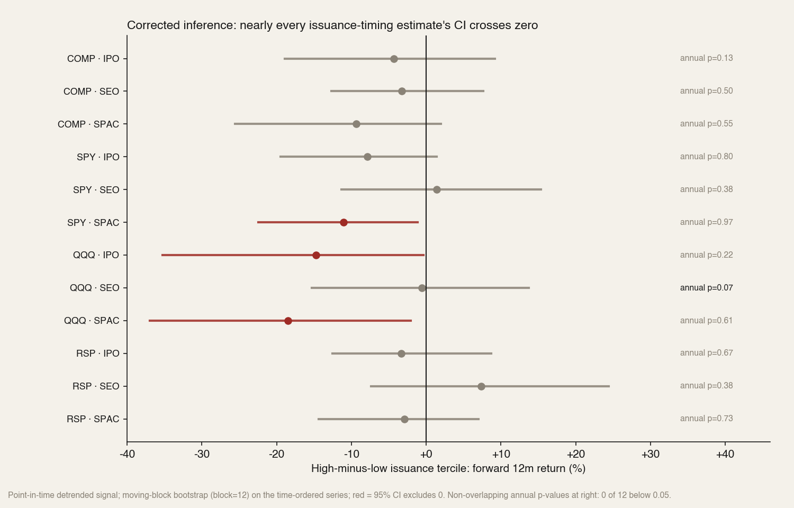
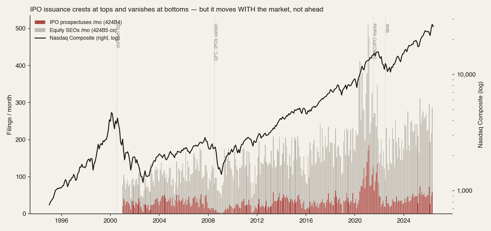
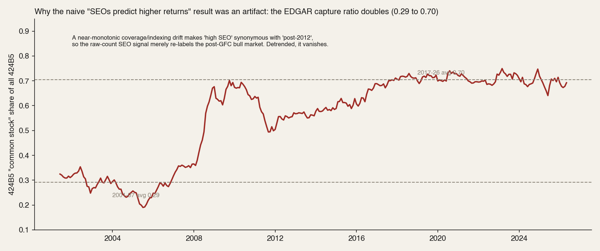

# 23 — Equity issuance doesn't time the market top (and the "SEO signal" is a data artifact)

**Question.** A durable piece of market folklore: companies sell equity when management thinks the stock is dear, so a wave of issuance — IPOs and secondary offerings — should mark an overpriced market and predict weak forward returns. Does aggregate equity-issuance intensity actually time the top?

**Finding.** **No — not as a usable timing signal.** Tested across four cycles (2001–2026) against the Nasdaq Composite and SPY/QQQ/RSP, **0 of 12** honest (non-overlapping annual) tests reach significance. What survives is a *weak, directional* tilt: heavy **IPO/SPAC** issuance precedes somewhat lower forward returns, strongest in tech (QQQ IPO high-minus-low −14.7%), but it is roughly **half explained by the fact that IPOs cluster after rallies** (momentum), is concentrated in the 2020–22 mania, and is not statistically established. The popular **secondary-offering (SEO) version inverts in the raw data — and that inversion is an artifact** of a 2.4× drift in EDGAR's filing-coverage ratio, not a real result. The genuinely robust truth is **cross-sectional, not aggregate-timing**: the issued securities themselves underperform (see [study 15](../15-ipo-chase/README.md)).

> Research / backtested, no live capital. This is a *market-timing* test of issuance; it is deliberately stress-tested to destruction (see "What the first pass got wrong"). Effective sample is small — ~24 independent years on the Nasdaq Composite, ~9 on SPY/QQQ/RSP — so read the surviving directional tilt as a weak hypothesis, not an established edge.

## Data & method

- **Issuance (survivorship-free).** Monthly counts of SEC EDGAR full-text filings, 2001–2026: **424B4** (final IPO prospectuses), **424B4 + "special purpose acquisition"** (SPAC IPOs), and **424B5 + "shares of common stock"** (equity shelf takedowns ≈ SEOs). EDGAR counts filings as of when they happened, so issuers that later delisted are included — no survivorship bias.
- **Market.** Nasdaq Composite month-end, 1995–2026 (the multi-cycle proxy: dot-com, GFC, COVID, 2022), plus SPY / QQQ / RSP, 2016–2026, for a recent high-fidelity cross-check.
- **Signal.** A **point-in-time** percentile of *detrended* issuance — each month's 3-month-smoothed count divided by its trailing-60-month median, then ranked only against history available at that date (≥36-month warm-up). This is the only version a trader could compute live, and it strips the secular rise in EDGAR filing volume.
- **Inference.** Headline test is **non-overlapping annual** (year-average issuance vs the next calendar year's return) — honest effective n. Secondary is a **moving-block bootstrap (block = 12) on the time-ordered series**, recomputing the high-minus-low tercile gap inside each resample. Every comparison also reports a **partial Spearman controlling for trailing-12-month return**, to separate issuance from momentum. Fixed RNG seed.

## Claim 1 — At honest resolution, there is no aggregate issuance top-signal

Point estimates lean negative for IPO/SPAC (consistent with the folklore *in direction*), but almost every confidence interval crosses zero, and not one non-overlapping annual test clears p = 0.05 — before any multiple-testing penalty across the 12-test family.

The family is pre-specified: IPO / SEO / total × {COMP, SPY, QQQ, RSP} = 12 non-overlapping annual Spearman tests. The SPAC series, the equity-share SEO variant, the Pearson read and the moving-block bootstrap high−low are secondary and shown for completeness — the bootstrap rests on overlapping 12-month windows (and the ETF rows on only ~9 independent years), so it is less conservative than the annual test, which is the headline. The SPAC keyword count is near-zero before ~2003, so its early point-in-time signal is degenerate; read the SPAC rows as descriptive.

| Index · series | High−low fwd-12m | Time-block 95% CI | Annual Spearman (n) | Annual p |
|---|---|---|---|---|
| COMP · IPO | −4.3% | [−18.9, +9.2] | −0.32 (24) | 0.13 |
| COMP · SEO | −3.3% | [−12.7, +7.6] | +0.14 (24) | 0.50 |
| COMP · SPAC | −9.3% | [−25.0, +2.4] | +0.13 (24) | 0.55 |
| QQQ · IPO | **−14.7%** | [−34.4, −0.5] | −0.45 (9) | 0.22 |
| QQQ · SEO | −0.5% | [−14.4, +13.7] | −0.63 (9) | 0.067 |
| QQQ · SPAC | **−18.5%** | [−36.8, −1.9] | −0.20 (9) | 0.61 |
| SPY · SPAC | **−11.0%** | [−22.7, −1.0] | −0.02 (9) | 0.97 |

Bold = bootstrap CI excludes zero. All three sit in the short, tech-heavy 2016-on window (≈9 independent years) and none is significant on the annual test. **Multiple-testing tally: of 12 annual Spearman tests, 0 below raw 0.05 and 0 under Bonferroni.** Read with Pearson instead (linear, outlier-sensitive) the same family flags three cells — COMP·IPO p=0.035, QQQ·IPO p=0.017, QQQ·total p=0.034 — but all three are driven by the 2020–22 IPO/SPAC outliers, none survives Bonferroni, and Spearman is the primary test precisely because the relationship is monotone, not linear.

## Claim 2 — What's left is real in *direction* but ~half momentum, and mania-bound

The negative IPO/SPAC tilt is genuine in sign and survives a point-in-time signal, but it does not stand apart from simple mean-reversion, and it leans on one episode.

- **IPOs chase rallies.** IPO issuance level correlates +0.51 to +0.62 with the *trailing* 12-month market return across every index — issuance is largely a coincident froth gauge, not a leading one.
- **The incremental edge is thin.** On the Nasdaq Composite the IPO→forward relationship loses its independent content once trailing return is controlled (partial Spearman −0.03, p = 0.64). The dramatic QQQ −14.7% halves to roughly −10% on residualization and its t-stat goes insignificant once trailing return is in the regression.
- **One episode does the work.** The multi-cycle IPO significance is concentrated in the 2020–22 SPAC/IPO mania-and-bust; drop that window and the spread roughly halves and the CI spans zero.

Issuance crests at tops and vanishes at bottoms — IPO filings cratered ~70% into 2008 and ~74% into 2022 — but it moves *with* the market, not ahead of it. As a coincident thermometer it is informative; as a forward timer it is not.

## Claim 3 — The "SEOs predict higher returns" result is an EDGAR coverage artifact

The raw secondary-offering count appears to *invert* the hypothesis (high SEO → higher forward returns, +11.1% on a naive sort). It does not survive scrutiny. EDGAR's full-text capture ratio for the "common stock" query rises from **0.29 (2001–07) to 0.70 (2017–26)** — a coverage/indexing drift, not a doubling of real equity takedowns. That trend makes "high SEO" essentially synonymous with "post-2012," so the naive signal merely re-labels the post-GFC bull market. A content-free time placebo (row number) scores *higher* (+15.5%) than the real signal. Detrended or measured within-era, the SEO effect collapses to roughly zero or slightly negative and is never significant.

| SEO signal construction | High−low fwd-12m (COMP) |
|---|---|
| Raw count, full-sample rank (naive, look-ahead) | +11.1% |
| Point-in-time detrended (corrected) | −3.3% |
| Equity-share (cs ÷ all 424B5), point-in-time | −6.3% |
| Content-free time placebo (row index) | +15.5% |

## Claim 4 — The mega-caps people invoke don't issue equity at all

The intuition is often pinned on names like Meta, Alphabet, Microsoft and Amazon "selling stock at the top." They don't — they are among the largest *repurchasers* in history, and their share counts have fallen, not risen: **Microsoft ~7.99B → ~7.45B** (no split in the window — pure buyback), **Meta 2.71B → 2.57B**, **Alphabet 12.49B → 12.20B**; **Apple's split-adjusted count fell about a third** (≈22B → 14.7B, after its 2020 4-for-1 split and a decade of buybacks); only **Amazon** is roughly flat (modest stock-comp dilution). Their genuine equity raises sit outside this window (Amazon's 1999–2000 convertibles near the dot-com peak; Alphabet's lone 2005 follow-on). For today's cash-generative mega-caps the issuance-as-overpricing frame simply does not apply.

## Did we find noise? — the robustness battery

Six standard checks beyond the headline test. Every one points the same way: no reliable, tradeable signal.

| Check | Result | Read |
|---|---|---|
| Leave the mania out | COMP·IPO high−low −4.3% → **−0.3%** dropping 2020–22 (QQQ −14.7% → −2.7%; annual Spearman flips to +0.14) | the entire tilt *is* the 2020–22 episode |
| Time-split | IPO high−low **+4.6%** in 2001–2015 vs **−12.7%** in 2016–2026 | the sign flips across halves — it does not generalize |
| Newey–West / HAC (lag 12) | COMP·IPO p=0.55, COMP·SEO p=0.54; only QQQ·IPO marginal (p=0.045, single test) | the broad-market effect is insignificant under serial-correlation-robust inference |
| Reactive vs predictive | IPO trailing-return IC **+0.57** vs forward IC **−0.11** (5.4×); SEO 2.8× | issuance chases past returns; it does not lead |
| Tradeable strategy | "go to cash when issuance is hot" earns Sharpe **+0.39 vs +0.62** for buy-and-hold; **deflated Sharpe 0.62 (fails)**, **PBO 0.54 (overfit-prone)**; transaction costs immaterial | no tradeable edge survives an overfitting adjustment |
| Parameter sensitivity | COMP·IPO high−low spans only **−1% to −9%** across 27 smoothing / detrend-window / threshold combinations | sign-stable, magnitude imprecise, never large |

**A word on power.** With 24 independent annual observations (9 for the ETFs), the annual test can only catch *large* correlations — |r| ≥ 0.40 to reach p < 0.05, and ≥ 0.55 for 80% power (for n = 9: ≥ 0.67 and ≥ 0.82). So the honest reading is "no evidence of a reliable, usable signal," not "proof that no small effect exists."

## Answer

**Does equity issuance signal a market top? No, not in a way you can act on.** Properly tested point-in-time, de-trended, momentum-controlled and at honest resolution, there is **no statistically established aggregate issuance top-signal** (0/12 annual tests significant). A faint directional tilt remains for IPO/SPAC froth — strongest in tech — but it is about half mean-reversion and confined to the 2020–22 mania. The SEO "inversion" is a data artifact. The part of the folklore that *is* true is cross-sectional, not market-level: **the new issues themselves underperform** ([study 15](../15-ipo-chase/README.md): −28% median excess vs SPY at one year). Don't buy the offerings; don't sell the index because offerings are heavy.

| Form of the claim | Verdict | Evidence |
|---|---|---|
| Aggregate issuance times the market top | **No usable signal** | 0/12 annual tests significant; CIs cross zero; no tradeable edge (deflated Sharpe fails) |
| IPO/SPAC froth tilts forward tech returns down | **Weak / directional only** | Sign consistent; ~half momentum; 2020–22-bound; not significant |
| SEOs invert (predict higher returns) | **Artifact — rejected** | EDGAR capture-ratio drift 0.29→0.70; placebo beats it |
| Mega-caps issue equity at the top | **N/A** | Net repurchasers — MSFT 7.99B→7.45B shares; AAPL −34% split-adjusted |
| The *issued securities* underperform | **Yes (separate result)** | [Study 15](../15-ipo-chase/README.md); Loughran-Ritter |

## What the first pass got wrong (methods note)

This study was rebuilt after an internal audit caught three errors in a first version that had reported "significant" results — kept here because the failure modes are the interesting part:

1. **Broken bootstrap.** The block bootstrap drew 12-element blocks from an array already *sorted by signal*, so it preserved none of the overlapping-window autocorrelation it was meant to absorb (block = 12 paradoxically gave a *narrower* CI than i.i.d.). A correct moving-block bootstrap on the time-ordered series widened every CI through zero.
2. **Look-ahead.** Ranking issuance against the full-sample distribution let the model "know" the future; a point-in-time expanding percentile removed it and collapsed the SEO result.
3. **Coverage artifact.** The drifting EDGAR capture ratio turned a calendar trend into a fake cross-sectional signal (Claim 3).

Overlap-inflated p-values (treating ~290 overlapping monthly observations as independent) compounded all three. The corrected pipeline — point-in-time signal, time-ordered block bootstrap, non-overlapping annual headline, multiple-testing accounting — is what produced the null above.

## Caveats

- **Power.** ~24 independent years on the Nasdaq Composite, ~9 on SPY/QQQ/RSP — enough to detect only large correlations (|r| ≥ 0.40 for significance, ≥ 0.55 for 80% power; n = 9 needs ≥ 0.67 / ≥ 0.82). The study can reject a *strong, tradeable* timing signal but cannot rule out a small genuine IPO-froth effect; it is under-powered for that. Read the verdict as "no usable signal," not "proof of no effect."
- **Proxy error.** 424B5 + "common stock" captures some convertible/warrant debt and misses some equity deals; 424B4 is a clean IPO proxy. The capture-ratio drift is documented, not fully correctable from counts alone.
- **Scope.** This concerns *market-level timing only*. The cross-sectional underperformance of new issues is a separate, robust result and is not in question here.

## References

- Baker & Wurgler (2000). *The Equity Share in New Issues and Aggregate Stock Returns.* Journal of Finance.
- Loughran & Ritter (1995). *The New Issues Puzzle.* Journal of Finance.
- Ritter, J. *Initial Public Offerings: Updated Statistics* (University of Florida).
