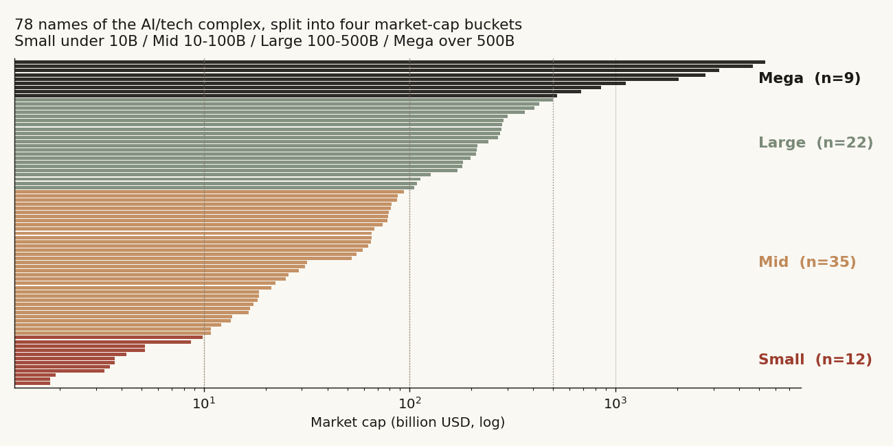
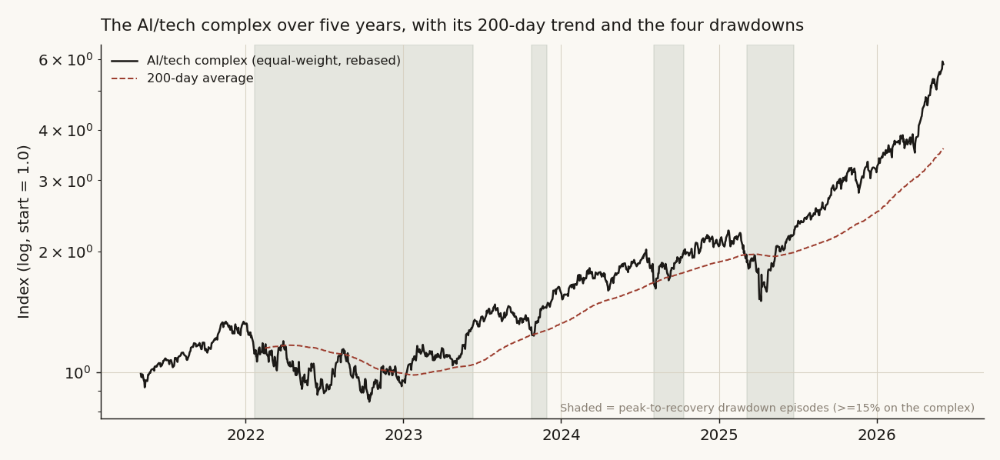
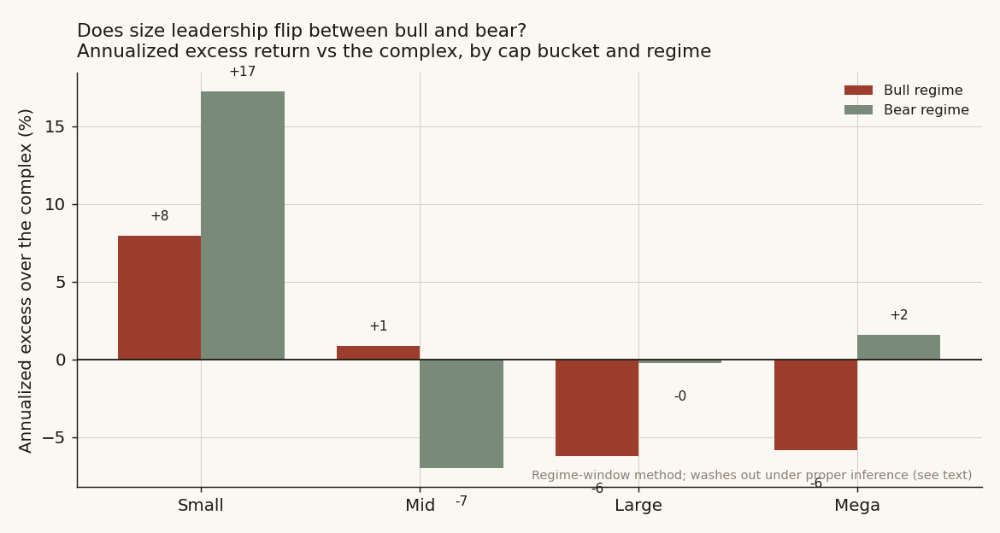
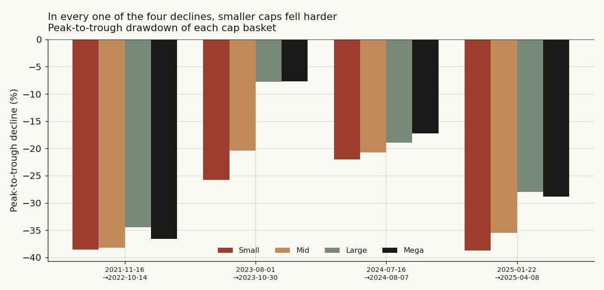
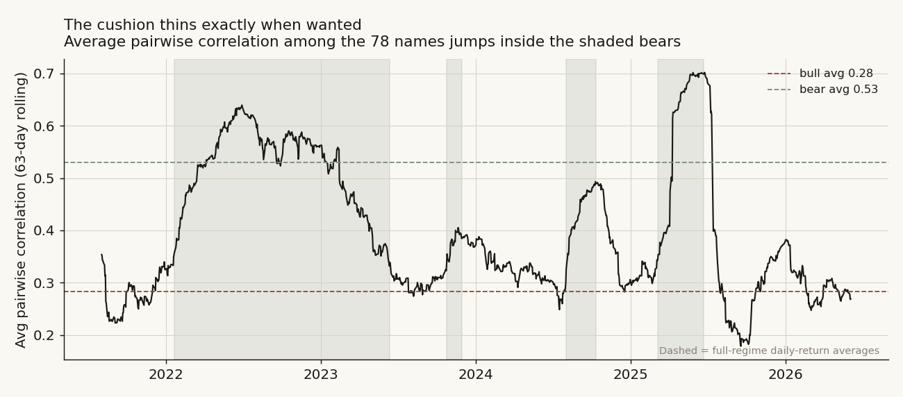

# 22 — Sector rotation by size: does money rotate between big and small tech as the cycle turns — and can you trade it?

There is a tidy story traders tell about cycles. When the market is climbing, money chases the risky, fast-moving names; when it turns down, money runs to the safe, boring ones. "Risk-on, risk-off." Inside the one corner of the market I can measure deeply — the US AI and technology complex, from the smallest chip-tool maker to the trillion-dollar platforms — the cleanest version of that story is **size**. If rotation is real, the small, high-octane names should lead when the complex is rising and get dumped first when it falls; the giant, cash-rich platforms should be the place money hides.

So I split the complex into four market-cap buckets and asked one question: **does size leadership actually flip with the cycle, the way the story says — and if it does, can you make money rotating between buckets?**

The short answer is no, and the reason is almost boring once you see it. Size is not a rotation axis at all. It is a **volume knob on beta**. Small caps go up more *and* down more, by almost exactly the same factor; the giants damp both directions by almost exactly the same factor. There is no point in the cycle where the small bucket quietly becomes safe or the mega bucket quietly becomes exciting. And every attempt to trade the supposed rotation loses to the dumbest thing you can do — just holding the whole complex.

**Question.** As the AI/tech complex rises and falls, does capital measurably rotate between market-cap tiers — into small, high-beta names in the up-legs, into mega-caps for shelter in the down-legs — and can a real-time rule turn that rotation into a return or a smaller drawdown?

**Why it matters.** If size leadership genuinely flipped with the cycle, a sector book could ride it: lean into small caps while the trend is up, hide in the megas when it rolls over, and beat a static long. If it does not — and especially if the "small caps are defensive in bears" reading is just an accounting trick of how you slice the calendar — then the honest thing is to document it so the next person does not pay to relearn it.

> Research / backtested. 78 US-listed AI/tech names, daily split-adjusted closes, 2021-05-03 to 2026-06-04 (1,279 aligned trading days), covering the 2022 tech bear and three later drawdowns. "Money flow" is read as **relative price strength** and **up/down-capture** — the price footprint of demand — not literal fund creation or redemption, which is not in the data. No live capital, no audited track record. A clean null, reported as a null.

---

## Summary of results

- **Verdict: No — size is a beta dial, not a rotation axis, and the rotation is not tradeable.** No cap bucket becomes meaningfully more defensive in bears or more offensive in bulls once the inference is done honestly.
- **Up-capture ≈ down-capture for every bucket.** Small captures 1.23 of the complex's up moves and 1.22 of its down moves (spread +0.01, 90% CI [−0.06, +0.07]); Mega is 0.82 up / 0.79 down (spread +0.02, CI [−0.03, +0.07]). Every bucket sits on the pure-beta line. Nothing is asymmetrically protective.
- **The "defensive small-cap" reading is a calendar artifact.** Slice the cycle into peak-to-recovery windows and the small bucket *looks* like it beats the complex by +17 points a year in bears. Measure the actual peak-to-trough decline instead and small caps fell **hardest in all four drawdowns** (median −32% vs Mega's −23%). The +17% was the recovery rally hiding inside a window labelled "bear."
- **No bucket's bull-vs-bear edge is statistically real.** The difference between each bucket's bull excess and its bear excess is insignificant for all four (p = 0.27 to 0.71). The eye-catching rotation washes out the moment you put a confidence interval on it.
- **You cannot trade it.** A causal 200-day-trend rotation (small in up-trends, mega in down-trends, 20 bps per switch) earns Sharpe 1.13 versus **1.26 for simply holding the complex**, cuts no drawdown (−43% vs −37%), and beats a randomly-timed version of itself only 35% of the time (placebo p = 0.65). The long-short timing tilt is outright negative.
- **The cushion thins exactly when wanted.** Average pairwise correlation across the 78 names jumps from 0.28 in bulls to 0.53 in bears; the four buckets are already 0.80-correlated in calm and 0.91 in stress. There is barely any diversification to rotate into.
- **The spine:** compute each name's cap → split into four buckets → measure capture, regime excess, and peak-to-trough decline per bucket → test whether any of it survives a bootstrap → then try to trade it and benchmark against random timing. It does not survive, and it does not trade.

---

## What I expected, and why (the hypothesis)

The plain prior is one sentence: **if money rotates with the cycle, the smallest, highest-beta tech names should lead the complex when it is trending up and fall behind — or be actively dumped — when it is trending down, while the mega-caps act as the hiding place.** That is the size version of risk-on/risk-off, and it is what a desk means when it says "rotate down the cap scale in a melt-up, up the cap scale in a scare."

I am testing it against the *complex itself*, not against zero. In a five-year tech bull almost everything went up, and the smaller, twitchier names went up fastest of all (the Small bucket compounded at 53% a year, the giants at ~39%). So "the small bucket made money in the bull" is not evidence of rotation — it is evidence of beta. The honest question per bucket is whether it beats *simply owning the whole complex* in that regime, and whether that edge **flips sign** between bull and bear. A rotation that is real has to show a defensive tilt appearing in bears that was not there in bulls.

One published idea earns a single line here because it sharpens the test, not because I trust it over my own data: up/down-**capture** (the Morningstar convention) is the standard way to ask "in down months, what fraction of the market's loss did this thing take?" A genuinely defensive asset has down-capture well below 1 and up-capture near 1 — it gives up little on the way down and keeps up on the way up. A pure-beta asset has up-capture and down-capture roughly *equal*, both above or both below 1. That single comparison — is the up/down spread different from zero? — is the cleanest test of "defensive" there is, so I lead with it.

**Hypotheses (per bucket, daily returns vs the equal-weight complex):**

- **H0 (the null I expect to keep):** each bucket's behaviour relative to the complex is the *same* in bulls and bears — it is just its beta, scaled. Up-capture ≈ down-capture. No rotation.
- **H1, the rotation claim:** small caps show positive excess in bulls that turns negative (or sharply smaller) in bears, and mega-caps the reverse; small caps' down-capture exceeds their up-capture, mega-caps' is the inverse.

**What would prove me wrong:** a bucket with an up/down-capture spread that is significantly different from zero in the protective direction (mega-caps low down-capture, or small-caps high down-capture, with a CI clear of zero), **and** a bull-minus-bear excess difference that is significant and the right sign. Either alone would be suggestive; both together would be rotation. Neither happens.

**My approach, in one breath:** cut the 78-name complex into four cap buckets; measure each bucket's up/down-capture and its excess over the complex in bull and bear regimes; check whether the "defensive small-cap" signal that the regime-window method throws off survives an honest peak-to-trough measurement and a bootstrap; then build the causal trend-rotation strategy and see if it beats buy-and-hold and a random-timing placebo. Only a surviving, sign-flipping, tradeable edge would count.

This study is the macro-scale sibling of [study 01 (volume-sweep microstructure)](../01-volume-sweep-microstructure/), which found that size scales *noise*, not signal, on intraday data; here the same lesson appears one timescale up — size scales *beta*, not rotation. It shares the concentration lens of [study 11 (semiconductor concentration)](../11-semiconductor-concentration/) and the breadth-timing null of [study 16 (narrow leadership and the index)](../16-narrow-leadership-and-the-index/).

## How I set it up (method, and why each piece)

- **Universe (the biggest the data honestly supports).** 78 US-listed AI/tech names with a full five-year daily history *and* a reported diluted share count for the cap split. They span the whole complex: chip designers and foundries, semi-cap equipment, optical and networking, data-center and power infrastructure, and the mega-cap software and platform names. I deliberately did **not** force the classic nine-sector "cyclical vs defensive" study onto this data: the warehouse has no staples, utilities, or health-care names and no clean sector ETF history, so a cross-sector rotation claim would have been fabricated. Size is the rotation axis this data can actually test, and it is the one the cross-section is built for.
- **Market cap → buckets.** Each name's cap = (a robust recent diluted share count, the median of its last four positive quarterly filings) × (its latest daily close), in $B. The 78 sort into **Small (< $10B, 12 names), Mid ($10–100B, 35), Large ($100–500B, 22), Mega (> $500B, 9)** — the same four tiers used across this repo.
- **The "market" is the complex, equal-weighted.** Each bucket is its own equal-weight basket; the benchmark is the equal-weight average of all 78 names. Equal weight on purpose: a cap-weight complex would be ~half NVDA-plus-Apple, so "leadership measured against it" would just be a concentration mirror.
- **Sample / window.** Daily split-adjusted closes, 2021-05-03 → 2026-06-04, 1,279 days common to all 78 names. The complex compounded +483% over the window.
- **Two regimes, kept strictly apart.** A *descriptive* regime — a 15%-drawdown state machine on the complex index that dates four bear episodes (the 2022 tech bear, plus sharp 2023, 2024 and 2025 drawdowns) and calls everything else bull — is only ever used to *describe*, because its exit (a new all-time high) is knowable only in hindsight. A separate *causal* regime — the complex above or below its own 200-day average, computed through the prior close and acted on the next day — is the only thing allowed to claim "tradeable," and it is charged 20 bps whenever it rotates.
- **Up/down-capture.** Geometric capture (Morningstar convention) of each bucket against the complex, on up-days and down-days separately. The up-minus-down spread is the headline "defensive?" statistic.
- **Honest inference.** Daily returns are autocorrelated and the buckets share days, so every CI is a **stationary block bootstrap** (mean block ≈ 5 trading days) rather than an i.i.d. t-test. Capture spreads and regime-excess differences both get 90% bootstrap CIs. The tradeable test is benchmarked against a **circular-shift placebo** of the trend signal — randomly-timed rotation with the same on/off mix — so I am measuring the edge of the *timing*, not of being long high-beta names.
- **Robustness.** A chronological out-of-sample split, a cost haircut on rotations, a correlation-regime overlay, and an early-warning test (does small-cap weakness lead the bear onsets?).

The identification problem, stated out loud: in a bull market, **drift contaminates everything, and contaminates the high-beta small bucket most.** Any rule that is "long the small bucket on selected days" will look brilliant in raw return. The whole method nets that out — the excess-over-complex framing, the up/down-capture spread, and the random-timing placebo are the load-bearing pieces, not the headline return.

## The data

**The universe, bucketed.** Caps are robust-recent-shares × latest close, in $B.

| Bucket | Range | Count | A few members (cap $B) | Total cap |
|---|---|---:|---|---:|
| **Small** | < $10B | 12 | AMSC (2), PLAB (2), AEHR (4), ACLS (5), IPGP (5), VSH (9), FORM (10) | $53B |
| **Mid** | $10–100B | 35 | AMKR (18), ENTG (21), SMCI (32), MCHP (52), NXPI (82), SNOW (81), DDOG (88), NET (94) | $1,692B |
| **Large** | $100–500B | 22 | CDNS (113), CRM (183), PANW (198), QCOM (269), TXN (279), KLAC (283), AMAT (405), LRCX (426) | $5,446B |
| **Mega** | > $500B | 9 | CSCO (520), ORCL (683), AMD (856), MU (1,127), AVGO (2,031), AMZN (2,741), MSFT (3,195), AAPL (4,669), NVDA (5,359) | $21,180B |



| | |
|---|---|
| Series | 78 US AI/tech daily split-adjusted closes |
| Window | 2021-05-03 → 2026-06-04 (1,279 trading days) |
| Complex | equal-weight average of all 78 names (the benchmark) |
| Regimes | descriptive: 15%-drawdown state machine (779 bull / 500 bear days) · causal: 200-day average through prior close |

One line per transform: daily closes → equal-weight bucket and complex baskets → up/down-capture and regime excess vs the complex → 200-day average for the causal regime → block-bootstrap CIs. Caps from latest diluted shares × latest close. All from a private price + reference warehouse.

## What the complex looks like first

Here is the whole complex over five years, its 200-day average, and the four drawdowns the descriptive state machine dates. Two real bears (the 2022 tech wreck, −37%; the early-2025 tariff scare, −33%) and two sharp shallow ones (2023, −16%; 2024, −20%).



That is the stage. Now the question is whether, inside those shaded spans, the small bucket quietly hands the baton to the giants — or whether everyone just falls together at their own beta. The spine from here: **first I ask the cleanest "defensive?" question there is (capture), then I chase the one signal that looks like rotation and find out it is a calendar trick, then I put a CI on the whole thing, and finally I try to trade it.**

---

## Analysis

### Finding 1 — Every bucket sits on the beta line: nothing is "defensive"

- **What I expected & why.** Under the rotation story the mega bucket should be a shelter: it should give up less than its share of the complex's down moves (down-capture well below 1) while keeping pace on the way up. Small caps should be the opposite. Under the null, every bucket's up-capture and down-capture are roughly *equal* — pure beta, no asymmetry.
- **How I measured it.** Geometric up/down-capture of each bucket against the complex, with a paired block bootstrap for the up-minus-down spread:

  ```python
  up, dn = mkt > 0, mkt < 0                      # complex up-days / down-days
  up_cap = geomean(bucket[up]) / geomean(mkt[up])
  dn_cap = geomean(bucket[dn]) / geomean(mkt[dn])
  spread = up_cap - dn_cap                        # ~0 => pure beta; <0 => defensive tilt
  # 90% CI: resample day indices jointly (bucket + complex) in ~5-day blocks
  ```

- **What the data shows.** The spread is statistically zero for all four buckets. Small captures *more* of both directions (1.23 up, 1.22 down); Mega captures *less* of both (0.82 up, 0.79 down). Nobody buys protection by going up the cap scale — they just buy lower beta, symmetrically.

  | Bucket | Up-capture | Down-capture | Spread (up − down) | 90% CI | p | Beta | Vol |
  |---|---:|---:|---:|:--|---:|---:|---:|
  | Small | 1.23 | 1.22 | +0.01 | [−0.06, +0.07] | 0.89 | 1.18 | 41% |
  | Mid | 1.06 | 1.08 | −0.02 | [−0.04, +0.00] | 0.11 | 1.07 | 34% |
  | Large | 0.85 | 0.84 | +0.01 | [−0.02, +0.04] | 0.49 | 0.86 | 28% |
  | Mega | 0.82 | 0.79 | +0.02 | [−0.03, +0.07] | 0.43 | 0.82 | 29% |

  

  Plotted, the four buckets fall almost perfectly on the 45-degree line where up-capture equals down-capture. A defensive bucket would sit *above* the line (more up than down); a fragile one *below*. None does. The picture is a beta ladder, not a rotation map.

- **Why (mechanism).** Cash it out: the Small bucket's average up-day move is ~1.23× the complex's, and its average down-day move is ~1.22× — the same multiplier in both directions. That is the definition of beta with no alpha asymmetry. There is no hidden "small caps hold up in stress" or "megas surge in melt-ups" — the multiplier is the whole story, and it points the same way up and down.
- **What I checked.** The block bootstrap (5-day blocks) widens every CI to span zero; the closest to significant is Mid at p = 0.11, in the *wrong* (mildly fragile) direction. Beta and realized vol line up monotonically with size (Small 1.18 / 41% → Mega 0.82 / 29%), confirming the ladder.
- **Verdict.** **Null.** No bucket is asymmetrically defensive or offensive. Size is a symmetric beta dial. H1 fails on its cleanest test before I even reach regimes.

### Finding 2 — The "defensive small-cap in bears" signal is a calendar artifact

- **What I expected & why.** If the rotation story has any life left after Finding 1, it should show up as a regime flip: small caps beating the complex in bulls and lagging in bears. When I slice the cycle into bull and bear *windows* and annualize, that is exactly what seems to appear — and it is a trap.
- **How I measured it.** Two ways, on purpose. First the regime-window way (annualized excess inside each peak-to-recovery window). Then the honest way: the actual peak-to-trough decline of each bucket in each of the four drawdowns.

  ```python
  # tempting (and misleading): annualized excess inside each regime window
  excess[b, regime] = annualize(bucket_ret[regime]) - annualize(complex_ret[regime])
  # honest: peak -> trough decline, where trough = complex low in the episode
  decline[b, ep] = bucket_cum[trough] / bucket_cum[peak] - 1
  ```

- **What the data shows.** The window method makes the small bucket look like a hero in bears: **+17.2% annualized excess over the complex in bear regimes**, on top of +7.9% in bulls. Read naively, that says small caps lead in *both* states — which already breaks the rotation story (a defensive asset should lag in bulls), but it still flatters small caps in the downturn.

  

  Then measure what actually happened to your money from the top to the bottom of each crash, and it inverts completely. In **all four** drawdowns the small bucket fell *hardest*:

  | Bucket | 2022 bear | 2023 | 2024 | 2025 | Median | Mean | Declines worse than Mega |
  |---|---:|---:|---:|---:|---:|---:|---:|
  | Small | −38.5% | −25.8% | −22.0% | −38.7% | **−32.2%** | −31.3% | 4 of 4 |
  | Mid | −38.3% | −20.4% | −20.8% | −35.5% | −28.1% | −28.7% | 4 of 4 |
  | Large | −34.4% | −7.8% | −18.9% | −28.0% | −23.5% | −22.3% | 1 of 4 |
  | Mega | −36.6% | −7.7% | −17.3% | −28.8% | **−23.0%** | −22.6% | — |

  

  The complex itself fell −37% / −16% / −20% / −33%. The mega bucket consistently lost the *least*; the small bucket the *most*. The +17% "bear excess" was real arithmetic on a mislabelled window — the drawdown state machine keeps a window "bear" until the complex makes a *new high*, so each bear window contains the entire recovery rally, and small caps' violent bounce off the bottom (a +44% leg in 2022) gets averaged in as if it were "bear performance."

- **Why (mechanism).** A worked case: in the 2022 bear the complex peaked in November 2021 and did not reclaim that high until mid-2023. The small bucket fell 38% to the October-2022 trough — worse than every other bucket — then ripped higher into 2023 while still inside the "bear" label. Annualize the whole stretch and the brutal decline and the violent rebound net out to a flattering number. Measure top-to-bottom, where the pain actually lived, and small caps were the *least* defensive thing in the complex.
- **What I checked.** This is the same beta dial from Finding 1, viewed through a crash: higher beta means a deeper fall and a sharper bounce. The window method confounds the two; the peak-to-trough cut separates them and kills the defensive reading.
- **Verdict.** **The rotation reading is rejected.** The one number that looked like "small caps are safe in bears" is an artifact of slicing the calendar to include the recovery. On the metric that matters to a holder — how far down did it take me — smaller is *worse*, every single time.

### Finding 3 — Put a confidence interval on it and the rotation disappears entirely

- **What I expected & why.** Even granting the window framing, a *real* rotation would survive a bootstrap: the gap between a bucket's bull excess and its bear excess would be reliably non-zero. A noise pattern would not.
- **How I measured it.** For each bucket I took its daily excess over the complex, split it by regime, and block-bootstrapped the difference of regime means (5-day blocks, 5,000 draws):

  ```python
  e = bucket_ret - complex_ret                       # daily excess
  diff = e[regime=='bull'].mean() - e[regime=='bear'].mean()
  # block-bootstrap each regime mean, take the difference distribution -> 90% CI, p
  ```

- **What the data shows.** Not one bucket has a significant bull-vs-bear difference. The point estimates are tiny (a few basis points a day) and every CI straddles zero:

  | Bucket | Bull excess (bp/day) | Bear excess (bp/day) | Difference | 90% CI | p |
  |---|---:|---:|---:|:--|---:|
  | Small | +3.6 | +6.1 | −2.5 | [−13.1, +7.8] | 0.71 |
  | Mid | +0.5 | −1.7 | +2.2 | [−1.1, +5.4] | 0.27 |
  | Large | −2.0 | −0.6 | −1.4 | [−6.4, +3.5] | 0.64 |
  | Mega | −1.8 | +0.0 | −1.9 | [−9.4, +6.0] | 0.69 |

  The smallest p-value anywhere is Mid at 0.27 — nowhere near significant, and the sign (a *bull* tilt, if anything) is the opposite of the rotation prediction. The annualized window gaps that looked like 15-to-25-point swings are, at daily resolution with an honest interval, indistinguishable from zero.

- **Why (mechanism).** The descriptive magnitudes rest on only **four bear episodes** — that is the true sample behind every bear average, no matter how many daily bars stack up inside them. With four independent regime switches, the confidence band on "how a bucket behaves in bears" is enormous. The daily means are small and the dependence-adjusted error bars swallow them.
- **What I checked.** Cross-check from a completely different angle — the capture spread of Finding 1 — agrees: zero asymmetry there, zero significant regime difference here. Two independent measurements, same answer.
- **Verdict.** **Null, confirmed.** There is no statistically real size rotation between bull and bear. H0 holds.

### Finding 4 — The cushion thins exactly when you would want it

- **What I expected & why.** Suppose, despite Findings 1–3, you still wanted to rotate for diversification. That only helps if the buckets move differently from each other in a crash. The well-known pattern is the opposite: correlations spike when everything sells off.
- **How I measured it.** Rolling 63-day average pairwise correlation across the 78 names, and the average pairwise correlation among the four bucket baskets, split by regime:

  ```python
  def avg_pairwise(df):
      c = df.corr().values; n = len(c)
      return (c.sum() - n) / (n*(n-1))     # mean off-diagonal correlation
  ```

- **What the data shows.** Among the 78 names, average pairwise correlation rises from **0.28 in bulls to 0.53 in bears** — it roughly doubles in stress. Among the four cap baskets it is already **0.80 in bulls and 0.91 in bears**: the buckets barely diverge even in calm, and they converge toward one in a crash.

  

- **Why (mechanism).** When the complex is falling, idiosyncratic stories stop mattering and one factor — risk appetite for tech — drives everything. The four buckets are slices of the *same* factor, so they move together hardest exactly in the drawdowns where you hoped one would protect you. There is almost no cross-bucket diversification to rotate into when it counts.
- **What I checked.** The bull/bear correlation gap (+0.25 among names) tracks the drawdown spans visibly in the rolling chart — every shaded bear coincides with a correlation spike, including the short 2023 and 2024 ones.
- **Verdict.** **Confirmed, and it deepens the null.** Even if a rotation edge existed, the diversification it would rely on evaporates in the very regimes it is meant for.

### Finding 5 — You can watch it, but you cannot trade it

- **What I expected & why.** The descriptive views are hindsight. The only fair test of "tradeable" is a causal rule. If size rotation were real and exploitable, a 200-day-trend rotation — lean into small caps while the complex trends up, hide in megas when it rolls over — should beat buy-and-hold or at least cut the drawdown.
- **How I measured it.** Trend known as of the prior close, acted next day, 20 bps charged per switch; benchmarked against buy-and-hold and against a circular-shift placebo of the same signal:

  ```python
  pos  = where(complex > complex.rolling(200).mean().shift(1), 'Small', 'Mega')
  ret  = bucket_ret[pos] - 0.0020 * pos.changed()        # 20 bps per rotation
  # placebo: circularly shift the trend signal by a random offset, re-run, 2,000 times
  ```

- **What the data shows.** No causal variant beats simply holding the complex, and none cuts the drawdown:

  | Strategy (net of 20 bps/rotation) | Sharpe | CAGR | Max drawdown |
  |---|---:|---:|---:|
  | Cap rotation (Small in up-trend / Mega in down-trend) | 1.13 | +42.3% | −43.2% |
  | Long-short size timing tilt | −0.09 | −6.2% | −62.1% |
  | De-risking overlay (complex / Mega) | 1.20 | +37.7% | −42.6% |
  | **Buy-and-hold complex (equal-weight)** | **1.26** | +41.5% | **−36.8%** |
  | Hold Mega always (lowest beta) | 1.28 | +38.8% | −41.0% |
  | Hold Small always (highest beta) | 1.24 | +53.4% | −44.8% |

  

  Buy-and-hold has the **best Sharpe (1.26) and the shallowest drawdown (−37%)** of everything that times. The long-short tilt is negative outright. "Hold Mega always" matches buy-and-hold on Sharpe with a slightly higher drawdown — confirming the only thing size buys you is lower beta, which a static low-beta hold already delivers, no timing required. The best raw *return* comes from "hold Small always" (+53% CAGR) — pure beta in a bull, with the worst drawdown to match. Out-of-sample the rotation trails buy-and-hold in both halves (train Sharpe 0.68 vs 0.79; hold-out 1.74 vs 1.97).
- **Why (mechanism).** A 200-day filter is far too slow for these drawdowns — the worst leg, the 2025 tariff scare, was −33% in eleven weeks, and the filter was still flagging "up-trend" deep into the fall. By the time it flips you to megas the damage is done, and you eat 20 bps and a whipsaw turning back.
- **What I checked.** The placebo is decisive. Randomly-timed rotation (the real signal circularly shifted, 2,000 times) earns an *average* Sharpe of 1.20 — *higher* than the real 200-day rotation's 1.13 — and the real signal beats the random version only 35% of the time (p = 0.65). The timing adds nothing; any benefit is just being long high-beta names in a bull. The early-warning version fails too: small-cap weakness before the four bear onsets has no consistent sign (RS slope −78% / −159% / +149% / −127% a year into the four tops).
- **Verdict.** **No.** The rotation is a regime/positioning lens, not a tradeable signal. It loses to buy-and-hold net of cost, cuts no drawdown, and is beaten by its own random-timing placebo.

---

## Robustness — did I just find noise?

Pulled together as one goal: the null had to survive a true forward split, a cost charge, a random-timing placebo, and an independent second metric. It does. The chronological hold-out (train pre-Aug-2024, hold-out after) keeps rotation below buy-and-hold in both halves. The 20 bps cost only widens the gap. The circular-shift placebo shows the 200-day timing is *worse* than random timing of the same signal (1.13 vs 1.20 mean Sharpe). And the two descriptive legs — capture asymmetry (Finding 1) and regime-excess difference (Finding 3) — are independent measurements that both land on zero, so the null is not an artifact of one method. The block bootstrap is the connective tissue: every CI uses 5-day blocks, so daily autocorrelation cannot manufacture a false signal.

## Steelman the rival, then kill it

Three rival stories could each produce the surface look of a size rotation. Each gets its best case, then its own numbers.

**Rival A — small caps really are defensive in bears (the rotation story).** *Steelman:* the +17% annualized bear excess for the Small bucket is the predicted flight-to-the-fast-recovery. *Test:* measure the actual peak-to-trough decline instead of the peak-to-recovery window — small caps fell **−32% median, worst of all four buckets, in 4 of 4 drawdowns.** The +17% is a recovery rally averaged into a "bear" label. **Rival A loses.**

**Rival B — it's just beta, symmetric, no rotation.** *Steelman:* every bucket's up-capture equals its down-capture; size is a volume knob, nothing more. *Test:* the capture spreads are +0.01 / −0.02 / +0.01 / +0.02, every CI on zero (p ≥ 0.11), and beta and vol fall monotonically with size. **Rival B wins** — this is the true picture, and it is the picture of *no rotation*.

**Rival C — the rotation is real but too slow/noisy to trade.** *Steelman:* maybe the descriptive edge exists and only execution kills it. *Test:* the descriptive edge is itself insignificant before any trading (regime-excess differences p = 0.27 to 0.71), and the causal version loses to a *random*-timing placebo (p = 0.65). There is no edge upstream of execution to lose. **Rival C describes nothing** — there is no signal to fail to trade.

The rival that wins (pure symmetric beta) is exactly the one that implies *no tradeable size rotation*. The rival that would rescue the story (small caps defensive in bears) is the one the peak-to-trough data flatly rejects.

---

## The answer, in the data

**Q: Does capital rotate between cap tiers as the AI/tech cycle turns — and can you trade it?**

**A: No, and no.** Split into four market-cap buckets and measured honestly — geometric up/down-capture, regime excess with block-bootstrap CIs, peak-to-trough declines, a causal trend strategy, a random-timing placebo — **size is a symmetric beta dial, not a rotation axis.** Up-capture equals down-capture in every bucket (spreads on zero, p ≥ 0.11). The "defensive small-cap in bears" reading is a calendar artifact: on the metric that matters, small caps fell hardest in all four drawdowns (median −32% vs Mega −23%). No bucket's bull-vs-bear edge is significant (p = 0.27 to 0.71). And the causal rotation loses to buy-and-hold (Sharpe 1.13 vs 1.26), cuts no drawdown, and is beaten by its own random-timing placebo.

| Bucket | Up-capture | Down-capture | Spread (p) | Median bear decline | Bull−bear excess diff (p) |
|---|---:|---:|:--|---:|:--|
| Small (< $10B, n=12) | 1.23 | 1.22 | +0.01 (0.89) | −32.2% | −2.5 bp (0.71) |
| Mid ($10–100B, n=35) | 1.06 | 1.08 | −0.02 (0.11) | −28.1% | +2.2 bp (0.27) |
| Large ($100–500B, n=22) | 0.85 | 0.84 | +0.01 (0.49) | −23.5% | −1.4 bp (0.64) |
| Mega (> $500B, n=9) | 0.82 | 0.79 | +0.02 (0.43) | −23.0% | −1.9 bp (0.69) |
| **Tradeable test** | — | — | — | — | rotation Sharpe **1.13** vs buy-hold **1.26**; placebo p=0.65 |

**The two questions, separated.** *Did size rotation hold, and can you trade it?* No on both — a clean null. *Was the method sound / what did I learn?* Yes: cutting the complex by size turned a vague "does money rotate?" into a sharp diagnosis — the one thing that *looked* like rotation (the small-cap bear excess) is a window-slicing artifact, and the cap-bucket lens plus the peak-to-trough cut is what exposes it. The live alternative I **cannot** fully exclude is that a genuine cyclical-vs-defensive rotation exists *across* sectors (staples, utilities, health care versus tech) that this tech-only warehouse simply cannot see — so this is *inconsistent with* a tradeable size rotation inside the tech complex, not a proof that no sector rotation exists anywhere. Within the data I have, the honest result is a null, and a clean one.

## Caveats

- **Price strength, not fund flows.** Every figure is relative return or capture, not net dollars created or redeemed. Direction is demand revealed by price; literal creation/redemption is not in the data.
- **Tech-only universe — the big one.** This is the AI/tech complex, not a cross-sector market. The classic "cyclicals vs defensives" rotation cannot be tested here because the warehouse has no staples/utilities/health-care names; I tested the rotation axis the data *can* support (size) and said so rather than fabricating sector ETFs. Direction of bias: unknown — a true cross-sector rotation could exist and be invisible here.
- **Four bears.** Every bear magnitude rests on four independent drawdowns; the daily samples look large, but the honest n behind each bear average is four, which is why the CIs are wide and the regime differences insignificant.
- **Share-count and price noise at bucket edges.** Caps use a robust median of recent diluted-share filings, but a few names carry filing or split-adjustment noise, so exact bucket membership at the boundaries is approximate; the broad ladder (mega platforms at the top, small chip-tools at the bottom) is correct and is what the findings rest on.
- **Equal-weight, no costs in the descriptive figures.** Capture and excess are gross and equal-weight; only the tradeable test (Finding 5) charges cost, on rotation days.
- **Survivorship.** These are the names that survived with a full five-year history and a share count — delisted small caps would only make the small bucket look *worse* in bears, reinforcing the null.

## Reproducibility

**Cap bucketing (the cross-sectional split).** For each name: cap = (median of its last four positive quarterly diluted-share filings) × (latest daily close); assign to Small (< $10B) / Mid ($10–100B) / Large ($100–500B) / Mega (> $500B).

**Up/down-capture (the governing "defensive?" statistic).** For bucket *b* against the complex *m*, over up-days (m>0) and down-days (m<0):

```
up_cap_b = geomean(r_b | m>0) / geomean(m | m>0)
dn_cap_b = geomean(r_b | m<0) / geomean(m | m<0)
spread_b = up_cap_b - dn_cap_b        # 0 => pure beta; <0 => defensive
```

**The two load-bearing inference steps, in code:**

```python
# 1) dependence-robust CI — stationary (block) bootstrap, ~5-day mean block
def stationary_bootstrap(x, mean_block=5, n_boot=5000):
    n, p, out = len(x), 1.0/mean_block, []
    for _ in range(n_boot):
        idx, i = [], np.random.randint(n)
        while len(idx) < n:
            idx.append(i)
            i = np.random.randint(n) if np.random.rand() < p else (i+1) % n
        out.append(np.mean(np.asarray(x)[idx]))
    return np.array(out)

# 2) random-timing placebo — circularly shift the real trend signal, re-run the rotation
placebo = [rotation_sharpe(np.roll(trend.values, np.random.randint(len(trend))))
           for _ in range(2000)]
p_beat = (np.array(placebo) >= observed_sharpe).mean()   # = 0.65
```

Full pipeline (panel construction, regime state machine, capture, episode decomposition, the trend strategy, the placebo, and every chart) lives in the study's research notebook in the private method repo; the formulas and boxes above reproduce the headline numbers from raw daily closes. Source: daily split-adjusted closes for the 78 names plus reported diluted shares for the cap split, 2021–2026, from a private warehouse.

## References & forward pointer

- Up/down-capture is the standard Morningstar geometric definition; the 200-day-average trend filter and relative-strength constructions are standard, publicly documented.
- Politis, D. & Romano, J. (1994). *The stationary bootstrap.* JASA — the dependence-robust resampling behind every CI here.
- Data: daily split-adjusted closes for the 78 names, plus reported diluted shares for the cap split, 2021–2026.

**Builds on / part of:** the repo-wide thread on *which "edges" survive an honest test.* Shares the four-cap-bucket lens with [study 01 — volume-sweep microstructure](../01-volume-sweep-microstructure/) (where size scales *noise*; here it scales *beta*), the concentration view of [study 11 — semiconductor concentration](../11-semiconductor-concentration/), and the timing-overlay null of [study 16 — narrow leadership and the index](../16-narrow-leadership-and-the-index/).

**Next:** [study 16 — narrow leadership and the index](../16-narrow-leadership-and-the-index/), which asks the cousin question one level up — when breadth thins and the megas carry the tape, is *that* a tradeable warning? (It is not either.) Same lesson, different lens: the cycle is legible, and still not timeable.
