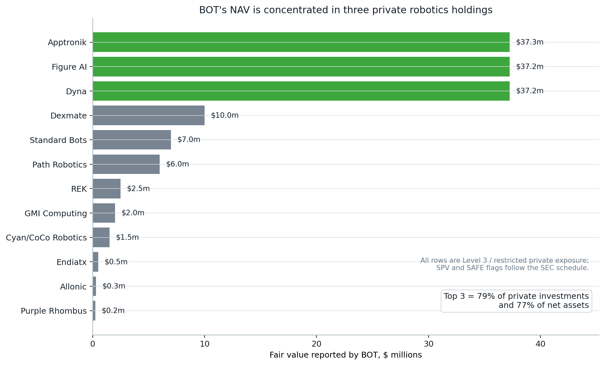
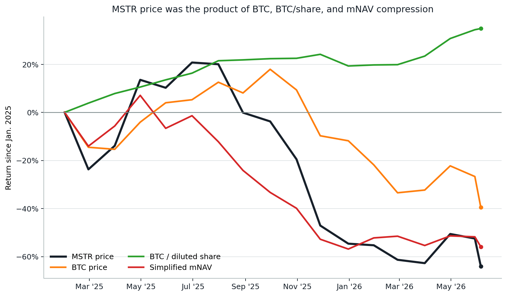
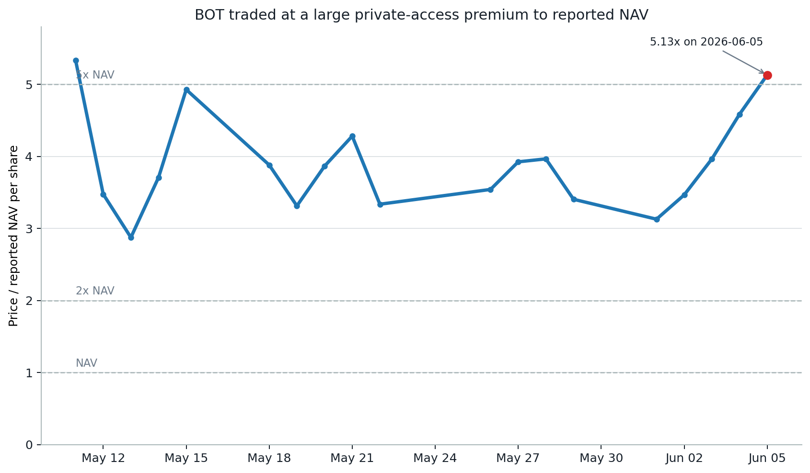
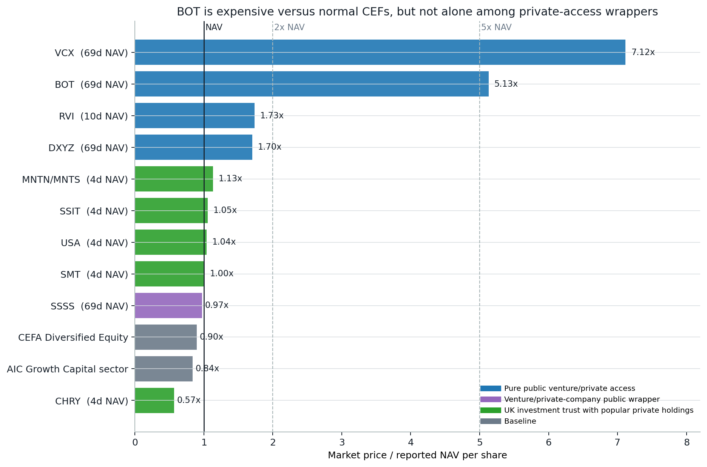
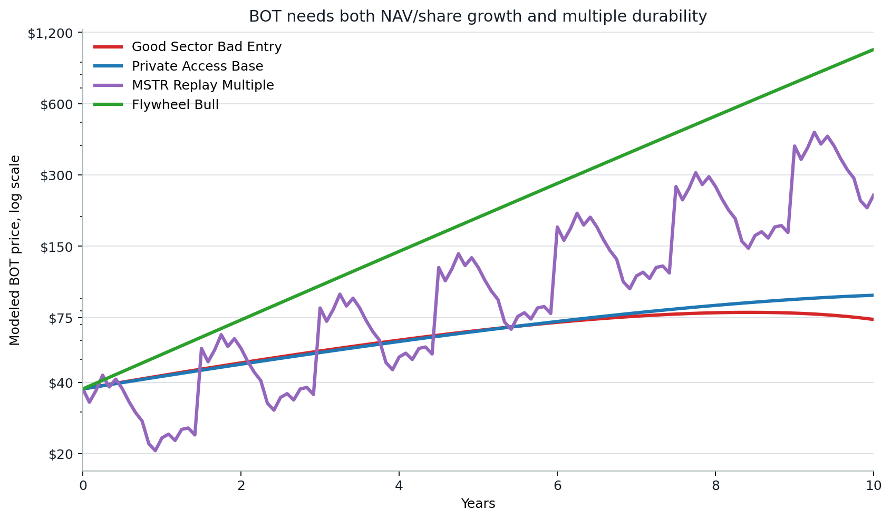
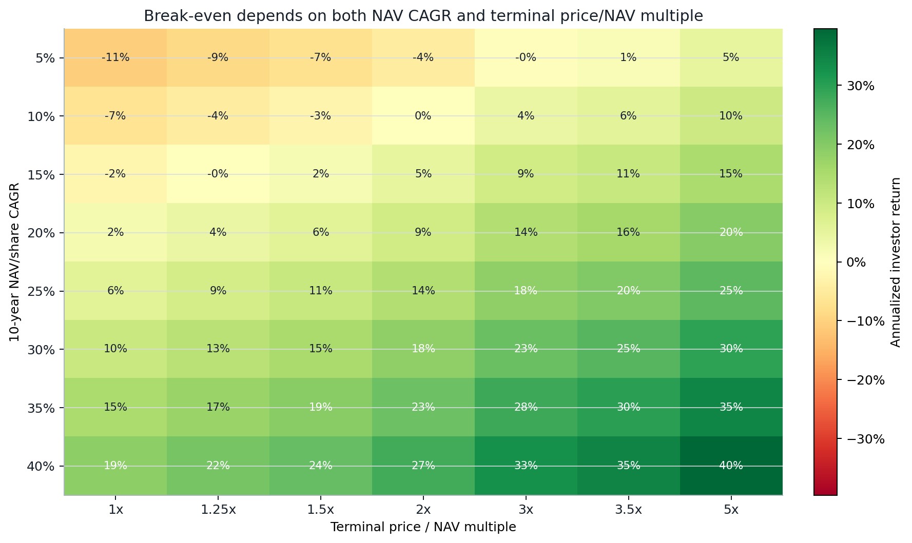

# 23 — Robotics closed-end fund vs MSTR premium replay

**Question.** If a robotics closed-end fund owns mostly private companies and trades at a persistent premium to reported NAV, does a MicroStrategy/Strategy-style issuance flywheel make it bullish for early public investors?

**Finding.** **Conditional.** The premium is not automatically bearish. A private-access premium can be rational if public investors cannot otherwise buy the underlying robotics companies. But early public investors benefit only if **NAV/share compounds before the premium fades**. The clean test is:

```text
MSTR price ~= BTC price x BTC per diluted share x simplified mNAV
BOT price  = robotics NAV/share x price-to-NAV multiple
```

So BOT can be right about robotics and still be a mediocre public entry if the starting multiple compresses faster than NAV/share grows. At the latest Massive daily close used here, BOT traded at **$37.49** versus reported NAV/share of **$7.31**, or **5.13x NAV**. That can be a rational access premium. It is also a demanding hurdle.

> Research model only; not personal financial advice. The MSTR mNAV here is simplified and excludes debt, preferred stock, cash, and operating software value. It is built to test price-action mechanics, not produce an official valuation.

## Result

**A robotics closed-end fund using the MSTR method can be bullish for early investors, but only conditionally.** The premium is part of the mechanism, not automatically a flaw. The bullish version requires all three:

1. **NAV/share growth**, not just total NAV growth.
2. **Accretive issuance**, meaning new shares are sold above NAV after fees and increase NAV/share.
3. **Premium durability**, meaning the market continues paying for scarce private robotics access long enough for NAV/share to catch up.

The bearish version is not "premium exists." It is:

- the premium is hype rather than access value;
- BOT issues shares without NAV/share accretion;
- private marks are stale or unsupported by outside rounds, IPOs or M&A;
- the multiple compresses before robotics NAV/share compounds.

At a starting multiple above **5x reported NAV**, early investors are not just buying robotics. They are buying the persistence of the private-access premium.

## External research cross-check

Outside research supports the robotics adoption side of the thesis, but it does not remove the price/NAV hurdle. The public evidence points to a two-part answer: robotics can be a real secular theme, while BOT still has to convert that theme into NAV/share accretion at a starting premium above 5x reported NAV.

| Source | What it supports | How it affects BOT thesis |
|---|---|---|
| [Citrini Research humanoid primer](https://www.citriniresearch.com/p/thematic-primer-humanoid-robots?action=share) | Citrini frames humanoids as a "why now" theme driven by early deployments, AI progress, a falling cost curve, and supplier-cycle setup. | Supports the sector bull case: private robotics holdings can be valuable if deployments and cost curves keep improving. It does **not** say BOT is cheap at any premium. |
| [Citrini MSTR thesis](https://www.citriniresearch.com/p/microstrategy-thesis) | Citrini's MSTR work treats the premium over Bitcoin holdings as state-dependent and important to value; in a weak Bitcoin regime, the vehicle can plausibly trade closer to or below asset value. | Supports this study's MSTR analogy: a premium can be rational while the flywheel works, but the public investor is exposed to premium compression. |
| [SemiAnalysis robotics levels](https://newsletter.semianalysis.com/p/robotics-levels-of-autonomy) | SemiAnalysis argues general-purpose robots are already in early production or pilot phases, while later autonomy levels still face reliability, force-sensing, data, and deployment hurdles. | Supports robotics adoption as real but uneven. No direct public SemiAnalysis call on BOT/RoboStrategy was found, so this is sector evidence, not fund-specific endorsement. |
| [RoboStrategy strategy materials](https://robostrategy.co/strategy) and [BOT 424B3 supplement](https://www.sec.gov/Archives/edgar/data/2081119/000121390026058028/ea0291179-01_424b3.htm) | RoboStrategy describes the closed-end-fund premium issuance mechanic; the supplement reports **$7.31 NAV/share** as of **2026-03-31** and large private positions in Figure AI, Dyna, and Apptronik. | Confirms the mechanism being tested: issuance above NAV can be accretive, but only when the premium persists and proceeds improve NAV/share. |
| YehCapital evidence audit | Read-only checks across the local market/research databases found robotics, physical-AI, Figure, MSTR, and social/news/transcript support, but no direct institutional BOT thesis strong enough to cite publicly. The requested cloud-drive source was unavailable at implementation time. | Used only as a sanity check. The public study relies on citeable public sources and does not include private PDFs, cloud-drive files, local paths, or unpublished ingestion code. |

## What BOT actually owns

The holding-company question matters because BOT is not a broad robotics index. The latest public SEC supplement shows **$141.8 million** of restricted Level 3 private exposure, equal to **97.4% of net assets** as of **2026-03-31**. The top three holdings - Apptronik, Figure AI and Dyna - were each about **$37.25 million**, and together represented **78.8% of private investments** and **76.8% of net assets**.



| Holding | Business | Exposure type | Fair value | % net assets | Read-through |
|---|---|---|---:|---:|---|
| Apptronik | Humanoid robotics | Direct preferred + SPV | $37.3m | 25.6% | Top-three humanoid exposure; needs deployment and later-round validation. |
| Figure AI | Humanoid robotics | SPV | $37.3m | 25.6% | Top-three humanoid exposure; needs commercial deployment and outside valuation validation. |
| Dyna | General-purpose robotics | Direct preferred | $37.2m | 25.6% | Top-three manipulation-platform exposure; needs customer traction and marked-up financing validation. |
| Dexmate | General-purpose robotics | Direct preferred | $10.0m | 6.9% | Meaningful secondary robotics exposure, but not large enough alone to justify the public premium. |
| Standard Bots | Industrial automation | Direct preferred | $7.0m | 4.8% | Industrial automation exposure added in the latest public holdings schedule. |
| Path Robotics | Industrial automation | Direct preferred | $6.0m | 4.1% | Automation exposure; upside matters but is smaller than the top-three names. |
| REK | Humanoid robotics | Direct preferred | $2.5m | 1.7% | Small early-stage humanoid and robot-competition exposure. |
| GMI Computing | Cloud infrastructure | SAFE | $2.0m | 1.4% | AI infrastructure adjacency; helps the robotics compute theme but is not a pure robot manufacturer. |
| Cyan/CoCo Robotics | Logistics | SAFE via SPV | $1.5m | 1.0% | Small logistics robotics exposure. |
| Endiatx | Medical robotics | Direct preferred | $0.5m | 0.3% | De minimis medical robotics exposure. |
| Allonic | Robotics infrastructure | Direct preferred | $0.3m | 0.2% | De minimis robotics infrastructure exposure. |
| Purple Rhombus | Defense robotics | SAFE via SPV | $0.3m | 0.2% | De minimis defense robotics exposure. |

This makes the practical test more specific. BOT is bullish if the top holdings show external validation through commercial deployments, higher-priced funding rounds, IPO filings, acquisitions, or audited NAV mark-ups. It is not bullish if the public premium rises while those marks stay flat, if the evidence remains stale, or if the top three fail to commercialize.

## Data & method

- **MSTR price.** YehCapital's published extract from the Massive-backed daily-bars store, supplemented by Massive REST where local rows were missing.
- **BTC price.** Massive REST `X:BTCUSD`.
- **BOT price.** Massive REST `BOT`; the public CSV covers **2026-05-11 to 2026-06-05**.
- **Strategy holdings.** Strategy's official purchase page for BTC holdings and assumed diluted shares outstanding.
- **BOT NAV.** SEC 424B3 reported **$7.31 NAV/share as of 2026-03-31**.

The clean MSTR decomposition window is **2025-01-06 to 2026-06-05**, because Strategy's public purchase table includes assumed diluted shares from January 2025 onward.

Core formulas:

```text
BTC reserve value        = BTC held x BTC price
BTC per diluted share    = BTC held / assumed diluted shares
BTC NAV/share            = BTC price x BTC per diluted share
simplified MSTR mNAV     = MSTR price / BTC NAV/share

BOT price/NAV multiple   = BOT price / reported NAV/share
BOT investor return      = NAV/share growth x ending multiple / starting multiple
```

## Claim 1 — MSTR is a three-factor machine, not just "Bitcoin up"

Over the modeled window, MSTR's stock price fell **68.2%** even though BTC per diluted share rose **38.8%**. The reason is visible in the decomposition: BTC price fell **37.2%** and simplified mNAV compressed **63.5%**. In other words, accretive asset-per-share growth can be real and still be overwhelmed by public multiple compression.

| Factor | Modeled result |
|---|---:|
| MSTR price return | -68.2% |
| BTC price return | -37.2% |
| BTC per diluted share change | +38.8% |
| Simplified mNAV change | -63.5% |
| Simplified mNAV range | 0.99x p25 / 1.44x median / 1.93x p75 |



**Why this matters for BOT.** The MSTR flywheel's key output is not total asset growth; it is asset-per-share growth. But the public investor's return still depends on the premium/multiple. The BOT analogue is exactly the same: robotics NAV/share can compound while the public price disappoints if price/NAV compresses.

## Claim 2 — BOT's premium is a feature of the hypothesis, not a reason to reject it

BOT traded at a large premium to its stale reported NAV through its first public month. That premium is not automatically irrational: the fund owns mostly private robotics and embodied-AI exposure, so public scarcity can justify a structural access premium. The question is whether that premium behaves like durable access value or like launch-window hype.

| Date range | BOT close range | Price/NAV multiple range | Latest multiple |
|---|---:|---:|---:|
| 2026-05-11 to 2026-06-05 | $21.01 to $39.00 | 2.87x to 5.34x | 5.13x |



**What would confirm the premium.** New share issuance has to be above NAV after costs, and the proceeds have to raise NAV/share by buying or marking up better private robotics assets. A high premium that does not translate into NAV/share accretion is only expensive access.

## Valuation ladder from reported NAV

The public filing is the anchor for a simple order-price map. BOT's reported NAV/share was **$7.31 as of 2026-03-31**. Any market price can be translated into a reported-NAV multiple with:

```text
price / $7.31 = reported-NAV multiple
reported-NAV multiple x $7.31 = implied price
```

Citrini's MSTR-style framing helps with interpretation: a premium can be rational if the public vehicle uses that premium to compound asset value per share, but the same premium can disappear if the flywheel stalls. For BOT, that means these are not fair-value targets by themselves. They are the prices at which an investor is choosing how much private-access premium to underwrite.

| Reported NAV multiple | Implied BOT price | Premium to filed NAV | Read-through |
|---:|---:|---:|---|
| 1.00x | $7.31 | 0% | Buyer pays filed NAV/share. |
| 2.00x | $14.62 | 100% | Still a large premium versus ordinary CEFs. |
| 3.00x | $21.93 | 200% | Private-access premium is meaningful but below BOT's first-month average. |
| 4.00x | $29.24 | 300% | Requires NAV/share validation, not just robotics excitement. |
| 5.00x | $36.55 | 400% | Near the study's latest BOT price/NAV level. |
| 5.13x | $37.49 | 413% | Latest Massive daily close used in this study. |
| 6.00x | $43.86 | 500% | Scarcity-window valuation; needs very durable premium or fast NAV/share catch-up. |

The practical use is mechanical: choose the maximum reported-NAV multiple you are willing to pay, then multiply it by **$7.31**. The risk is that the NAV is stale and private-company marks can move in either direction before the next filing.

## How much premium do private-access CEFs get?

The clean comparison is not BOT versus ordinary income CEFs. The better comparison is BOT versus exchange-traded vehicles that package scarce private companies or SPV exposure. On that basis, BOT's **5.13x** reported NAV multiple is still extreme, but it is not without precedent. VCX, the Fundrise Innovation Fund, recently traded near **7.12x** reported NAV while offering exposure to private AI and venture names such as Anthropic, Databricks, OpenAI and SpaceX.

That does not make BOT cheap. It says the market sometimes pays a very large access premium when three things overlap: famous private holdings, limited tradable float, and stale quarterly NAV marks. Once the sample broadens to RVI, DXYZ, SuRo Capital and UK investment trusts, the premiums fall sharply. Most private-growth wrappers trade near NAV, at modest premiums, or at discounts.

| Group | Examples | Reported price/NAV range | Read-through |
|---|---|---:|---|
| Pure public venture/private access | VCX, BOT, RVI, DXYZ | 1.70x to 7.12x | This is the relevant scarcity-premium peer group. BOT is below VCX but far above RVI and DXYZ. |
| Venture/private-company public wrapper | SSSS | 0.96x | A longer-running venture wrapper can trade near NAV even with attractive AI/private holdings. |
| UK investment trusts with popular private holdings | SMT, USA, MNTN/MNTS, SSIT, CHRY | 0.57x to 1.13x | SpaceX, Stripe, Databricks and Anthropic exposure does not automatically command multi-x NAV. |
| Broad CEF baseline | CEFA diversified equity model, AIC Growth Capital sector | 0.84x to 0.90x | Ordinary closed-end/private-growth baskets often trade at discounts, not premiums. |



The key caveat is NAV staleness. BOT, VCX and DXYZ use March 31 reported NAVs in this comparison, so the denominator may lag private-company valuation events. But stale NAV cuts both ways: it can justify some premium if marks are about to rise, and it can hide risk if public buyers are paying for unverified re-ratings. The conclusion is therefore narrower than "4x is wrong": a 4x+ multiple is **rare and demanding**, mostly visible in launch-window or scarcity-window private-access wrappers, and it needs fast NAV/share validation.

## Claim 3 — Good robotics is not enough; entry multiple decides the public return

The replay tests four paths. It is not a forecast. It is a sensitivity map for one question: how much of the early investor's return comes from NAV/share compounding versus premium persistence?

| Scenario | Year-10 NAV/share | Year-10 multiple | Year-10 price | Total return | Annualized |
|---|---:|---:|---:|---:|---:|
| Flywheel bull | $290.34 | 3.50x | $1,016.20 | +2610.6% | +39.1% |
| MSTR replay multiple | $100.75 | 2.45x | $246.90 | +558.6% | +20.7% |
| Private-access base | $46.59 | 2.00x | $93.19 | +148.6% | +9.5% |
| Good sector, bad entry | $58.91 | 1.25x | $73.64 | +96.4% | +7.0% |



The "good sector, bad entry" case is the guardrail. NAV/share can grow from **$7.31** to **$58.91** and the stock still only compounds at about **7.0%** annually if the terminal multiple normalizes to **1.25x**. That is not a failed robotics thesis. It is a paid-too-much-for-access outcome.

The break-even grid shows the same thing from another angle: if BOT eventually trades near NAV, it needs extreme NAV/share growth just to make today's public buyer whole. If the market keeps paying a 2x to 3.5x private-access multiple, the hurdle becomes much easier.



## Caveats

- **Short BOT history.** BOT's public price record in this study covers only its first trading month. The premium path is a starting condition, not a stable distribution.
- **Stale private NAV.** Reported BOT NAV/share is as of **2026-03-31**. Private marks can lag reality in either direction.
- **Holding concentration.** The public NAV is highly sensitive to Apptronik, Figure AI and Dyna; broad robotics adoption is not enough if those specific marks fail to validate.
- **Simplified MSTR mNAV.** The MSTR decomposition excludes debt, preferred stock, cash, and software operating value. It is intentionally a clean mechanical analogue, not an official valuation.
- **Scenario model, not backtest.** The 10-year BOT paths are sensitivity tests. They do not estimate private robotics company outcomes directly.
- **Private-company access risk.** Scarcity value only matters if the fund actually gets access to winners and converts issuance into NAV/share accretion.

## Reproducibility

The public figures use only CSVs in `data/`:

- `data/mstr_monthly_mnav_decomposition.csv`
- `data/bot_massive_price_nav.csv`
- `data/bot_mstr_replay_scenarios.csv`
- `data/bot_private_access_premium_break_even.csv`
- `data/bot_reported_nav_price_ladder.csv`
- `data/private_access_fund_comparables.csv`
- `data/bot_portfolio_holdings.csv`

Regenerate the figures:

```bash
python3 23-robotics-fund-mstr-premium-replay/build_figures.py
```

The supporting workbook is included as [`mstr_robotics_fund_replay_model.xlsx`](mstr_robotics_fund_replay_model.xlsx), but the README and PNGs are sufficient to audit the published conclusion. No private database, API key, or YehCapital ingestion script is required to rebuild the public figures.

## References

- Strategy official purchase page and public BTC reserve disclosures.
- [Citrini Research: Humanoid Robots](https://www.citriniresearch.com/p/thematic-primer-humanoid-robots?action=share).
- [Citrini Research: Microstrategy Thesis](https://www.citriniresearch.com/p/microstrategy-thesis).
- [SemiAnalysis: Robotics Levels of Autonomy](https://newsletter.semianalysis.com/p/robotics-levels-of-autonomy).
- [RoboStrategy strategy materials](https://robostrategy.co/strategy) on NAV, premium issuance, and closed-end fund mechanics.
- [RoboStrategy/BOT SEC 424B3 supplement](https://www.sec.gov/Archives/edgar/data/2081119/000121390026058028/ea0291179-01_424b3.htm) reporting NAV/share and portfolio reference as of 2026-03-31.
- [Fundrise Innovation Fund / VCX SEC N-CSR](https://www.stocktitan.net/sec-filings/VCX/n-csr-a-fundrise-innovation-fund-llc-sec-filing-177460d2b328.html) and public quote data for VCX.
- [Destiny Tech100 / DXYZ SEC 424B5](https://www.sec.gov/Archives/edgar/data/1843974/000157587226000359/dxyz102_424b5.htm) and public quote data for DXYZ.
- [Robinhood Ventures Fund I / RVI update](https://cdn.robinhood.com/app_assets/rhv/updates/rvi_q1_2026_update.pdf), CEFData, and public quote data for RVI.
- [SuRo Capital Q1 2026 results](https://www.globenewswire.com/news-release/2026/05/05/3288229/0/en/SuRo-Capital-Corp-Reports-First-Quarter-2026-Financial-Results.html) and public quote data for SSSS.
- AIC company data for [Scottish Mortgage](https://www.theaic.co.uk/companydata/scottish-mortgage-investment-trust), [Baillie Gifford US Growth](https://www.theaic.co.uk/companydata/baillie-gifford-us-growth), [Schiehallion](https://www.theaic.co.uk/companydata/schiehallion-fund), [Seraphim Space](https://www.theaic.co.uk/companydata/seraphim-space-investment-trust), and [Chrysalis](https://www.theaic.co.uk/companydata/chrysalis-investments).
- [CEF Advisors model portfolio data](https://legacy.cefdata.com/portfoliocomp/) and AIC advanced-compare data for broad baseline discount context.
- Investor.gov closed-end fund materials on premiums and discounts to NAV.
