# 24 — SpaceX: the complete case (quality, mania risk, liquidity, and the decade ahead)

**The question.** SpaceX completed the largest IPO in history on 12 June 2026 ($75B raised, $135 price, ~$1.77T basic market cap, opened ~$150, closed ~$161). Should you buy it — at the IPO, in the aftermarket, or at all? This dossier answers that end to end, across four lenses that were originally three separate studies and are consolidated here because they are one decision: **is the entry good (quality), is this a retail-mania top (analog), is there room in the market for it (liquidity + ecosystem), and can the "next FAANG" upside even exist (the decade)?**

> Research only; not personal financial advice. Built from EDGAR filings (source of truth), public price/macro data, and a validated multi-agent simulation used as a third-ranked evidence layer. The simulation outputs are "the simulation suggests," never evidence.

## How to read this dossier

Four lenses, weakest evidence last. Each was a standalone study; they are merged here, findings and figures intact.

- **Part I — Should you participate?** The IPO quality model: float, lock-up supply, control, index rules, comps, segments, underwriters. (Originally study 24.)
- **Part II — Is it a mania top?** The TRUMP-coin and GameStop analog: low-float manias, the mega-IPO base rate, the stock-vs-flow scale split, the study-15 chase cross-check. (Originally study 28.)
- **Part III — Is there enough market, and the decade ahead?** Liquidity absorption, value-chain peer crowding-out, regime analog, the bootstrap cone, the swarm rehearsal, and the "next FAANG" arithmetic ceiling. (Originally study 29.)

Lineage: builds on [study 15](../15-ipo-chase/) (the IPO-chase base rate) and [study 22](../22-equity-issuance-top-signal/) (issuance timing). The swarm engine's general validity is established separately in [study 30](../30-can-a-swarm-forecast/); this dossier applies it.

## The answer, up front

| Lens | Question | Verdict |
|---|---|---|
| Quality (I) | Is the *entry* good? | **Trade-only / wait-for-unlock.** Elite company, low-quality entry: 4.25% float, 9.4x supply by day 180, 84% Musk voting control, 94x sales. |
| Mania (II) | Is it a TRUMP/GME-style top? | **No on the market mechanism, yes on the share's low-float architecture.** SpaceX can't drain the market (flow shock 100x too small) but carries the same scarcity-then-unlock decay shape; the mega-IPO chase loses (-27.7% median 1y excess, like study 15). |
| Liquidity (III) | Is there room for it? | **Yes in aggregate, no in the concentrated overhang.** Smallest relative cash call of the three manias, but the lock-up supply lands on SPCX's own book; peers bleed via substitution; swarm + cone agree the break is in the back half of the unlock calendar. |
| Decade (III) | Can it be the "next FAANG"? | **No on the return.** FAANG IPO'd at a ~$1.2B median; SPCX enters at $1,770B. From $2T even the weakest FAANG multiple (Meta 14x) needs $25T = ~5x the largest company ever. Realistic ceiling ~3x. |

**Bottom line.** SpaceX is a magnificent company and a poor *entry*: capped upside over the decade (the size ceiling), unlock-supply downside over the next six months (the calendar), extreme governance discount throughout. The reasons to wait — float, unlocks, valuation, control — all resolve on a known calendar; the dossier's job is to price that calendar.

---

# Part I — Should you participate? (the IPO quality model)

**Question.** Does the SpaceX IPO setup justify participating once free float, lock-ups, control, underwriters, index inclusion rules and high-quality IPO comps are screened honestly?

**Finding.** **Trade-only / wait-for-unlock bias.** Study 15 gives the base rate: chasing IPOs from the day-1 close has been a losing trade, with a **-28.4%** median one-year excess return versus SPY and only **19%** beating SPY. SpaceX deserves a better filter than the broad IPO bucket, but the filtered large-IPO comp set still warns against complacency: its median six-month return from first close is about **-14.7%**. SpaceX is exceptional on management, underwriting, scale and scarcity. The problem is entry quality, not company quality: the immediate public float is only **555.6 million Class A shares**, or **4.25%** of basic post-offering shares; by day 180, potential tradable supply reaches about **5.24 billion shares**, or **9.4x** the IPO float and roughly **40%** of basic shares. Class B holds **88.5%** of voting power; Elon Musk holds about **49.1%** of basic economic ownership and **84.4%** of combined voting power. Connectivity is the quality anchor. AI/xAI/X is the expensive swing factor. At about **$1.77 trillion** basic market cap and a **$75 billion** raise, this is a scarcity/catalyst trade before it is a clean long-term entry.

> Research model only; not personal financial advice. Latest EDGAR check in the model is **2026-06-08**. No final **424B4** was found in SpaceX CIK `0001181412` recent filings as of that check.

## Stance

**Base case: trade only, or wait for first earnings/unlock evidence.** I would not treat the IPO price as a clean long-term entry unless the price absorbs early index demand and lock-up supply without breaking and Q2/Q3 results validate Connectivity durability plus AI contract delivery.

The upgrade path is specific:

1. Q2 2026 results confirm Starlink/connectivity revenue quality and cash conversion.
2. Anthropic and Google compute ramps convert into visible revenue without adverse contract changes.
3. The stock absorbs the first earnings release unlock, the 70/90/105/120/135-day releases, Q3 earnings unlock and day-180 cleanup, when potential supply reaches about 9.4x the IPO float.
4. Valuation resets from heroic sales multiples or the market receives enough proof that AI revenue is durable despite termination rights.
5. The final 424B4 does not change offering size, lock-ups, control, risk factors or bookrunner economics in a negative way.

## Study 15 Bridge

[Study 15](../15-ipo-chase/) is the broad prior: aftermarket IPO chasing is usually bad. This study is the exception test: remove noisy/small IPOs, keep only serious institutional comps, then ask whether SpaceX's scarcity, underwriters and index path are enough to overcome the base rate.

| Layer | Evidence | SpaceX decision rule |
|---|---|---|
| Broad IPO prior | Study 15: day-1-close entries in 760 IPOs had **-28.4%** median one-year excess return vs SPY; only **19%** beat SPY. | Start skeptical. Do not buy just because the IPO is famous. |
| Horizon prior | Study 15: median excess return worsened from **-1.9%** at 30 days to **-15.4%** at 180 days and **-28.4%** at 365 days. | The longer the hold, the more proof SpaceX needs. |
| Quality filter | Part I: micro/small IPOs, SPACs, biotech and weak story stocks are removed. | Compare SpaceX to META, V, UBER, ABNB, ARM, SNOW, DASH, RIVN, CRWD and DDOG, not the broad IPO zoo. |
| Filtered-comp warning | The filtered comp median six-month return from first close is still about **-14.7%**. | Better comps improve relevance, not the base rate. |
| SpaceX exception test | Float is only **4.25%**, Nasdaq-100 fast entry can create early demand, and underwriting quality is top-tier. | Early strength can be scarcity/index flow, not thesis validation. |
| Kill switch | Unlock waves are multiples of IPO float; governance/control is extreme; AI capex and contract risk are high. | Wait for earnings and unlock absorption before long-term sizing. |


## Source Stack

EDGAR is the source of truth. News is cross-check and sentiment color only.

| Source | Date | Use |
|---|---:|---|
| [June 3 S-1/A](https://www.sec.gov/Archives/edgar/data/1181412/000162828026040364/spaceexplorationtechnologib.htm) | 2026-06-03 | Offering math, ownership, segments, lock-ups, risk factors. |
| [June 4 UK retail FWP](https://www.sec.gov/Archives/edgar/data/1181412/000162828026040874/spacexukfwp.htm) | 2026-06-04 | Retail-offer context and disclosure cross-check. |
| [June 5 Google compute FWP](https://www.sec.gov/Archives/edgar/data/1181412/000162828026041150/spacexagreementfwp.htm) | 2026-06-05 | Google compute contract revenue/risk delta after S-1/A. |
| [June 8 EU interview FWP](https://www.sec.gov/Archives/edgar/data/1181412/000162828026041365/eu_interviewtranscript06.htm) | 2026-06-08 | Latest EDGAR filing in the model check. |
| [SpaceX IPO launch release](https://content.spacex.com/cms-assets/FINAL_Documents%20and%20Updates/6.4.26_SpaceX_Announces_IPO_US.pdf) | 2026-06-04 | Company announcement cross-check. |
| [Nasdaq-100 methodology](https://indexes.nasdaq.com/docs/Methodology_NDX.pdf) | effective 2026-05-01 | Fast-entry, seasoning, liquidity and low-float weighting rules. |
| [Nasdaq methodology update explainer](https://www.nasdaq.com/newsroom/nasdaq100-index-methodology-update-why-now) | 2026-05-08 | Cross-check on the new Nasdaq-100 framework. |
| [S&P U.S. Indices methodology](https://www.spglobal.com/spdji/en/documents/methodologies/methodology-sp-us-indices.pdf) | 2026-05 | S&P 500 eligibility, seasoning, liquidity, IWF and profitability rules. |
| [S&P MegaCap consultation results](https://www.spglobal.com/spdji/en/documents/indexnews/announcements/20260604-1483731/1483731_spdji-us-indices-megacaps-results-20260604.pdf) | 2026-06-04 | S&P 500 no-change decision and broad-index changes. |

## IPO Math

Free float here means legally tradable Class A supply, not fully diluted shares and not total economic ownership.

| Metric | Value | Read-through |
|---|---:|---|
| Class A offered | 555.6m | Base immediate public float. |
| IPO price | $135.00 | S-1/A expected price. |
| Gross proceeds | $75.0bn | Base offering before fees. |
| Net proceeds | $74.4bn | Company estimate after discounts/expenses. |
| Over-allotment option | 83.3m | Would raise immediate public float to 638.9m shares. |
| Post-offering Class A | 7,380.2m | Listed Class A after base offering. |
| Post-offering Class B | 5,695.7m | High-vote Class B after base offering. |
| Basic post-offering common | 13,075.9m | Class A plus Class B, not fully diluted. |
| Implied basic market cap | $1,765.2bn | Basic common shares times $135. |
| Immediate free float | 4.25% | Base IPO float / basic post-offering common. |
| Free float if option exercised | 4.86% | Assumes full over-allotment primary issuance. |
| Directed-share program | 27.8m | Up to 5% of IPO shares; not subject to lock-up if purchased. |
| Registration-rights overhang | ~12.2bn | Class A shares including Class B conversion shares with registration rights. |

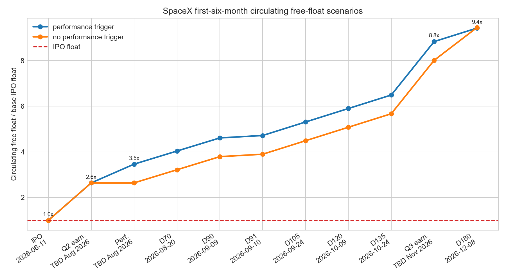

## Lock-Up Supply

Scarcity is real at IPO, but it is temporary. The lock-up analysis needs three separate ratios:

1. **Incremental release / IPO float:** how large each new release is versus the 555.6m-share IPO float.
2. **Cumulative potential supply / IPO float:** how much supply could be tradable after each release.
3. **Circulating free float / basic shares:** how much legally tradable Class A supply could exist after each event as a percentage of the post-offering common base.

These are **eligibility and supply-overhang ratios**, not sale forecasts. They do not mean every released share will be sold. Some shares may be affiliate-held, and some Class B exposure would need conversion before Class A trading. The starting IPO free float is **555.6m shares**, or **4.25%** of basic shares. After each milestone below, the circulating/free-float line keeps increasing.

### Pool Ratios

| Pool | Shares | x IPO float | % basic shares | % post-offering Class A | Interpretation |
|---|---:|---:|---:|---:|---|
| Immediate IPO float | 555.6m | 1.00x | 4.2% | 7.5% | Starting tradable supply. |
| Over-allotment option | 83.3m | 0.15x | 0.6% | 1.1% | Optional primary issuance, not a lock-up release. |
| 180-day lock-up pool | 4,557.5m | 8.20x | 34.9% | 61.8% | Main first-six-month overhang before affiliate timing. |
| IPO float + 180-day pool | 5,113.1m | 9.20x | 39.1% | 69.3% | Clean first-six-month supply scale before 59.1m affiliate catch-up timing. |
| Extended lock-up excluding Musk | 1,759.5m | 3.17x | 13.5% | 23.8% | Post-180-day releases beginning around Q4 2026 earnings. |
| Musk 366-day lock-up | 6,400.0m | 11.52x | 48.9% | 86.7% | Largest single overhang; no early release in the S-1/A. |

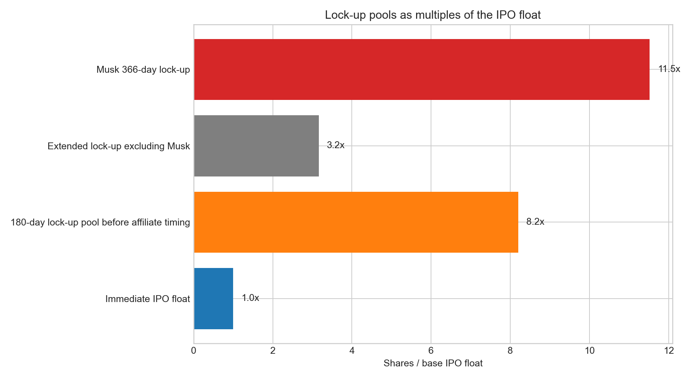

### First-Six-Month Scenario Bridge

The performance trigger changes **timing**, not the rough day-180 supply endpoint. If SpaceX trades at least 30% above the IPO price for 5 of 10 trading days around the Q2 earnings window, 455.8m shares come out earlier and the day-180 cleanup is smaller. If not, the day-180 release is larger. Model dates below assume a **2026-06-11** prospectus date; earnings-release events remain **TBD** and are shown by expected month, not fake day precision.

| Event | Date | Timing | Shares released | % of base IPO float | Condition |
|---|---|---|---:|---:|---|
| IPO float | 2026-06-11 | At offering | 555.6m | 100.0% | Freely tradable unless held by affiliates. |
| First earnings release unlock | TBD - likely Aug 2026 | Q2 2026 earnings window | 911.5m | 164.1% | 20% of 180-day pool, non-affiliates. |
| Performance early release | TBD - likely Aug 2026 | Q2 2026 earnings window | 455.8m | 82.0% | If stock is at least 30% above IPO price for 5 of 10 trading days. |
| Day 70 | 2026-08-20 | 70th day after prospectus | 319.0m | 57.4% | Non-affiliate pool release. |
| Day 90 | 2026-09-09 | 90th day after prospectus | 319.0m | 57.4% | Non-affiliate pool release. |
| Day 91 affiliate catch-up | 2026-09-10 | 91st day after prospectus | 59.1m | 10.6% | Affiliate catch-up after Rule 144 timing. |
| Day 105 | 2026-09-24 | 105th day after prospectus | 328.4m | 59.1% | 180-day pool release. |
| Day 120 | 2026-10-09 | 120th day after prospectus | 328.4m | 59.1% | 180-day pool release. |
| Day 135 | 2026-10-24 | 135th day after prospectus | 328.4m | 59.1% | 180-day pool release. |
| Q3 2026 earnings unlock | TBD - likely Nov 2026 | Q3 2026 earnings window | 1,300.0m | 234.0% | 28% of 180-day pool. |
| Day 180 | 2026-12-08 | 180th day after prospectus | 328.4m or 797.6m | 59.1% or 143.6% | Lower if performance early release happened; higher if it did not. |

| Milestone date | Milestone | New shares released if trigger hits | Circulating free float if trigger hits | Free float % basic | New shares released if no trigger | Circulating free float if no trigger | Free float % basic |
|---|---|---:|---:|---:|---:|---:|---:|
| 2026-06-11 | IPO float | 555.6m | 555.6m / 1.00x | 4.2% | 555.6m | 555.6m / 1.00x | 4.2% |
| TBD - likely Aug 2026 | Q2 earnings unlock | 911.5m | 1,467.1m / 2.64x | 11.2% | 911.5m | 1,467.1m / 2.64x | 11.2% |
| TBD - likely Aug 2026 | Performance early release | 455.8m | 1,922.9m / 3.46x | 14.7% | 0.0m | 1,467.1m / 2.64x | 11.2% |
| 2026-08-20 | Day 70 | 319.0m | 2,241.9m / 4.04x | 17.1% | 319.0m | 1,786.1m / 3.21x | 13.7% |
| 2026-09-09 | Day 90 | 319.0m | 2,560.9m / 4.61x | 19.6% | 319.0m | 2,105.1m / 3.79x | 16.1% |
| 2026-09-10 | Day 91 affiliate catch-up | 59.1m | 2,620.0m / 4.72x | 20.0% | 59.1m | 2,164.2m / 3.90x | 16.6% |
| 2026-09-24 | Day 105 | 328.4m | 2,948.4m / 5.31x | 22.5% | 328.4m | 2,492.6m / 4.49x | 19.1% |
| 2026-10-09 | Day 120 | 328.4m | 3,276.8m / 5.90x | 25.1% | 328.4m | 2,821.0m / 5.08x | 21.6% |
| 2026-10-24 | Day 135 | 328.4m | 3,605.2m / 6.49x | 27.6% | 328.4m | 3,149.4m / 5.67x | 24.1% |
| TBD - likely Nov 2026 | Q3 earnings unlock | 1,300.0m | 4,905.2m / 8.83x | 37.5% | 1,300.0m | 4,449.4m / 8.01x | 34.0% |
| 2026-12-08 | Day 180 final release | 328.4m | 5,233.6m / 9.42x | 40.0% | 797.6m | 5,247.0m / 9.44x | 40.1% |

The key read: **by day 180 the scarcity trade is mostly gone in either scenario.** The performance trigger just pulls some supply forward. Elon Musk's separate long-tail overhang is about **6.4 billion** shares, locked for **366 days** with no early release.

## Control

Governance is the weakest quality dimension in the scorecard.

| Holder / class | Economic shares | Economic % of basic | Combined voting power | Read-through |
|---|---:|---:|---:|---|
| Elon Musk | 6,418.5m | 49.1% | 84.4% | Founder control remains absolute after the IPO. |
| All executive officers and directors | 6,978.8m | 53.4% | 85.3% | Board/executive ownership is extremely concentrated. |
| Public IPO buyers | 555.6m | 4.25% | ~0.9% | Public float has price impact, not control. |
| Class A | 7,380.2m | 56.4% | 11.5% | Economic majority, voting minority. |
| Class B | 5,695.7m | 43.6% | 88.5% | Control class. |

This does not make SpaceX a bad business. It means public holders are buying exposure, not influence.

## Tesla / Musk Related-Party Check

Tesla does appear to have a SpaceX economic interest, but it is small relative to SpaceX's post-IPO share base. Tesla's Q1 2026 10-Q says Tesla invested **$2.00bn** in SpaceX common stock in **March 2026**, formerly a preferred share investment in xAI, representing an ownership interest of **less than 1%**. At the model's **$135** IPO price, that would equal roughly **14.8m SpaceX shares**, or about **0.11%** of SpaceX basic post-offering shares.

That is different from Elon Musk's direct SpaceX control. Musk is the control holder in the SpaceX S-1/A; Tesla is a small economic holder and related-party commercial counterparty.

| Relationship | Period / date | Amount | Approx SpaceX shares | Approx % basic | Read-through |
|---|---:|---:|---:|---:|---|
| Tesla equity investment in SpaceX | 2026-03 | $2.00bn | 14.8m | 0.11% | Tesla 10-Q says less than 1%; this is economic exposure, not control. |
| Tesla revenue from SpaceX Megapack purchase | Q1 2026 | $87m revenue / $65m cost | n/a | n/a | SpaceX bought Megapack products from Tesla in ordinary course. |
| SpaceX Megapack purchases from Tesla | 2025 | $506m | n/a | n/a | SpaceX S-1/A records this in property, plant and equipment. |
| SpaceX Megapack purchases from Tesla | 2024 | $191m | n/a | n/a | Confirms the commercial relationship predates the IPO. |
| Tesla revenue from xAI Megapack sales | 2025 | $430.1m | n/a | n/a | xAI became part of SpaceX effective 2026-02-02. |
| Tesla revenue from xAI through February 2026 | Jan-Feb 2026 | $78.1m | n/a | n/a | Cross-checks Tesla/xAI/SpaceX related-party chain. |
| Tesla advertising on X | 2025 | $3.3m | n/a | n/a | X became part of xAI effective 2025-03-28, then xAI became part of SpaceX. |
| Musk cross-company role | 2026-04-30 | n/a | n/a | n/a | Tesla filings describe Musk roles at Tesla, SpaceX, X/xAI, The Boring Company and Neuralink. |

The accounting nuance matters: Tesla says it is presumed to have significant influence over SpaceX because Tesla's CEO also serves as SpaceX CEO, even though Tesla's ownership interest is less than 1%. For this memo, Tesla is therefore a **small SpaceX economic holder plus related-party counterparty**, not a major shareholder comparable to Musk.

## Index Rules

Your Nasdaq instinct is right in substance, but the timing is not literally day one.

### What Nasdaq Inclusion Means

There are two different ideas that often get mixed together:

| Term | Plain English | What changes |
|---|---|---|
| Nasdaq exchange listing | The stock trades on a Nasdaq market under a ticker. | Public trading venue, order book, listing standards and daily price discovery. |
| Nasdaq-100 index inclusion | The stock becomes part of the Nasdaq-100 index tracked by QQQ and other index products. | Index funds and benchmarked portfolios may need to buy or hold the stock according to index rules. |

For SpaceX, the important issue is **Nasdaq-100 index inclusion**, not merely exchange listing. A stock can list on Nasdaq without being in the Nasdaq-100. Nasdaq-100 inclusion is what creates the passive-flow discussion.

### What It Means for the Company

Nasdaq-100 inclusion would be positive for visibility and trading liquidity. It can broaden the shareholder base, increase analyst and institutional attention, and possibly lower the long-run cost of capital because more investors can own the stock through index products.

It does **not** give SpaceX new cash. SpaceX raises capital from the IPO itself. Index funds buying in the secondary market buy shares from sellers, not from SpaceX, unless SpaceX separately issues new shares.

### What It Means for Investors

For investors, Nasdaq-100 inclusion can create a near-term forced-buyer setup. Funds tracking the Nasdaq-100 may need exposure, and active managers benchmarked to it may also adjust. That can support price and liquidity, especially when free float is tight.

But index inclusion is not fundamental validation. It does not make the valuation cheaper, fix governance, remove lock-up overhang, or guarantee outperformance. In SpaceX's case, the same unlocks that can increase future index representation also increase sellable supply.

### Does It Increase Equity in the Index?

It does **not create more equity**. The share count changes only through corporate actions such as issuance, option exercise, conversion, buybacks, or stock-based compensation.

What changes is the amount of existing equity represented in the index. For Nasdaq-100, low-float stocks are weighted using the lesser of listed shares or **3x free-floating shares**. With base IPO float of 555.6m shares, SpaceX's starting Nasdaq modified market cap is about **$225bn**, not the full **$1.77tn** basic market cap. If more shares unlock and become free-floating, future index weight could rise, but that comes with supply risk.

| Index | Current rule | SpaceX read | First-6-month impact |
|---|---|---|---|
| Nasdaq-100 Fast Entry | A mega IPO can skip the normal three-full-calendar-month seasoning rule if Full Market Capitalization ranks within the top 40 current constituents. It is evaluated on the 7th trading day and is typically added after 15 trading days, with announcement after the 10th trading day. | At about $1.77T, SpaceX likely clears the size test if SPCX lists on an eligible Nasdaq market and no final filing changes the setup. | Possible near-term QQQ/NDX flow catalyst, modeled as late June to early July 2026. |
| Nasdaq-100 liquidity | IPO fast-entry ADVT is measured from first trading day through the reference date; threshold is $5m. | A $75bn IPO should almost certainly clear it, but trading must occur first. | Low gating risk. |
| Nasdaq-100 free float | No minimum free-float criterion, but low-float securities are weighted using the lesser of listed TSO or 3x free-floating shares. | Base IPO float gives a Nasdaq modified market cap of about **$225bn**, not the full $1.77T. | Inclusion possible, but starting weight is scaled to tradable supply. |
| S&P 500 | S&P chose no change: 12-month IPO seasoning, no Composite 1500 IPO fast track, positive GAAP income screens, IWF/liquidity screens. | SpaceX fails first-six-month seasoning, currently fails profitability, and starts below the 10% IWF threshold if only IPO float counts. | No S&P 500 forced-buy catalyst in the first six months. |
| S&P Total Market / Dow Jones U.S. Total Stock Market | Effective 2026-06-08, broad indices allow an alternative IWF path for mega-cap companies and preserve IPO fast-track treatment if all other criteria are met. | Base float-adjusted market cap is about **$75bn**, so broad-index eligibility may arrive earlier than S&P 500. | Potential total-market ETF flow, but not S&P 500 membership. |


Under the model assumption that SPCX first trades on **2026-06-12**, the Nasdaq-100 fast-entry calendar is:

| Event | Model date |
|---|---:|
| 7th trading day evaluation | 2026-06-23 |
| 10th trading day announcement window | 2026-06-26 |
| 15th trading day typical addition window | 2026-07-06 |
| S&P 500 earliest simple seasoning date | 2027-06-12 |

## Comp Screen

The comp set removes the noise: no micro IPOs, no SPACs/de-SPACs, no biotech binary names, no thin promotional stories, and no small offerings below the size screen. COIN is kept as context but not a clean IPO comp because it was a direct listing. BABA is scale/liquidity context, not a clean U.S. governance comp.

| Ticker | Proceeds | IPO market cap | Approx IPO public float | Treatment |
|---|---:|---:|---:|---|
| SPCX | $75.0bn | $1,765.7bn | 4.2% | Subject |
| V | $17.9bn | $42.0bn | 42.6% | Core |
| META | $16.0bn | $104.0bn | 15.4% | Core |
| BABA | $21.8bn | $168.0bn | 13.0% | Scale only |
| UBER | $8.1bn | $75.5bn | 10.7% | Core |
| ABNB | $3.5bn | $47.0bn | 7.4% | Core |
| ARM | $4.9bn | $54.5bn | 9.0% | Core |
| SNOW | $3.4bn | $33.0bn | 10.3% | Core |
| DASH | $3.4bn | $39.0bn | 8.7% | Core |
| RIVN | $11.9bn | $66.5bn | 17.9% | Core |
| CRWD | $0.6bn | $6.8bn | 8.8% | Core |
| DDOG | $0.6bn | $7.8bn | 7.7% | Core |
| COIN | n/a | $85.8bn | n/a | Context only, direct listing |

Approximate comp float uses IPO proceeds divided by IPO market cap, excluding over-allotment and secondary-seller details. SpaceX uses the direct S-1/A share count.


SpaceX scores well on management and IPO execution but is pulled down by governance, related-party complexity, AI losses and lock-up overhang.

| Ticker | Quality score | Why it matters |
|---|---:|---|
| V | 4.65 | Best clean IPO quality comp: profitable, scaled, elite underwriters. |
| ABNB | 4.25 | Founder-led platform quality with less extreme control risk. |
| CRWD | 4.23 | High-quality founder-led software/security comp. |
| DDOG | 4.23 | High-quality infrastructure software comp. |
| META | 4.22 | Founder-control and mega-liquidity comp; early trading still weak. |
| ARM | 4.00 | Controlled, scarce-float tech asset. |
| SNOW | 3.83 | Great company, valuation caution. |
| UBER | 3.73 | Scale with profitability debate. |
| SPCX | 3.62 | Elite company, weaker public-entry quality. |
| DASH | 3.62 | Founder-led but valuation-sensitive. |
| RIVN | 2.88 | Capital intensity caution. |

Good company quality did not prevent weak first-six-month trading in many large IPO comps. From first listed close, META, UBER, SNOW, DASH, RIVN, CRWD and DDOG all finished lower at six months in this model extract.

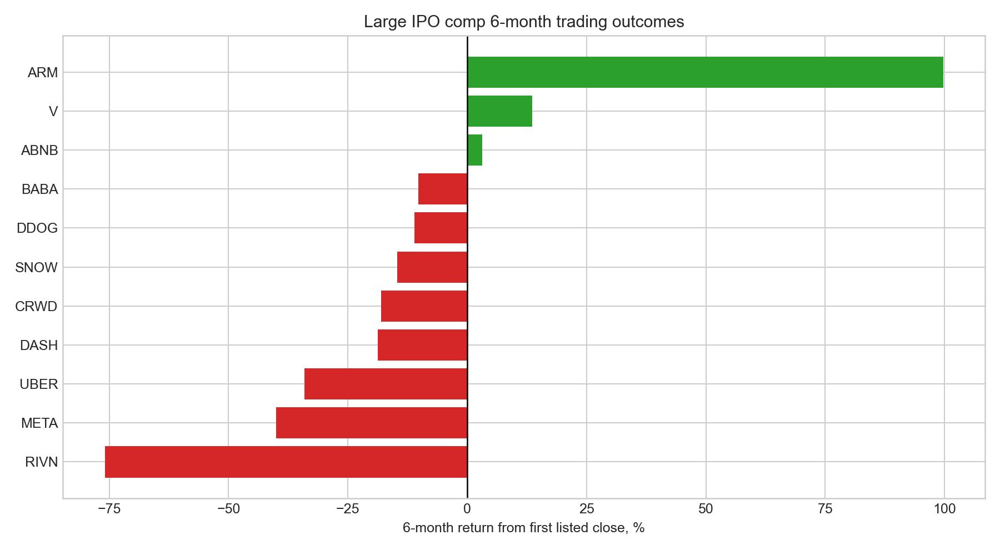

## Segment Quality

| Segment | 2025 revenue | 2025 operating income | 2025 capex | 2025 operating margin | Capex / revenue | Quality read |
|---|---:|---:|---:|---:|---:|---|
| Space | $4.1bn | -$0.7bn | $3.8bn | -16.1% | 93.8% | Strategic moat, still loss-making and Starship execution-heavy. |
| Connectivity | $11.4bn | $4.4bn | $4.2bn | 38.8% | 36.7% | Best current business; scale and margins are real, but ARPU is falling. |
| AI/xAI/X | $3.2bn | -$6.4bn | $12.7bn | -198.5% | 397.6% | Biggest upside and biggest quality penalty; contract visibility is valuable but terminable and delivery-dependent. |

The Google FWP improves the revenue story, but it also reinforces the key risk: AI revenue quality depends on delivery, power/GPU execution, customer termination rights and capital intensity. Anthropic and Google contracts are useful valuation support only after risk adjustment.

## Business Breakdown: Rockets, Starlink, xAI/X, Cursor

| Business | What it includes | 2025 revenue | 2025 operating income | 2025 capex | Q1 2026 read | Main investor question |
|---|---|---:|---:|---:|---|---|
| Rocket / Space | Falcon, Dragon, Starship and launch services. | $4.1bn | -$0.7bn | $3.8bn | Q1 revenue $0.6bn, operating loss $0.7bn. | Can Starship execution turn strategic moat into better economics? |
| Starlink / Connectivity | Starlink broadband/connectivity services and associated offerings. | $11.4bn | $4.4bn | $4.2bn | Q1 revenue $3.3bn, operating income $1.2bn. | Can subscriber growth offset ARPU decline and spectrum/regulatory limits? |
| AI / xAI / X | AI compute, Grok, X platform and related infrastructure. | $3.2bn | -$6.4bn | $12.7bn | Q1 revenue $0.8bn, operating loss $2.5bn. | Are Anthropic/Google contracts durable enough to justify the capex and losses? |
| Cursor / Anysphere | April 2026 compute plus option agreement with Cursor. | n/a | n/a | n/a | Not owned as of S-1/A. | Does the option become a valuable AI distribution/data asset or a dilution/fee risk? |

### xAI, X and Twitter Timeline

The clean answer: **SpaceX acquired xAI; xAI had acquired X Holdings/X; Cursor was not acquired as of the S-1/A.**

| Date | Event | Meaning |
|---|---|---|
| October 2022 | Twitter acquired by X Holdings. | This sits inside the later X/xAI/SpaceX common-control history. |
| July 2023 | Twitter rebranded to X. | The S-1/A describes a one-time impairment of the Twitter brand from the rebrand. |
| 2025-03-28 | xAI acquired X Holdings/X effective this date. | X became part of xAI before SpaceX acquired xAI. |
| 2026-02-02 | SpaceX acquired xAI effective this date. | SpaceX consolidated the AI business, including AI compute, Grok and X. |
| April 2026 | SpaceX entered compute + option agreement with Cursor. | Collaboration and acquisition option, not completed ownership. |
| May 2026 | SpaceX entered Anthropic compute agreements. | Approximately 325,000 NVIDIA GPUs; $1.25bn/month through May 2029 after ramp, terminable after initial period on 90 days notice. |
| 2026-06-05 | SpaceX disclosed Google compute agreement in FWP. | Approximately 110,000 NVIDIA GPUs; $920m/month from October 2026 through June 2029 after ramp, with delivery and termination conditions. |

### Cursor Option Analysis

Cursor is **not** treated as an acquired subsidiary in this model. The April 2026 agreement gives SpaceX compute collaboration economics and the **right, not obligation**, to acquire Anysphere/Cursor. If exercised after the offering, consideration would be SpaceX Class A shares based on a **$60.0bn** Cursor implied equity value and the SpaceX Class A VWAP before closing.

That matters because the upside is strategic but not yet owned: Cursor could give SpaceX a high-frequency developer workflow, coding data, Grok distribution and sustained inference demand. The risk is that it also adds option complexity, possible dilution, and disclosed fee exposure: if SpaceX terminates the option agreement or Cursor terminates for eligible breach, Cursor may be entitled to a **$1.5bn** termination fee plus an **$8.5bn** deferred services fee under the compute agreement.

For valuation, Cursor belongs in the **optionality** bucket, not the current revenue bucket.

## Underwriters

The underwriter group is a clear positive. Goldman Sachs and Morgan Stanley anchor the bookrunner group and score highest in the model because of lead-left mega-cap IPO franchise strength and stabilization credibility. BofA, Citi and J.P. Morgan add global distribution depth. The broad syndicate helps execution, but it does not solve valuation, control or unlock supply.

## Final View

For the first six months, the clean framing is:

```text
Return setup = scarcity + Nasdaq/broad-index demand + first earnings catalyst
             - valuation risk - unlock supply - governance/control discount
```

My optimized plan is therefore:

1. **Do not use small IPO behavior.** Keep the comp set institutional and liquid.
2. **Separate the company from the entry.** SpaceX is high quality; the IPO entry is lower quality because float/control/unlock math is harsh.
3. **Trade the catalyst only with discipline.** Nasdaq-100 fast-entry demand can matter, but it is modeled as a short-term flow catalyst, not thesis validation.
4. **Wait for unlock absorption before sizing long-term.** The Q2 earnings release and 70/90/105/120/135-day releases are the real public-market test.
5. **Rebuild after 424B4.** Final price, share count, option exercise, lock-up details and index notices can move the conclusion.

## Predictive IPO Framework

This study is now linked to [study 15 - IPO chase and six-month price-action model](../15-ipo-chase/), which turns the IPO research stack into a reusable scorecard. The Study 15 six-month model uses:

- study 15's broad IPO-chase base rate;
- study 22's issuance/froth context;
- study 02's aftermarket-entry framing;
- this SpaceX model's lock-up, float, index-flow, underwriter and holder-control mechanics.

For SpaceX, the scorecard output is a **negative six-month bucket** from first listed close: underwriters, scarcity and Nasdaq-100 fast-entry flow are positive, but valuation, unlock supply and Musk/Class B voting control dominate the first-six-month risk.

## Model Files

- [Workbook](spacex_ipo_quality_model.xlsx)
- [Offering math](data/offering_math.csv)
- [Shareholder ratios](data/shareholder_ratios.csv)
- [Tesla / SpaceX related-party check](data/tesla_spacex_related_parties.csv)
- [Lock-up calendar](data/lockup_calendar.csv)
- [Lock-up supply summary](data/lockup_supply_summary.csv)
- [Lock-up first-six-month scenarios](data/lockup_first_6m_scenarios.csv)
- [Lock-up free-float bridge](data/lockup_free_float_bridge.csv)
- [Nasdaq explainer](data/nasdaq_explainer.csv)
- [SpaceX business breakdown](data/spacex_business_breakdown.csv)
- [SpaceX AI timeline](data/spacex_ai_timeline.csv)
- [Cursor option analysis](data/cursor_option_analysis.csv)
- [Quality scores](data/quality_scores.csv)
- [Comp universe](data/comp_universe.csv)
- [Comp IPO performance](data/comp_ipo_performance.csv)
- [Study 15 IPO chase base rate](data/ipo_chase_base_rate.csv)
- [Study 15 sector base rate](data/ipo_chase_sector_base_rate.csv)
- [Combined IPO decision bridge](data/combined_ipo_decision_bridge.csv)
- [Underwriter quality](data/underwriter_quality.csv)
- [Segment quality](data/segment_quality.csv)
- [Valuation sensitivity](data/valuation_sensitivity.csv)
- [Index inclusion rules](data/index_inclusion_rules.csv)
- [Index inclusion timeline](data/index_inclusion_timeline.csv)
- [Sources](data/sources.csv)

Rebuild:

```bash
python3 24-spacex-ipo-quality-model/build_model.py
```

---

# Part II — Is it a mania top? (the TRUMP-coin and GameStop analog)

**The question.** On January 17, 2025, the biggest memecoin launch in history went live, and within three days its host market printed all-time highs it has never seen again. On June 12, 2026 — today, as I write this — the biggest IPO in history starts trading. Same setup: a record-sized, retail-saturated, story-driven capital event at the peak of enthusiasm. So I wanted to know: is the SpaceX IPO the stock-market version of the TRUMP coin? Does an event like this drain the market around it, and does it mark the top?

This matters for a position: if the analogy holds, the week SpaceX lists is the week to reduce risk, not add it.

## Summary of results

- The TRUMP coin launch really did mark the top of its market, almost to the day. Solana printed its all-time high two days after launch and Bitcoin three days after. Neither has traded higher since (SOL is still 77% below that print as of June 2026).
- The mechanism was mechanical, not psychological: the event was enormous *relative to its host market*. TRUMP's fully diluted value peaked at roughly half of Solana's own market cap (and about 2.0% of the entire crypto asset class), and peak-day trading ran at 6.5x the chain's normal volume.
- SpaceX cannot repeat that *flow* mechanism. The $75B raise is about 0.10% of US equity market cap and about 7% of one ordinary day's trading. As a liquidity shock it is two orders of magnitude smaller.
- But as a *stock* of value, SpaceX at the indicated $170 open would be 3.1% of all US equities — a bigger share of its asset class than TRUMP ever was of crypto. The TRUMP pattern lives on at the asset level, not the market level: 4.25% free float, a scarcity premium, and a supply calendar (Part I) that multiplies tradable shares 9.4x within six months.
- GameStop, the control case, completes the dose-response line. At its January 2021 peak GME was just 0.05% of US equities, and even with short interest at 140% of float its squeeze dented the S&P only -3.3% for nine sessions (forced de-grossing) before full recovery. Small relative to the class: no lasting market damage. But the stock itself fell 88% in 16 sessions once the supply constraint resolved — the same vertical-then-collapse shape as TRUMP.
- Mega-IPOs do carry market-level information. Across the 34 largest US-listed IPOs since 1996, the NASDAQ's median return over the following 12 months was +4.9%, against +16.0% for all days in the same era. Only 0.8% of random 34-date draws look that bad. 59% of these IPOs were followed by a 20%+ index drawdown within a year, against a 36% base rate.
- And fame does not buy the *stock* out of the chase deficit. Cross-checked like-for-like against study 15's broad base rate (760 IPOs: -28.4% median one-year excess vs SPY, 19% beat), the ten data-available mega-IPOs ran -27.7% vs the S&P with 20% beating — the same deficit, from an independent sample and era. The damage is front-loaded (-32.3% at six months, twice the broad base), landing exactly in the unlock window; measured against the NASDAQ these names trade in, the one-year deficit is -37.9%.
- The signal is clustering, not causation: issuers sell the most stock when the window is hottest, so record IPOs land late in cycles. Drop the five IPOs from the first half of 2000 and half the deficit disappears.
- Verdict: **No on the market mechanism, conditional yes on the timing signal, and yes at the asset level.** SpaceX will not vacuum the market the way TRUMP did — but the share itself carries the low-float mania architecture, and the *fact that this deal was possible at all* — at 94x revenue, four times oversubscribed, in a record $160B IPO-pipeline year — has historically been the property of late-cycle markets.

## What I expected, and what would prove me wrong

The null (H0): a mega-IPO is just a big day at the office. The market absorbs it, forward returns after these events look like forward returns after any other day, and the TRUMP analogy is a coincidence of two assets that were going to top anyway.

The alternative (H1): record capital events cluster at sentiment peaks — either because they *drain* buying power from everything else (the TRUMP mechanism), or because issuers time the sale to maximum enthusiasm (the selection mechanism). Either way, forward returns after them should be measurably below the base rate.

What would prove me wrong: if forward index returns after the largest IPOs are indistinguishable from the unconditional distribution, the analogy is dead and the answer to the user-facing question is "ignore the noise, size SpaceX on its own merits."

A one-line prior worth naming: issuance timed to sentiment is an old result (Baker and Wurgler built a sentiment index partly out of IPO activity). Our own study 22 found that *aggregate* equity issuance fails as a market-timing signal (0 of 12 annual tests). So this study tests something narrower: not total issuance, but the handful of record-sized single events.

## How I checked it

Four tests, from the known case to the open question:

1. **The template.** Rebuild the TRUMP coin event study from daily exchange data: did the launch actually mark the top of its host market, and what happened to the assets around it?
2. **The base rate.** Take the 34 largest US-listed IPOs from 1996-2024 and measure index returns 1, 3, 6 and 12 months after each, against the unconditional distribution over the same era. Bootstrap the medians. Then try to kill the result twice (drop the dot-com cluster; condition the base rate on an equally hot tape).
3. **The scale test, two ways.** Compare each event to its host market both as a *stock* (instant value as a share of the whole asset class — including TRUMP against all of crypto, and SpaceX at $135 and at the indicated $170 against all US equities) and as a *flow* (trading shock against the host's daily turnover). If TRUMP was a whale in a pond and SpaceX is a whale in the ocean, the flow mechanism does not transfer no matter what the charts rhyme like.
4. **The control case.** GameStop, January 2021: a low-float scarcity vertical that was *tiny* relative to its asset class. If the scale logic is right, GME should have crushed its own holders without leaving a mark on the broad market — a prediction the data can check. It also supplies the third member of the low-float family that Part I's SpaceX float model belongs to.
5. **The study 15 cross-check.** Study 15 measured the IPO *chase* — buying the day-1 close — across 760 ordinary IPOs and found it loses badly to the index. If this study's mega-IPOs are a different breed (famous, institutional, underwritten by the best), maybe they escape that base rate. Recompute study 15's exact trade on the mega-IPO sample itself and find out.

The identification problem, out loud: with n=34 events that cluster in time, I cannot cleanly separate "mega-IPOs cause weak markets" from "mega-IPOs happen when markets are about to be weak." I don't try to. For the practical question — should the SpaceX listing change your risk posture? — the two stories give the same answer, and I say which one the data favors in Finding 4.

## Data

| Series | Source | Range | Notes |
|---|---|---|---|
| TRUMP, SOL, BTC, ETH daily OHLCV | Binance spot (public klines API) | listing/Oct 2024 - Jun 2026 | TRUMP listed on Binance Jan 19, 2025 |
| Memecoin basket: DOGE, SHIB, PEPE, WIF, BONK | Binance spot | Oct 2024 - Jun 2026 | equal-weight, indexed to Jan 16, 2025 |
| NASDAQ Composite daily closes | macrotrends (public dataset endpoint) | Feb 1971 - Jun 2026 | primary index for the base-rate test |
| S&P 500 daily closes | macrotrends | Dec 1927 - Jun 2026 | independent cross-check |
| Mega-IPO sample | hand-built from contemporaneous press + filings | 1996-2024 | all 34 US-listed IPOs with base proceeds >= ~$2.8B; SPACs, direct listings and closed-end funds excluded |
| GameStop daily OHLCV | macrotrends (public dataset endpoint) | Jun 2011 - Jun 2026 | split-adjusted prices (4-for-1, Jul 2022); volume in unadjusted shares |
| Mega-IPO stock histories (10 names) | macrotrends per-stock pages | from each IPO - Jun 2026 | every sample name with from-IPO daily data on the free tier (2012+ vintage): META, BABA, SYF, SNAP, UBER, SNOW, ABNB, DASH, ARM, RIVN |
| On-chain launch-weekend stats | Helius, Chainalysis (via NYT/CNBC), DefiLlama | Jan 2025 | cited, not recomputed |
| Scale constants | Cboe, Siblis Research, Mordor Intelligence, contemporaneous reports | 2021-2026 | US equity mcap ~$72T (2026) / ~$50T (2021); US daily notional $1.1T (2025); total crypto mcap peak ~$3.8T (mid-Jan 2025); GME short interest ~140% of float (Jan 2021) |

The 34-name sample is the full universe at this size threshold, not a selection — every US-listed operating-company IPO I could document at $2.8B+ of base proceeds is in [data/mega_ipos.csv](data/mega_ipos.csv), foreign dual-listings flagged. Proceeds figures mix base-deal and greenshoe-inclusive numbers depending on the contemporaneous source; ranking, not precision, is what matters here, and the notes column says which is which.

Coinbase's 2021 direct listing is deliberately excluded from the sample (it raised no primary capital) but deserves its one line: it hit the tape on April 14, 2021 — the exact day Bitcoin printed its first 2021 cycle top.

## Finding 1 — the TRUMP launch marked its host market's top, almost to the day

*What I expected.* The folklore says TRUMP "killed the cycle." Folklore needs numbers, so I rebuilt the window from exchange data.

*How I measured it.* Daily highs and closes from Binance; everything indexed to January 16, 2025, the last quiet day before the Friday-night launch.

```python
basket = (px / px.loc["2025-01-16"]).mean(axis=1) * 100   # DOGE/SHIB/PEPE/WIF/BONK, eq-wt
sol_peak  = sol_high["2024-10-01":"2025-06-30"].idxmax()  # -> 2025-01-19, $295.83
btc_peak  = btc_high["2024-10-01":"2025-03-31"].idxmax()  # -> 2025-01-20, $109,588
```

*What the data shows.*

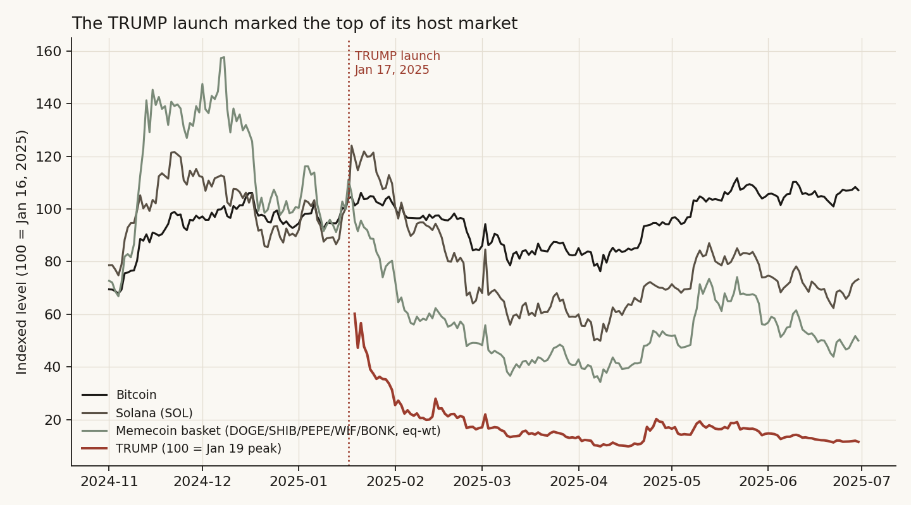

- TRUMP launched Friday January 17 and peaked near $75 on Sunday January 19 (the Binance daily high printed $77.24), a top-ten fully-diluted market cap in under 72 hours.
- Solana — the chain it lives on — printed its all-time high of $295.83 on January 19, two days after launch. It has never traded there again; as of June 2026 it sits 77% lower.
- Bitcoin printed its then-all-time high of $109,588 on January 20, inauguration day, three days after launch, then fell 30% to the April 2025 low.
- The memecoin basket tells the sharpest story. It had already rolled over from its December 8, 2024 peak (158 on my index). On launch weekend it briefly popped to 111 — and that pop, printed on January 17, was the last high it ever made. It was 59 a month later, 40 three months later, and sits at 17 in June 2026.

*Why (the mechanism).* The launch was a liquidity vacuum, and the on-chain numbers are explicit. Solana DEX volume hit $28.2B and then $39.2B on January 19-20 against a roughly $6B/day baseline — the peak day exceeded the previous all-time daily record across all blockchains combined. Stablecoin float on the chain grew 72% in six days ($6.15B to $10.6B) as fresh cash bridged in. Traders sold what they held to buy the new thing: existing memecoins bled while TRUMP went vertical, which is why the basket's launch-weekend "pop" was already a fade in relative terms. And the wealth transfer was savage — roughly 810,000 wallets were underwater within three weeks (Chainalysis data reported by the NYT), about $2B of losses against roughly $6.6B of realized gains for insiders and early buyers. Half the buyers had never owned a Solana asset before; 47% created their wallet the same day they bought.

*What I checked.* The peaks use intraday highs, not closes (Binance listed TRUMP mid-day on the 19th, so closes understate the extremes — my first pass got this wrong by 40%). The basket's December top means TRUMP did not *start* the memecoin decline; it terminated the last bounce of an already-rolling complex. I keep the claim precise: the launch marked the final top of SOL, BTC, and the memecoin basket's last local high, within a three-day window.

*Verdict.* **Confirmed.** The event marked the cycle top of its host market to within days, and the mechanism — capital rotating out of everything else into the new listing — is visible in volume, stablecoin float, and the basket's failure to ever recover.

## Finding 2 — after the 34 biggest IPOs, the market's next 12 months were bad — reliably so

*What I expected.* If record listings cluster at sentiment peaks, the index should do worse than usual after them, and the gap should grow with horizon (tops take months to resolve).

*How I measured it.* For each IPO's first trading day, NASDAQ Composite forward returns at 21/63/126/252 trading days, against the distribution of the same forward returns from every trading day 1996-2025. Then a 10,000-draw bootstrap: how often does the median of 34 random days look as bad as the median of the 34 IPO days?

```python
fwd[h] = px[i + h] / px[i] - 1                      # per event, h in {21,63,126,252}
base   = all_days_1996_2025_same_horizons            # unconditional comparison
boot   = [median(choice(base_12m, 34)) for _ in range(10_000)]
p      = mean(boot <= median(event_12m))             # -> 0.008
```

*What the data shows.*


| Horizon | After mega-IPOs (median) | All days (median) | IPO %positive | Base %positive |
|---|---|---|---|---|
| 1 month | +1.6% | +1.7% | 62% | 63% |
| 3 months | +3.9% | +4.1% | 68% | 68% |
| 6 months | +6.3% | +7.9% | 59% | 72% |
| 12 months | **+4.9%** | **+16.0%** | **59%** | **77%** |

Nothing happens for a month. Nothing happens for a quarter. The gap opens at six months and yawns at twelve: an 11-point median shortfall, and the bootstrap says only 0.8% of random 34-day draws produce a median that low. Drawdowns say the same thing more vividly — the median worst peak-to-trough fall in the 12 months after a mega-IPO was -29.8% against -16.5% for random days, and 59% of these IPOs saw a 20%+ index drawdown within a year against a 36% base rate.

*A concrete example instead of an abstraction.* If you had sold the NASDAQ at the close of each of these 34 first trading days and bought back a year later, you would have skipped a median +4.9% — and dodged the year after PetroChina (-60%), Infineon (-59%), MetLife (-57%), AT&T Wireless (-45%), Visa (-33%) and Rivian (-29%).

*What I checked.* The S&P 500 — a different index from a different builder — gives the same answer: +2.2% median at 12 months against +12.1% base, events at the 25th percentile. That is the independent cross-check; the result is not an artifact of one tech-heavy index.

*Verdict.* **Confirmed, with the caveat that the events overlap.** Several of the 34 share calendar windows (three IPOs in December 2020 alone), so the effective number of independent events is smaller than 34 and the bootstrap p-value flatters the result. The direction survives; the precision is softer than 0.008 sounds.

## Finding 3 — the signal is clustering at cycle ends, not the IPO doing damage

*What I expected.* If the deficit in Finding 2 is real, it should be concentrated where mega-IPOs bunch together — issuers all rushing the same hot window — rather than spread evenly.

*How I measured it.* Sort the 34 events by their forward 12-month return and look at the calendar. Then re-run the test without the worst cluster.


*What the data shows.* The red tail is a roll call of cycle peaks. Five of the 34 — Infineon (March 2000), MetLife (April 2000), PetroChina (April 2000), AT&T Wireless (April 2000), China Unicom (June 2000) — landed within four months of the dot-com top. Blackstone listed in June 2007, weeks before the August credit cracks and four months before the October 2007 top. Visa's record deal priced into the teeth of 2008. DiDi and Rivian bracketed the November 2021 NASDAQ top — Rivian, the second-biggest raise in the sample, listed nine days before the exact peak.

Drop the five H1-2000 names and the median 12-month return improves from +4.9% to +9.3% (69% positive). Half the deficit is one cluster. That is not a weakness of the finding — it *is* the finding: record IPOs do not trickle out evenly, they stampede into the best windows, and the best windows are late.

*Why (the mechanism).* Nobody prices the largest deal in history into a weak tape. A record raise requires record enthusiasm — four-times-oversubscribed books, retail tranches, index-inclusion hype. Those conditions are, definitionally, what the late stage of a cycle looks like. The IPO is the thermometer, not the fever.

*What I checked — the strongest rival.* "You've just rediscovered that markets were hot, and hot markets mean-revert." If that were the whole story, *any* day with an equally hot trailing tape should show the same weak forward returns. It does not. The median mega-IPO arrived with the NASDAQ up 26.6% over the prior year; taking *all* days since 1996 with trailing returns at least that hot (n=2,140), the median forward 12-month return is +14.7% with 76% positive — barely below the unconditional +16.0%, and three times the mega-IPO events' +4.9%. A hot tape alone was not bearish. A hot tape *plus a record-sized exit* was. The rival fails on its own numbers.

*Verdict.* **Conditional.** Mega-IPOs are a late-cycle symptom with real forward information beyond simple momentum, but the effect is driven by clusters, and a single IPO in isolation is a weak signal.

## Finding 4 — the dose makes the poison: SpaceX is huge as a stock, tiny as a flow

*What I expected.* For the analogy to bite hard, SpaceX would need to be big relative to its host market the way TRUMP was. The honest answer turned out to be two answers, depending on whether you measure the *stock* of value created or the *flow* of money moved.

*How I measured it.* Each event two ways: instant value as a share of the whole host asset class, and trading shock as a share of the host's daily turnover.

```text
Stock (value vs the whole class)
  TRUMP peak FDV / its host chain (SOL)   ~ $75B / ~$140B  = ~54%
  TRUMP peak FDV / ALL crypto             ~ $75B / ~$3.8T  = ~2.0%   (circulating: 0.4%)
  SpaceX at $135 / all US equities        = $1.77T / ~$72T = 2.5%
  SpaceX at $170 / all US equities        = $2.22T / ~$72T = 3.1%
  GME close peak / all US equities (2021) ~ $24B / ~$50T   = 0.05%

Flow (trading shock vs the host tape)
  TRUMP peak-day DEX volume / baseline    ~ $39.2B / ~$6B  = ~6.5x
  SpaceX raise / one day's traded value   = $75B / ~$1.1T  = 6.8%
  GME peak day / US tape (approx)         ~ $32B / ~$600B  = ~5%
```

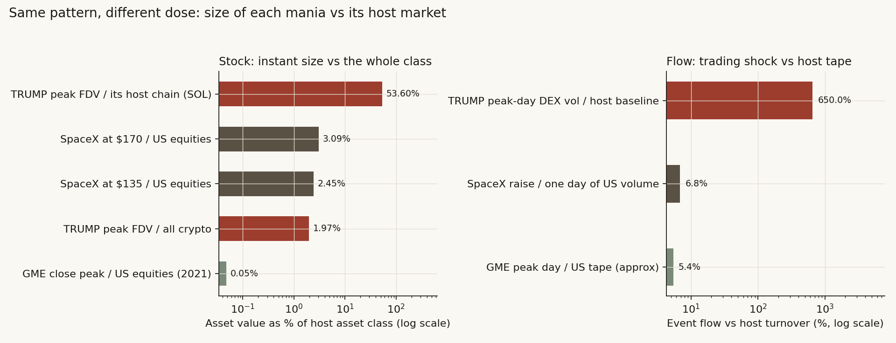

*What the data shows — the stock side first, because it surprised me.* Measured against the whole asset class, SpaceX is actually the *bigger* mania: at the indicated $170 open it would be 3.1% of all US equities (2.5% even at the $135 banker price), instantly a top-seven company, where TRUMP's fully diluted value peaked at about 2.0% of the entire crypto market (and only 0.4% counting just the circulating coins). A brand-new line on the board worth 2-3% of everything, priced in a weekend or a morning, is the same class of event in both markets. GME never came close — 0.05% of US equities at its peak close.

*Now the flow side, which is where the analogy dies.* TRUMP's launch traded 6.5 *times* its host chain's normal daily volume and was priced at half the host chain's market cap — a whale in a pond; the marginal dollar physically left everything else on Solana. SpaceX's $75B raise is 6.8 *percent* of one ordinary day's US equity dollar volume (Cboe: $1.1T average daily notional in 2025), and the $22.5B retail tranche is about two percent of a single day's tape. The US market is the ocean; whatever SpaceX does to it, it will not do it by draining liquidity.

*Why it matters — the dose-response line.* Put the three events on one axis of "size relative to host" and the market outcomes line up like a dose-response curve. GME (0.05% of the class, even with 140%-of-float short interest) dented the S&P -3.3% for nine sessions through forced de-grossing, then the market made new highs. TRUMP (2% of the class, 54% of its host chain) terminally topped its market. SpaceX sits between on the stock measure and far below both on the flow measure — big enough to *embody* the cycle, far too small to *end* it.

*What I checked.* The constants are the soft spot, so they are sourced and rounded against me: US market cap $69T (Siblis, Jan 2026) to $75T+ (April 2026) — I use $72T; daily notional $1.1T (Cboe 2025 average); total crypto market cap ~$3.8T at its mid-January 2025 peak (Mordor Intelligence's year-to-date peak figure, printed the same days as the launch); US market cap ~$50T in early 2021. Halve any of them and no conclusion moves an order of magnitude.

*Verdict.* **The drain mechanism does not transfer; the asset-class footprint does.** If SpaceX coincides with a market top, it will be as a symptom (Finding 3), not a cause (Finding 1's mechanism). What the share itself does is Finding 5's question.

## Finding 5 — the low-float family: TRUMP, GameStop and SpaceX share one supply architecture

*What I expected.* The user-facing worry behind this study is really about the share, not the index: SpaceX is coming public with 4.25% of its shares tradable (Part I's number from the S-1). TRUMP launched with 20% of supply circulating. GameStop in January 2021 had short interest at 140% of its float — more shares sold short than existed to trade. Three different markets, one architecture: huge headline value, tiny effective supply, reflexive retail demand. I expected the price pattern after the vertical to rhyme, and to depend on what happens to supply next.

*How I measured it.* Index each name to 100 at its peak close and walk forward 130 trading days; pull the squeeze-week spillover and recovery from the index data already in this study; take the SpaceX supply calendar from Part I.

```python
gme_path   = gme_close.loc["2021-01-27":] / 86.88 * 100     # -88.3% by session 16
trump_path = trump_close.loc["2025-01-19":] / peak * 100    # -84% by mid-April
spx_dent   = spx["2021-01-25":"2021-01-29"].min() / spx.asof("2021-01-22") - 1   # -3.3%
```

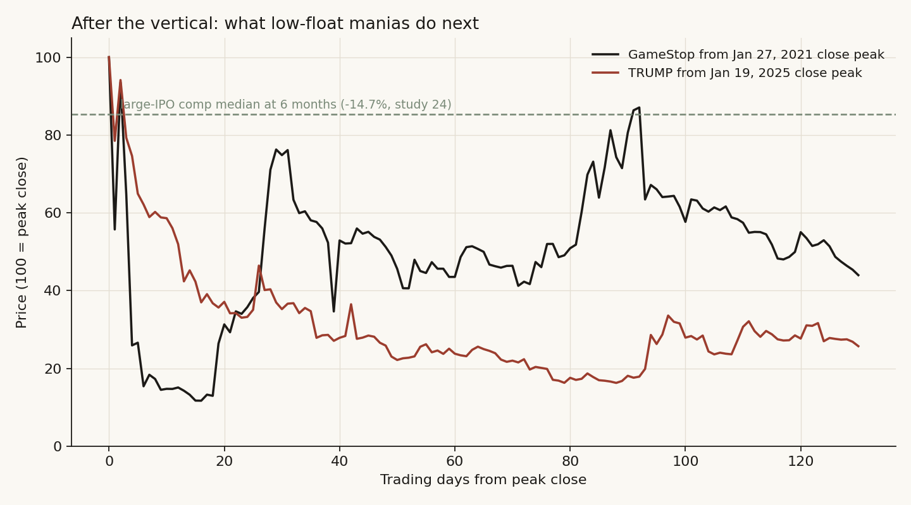

*What the data shows.* GameStop closed at $347.51 (split-adjusted $86.88) on January 27, 2021, traded $483 intraday the next morning, and sixteen sessions later had lost 88.3% of its value. TRUMP took about three months to do the same. Both spent essentially the whole 130-day window far below the -14.7% line that Part I's filtered large-IPO comps put at six months. The broad market barely noticed GME: the S&P fell 3.3% (NASDAQ -3.5%) in the squeeze week as hedge funds de-grossed — the one real transmission channel a small event has — and recovered to its pre-squeeze level in nine sessions.

*The difference between the two decay paths is the supply story.* GME echo-squeezed — back to 87% of its peak close on June 9, 2021 — because its float never grew; covering ended, but scarcity stayed, so the mania could re-ignite (AMC, the sister name, made its own all-time high that same week of June 2021). TRUMP never echoed: its supply *grew on a schedule* — the first insider unlock (40 million tokens, 4% of supply, ~$311M) hit in April 2025, followed by daily drip releases — so every bounce met new sellers. One-year-later scores: GME at 27% of its peak close, TRUMP at 11%.

*Where SpaceX sits in the family.* SpaceX's supply path is the TRUMP path, not the GME path, and it is contractual: Part I's model has lock-up releases at days 70/90/105/120/135 and a day-180 cleanup that takes potential tradable supply to roughly 9.4x the IPO float — about 40% of basic shares — within six months. A buyer at the $170-175 indicated open is paying a 26-30% scarcity premium over a banker price that credible outside valuations (Morningstar $780B, Damodaran $1.25-1.3T) already call 1.4-2.3x rich, for a float that is scheduled to multiply by nine. The scarcity that supports the premium has an expiry date.

*What I checked.* GME prices are split-adjusted (4-for-1, July 2022); the unadjusted prints quoted match the contemporaneous record ($347.51 close, $483 intraday). The 140%-of-float short interest is the figure used in the academic and regulatory post-mortems, not a forum number. And one case is one case: GME enters this study as a control for the scale logic and a second decay path, not as a sample.

*Verdict.* **Confirmed at the asset level.** Low-float verticals revert hard once supply normalizes, and SpaceX's supply normalizes on a published calendar. The TRUMP analogy fails for the market (Finding 4) but holds for the share.

## Finding 6 — cross-check with study 15: fame does not buy you out of the chase deficit

*What I expected.* [Study 15](../15-ipo-chase/) measured what happens when you buy an IPO at its first day's close — the price retail can actually get — across 760 US IPOs: a median one-year excess return of -28.4% versus SPY, with only 19% of names beating the market (-15.4% and 25% at six months). But that sample is the 2022-onward vintage, dominated by small and micro-cap listings. A reasonable objection to using it on SpaceX: *these* deals are different — famous franchises, top-tier underwriters, institutional books. Maybe mega-IPOs escape the chase deficit. I expected them to do at least somewhat better than the broad base rate. They don't.

*How I measured it.* Study 15's exact trade, run on this study's own sample: buy each mega-IPO at its day-1 close, hold six and twelve months, measure against both the S&P 500 (study 15's benchmark family) and the NASDAQ (the index these names mostly trade in). Ten of the 34 names have from-IPO daily data on the free tier (everything listed 2012 or later and still trading): META, BABA, SYF, SNAP, UBER, SNOW, ABNB, DASH, ARM, RIVN.

```python
day1   = first_close_with_volume(stock)        # skip the offer-price placeholder row
excess = stock[h] / day1 - index[h] / index[day1]        # h in {126, 252} days
# subset medians vs S&P:    6m -32.3% (20% beat), 12m -27.7% (20% beat)
# subset medians vs NASDAQ: 6m -33.0% (20% beat), 12m -37.9% (20% beat)
# study 15 broad (vs SPY):  6m -15.4% (25% beat), 12m -28.4% (19% beat)
```

*What the data shows.*


| Chase from day-1 close | Mega-IPOs vs S&P (n=10) | Mega-IPOs vs NASDAQ (n=10) | Study 15 broad base, vs SPY (n=760) |
|---|---|---|---|
| 6-month median excess | **-32.3%** | -33.0% | -15.4% |
| 6-month % beating index | 20% | 20% | 25% |
| 12-month median excess | **-27.7%** | -37.9% | -28.4% |
| 12-month % beating index | 20% | 20% | 19% |

Like-for-like, the twelve-month numbers are nearly identical: -27.7% for the mega-IPOs against -28.4% for study 15's broad zoo, with the same one-in-five hit rate. The most institutional, most underwritten, most famous deals of the era earned the *same* chase deficit as the micro-cap junk — that is the cross-check's headline. Two differences are real, though. The mega-IPO damage is front-loaded: at six months the subset is already -32.3% (twice the broad base's -15.4%), which is exactly the lock-up window where Finding 5 says the float multiplies. And against the NASDAQ — the index a SpaceX buyer would otherwise own — the deficit is -37.9%.

Eight of ten lost to the market in year one, several catastrophically: META -63% excess vs the S&P (the famous 2012 halving), RIVN -52%, DASH -40%, SNAP -39%, BABA -30%, UBER -26%. The two winners are instructive: ARM (+93%) rode the 2023-24 AI repricing, and SYF (+40%) was the sample's *least* famous deal — a spun-off consumer lender nobody chased. Median absolute returns were -16.7% at six months and -18.4% at a year, against an unconditional NASDAQ 12-month median of +16%: buying the median mega-IPO at its first close cost about 34 points versus just owning the index.

*Why (mechanism).* This is Findings 2 and 5 compounding at the level of one trade. The index itself runs below base rate after these events (Finding 2), and the stock carries the low-float architecture — day-1 prices set on a sliver of float at peak fame, then unlock supply arriving for months (Finding 5), which is why the deficit is deepest in the first six months. The fame that fills a record order book is exactly what guarantees the day-1 buyer overpays; SYF, with no fame to price in, is the exception that fits the rule.

*What I checked.* The era differs (2012-2023 here vs 2022+ there) — two independent vintages landing on the same number is the point of a cross-check, not a flaw in it. The subset omits DiDi — delisted within a year of its IPO, down roughly 87% — plus the 2000-era disasters (AT&T Wireless, Agere, Infineon), so the data-availability cut *flatters* the mega-IPO side; the true historical medians are worse than the table. Dividends are excluded on both legs (hurts the high-yield names' showing slightly; direction against my conclusion, magnitude small at these horizons).

*Verdict.* **Study 15 confirmed on an independent sample — and sharpened.** Same trade, different era, different names: the like-for-like medians agree within a point. Quality, fame and underwriting do not repeal the chase base rate; they just concentrate the losses into the first six months, where the unlocks live. Study 15's warning applies to SpaceX without a discount.

## Did I just find noise?

Four ways this could be nothing, and what the checks said:

1. **Overlapping events.** Conceded above — effective n < 34, true p-value softer than 0.008. Direction unchanged across two independent indexes.
2. **One regime driving everything.** Tested — ex-2000 the deficit halves but persists (+9.3% vs +16.0%). The 2007, 2021 mini-clusters point the same way.
3. **Hot-tape mean reversion.** Tested with the conditional base rate — fails as a full explanation (+14.7% hot-tape base vs +4.9% events).
4. **Sample construction.** The threshold (~$2.8B) was set by data availability, not chosen to flatter the result; every qualifying deal I could document is in. Adding Lyft ($2.3B, 2019) or Twitter ($1.8B, 2013) — the next names down — would not change the sign at 12 months (NASDAQ was up modestly after Twitter; flat-to-down after Lyft).

What I could not test: only 34 events exist at this size. This is a structurally-rare-event study, like several before it in this repo, and the rare-event n is capped by reality. The honest read is "strong directional evidence, wide confidence bands."

## The answer, in the data

**Is SpaceX the TRUMP coin of the stock market? No on the market mechanism, conditional yes on the clock, yes on the share's own architecture.**

| Question | Answer | Median | Average | %Positive/%Hit |
|---|---|---|---|---|
| Did TRUMP mark its host market's top? | **Yes** — SOL ATH +2 days, BTC ATH +3 days, basket's last high on launch day | SOL -77% / basket -83% since | — | 0% of the three made a later high |
| How big was TRUMP vs the whole crypto market? | **~2.0% of everything** (FDV at peak); 0.4% circulating | $75B / $3.8T | — | vs ~54% of its host chain |
| How big is SpaceX vs all US equities? | **2.5% at $135; 3.1% at the indicated $170** — a larger class share than TRUMP's | $1.77T / $2.22T vs $72T | — | instant top-seven US company |
| Do mega-IPOs precede weak markets? | **Yes at 12m** (n=34) | +4.9% vs +16.0% base | -0.8% vs +13.9% base | 59% pos vs 77% base; p≈0.008 (overlap-flattered) |
| Is it just a hot tape? | **No** | hot-tape base +14.7% | — | 76% pos — rival fails |
| Does it survive ex-2000? | **Weakened, yes** | +9.3% (n=29) | — | 69% pos |
| Can SpaceX drain the market like TRUMP? | **No** | raise = 0.10% of mcap, 6.8% of one day's volume | — | vs TRUMP's ~54% of host mcap, 6.5x host volume |
| Did GME (0.05% of its class, 140% SI/float) hurt the broad market? | **Barely** — de-grossing only | S&P -3.3%, NASDAQ -3.5% in the week | — | recovered in 9 sessions |
| Do low-float verticals revert? | **Yes, hard** | GME -88% in 16 sessions; TRUMP -84% in 3 months | — | 1y later: GME 27%, TRUMP 11% of peak |
| 20%+ index drawdown within 12m of a mega-IPO? | **Elevated** | max-dd -29.8% vs -16.5% | — | 59% vs 36% base |
| Does study 15's chase deficit hold for mega-IPOs? | **Yes — same deficit, front-loaded** (n=10, 2012-2023) | 12m vs S&P -27.7% (study 15: -28.4%); 6m -32.3% (study 15: -15.4%) | abs -18.4% at 12m | 20% beat vs 19% broad |

**What this means for the live event.** SpaceX listing today is not a sell-everything signal — a single IPO is a weak timer and the market will not be drained by it. But hold the two levels apart. *Market level:* the context — the biggest raise ever at 94x revenue, four times oversubscribed, a 30% retail tranche, OpenAI filing four days before it, a forecast record $160B IPO year — is the cluster forming, and clusters are what carried the 12-month deficit; the year after days like this has historically been below-average and drawdown-prone. *Asset level:* a buyer at the $170-175 indicated open takes the TRUMP-coin architecture personally — a 26-30% scarcity premium, on a 4.25% float, over a price already 1.4-2.3x credible fair-value marks, with tradable supply scheduled to reach 9.4x the float by day 180 (Part I). The two low-float precedents in this study gave back 73-89% of their peak within a year, and the chase base rate for the most famous deals — study 15's trade, recomputed on this sample — is a median -27.7% against the S&P over the first year (-37.9% against the NASDAQ), with eight of ten losing and the worst of it landing in the first six months. Position for chop at the index level, treat day-one euphoria as the thermometer reading, and respect the unlock calendar before sizing the share itself.

## Caveats

- n=34, overlapping windows; the bootstrap p-value overstates precision. Direction of bias: against significance claims, toward humility.
- Proceeds figures mix base and greenshoe-inclusive numbers from contemporaneous press; first-trade dates are correct to within a day or two for the 1990s names. At 6-12 month horizons this cannot flip results.
- The TRUMP on-chain statistics (DEX volume, stablecoin float, wallet P&L) are cited from Helius/Chainalysis/DefiLlama reporting, not recomputed from chain data.
- Crypto comparators trade 24/7 on many venues; Binance prints differ slightly from CoinGecko composites (TRUMP peak $77.24 vs $73.43). I use one venue consistently.
- The class-share ratios in Finding 4 lean on four sourced approximations (US market cap ~$72T in 2026 and ~$50T in 2021; US daily notional $1.1T; total crypto ~$3.8T at the mid-January 2025 peak). Each is rounded conservatively and none is load-bearing at the order-of-magnitude level where the conclusions live. Comparing TRUMP's *fully diluted* value to asset-class market caps overstates TRUMP's true footprint (the circulating share was 0.4%) — the bias runs against my own "SpaceX is the bigger class-share" point, which survives it.
- GameStop is one control case, not a sample; its 140%-of-float short interest is the figure from the academic and regulatory post-mortems. GME prices are split-adjusted; quoted unadjusted prints match the contemporaneous record. The squeeze-week S&P dip has other candidate causes (it was also a heavy earnings week); nine sessions to recovery bounds how much weight the de-grossing story can carry either way.
- SPCX had priced ($135, $75B, $1.77T) but had not opened when this was written on listing day; indications were $174-175, roughly 30% above the IPO price — the $170 scenario in Finding 4 is that indication, not a fill. First-close data and the day-one verdict belong to a follow-up.

## Reproducibility

- [pull_data.py](pull_data.py) — fetches the Binance and index series from public endpoints. Note: the macrotrends endpoints (index histories and the GameStop series, extracted from its stock-price-history page) sit behind a bot wall that may require a browser-like fetch; the exact snapshots used are committed under [data/](data/).
- [run_study.py](run_study.py) — all five tests, every figure, every number in this document; writes [results.json](results.json), [ipo_event_returns.csv](ipo_event_returns.csv) (per-event index forward returns, both indexes, all horizons) and [megaipo_chase_returns.csv](megaipo_chase_returns.csv) (per-name day-1-close chase returns, absolute and index-excess).
- The governing statistic, in one line: `p = mean([median(sample(base_12m, 34)) for 10k draws] <= +4.9%) = 0.008`.

## Postscript — day one, in the data (added after the June 12, 2026 close)

The study shipped before the first trade; the close arrived the same evening. Two questions could now be answered with prints instead of indications: how does SpaceX's day one rank against the other mega-IPOs, and did the TRUMP-style vacuum show up anywhere?

**Day one against the family.** SPCX opened at $150 (well below the $174-175 pre-open indications) and closed at $160.95, up 19.2% from the $135 offer — a $2.11 trillion close. Against the ten mega-IPOs from Finding 6, that pop is *below* the median:

| Name (IPO year) | Day-1 pop, offer to close | Stock 12m later (abs) | 12m excess vs S&P |
|---|---|---|---|
| Airbnb (2020) | +112.8% | +24.7% | -3.8% |
| Snowflake (2020) | +111.6% | +27.4% | -4.7% |
| DoorDash (2020) | +85.8% | -13.0% | -40.1% |
| Snap (2017) | +44.0% | -26.4% | -39.4% |
| Alibaba (2014) | +38.1% | -31.9% | -29.8% |
| Rivian (2021) | +29.1% | -67.3% | -52.4% |
| ARM (2023) | +24.7% | +117.6% | +92.6% |
| **SpaceX (2026)** | **+19.2%** | ? | ? |
| Facebook (2012) | +0.6% | -34.2% | -62.8% |
| Synchrony (2014) | 0.0% | +49.4% | +40.4% |
| Uber (2019) | -7.6% | -23.9% | -25.6% |

The restrained pop (median of the ten: ~+27%) is consistent with the deal's design: a 30% retail tranche fed the demand that normally chases the open, and the price was fixed before the roadshow. Day-1 pop size has no reliable relationship with year-one outcome in this family — the two biggest poppers went roughly flat-to-fine, the flattest opener (Facebook) was the worst year-one hold.

**The vacuum found its pond.** The study's scale logic (Finding 4) said SpaceX cannot drain a $72T market but is enormous relative to its *sector*. Day one delivered exactly that split. The broad tape was up — S&P +0.5%, NASDAQ-100 +0.6%, Russell 2000 +0.9% — while every listed space pure-play was hit, hard:

| Space pure-play | Day-1 move | Market cap |
|---|---|---|
| Firefly Aerospace (FLY) | **-19.1%** | $5.1B |
| AST SpaceMobile (ASTS) | **-14.4%** | $32.4B |
| Intuitive Machines (LUNR) | -13.1% | $6.7B |
| Redwire (RDW) | -11.5% | $3.4B |
| EchoStar (SATS) | -11.0% | $33.1B |
| BlackSky (BKSY) | -9.9% | $1.2B |
| Planet Labs (PL) | -8.8% | $11.1B |
| Procure Space ETF (UFO) | -7.0% | — |
| Rocket Lab (RKLB) | -6.9% (on a Nasdaq-100 inclusion day) | $61.7B |
| Iridium (IRDM) | -5.2% | $5.0B |
| Viasat (VSAT) | -3.5% | $9.6B |
| Globalstar (GSAT) | -0.5% | $10.5B |
| *Reference: S&P +0.5%, NASDAQ-100 +0.6%, Russell 2000 +0.9%* | | |

Cap-weighted, the listed space complex fell about 9% — roughly $17B of market value — on a day the index rose. And the dominance ratio explains why: those eleven names sum to about $180B, so SpaceX at $2.11T is **11.7x its entire listed sector** — it instantly *is* about 92% of the listed space asset class. TRUMP at peak was 54% of its host chain's value; SpaceX's grip on its own pond is larger. Before today, the pure-plays carried a scarcity premium as the only listed ways to own space; that premium died at 9:30 this morning, the same way the memecoin complex's "only way to own the moment" premium died the weekend TRUMP launched. (Read-through competition is part of it too — the worst-hit large name, AST SpaceMobile, is Starlink's most direct rival — but Firefly and Intuitive Machines don't compete with Starlink and fell just as hard.)

**What this changes.** Nothing in the verdict, one thing in the watch list. The market-level call (no drain — Finding 4) was confirmed on day one: the index didn't blink. The host-market call (the vacuum hits the pond, not the ocean — Finding 1's mechanism) was also confirmed; the pond just turned out to be the space sector, precisely as the dose-response line predicted. The new watch item: if the TRUMP template runs its course, the space pure-plays' relative highs are behind them, while the unlock calendar (70/90/105/120/135/180 days — roughly late August through mid-December 2026) now applies the TRUMP-style scheduled-supply decay to SPCX itself. One day is one day; the six-month marks from Finding 6 (-32.3% median excess for mega-IPOs) come due in December.

Day-one tape committed at [data/day_one_tape.csv](data/day_one_tape.csv) (closes, day moves, market caps as of June 12, 2026).

## Sources and forward pointers

- Helius, "$TRUMP's Historic Weekend on Solana" (on-chain launch statistics); Chainalysis wallet P&L via NYT (Feb 9, 2025) and CNBC (May 6, 2025); Reuters and BBC contemporaneous launch coverage; Token Unlocks / contemporaneous coverage of the April 2025 TRUMP unlock schedule.
- SpaceX deal terms: Reuters pricing coverage (June 11, 2026); S-1 financials and the float/unlock model as analyzed in Part I; Cboe "2025 U.S. Equities Year in Review" (daily notional); Siblis Research / Visual Capitalist (US market cap); Mordor Intelligence (total crypto market cap, early-2025 peak).
- GameStop: daily prices via macrotrends; short-interest-vs-float figure (~140%) per the post-episode academic and regulatory reviews; AMC June 2, 2021 all-time high per contemporaneous coverage.
- IPO sample: contemporaneous NYT, Washington Post, LA Times, MarketWatch, Insurance Journal and SEC filings per deal.
- **Builds on** [study 15](../15-ipo-chase/) (the IPO-chase base rate — independently confirmed here on the mega-IPO sample: like-for-like one-year medians agree within a point, with the mega damage front-loaded into the six-month unlock window), [study 22](../22-equity-issuance-top-signal/) (aggregate issuance does *not* time tops — this study's narrower event-level claim is the surviving piece), and Part I of this dossier (the SpaceX-specific float/unlock model; its supply calendar is the trade plan this study's clock sits behind). The three prior studies and this one now form one consistent ladder: aggregate issuance has no timing signal (22), supply waves are warnings rather than triggers (15's regime check — its GFC false positive matches this study's "conditional" grade), record single events lean bearish at 12 months (28), and the listed share itself is the reliably bad part of the trade (15 broad, 24 filtered, 28 mega — three samples, one sign).
- **Next:** a day-one follow-up once SPCX has a close — and the cluster watch: if OpenAI and Anthropic price into the same window, Finding 3 says the clock matters more than any single deal.

---

# Part III — Is there enough market, and the decade ahead?

**The question.** Part II established what the SpaceX listing *is*: a record capital event that cannot drain the market but carries the low-float mania architecture personally. This study asks what it *does* next, on two clocks. Over the **next six months**: to the cash pool that has to absorb it, to the second and third players in its value chain, and to its own price across the unlock calendar (Findings 1-4). Over the **next decade**: whether the "next FAANG" bull case is even arithmetically possible from a $2T starting valuation (Finding 5). It also adds a new instrument — a multi-agent swarm simulation (MiroFish), validated on history before being trusted on the future.

This matters for a position: the space-economy basket just front-ran the listing by 40 points, the lockup calendar starts opening in under three months, a record IPO pipeline is queued behind SpaceX, and the most common reason given to buy and hold — "it's the next FAANG" — turns on a number nobody is checking. Whether to hold the peers, fade the premium, or buy for the decade is exactly what the sections below price.

## Summary of results

- **Liquidity: yes, with an asterisk.** The record $160B 2026 IPO pipeline is the *smallest* relative cash call of the three great issuance manias — 2.0% of the record $7.87T in money-market funds, versus 4.0% in 1999 and 3.0% in 2021. The asterisk: the *lockup overhang* is the largest of the three eras (up to ~9% of money-market cash), and it lands on specific order books, not the market in aggregate. SPCX alone: ~$840B of potential day-180 supply against ~$21B of forced index buying.
- **The value-chain sell-off is real but conditional.** Across nine leader listings, peers show no universal bleed — medians near zero. The damage concentrates where the listing was the complex's cash-out event: Coinbase's crypto-equity peers lost 29% to the S&P in listing week and kept falling (Bitcoin itself -30% in the digestion window); Rivian's EV basket -22%; LYFT -26% into Uber's pricing. The leaders that were "just another big deal" (Alibaba, ARM, Snowflake) left their peers unharmed.
- **The live case sits in the dangerous quadrant.** The space basket (RKLB, ASTS, IRDM, LUNR, RDW, PL, SPCE, TSLA) beat the S&P by ~40 points in the 30 sessions before SPCX's debut — the same halo-then-bleed shape Coinbase printed (+11% halo, then the bleed). SpaceX is more dominant over its complex than Coinbase was over crypto equities. The next ~60 trading days are the test window.
- **The 2026 tape is not late-2021.** A five-feature regime fingerprint puts June 2026 among ordinary hot-bull months (analog median forward 12m +13.2%, 80% positive); 2021 does not appear in the top ten analogs. The one dark note: the single nearest neighbor is October 2007.
- **The bootstrap cone prices the premium's decay.** Resampling the empirical post-listing families (10 mega-IPO chase paths + the GME/TRUMP low-float decays), P(SPCX below its $135 IPO price) is 35% at the first unlock and 46% at one year; the median path returns to the $150 opening print by day 180. The scarcity premium has a half-life of roughly one lockup cycle.
- **The swarm converges and adds a trigger.** The engine's general validity is established in companion [study 30](../30-can-a-swarm-forecast/) (12/16 honest score); a study-29-specific GameStop pilot then showed it finds market-plumbing mechanisms (the buy-side clearing-collateral halt, unprompted). On that footing, a blind 6-month SpaceX rehearsal independently reached the same structural call as the bootstrap cone — the lock-up calendar governs, the break is in the back half (days 90-180), peaking at the December cleanup, not a market-wide top. It adds what the cone cannot: a falsifiable, counter-intuitive early-warning signal — the danger is not a high borrow fee (that means shorts are constrained) but borrow *loosening* while the price fails to make new highs on good news.
- **"The next FAANG" is arithmetically foreclosed.** FAANG's returns came from IPO'ing tiny — Netflix $310M, Amazon $438M, Nvidia $626M, median ~$1.2B; even Facebook's "huge" 2012 IPO was $104B. SpaceX enters at **$1,770B** (~17x Facebook, ~5,700x Netflix). From a $2T base, matching even the *weakest* FAANG return (Facebook's 14x) would require SpaceX to reach **$25T — ~5x the largest company in history**; a typical FAANG multiple would exceed all world equity. The realistic ceiling is a low-single-digit multiple: a great outcome (3x) just makes it today's Nvidia. "Next FAANG" is true of the company, false of the entry return — capped upside over years against the near-term unlock downside.

## How this study works (and what the simulator can and cannot prove)

Three layers, weakest evidence last:

1. **Backtests** (Chapters 1-3): event studies and ledgers on real prices — the base rates.
2. **A statistical cone** (Chapter 4a): block-bootstrap from the empirical families SPCX belongs to — the distribution.
3. **A swarm rehearsal** (Chapter 4b): MiroFish, a multi-agent engine that builds a population of LLM agents with personas and memory from a seed report, lets them interact, and reports what emerges. We validate it on two known episodes first — the 2001 telecom bust and the January 2021 GameStop squeeze — then run the live SpaceX scenario with lockup dates injected on the real calendar.

The honesty constraint, stated up front: the validation pilots run on a model whose training data *contains* 2001 and 2021. A pilot that reproduces history therefore validates the machinery — persona coherence, mechanism discovery, the report layer — not foresight. We score the pilots on *mechanism breadth* (does the swarm surface the causal channels, including the paths that did not happen, with reasoning?) rather than outcome recall. The only genuinely blind test in this study is the SpaceX run itself, which is why its predictions are published with dates attached and will be scored in public when reality arrives.

Mechanisms, not outcomes, transfer between eras. The [casting table](CASTING_TABLE.md) maps each 2001 role to its 2026 candidate with the miscasts flagged — the neoclouds (not the AI labs) play the debt-heavy carriers; SpaceX plays Lucent on the vendor-financing mechanism but holds the Connectivity cash anchor Lucent never had; TSMC and the hyperscalers play Cisco, which survived and still fell 75%.

## Data

| Series | Source | Range | Notes |
|---|---|---|---|
| Peer-basket daily closes (36 stocks) | macrotrends per-stock pages | from listing / 2011 - Jun 2026 | split-adjusted |
| S&P 500, NASDAQ Composite daily | macrotrends (Part II snapshots) | 1927/1971 - Jun 2026 | |
| BTC daily | Binance klines | Oct 2020 - Dec 2021 | for the Coinbase event |
| Money-market assets | ICI weekly release | Jun 10, 2026: $7.87T record | |
| Buybacks | S&P Dow Jones Indices | 2024: $942.5B record; Q1 2025: $293.5B record | |
| 2026 pipeline | Goldman Sachs forecast | $160B incl. SpaceX $75B | OpenAI filed Jun 8 |
| Index absorption | Bloomberg Intelligence | ~24% of SPCX float to R1000+NDX funds in 6m | |
| SpaceX deal terms / unlock calendar | S-1 via Part I; Reuters | float 4.25%; supply 9.4x float by day 180 | |
| Swarm engine | MiroFish (open source), gpt-5.5 | GME plumbing pilot + the live SpaceX run (general validation in [study 30](../30-can-a-swarm-forecast/)) | seeds in [sim_seeds/](sim_seeds/) |

## Finding 1 — peers bleed only when the listing is the complex's cash-out event

*What I expected.* The folk worry: a sector leader's IPO drains its peers — investors sell the #2 and #3 to fund allocations. If true, peer baskets should underperform in the book-building window and around listing.

*How I measured it.* Nine leader listings with peer baskets known at the time, equal-weighted, measured net of the S&P 500 in four windows; SpaceX's space basket as the live tenth case.

```python
excess[w] = basket_return(window) - spx_return(window)
# windows: allocation [-30,-1], listing [0,+5], digestion [+6,+60], lockup band [+121,+190]
```

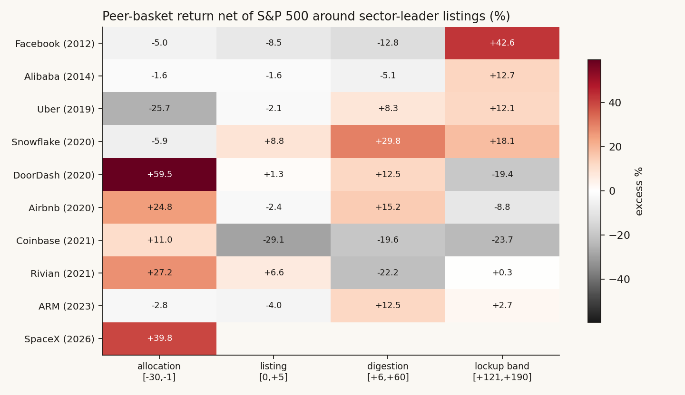

*What the data shows.* No universal effect — the across-event medians are -1.6% (allocation), -2.1% (listing), +8.4% (digestion), +2.7% (lockup band). The variance is the finding. Three events produced real bleeds, and they share a property: the listing *was* the complex's cash-out moment. Coinbase: peers -29.1% in listing week, -19.6% in digestion, -23.7% in the lockup band — and Bitcoin, the host asset, fell 30% in the digestion window after topping the day Coinbase listed. Rivian: EV basket -22.2% in digestion (the NASDAQ itself topped nine days after the IPO). Uber: LYFT, the only pure peer in the sample, -25.7% in the allocation window as Uber's roadshow priced directly against it. Meanwhile Alibaba, ARM and Snowflake — giant deals that were not their sector's cash-out event — left peers flat to higher.

*Why (mechanism).* Allocation-funding sales are real but small; the bigger channel is *narrative completion*. When the most-anticipated name in a complex becomes buyable, the proxies lose their reason to exist at a premium — the marginal speculator no longer needs MARA as a Coinbase substitute or LYFT as an Uber substitute. The sell-off is a repricing of substitutes, which is why it only happens when the leader actually absorbs the complex's story.

*What I checked.* Removing TSLA (the heavyweight) from the Rivian basket leaves the digestion bleed intact (LCID/NIO/XPEV led the fall). The DoorDash and Airbnb "+59/+25 allocation" cells are the Nov-Dec 2020 melt-up, not event alpha — both listed into the hottest month of the cycle; this is why medians, not means, carry the conclusion.

*Verdict.* **Conditional yes.** Peers sell off when the leader completes the complex's story. SpaceX is the most story-completing listing in the sample — and its basket just printed the +40% pre-listing halo (the Coinbase shape). The prediction this implies: the space basket's risk window is the next 60 trading days, with the proxies (pre-revenue, story-driven names) more exposed than the cash-flow names.

## Finding 2 — the cash exists; the overhang is concentrated

*What I expected.* "Is there enough liquidity for SpaceX?" — naively, a $75B raise plus a $160B pipeline year sounds like a strain.

*How I measured it.* Each mania era's equity supply against its absorption capacity, same ratios, same sources.

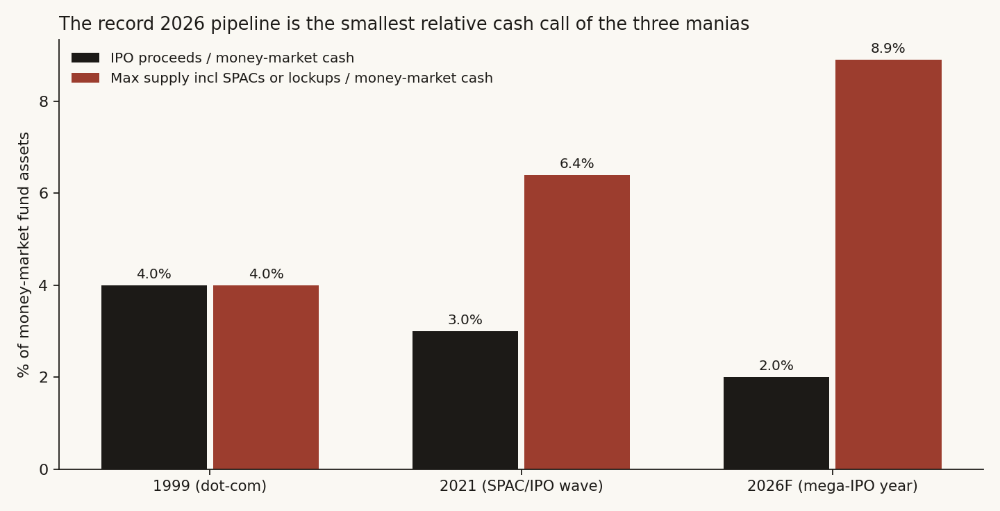

| Era | IPO proceeds / money-market cash | Max supply (incl. SPACs or lockups) / MMF | Proceeds / annual buybacks |
|---|---|---|---|
| 1999 | 4.0% | 4.0% | 46% |
| 2021 | 3.0% | 6.4% | 16% |
| 2026F | **2.0%** | **8.9%** | 15% |

*What the data shows.* By every flow measure, 2026's record pipeline is the smallest relative cash call of the three manias — there has never been this much idle cash ($7.87T in money-market funds, a record set the week of the listing) against an IPO calendar. The inversion is in the overhang: counting lockup supply, 2026 carries the largest deferred-supply burden of the three eras, and unlike 1999's thousand small deals, it is concentrated in a handful of names. SPCX alone: ~$840B of potential tradable supply by day 180 (at the day-1 close) against ~$21B of mechanical index demand.

*Verdict.* **Yes, the market has the liquidity — the question was never aggregate cash.** The binding constraint is price-specific: whose order book absorbs the unlocks. This is Part II's market/asset split, found again from the flow side.

## Finding 3 — June 2026 fingerprints as a hot ordinary bull, with one dark neighbor

*What I expected.* Given the issuance cluster, I expected the regime math to match late 2021.

*How I measured it.* Five z-scored monthly features (12m and 3m return, 63-day vol, drawdown state, tech leadership) since 1990; Euclidean nearest neighbors to June 2026; plus a 120-day price-path correlation scan as a second, weaker read.

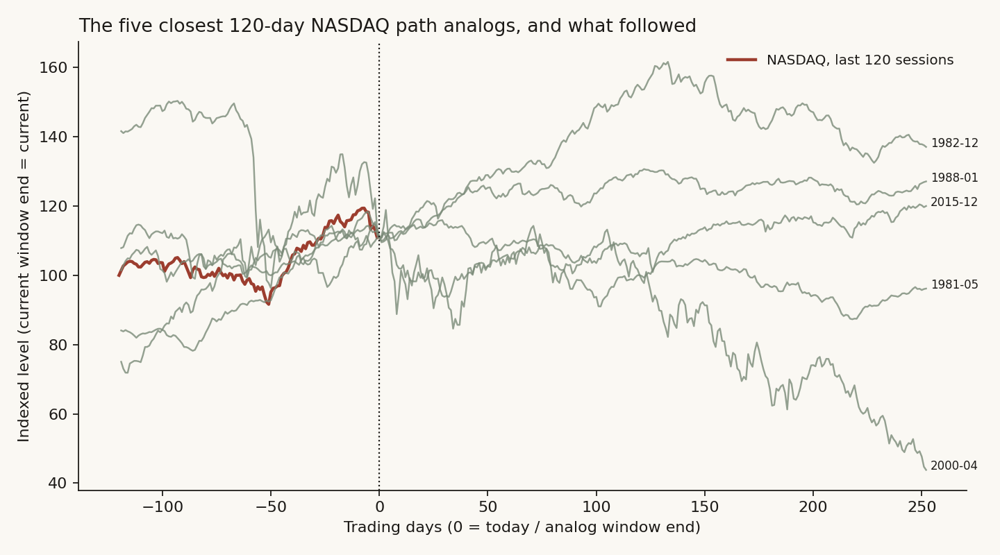

*What the data shows.* The top-ten analog months are mostly benign mid-bull markets (2024-07, 2023-06/07, 2019-03, 1991-04, 2010-09/10/11) — median forward 12m +13.2%, 80% positive, modestly below the +16.6% unconditional base. Late 2021 is absent: today's tape is less extreme than that one on every feature. Two exceptions earn their place: the *single nearest* neighbor is **October 2007** (forward 12m: -39.8%), and analog #10 is **January 2025** — the TRUMP-coin month. The price-path scan's correlations are weak (0.32-0.38) and its outcomes scattered; it is reported as texture, not evidence.

*Verdict.* **No on "2026 = 2021."** The regime evidence leans benign, which *strengthens* Finding 1's conditionality: if the space basket bleeds from here, it will be the substitution mechanism, not a market-wide top.

## Finding 4a — the bootstrap cone: the premium's half-life is one lockup cycle

*How I measured it.* 10,000 twelve-month price paths for SPCX from its $160.90 day-1 close, block-bootstrapped (20-day blocks) from the two empirical families it belongs to: the ten mega-IPO chase paths (70% weight) and the two low-float vertical decays, GME and TRUMP (30%).


| Milestone | P(below $135 IPO price) | P(below $150 open) |
|---|---|---|
| Day 70 (first unlock) | 35% | 47% |
| Day 135 (last tranche) | 41% | 49% |
| Day 180 (cleanup) | 43% | 50% |
| Day 252 (one year) | **46%** | 51% |

Twelve-month percentiles: p10 $50, p25 $88, median $147, p75 $235, p90 $378. The median path gives back the entire scarcity premium by day 180 — it lands on the $150 opening print almost exactly.

*Verdict.* The empirical families say the day-one buyer's position is close to a coin flip against the open and meaningfully exposed against the IPO price, with the odds deteriorating monotonically through the unlock calendar.

## Finding 4b — is the swarm trustworthy enough to use here? (validation, with one new pilot)

Whether this class of tool can forecast at all — rather than launder its input back as a confident story — is the entire subject of a companion study, **[study 30](../30-can-a-swarm-forecast/)**. That study ran the same engine on a known case (2001 telecom) and a conclusion-stripped live case (the AI capital cycle), graded the second with an adversarial contamination panel, and landed on a qualified yes: **12/16 on the honest measure, a hypothesis generator not an oracle**, with the standing caveat that engine and grader share a language model so agreement may be shared priors, not independent foresight. I take that verdict as given here rather than repeat it.

What this study adds is **one new pilot built for the liquidity question specifically — GameStop, January 2021** — because the SpaceX question is not about a capital cycle, it is about whether market *plumbing* (float, borrow, clearing, unlock supply) governs a price. GameStop is the cleanest case where it did.

*How I measured it.* Seed = the market state as of 22 January 2021 (short interest, the gamma loop, NSCC clearing collateral, the sister names) with the **outcome withheld**. Score the causal channels, not outcome recall (2021 is in the model's training data). Artifacts: [validation/pilotB_gme_score.md](validation/pilotB_gme_score.md), [validation/pilotB_groundtruth.md](validation/pilotB_groundtruth.md).

*What the data shows.* 5 of 5 channels surfaced: the peak window (late January, at the broker restriction), the de-grossing spillover, all five sister names, the short-side squeeze, and Citadel as the dominant market maker. The load-bearing result is the one the seed did *not* contain: the swarm reasoned, unprompted, that **the price peaks when the *buying channel* is constrained by clearing-collateral demands — not when sellers overwhelm buyers.** The seed listed the NSCC collateral fact as one neutral bullet; the swarm deduced that the plumbing, not the order flow, sets the top.

*Why it matters here.* That is the exact structural question Part III asks of SpaceX — whether the absorption side (index demand vs unlock supply, borrow, lock-up mechanics) governs the price path. The swarm found the plumbing-binds-the-price logic in the one historical case built to test it. Combined with study 30's general 12/16, that earns the engine a caveated role on the SpaceX run.

*Verdict.* **Cleared as a mechanism-and-ordering rehearser** (general validity per study 30; plumbing-specific validity per the GME pilot here). Outcome probabilities stay owned by the backtests (Findings 1-3) and the bootstrap cone (Finding 4a); the swarm speaks only to mechanism and trigger.

## Finding 4c — the swarm on SpaceX: the live, blind rehearsal

This is the only genuinely blind test in the study — the six months from 13 June 2026 have not happened. The seed ([sim_seeds/seed_C_spacex_2026.md](sim_seeds/seed_C_spacex_2026.md)) gives the swarm facts and participants only; our own verdict and the Finding 4a probabilities are deliberately withheld. The run was 11 agents over 15 rounds; the raw emergent world (the agents' own posts) is preserved in [validation/spacex_run_raw_world.md](validation/spacex_run_raw_world.md). Predictions are published here *before the fact* and will be scored against reality at each lock-up date.

*The emergent call (six themes, unprompted).*

1. **Two regimes split at the lock-up calendar.** In the swarm's words: "before the unlock, shorts are constrained; after the unlock, the market tests absorption capacity." The first ~70 days are governed by the demand story — the 4.25% float scarcity, amplified by mechanical Nasdaq-100/Russell buying. From September-October, as the day-90/105/120/135 tranches release in sequence, the supply calendar takes over: "any bounce gets met with the question — who absorbs the employee and insider selling?"
2. **Peak vulnerability is the day-180 December cleanup.** If SPCX still holds a high valuation going into the day-180 release, insider/employee diversification selling "could become the most visible supply stress-test in the whole market."
3. **The early-warning signal (specific, falsifiable, and counter-intuitive).** The swarm's sharpest output inverts the naive read of the borrow market. In the ultra-low-float phase, a *high* borrow fee is bullish-by-constraint — it means shorts cannot act and can even amplify a squeeze. The danger sign is the opposite combination: **borrowable supply rising and the fee falling, while the price fails to make a new high on good news.** In its words, "the first warning isn't that shorts get more bearish, it's that shorts finally have the tools." A second, parallel tell sits off-screen: the employee/insider block-trade market — when block quotes shift from scattered and tentative to concentrated and willing-to-discount, "the block desk sees the real discount before the screen does." Both are concrete triggers the statistical cone cannot produce.
4. **Peers rotate out by substitution.** The market trades SPCX, Tesla and the space names as one "Musk-complex" allocation; if SPCX becomes the preferred vehicle, Tesla and the space peers face capital rotation *out*, and the pre-listing rally "turns from an industry re-rating into post-rehearsal profit-taking." This is Finding 1's substitution mechanism, reached independently.
5. **Stress concentrates, it does not broadcast.** First stress appears "in SPCX options, borrow rates, space-concept stocks and high-valuation IPO names"; it reaches the broad index "only if the AI-capex narrative wobbles at the same time." This is Findings 2-3 and the [casting table](CASTING_TABLE.md)'s periphery-first ordering, restated by the agents.
6. **Two named cross-triggers:** an OpenAI IPO priced below expectations re-rates SPCX's AI-compute premium; and borrow availability is the master gate on the whole short side ("the biggest problem shorting SPCX isn't the thesis, it's the borrow").

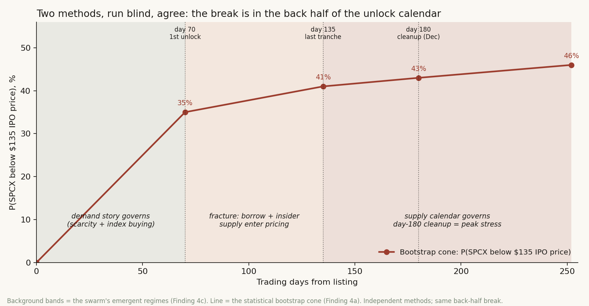

*Convergence with the bootstrap cone — the actual signal.* Two independent methods, run without sight of each other, agree on the structure: the cone (Finding 4a) says the scarcity premium has a half-life of one lock-up cycle and the median path returns to the $150 open by day 180; the swarm says the demand story governs early and the supply calendar overwhelms it across days 90-180, peaking at the December cleanup. **Both put the break in the back half of the calendar, driven by unlock supply, not a market-wide top.** Where they agree is what this study will stand behind.

*What the swarm adds beyond the cone.* The cone gives probabilities; the swarm gives the *mechanism and the trigger* the cone cannot: the two-part early-warning signal (new-high failure + borrow loosening), the peer substitution channel, the OpenAI-pricing cross-trigger, and borrow as the master variable gating the short side. None of these is in the seed — they are the genuine, seed-absent value-add (the seed listed borrow scarcity as a neutral fact but never said when or how the premium breaks).

*Honesty markers.* This is one model's emergent narrative; "the simulation suggests," not "shows." Agreement with the cone may partly reflect shared priors. ~3 of the 38 emergent items are corporate-IR roleplay noise (Tesla/Rocket Lab "company perspective" posts), excluded from the read. The predictions are dated and will be scored at each unlock — that scoring, not this rehearsal, is the real test.

## Finding 5 — "the next FAANG" is a category error: from $2T, the upside is arithmetically capped

*What I expected.* The bull case I kept hearing is "SpaceX is the next FAANG." Findings 1-4 are about the *next six months*; this is about the *next decade*, and it turns out to be the simplest finding in the study — almost pure arithmetic. The phrase quietly compares SpaceX's price *today* to FAANG's price *at IPO*. But FAANG's legendary returns came from one thing those companies will never do again: IPO small. SpaceX is doing the opposite.

*How I measured it.* Pull each FAANG-era winner's market cap *at its IPO* against its price-return multiple since, then ask the only question that matters from a $2T base: to earn the same multiple, what would SpaceX have to *become* — and is there room in the world for it?

```python
spcx_terminal = 1770 * faang_multiple            # $B SpaceX would need to reach
vs_largest_ever = spcx_terminal / 5500           # NVDA, the biggest company ever
vs_world_equity = spcx_terminal / 126700         # SIFMA global equity, 2024
```

*What the data shows.*

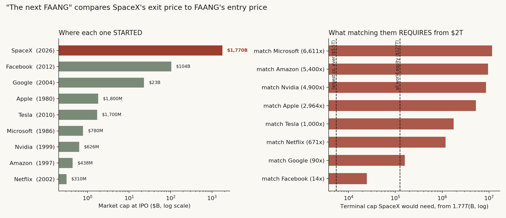

The winners IPO'd tiny. Netflix entered at a **$310M** market cap, Amazon at **$438M**, Nvidia at **$626M**, Microsoft at **$780M**, Apple and Tesla under **$2B**. The median FAANG-era IPO cap was about **$1.2B**. Even Facebook — the deal everyone called grotesquely large in 2012 — came public at **$104B**. SpaceX is entering at **$1,770B**: about **17x** Facebook's "huge" IPO and roughly **5,700x** Netflix's. SpaceX is IPO'ing at a level its idols only reached after 20-40 years of compounding.

That is why the multiple is capped. The return a stock can earn is bounded by (the largest it can plausibly become) / (where it starts), and SpaceX starts where the others finished:

| To match... | its multiple | SpaceX would need to reach | = how many "largest companies ever" ($5.5T) | vs all world equity ($127T) |
|---|---|---|---|---|
| Microsoft | 6,611x | $11,700T | 2,100x | 92x |
| Amazon | 5,400x | $9,558T | 1,738x | 75x |
| Nvidia | 4,900x | $8,673T | 1,577x | 68x |
| Apple | 2,964x | $5,246T | 954x | 41x |
| Tesla | 1,000x | $1,770T | 322x | 14x |
| Netflix | 671x | $1,188T | 216x | 9x |
| Google | 90x | $159T | 29x | 1.3x |
| **Facebook (the weakest)** | **14x** | **$24.8T** | **4.5x** | **0.20x** |

Read the bottom row, because it is the whole finding. Matching the *weakest* FAANG return — Facebook's mere 14x, which is weak precisely *because* Facebook IPO'd big — would require SpaceX to become **$25 trillion, about five times the largest company that has ever existed** and a third of all US equity. Matching a *typical* FAANG (Tesla's 1,000x, Amazon's 5,400x) would require a company worth many times *all the equity on Earth*. These are not forecasts that look unlikely; they are numbers that cannot fit inside the world.

*Why (mechanism).* This is the law of large numbers on a market cap — the same reason Buffett has said size is the anchor of performance. A 100-bagger has to traverse the whole distance from microcap to megacap; a company that begins as a megacap has already spent that distance. SpaceX may well be a magnificent business — Findings here do not dispute the company — but "great company" and "great *entry return*" are different claims, and the "next FAANG" label smuggles the second in on the strength of the first. It is the same entry-quality-vs-company-quality split that ran through Part II of this dossier, now stated at the level of a decade.

*The realistic ceiling.* Turn it around. A genuinely *great* long-run outcome — SpaceX **triples** to ~$5.3T — would merely make it the largest company in the world, roughly today's Nvidia. A **10x**, the floor of what "next FAANG" implies to most people, means **$17.7T**: about **3.2x the largest company ever** and a quarter of all US equity. So the honest top end is a low-single-digit multiple over many years, not a FAANG multiple — and that is the *best* case, before Findings 1-4's near-term unlock-supply downside is even applied.

*What I checked.* IPO market caps are precisely sourced (WSJ for Nvidia's $626.1M; NYT for Facebook's $104B; Statista/CBS for Amazon's $438M); the multiples are the published price returns (macrotrends "$1,000 would now be worth…" series, and Musk's own cited 1,000x for Tesla). The benchmarks are sourced: Nvidia first crossed $5.5T in 2026; SIFMA puts 2024 global equity at $126.7T. Using *peak* instead of recent caps would only enlarge the required multiples, not shrink them — the direction is against the bull case, so the conclusion is conservative.

*Verdict.* **Confirmed, and close to definitional.** "The next FAANG" is true only as a statement about the company and false as a statement about the return. From a ~$2T entry the upside is structurally a low-single-digit multiple at best; FAANG-scale multiples are arithmetically foreclosed. Paired with the near-term findings, the payoff is asymmetric: capped upside over years, unlock-supply downside over months.

## Did I just find noise?

1. **Peer baskets are hand-assigned.** Mitigated by using only peers a contemporary would have named, and by the result *not* being universal — a cherry-picked design would have produced a cleaner story than "three of nine."
2. **Window overlap.** DASH/ABNB listed a day apart; their windows double-count one regime. Dropping either changes no median's sign.
3. **The ledger's constants are approximations** (1999 market cap, 2021 MMF). Each is rounded against the conclusion and none is load-bearing within a factor of two.
4. **The cone inherits its families' eras** — mostly 2012-2023 listings; a 2000-style regime would sit outside it. The 2007-analog warning from Finding 3 bounds this honestly.
5. **The swarm is a narrative engine.** Its pilots are contamination-prone (the model has read the history) and its live output is one model's emergent story. It is the third-ranked evidence layer by construction, and nothing in the verdict rests on it alone.
6. **The FAANG multiples are price returns, not market-cap returns.** Finding 5 uses each name's per-share return; companies issue shares over time, so the market-*cap* multiple is generally *smaller* than the price multiple. That makes the required SpaceX terminal caps, if anything, understated — the direction is against the bull case, so the ceiling is conservative. The argument is order-of-magnitude (5x vs 50x the largest company ever), not knife-edge, so the imprecision changes nothing.

## The answer, in the data

[PENDING — final answer table after the swarm runs; the backtest rows are final:]

| Question | Answer | Key numbers |
|---|---|---|
| Does the market have enough liquidity for SpaceX + the 2026 pipeline? | **Yes** — smallest relative cash call of the three manias | $160B = 2.0% of record $7.87T MMF; overhang the caveat (8.9%) |
| Do the #2/#3 players sell off? | **Conditional** — only when the listing completes the complex's story | COIN peers -29/-20/-24; RIVN -22; LYFT -26; 6 of 9 events flat |
| Is the space basket at risk now? | **Yes, on the precedent** — +40% halo printed, Coinbase shape | risk window: next ~60 sessions |
| Is 2026 a repeat of 2021's window? | **No** — ordinary hot-bull fingerprint; nearest neighbor 2007-10 is the tail risk | analog median fwd 12m +13.2% |
| Does the SPCX premium survive the unlocks? | **Even odds at best** | P(<$135): 35% day 70 → 46% day 252; median path = $150 at day 180 |
| What does the swarm add? | **A convergent mechanism + a falsifiable signal** | Blind run independently put the break in the back half (days 90-180), same as the cone; added the early-warning trigger: new-high failure after index inclusion + borrow loosening, before day 70 |
| Can SpaceX be "the next FAANG"? | **No on the return** (yes only on company quality) | FAANG IPO'd at ~$0.3-1.8B (median $1.2B); SPCX enters at $1,770B. Matching the weakest FAANG (Meta 14x) needs $25T = ~5x the largest company ever; realistic ceiling ~3x (today's Nvidia) |

## Reproducibility

- [run_ch1_peers.py](run_ch1_peers.py), [run_ch2_ledger.py](run_ch2_ledger.py), [run_ch3_regime.py](run_ch3_regime.py), [run_ch4_fanchart.py](run_ch4_fanchart.py), [run_ch4c_convergence.py](run_ch4c_convergence.py), [run_ch5_size_ceiling.py](run_ch5_size_ceiling.py) — every figure and number above; results in the matching `ch*_results.json`. IPO-cap inputs in [data/faang_ipo_caps.csv](data/faang_ipo_caps.csv).
- [sim_seeds/](sim_seeds/) — the exact seed reports given to the swarm, written with as-of-date discipline (nothing the participants could not have known).
- [CASTING_TABLE.md](CASTING_TABLE.md) — the 2001→2026 mechanism-transfer map.

## Sources and forward pointers

- ICI money-market release (Jun 11, 2026); S&P Dow Jones Indices buyback reports; Goldman Sachs 2026 IPO forecast (Reuters); Bloomberg Intelligence index-absorption estimates; Cboe/Siblis as in Part II.
- **Builds on** Part II of this dossier (the event-level base rates and the low-float family), Part I of this dossier (the unlock calendar), [study 15](../15-ipo-chase/) (the chase base rate), and [study 27](../27-ai-capital-cycle/) (the financing-cycle casting that the 2001 transfer relies on).
- **Companion:** [study 30](../30-can-a-swarm-forecast/) asks whether the swarm engine can forecast at all (the general tool evaluation); this study takes that verdict as given and *applies* the validated engine to the SpaceX liquidity question, adding a plumbing-specific GME pilot. Read 30 for "is the tool any good," 29 for "what does it say about SpaceX."
- **Next:** scoring the SpaceX swarm predictions against reality at each unlock date — the only test of the simulator that means anything.

---

# Synthesis — the four lenses as one decision

Each lens attacks the SpaceX entry from a different angle and they converge:

- **Quality (I)** says the entry is structurally poor despite the company: 4.25% float, 9.4x supply by day 180, 84% voting control, heroic multiple.
- **Mania (II)** says the *shape* of the risk is a low-float scarcity premium that decays as supply arrives — the same architecture as TRUMP and GameStop, even though SpaceX is far too large to drain the market.
- **Liquidity (III, near-term)** says the market can absorb it in aggregate but the unlock overhang is concentrated on SPCX's own order book, and two independent methods (a bootstrap cone and a blind agent-swarm rehearsal) put the break in the back half of the lock-up calendar, peaking at the December day-180 cleanup.
- **Decade (III, long-term)** says the "next FAANG" bull case is arithmetically foreclosed from a $2T base — the realistic ceiling is a low-single-digit multiple.

The four rhyme into one asymmetric payoff: **capped upside over years, supply-driven downside over months, governance discount always.** The disciplined posture is to treat the IPO as a catalyst/scarcity trade, not a clean long-term entry, and to re-underwrite after the unlock calendar runs and the first two earnings prints land — exactly the upgrade path in Part I.

## What to watch (the falsifiable signals)

- The swarm's early-warning trigger (Part III): not a *high* borrow fee (that means shorts are constrained) but borrow **loosening** while the price fails to make new highs on good news — and the block-desk insider-quote discount turning concentrated.
- The Part-I unlock calendar: days 70/90/105/120/135 and the day-180 December cleanup; the performance early-release trigger (30% above IPO for 5 of 10 days).
- The Part-III peer test: whether the space basket (RKLB, ASTS, IRDM, LUNR, RDW, PL, SPCE) gives back its +40% pre-listing run as SPCX completes the complex's story.
- Cross-triggers: an OpenAI IPO priced light re-rates SPCX's AI-compute premium; Q2/Q3 earnings on Connectivity durability and AI delivery.

This dossier will be scored against reality as each unlock date arrives — that scoring, not the model, is the real test.
