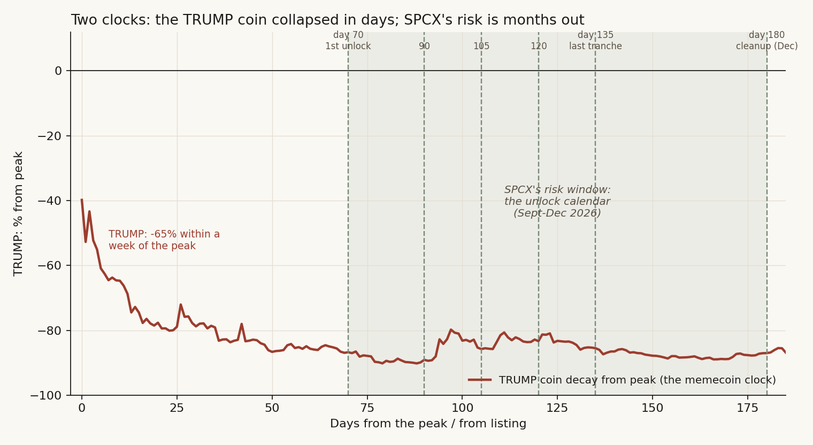
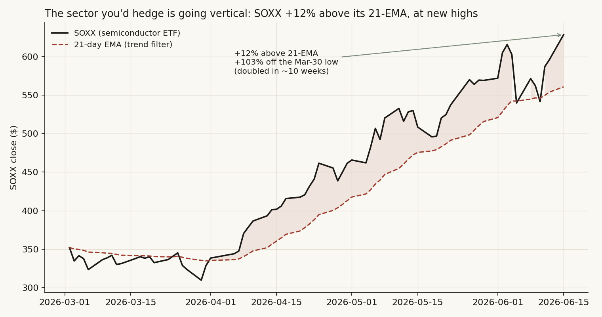

# SpaceX day-two follow-up — the two clocks, and should you hedge the overextended sectors?

*Standalone follow-up to [the SpaceX dossier](README.md). Written 16 June 2026, on the data through the day-two close (Mon 15 June). Research framework, not personal financial advice; nothing here is a trade instruction.*

## The question this answers

Two trading days in, SPCX is up and the broad AI/semis tape keeps climbing. Two things are being asked at once:
1. **How long can this stay overextended?** The TRUMP coin is the cautionary precedent — how long did *it* last?
2. **Is it the right thing to open a hedge now on the overextended sectors (semiconductors), and average down, to reduce risk?**

The short version: the TRUMP clock does **not** transfer to SPCX, the thing being drained is **space peers, not semis**, and on our own evidence hedging-by-averaging-down into this tape **increases** risk rather than reducing it. But there is one named tail that makes a *defined-risk* hedge defensible — as paid insurance, not as de-risking. Below is the work.

## Where things stand on day two

| | Value | Note |
|---|---|---|
| SPCX price (day-2) | **~$171.91** | +6.8% on the day, **~+27% from the $135 IPO**, at new highs |
| Debut close (day-1) | $160.95 | +19.2% over the IPO price; ~$2.11T |
| New money | **+$10.7B** | over-allotment exercised; deal grew |
| Demand tell | ARK bought **3.3M shares**; first earnings **Sept 2** | demand still chasing, not fading |
| The peers | **"Rocket Lab tumbles as SpaceX IPO sparks sector rotation"** | the drain the dossier predicted, continuing on day 2 |
| Semis | **SOXX +5.4%, SMH +4.4%, NVDA +3.5%** on 15 June | the "overextended" sector *rallied*, hard |

The day-two tape confirmed the dossier's mechanism in real time: the SpaceX listing is draining its *value chain* (the listed space pure-plays), exactly as Finding 1 predicted — and **not** the semiconductor complex, which went the other way.

## Finding A — the TRUMP clock does not transfer to SPCX

People reach for the TRUMP coin because both are record, retail-saturated, scarcity-driven listings. But the decay clocks are completely different.

TRUMP's run was **two days**. From its 19 January 2025 peak it was **-65% within a single week**, -79% in a month, -89% by 90 days. It collapsed that fast because *nothing held it up*: no cash flow, ~20% float, and the marginal buyer simply left.

SPCX is the opposite on exactly the things that set the timing:
- **4.25% float** (tighter than TRUMP) — scarcity holds the price *up* near-term;
- **mechanical index demand** still ahead (Nasdaq-100 fast entry ~days 5-15) — forced buying, not selling;
- **Starlink cash flow** — a valuation floor TRUMP never had.

So SPCX's decay window is **not days — it is the unlock calendar (Sept-Dec 2026), peaking at the day-180 December cleanup**, exactly as the dossier's bootstrap cone and swarm rehearsal independently concluded. **Answer to "how long can it stay overextended": plausibly into late August before the supply calendar starts biting** — not a two-day TRUMP-style flash. Day two going up is consistent with the thesis, not a refutation of it.

## Finding B — the sector you'd hedge is going vertical

Your instinct that semis are overextended is **correct, and measurable**:

SOXX is **+12.1% above its 21-day EMA**, **+103% off its 30 March low** (a clean double in ~10 weeks), **+16% in the last three sessions**, at fresh highs. That is genuinely stretched — the long-side mirror of the house "price below the 21-EMA = cut" rule.

But it is overextension that is **still accelerating**. Hedging it *today* means **shorting a parabola on the day it makes new highs**, to protect against a drain that is hitting a *different* sector (space peers). Two separate problems with the trade as posed.

## Finding C — "hedge and average down to reduce risk" is self-contradictory, and our own study proves it loses

This is the crux, and we have already measured it. The proposal — go to a hedge because the tape is hot, and average down — is the "de-risk because it's overextended" family. Our committed equity-issuance study ran exactly that rule and the result is brutal:

| The "go-to-cash-because-it's-hot" rule | Result |
|---|---|
| Annualised return | **+5.2%** vs **+13.7%** buy-and-hold |
| Sharpe | 0.39 vs 0.62 |
| Deflated Sharpe | **FAILS** (0.62) |
| Probability of backtest overfit | **0.54** (overfit-prone) |
| Signal character | reactive, not predictive (trailing IC +0.57, forward IC **-0.11**) |

It gives back ~8.5 points of return a year for a worse Sharpe. And **"average a short *down* as price prints new highs"** is worse than the mechanical rule — it adds size to a losing position into the most violent, least-bounded part of a parabola. That is the literal inverse of de-risking. **The average-down leg is rejected outright: it increases risk.**

The pre-registered SPCX fade signal points the opposite way too: the dossier's swarm+cone said to fade when **borrow loosens and price fails to make a new high** — right now borrow is scarce and the price is making new highs. The signal says *not yet*.

## Finding D — the one honest tail that makes a *defined-risk* hedge defensible

The wait-case does not get to wave one fact away: our own regime model's **single nearest historical neighbor to June 2026 is October 2007** (the dossier's Finding 3), and the price-action analog book independently surfaces **April 2000**. The two tightest matches by both methods are the two worst late-cycle tops in 45 years. Layered on top, study 27's bubble screen (Greenwood-Shleifer-You, >100% two-year net-of-market) flags **8 of 17 AI names** — and the blow-off has migrated *downstream* to memory (MU), power (GEV/VRT) and the broad semi complex (AMD/AVGO/TSM), which is precisely what SOXX/SMH hold.

So the tail is real and named. That makes a **small, pre-sized, defined-risk hedge** (a put-spread you would be content to let expire worthless) defensible — **as paid insurance against that specific left-tail, not as "risk reduction."** It is negative expected value (Finding C), so it is a cost you choose to pay for tail protection, sized to survive being early — not a free de-risk and not a conviction short.

The modal outcome is still the bull case: the hot-tape base rate is **+14.7%** forward 12 months (76% positive), and the 10-neighbor regime basket median is **+13.2%**. Oct-2007 is one neighbor out of ten. You are insuring the tail, not betting the mode.

## The verdict (graded)

**NO-but-prepare.**

- **Conviction short of semis today: No.** You would be fighting an uptrend the data says usually continues, at +12% above the 21-EMA.
- **Averaging down: No — it increases risk.** Rejected outright.
- **A small, defined-risk hedge: defensible only as paid insurance** against the named Oct-2007/Apr-2000 tail, fixed-loss, sized to survive being early — never scaled into strength.
- **Where the real near-term risk actually is: the space peers** (confirmed, ongoing on day 2), not semis. Semis are a *separate*, credit-triggered cycle (study 27). SPCX itself decays on the unlock calendar (Sept-Dec).

## The signal-triggered framework (risk reduction, done right)

Hedging is a response to a trigger, not a response to a feeling that things are high. Convert the watch into pre-defined flips:

| Trigger (any one) | What it confirms | Posture flip |
|---|---|---|
| **SOXX loses its 21-EMA (~560) or prints a confirmed lower high** | the parabola has broken | the cleanest flip — a *bounded* trend-break short replaces the parabola-short |
| Downstream leaders (MU, GEV, VRT, AMD) **roll over while NVDA/core still rise** | narrowing leadership — classic pre-break signature | begin scaling protection |
| **Study-27 financing refusal**: a neocloud fails/reprices its ~$4.2B 2026 refi wall; Oracle CDS blows out; B200 rental rates fall below TCO | the real (credit-led) cycle trigger fires | hedge the semis cycle directly |
| **SPCX-specific**: borrow loosens while SPCX stalls / fails a new high | the dossier's seed-absent fade signal (Sept-Dec, day-180 Dec peak) | fade the space complex / SPCX into the unlocks |
| Hyperscaler capex guide turns from raised-and-chased to a **disorderly guide-down** | demand-side confirmation the credit mechanism is biting | add |
| **Correlation regime flips** (study 20): cross-sector corr breaks from ~0.43 toward ~0.70 with VIX rising | the defensive cushion is compressing | protection gets expensive — put it on before this completes |

Instrument per risk: the **space pure-plays** (or SPCX puts dated to the unlock calendar) for the SpaceX drain; a **SOXX/SMH defined-risk put-spread** for the semis-cycle tail. Discipline: fixed-loss, time-boxed, triggered — no discretionary scaling into strength.

## Bottom line

Your risk-reduction instinct is right that the complex is stretched and the tail is real. But on our own evidence the *specific action* — short the overextended semis today and average down — is mistimed (you are shorting a parabola at new highs), mistargeted (the drain is in space peers, not semis), and self-defeating (averaging down into strength increases risk, and the mechanical de-risk rule loses ~8.5 pts/yr). The disciplined version is a small, defined-risk insurance position against the named Oct-2007 tail, plus a pre-set trigger list that flips you from *wait* to *hedge* the moment the parabola actually breaks — starting with SOXX losing its 21-EMA. That reduces risk; averaging down into a vertical tape does not.

*Sources: live tape via public reporting (15 June 2026 close); SOXX/SMH/NVDA daily bars via the market-data warehouse; TRUMP decay from the dossier's Binance data; study cross-references are to [the dossier](README.md) and the companion studies 15, 20, 22, 27, 29, 30. The hedge verdict was produced by an adversarial steelman (hedge-now vs wait-for-signal), adjudicated against the committed studies and stress-tested by a refutation pass.*
