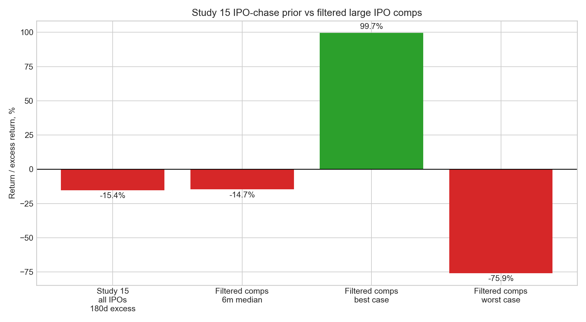
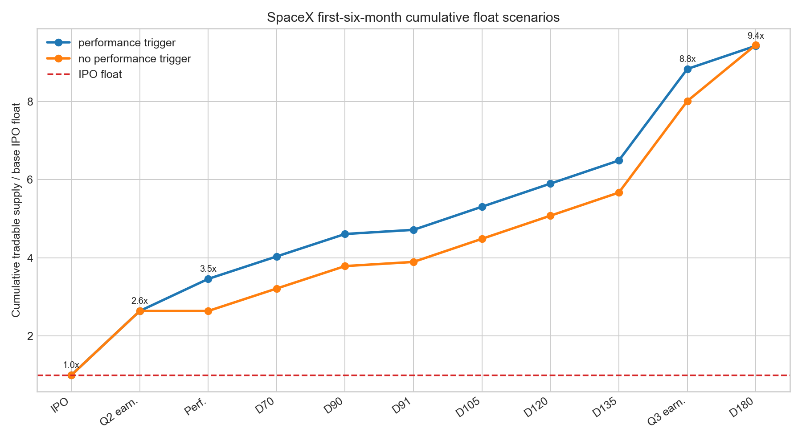
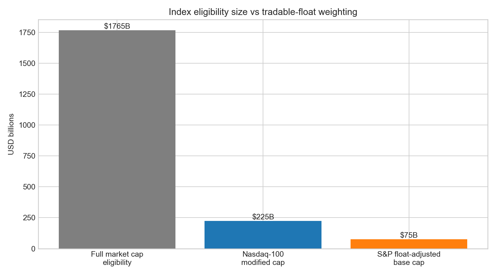
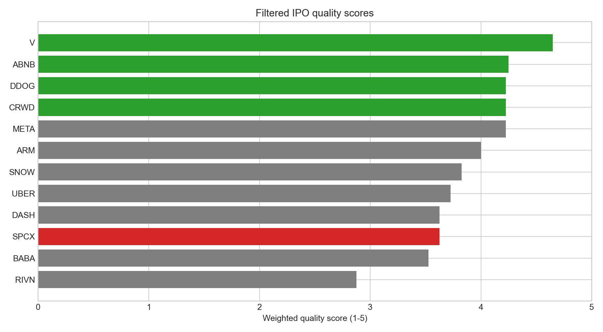

# 24 - SpaceX IPO quality model

**Question.** Does the SpaceX IPO setup justify participating once free float, lock-ups, control, underwriters, index inclusion rules and high-quality IPO comps are screened honestly?

**Finding.** **Trade-only / wait-for-unlock bias.** Study 15 gives the base rate: chasing IPOs from the day-1 close has been a losing trade, with a **-28.4%** median one-year excess return versus SPY and only **19%** beating SPY. SpaceX deserves a better filter than the broad IPO bucket, but the filtered large-IPO comp set still warns against complacency: its median six-month return from first close is about **-14.7%**. SpaceX is exceptional on management, underwriting, scale and scarcity. The problem is entry quality, not company quality: the immediate public float is only **555.6 million Class A shares**, or **4.25%** of basic post-offering shares; by day 180, potential tradable supply reaches about **5.24 billion shares**, or **9.4x** the IPO float and roughly **40%** of basic shares. Class B holds **88.5%** of voting power; Elon Musk holds about **49.1%** of basic economic ownership and **84.4%** of combined voting power. Connectivity is the quality anchor. AI/xAI/X is the expensive swing factor. At about **$1.77 trillion** basic market cap and a **$75 billion** raise, this is a scarcity/catalyst trade before it is a clean long-term entry.

> Research model only; not personal financial advice. Latest EDGAR check in the model is **2026-06-08**. No final **424B4** was found in SpaceX CIK `0001181412` recent filings as of that check.

## Stance

**Base case: trade only, or wait for first earnings/unlock evidence.** I would not treat the IPO price as a clean long-term entry unless the price absorbs early index demand and lock-up supply without breaking and Q2/Q3 results validate Connectivity durability plus AI contract delivery.

The upgrade path is specific:

1. Q2 2026 results confirm Starlink/connectivity revenue quality and cash conversion.
2. Anthropic and Google compute ramps convert into visible revenue without adverse contract changes.
3. The stock absorbs the first earnings release unlock, the 70/90/105/120/135-day releases, Q3 earnings unlock and day-180 cleanup, when potential supply reaches about 9.4x the IPO float.
4. Valuation resets from heroic sales multiples or the market receives enough proof that AI revenue is durable despite termination rights.
5. The final 424B4 does not change offering size, lock-ups, control, risk factors or bookrunner economics in a negative way.

## Study 15 Bridge

[Study 15](../15-ipo-chase/) is the broad prior: aftermarket IPO chasing is usually bad. This study is the exception test: remove noisy/small IPOs, keep only serious institutional comps, then ask whether SpaceX's scarcity, underwriters and index path are enough to overcome the base rate.

| Layer | Evidence | SpaceX decision rule |
|---|---|---|
| Broad IPO prior | Study 15: day-1-close entries in 760 IPOs had **-28.4%** median one-year excess return vs SPY; only **19%** beat SPY. | Start skeptical. Do not buy just because the IPO is famous. |
| Horizon prior | Study 15: median excess return worsened from **-1.9%** at 30 days to **-15.4%** at 180 days and **-28.4%** at 365 days. | The longer the hold, the more proof SpaceX needs. |
| Quality filter | Study 24: micro/small IPOs, SPACs, biotech and weak story stocks are removed. | Compare SpaceX to META, V, UBER, ABNB, ARM, SNOW, DASH, RIVN, CRWD and DDOG, not the broad IPO zoo. |
| Filtered-comp warning | The filtered comp median six-month return from first close is still about **-14.7%**. | Better comps improve relevance, not the base rate. |
| SpaceX exception test | Float is only **4.25%**, Nasdaq-100 fast entry can create early demand, and underwriting quality is top-tier. | Early strength can be scarcity/index flow, not thesis validation. |
| Kill switch | Unlock waves are multiples of IPO float; governance/control is extreme; AI capex and contract risk are high. | Wait for earnings and unlock absorption before long-term sizing. |



## Source Stack

EDGAR is the source of truth. News is cross-check and sentiment color only.

| Source | Date | Use |
|---|---:|---|
| [June 3 S-1/A](https://www.sec.gov/Archives/edgar/data/1181412/000162828026040364/spaceexplorationtechnologib.htm) | 2026-06-03 | Offering math, ownership, segments, lock-ups, risk factors. |
| [June 4 UK retail FWP](https://www.sec.gov/Archives/edgar/data/1181412/000162828026040874/spacexukfwp.htm) | 2026-06-04 | Retail-offer context and disclosure cross-check. |
| [June 5 Google compute FWP](https://www.sec.gov/Archives/edgar/data/1181412/000162828026041150/spacexagreementfwp.htm) | 2026-06-05 | Google compute contract revenue/risk delta after S-1/A. |
| [June 8 EU interview FWP](https://www.sec.gov/Archives/edgar/data/1181412/000162828026041365/eu_interviewtranscript06.htm) | 2026-06-08 | Latest EDGAR filing in the model check. |
| [SpaceX IPO launch release](https://content.spacex.com/cms-assets/FINAL_Documents%20and%20Updates/6.4.26_SpaceX_Announces_IPO_US.pdf) | 2026-06-04 | Company announcement cross-check. |
| [Nasdaq-100 methodology](https://indexes.nasdaq.com/docs/Methodology_NDX.pdf) | effective 2026-05-01 | Fast-entry, seasoning, liquidity and low-float weighting rules. |
| [Nasdaq methodology update explainer](https://www.nasdaq.com/newsroom/nasdaq100-index-methodology-update-why-now) | 2026-05-08 | Cross-check on the new Nasdaq-100 framework. |
| [S&P U.S. Indices methodology](https://www.spglobal.com/spdji/en/documents/methodologies/methodology-sp-us-indices.pdf) | 2026-05 | S&P 500 eligibility, seasoning, liquidity, IWF and profitability rules. |
| [S&P MegaCap consultation results](https://www.spglobal.com/spdji/en/documents/indexnews/announcements/20260604-1483731/1483731_spdji-us-indices-megacaps-results-20260604.pdf) | 2026-06-04 | S&P 500 no-change decision and broad-index changes. |

## IPO Math

Free float here means legally tradable Class A supply, not fully diluted shares and not total economic ownership.

| Metric | Value | Read-through |
|---|---:|---|
| Class A offered | 555.6m | Base immediate public float. |
| IPO price | $135.00 | S-1/A expected price. |
| Gross proceeds | $75.0bn | Base offering before fees. |
| Net proceeds | $74.4bn | Company estimate after discounts/expenses. |
| Over-allotment option | 83.3m | Would raise immediate public float to 638.9m shares. |
| Post-offering Class A | 7,380.2m | Listed Class A after base offering. |
| Post-offering Class B | 5,695.7m | High-vote Class B after base offering. |
| Basic post-offering common | 13,075.9m | Class A plus Class B, not fully diluted. |
| Implied basic market cap | $1,765.2bn | Basic common shares times $135. |
| Immediate free float | 4.25% | Base IPO float / basic post-offering common. |
| Free float if option exercised | 4.86% | Assumes full over-allotment primary issuance. |
| Directed-share program | 27.8m | Up to 5% of IPO shares; not subject to lock-up if purchased. |
| Registration-rights overhang | ~12.2bn | Class A shares including Class B conversion shares with registration rights. |



## Lock-Up Supply

Scarcity is real at IPO, but it is temporary. The lock-up analysis needs three separate ratios:

1. **Incremental release / IPO float:** how large each new release is versus the 555.6m-share IPO float.
2. **Cumulative potential supply / IPO float:** how much supply could be tradable after each release.
3. **Cumulative potential supply / basic shares:** how much of the post-offering common base that potential supply represents.

These are **eligibility and supply-overhang ratios**, not sale forecasts. They do not mean every released share will be sold. Some shares may be affiliate-held, and some Class B exposure would need conversion before Class A trading.

### Pool Ratios

| Pool | Shares | x IPO float | % basic shares | % post-offering Class A | Interpretation |
|---|---:|---:|---:|---:|---|
| Immediate IPO float | 555.6m | 1.00x | 4.2% | 7.5% | Starting tradable supply. |
| Over-allotment option | 83.3m | 0.15x | 0.6% | 1.1% | Optional primary issuance, not a lock-up release. |
| 180-day lock-up pool | 4,557.5m | 8.20x | 34.9% | 61.8% | Main first-six-month overhang before affiliate timing. |
| IPO float + 180-day pool | 5,113.1m | 9.20x | 39.1% | 69.3% | Clean first-six-month supply scale before 59.1m affiliate catch-up timing. |
| Extended lock-up excluding Musk | 1,759.5m | 3.17x | 13.5% | 23.8% | Post-180-day releases beginning around Q4 2026 earnings. |
| Musk 366-day lock-up | 6,400.0m | 11.52x | 48.9% | 86.7% | Largest single overhang; no early release in the S-1/A. |


### First-Six-Month Scenario Bridge

The performance trigger changes **timing**, not the rough day-180 supply endpoint. If SpaceX trades at least 30% above the IPO price for 5 of 10 trading days around the Q2 earnings window, 455.8m shares come out earlier and the day-180 cleanup is smaller. If not, the day-180 release is larger.

| Event | Timing | Shares released | % of base IPO float | Condition |
|---|---|---:|---:|---|
| IPO float | At offering | 555.6m | 100.0% | Freely tradable unless held by affiliates. |
| First earnings release unlock | Q2 2026 earnings window | 911.5m | 164.1% | 20% of 180-day pool, non-affiliates. |
| Performance early release | Q2 2026 earnings window | 455.8m | 82.0% | If stock is at least 30% above IPO price for 5 of 10 trading days. |
| Day 70 | Model date 2026-08-20 | 319.0m | 57.4% | Non-affiliate pool release. |
| Day 90 | Model date 2026-09-09 | 319.0m | 57.4% | Non-affiliate pool release. |
| Day 91 affiliate catch-up | Model date 2026-09-10 | 59.1m | 10.6% | Affiliate catch-up after Rule 144 timing. |
| Day 105 | Model date 2026-09-24 | 328.4m | 59.1% | 180-day pool release. |
| Day 120 | Model date 2026-10-09 | 328.4m | 59.1% | 180-day pool release. |
| Day 135 | Model date 2026-10-24 | 328.4m | 59.1% | 180-day pool release. |
| Q3 2026 earnings unlock | Likely Nov 2026 | 1,300.0m | 234.0% | 28% of 180-day pool. |
| Day 180 | Model date 2026-12-08 | 328.4m or 797.6m | 59.1% or 143.6% | Lower if performance early release happened; higher if it did not. |

| Milestone | Cumulative if performance trigger hits | % basic shares | Cumulative if no performance trigger | % basic shares |
|---|---:|---:|---:|---:|
| IPO float | 555.6m / 1.00x | 4.2% | 555.6m / 1.00x | 4.2% |
| Q2 earnings unlock | 1,467.1m / 2.64x | 11.2% | 1,467.1m / 2.64x | 11.2% |
| Performance early release | 1,922.9m / 3.46x | 14.7% | 1,467.1m / 2.64x | 11.2% |
| Day 70 | 2,241.9m / 4.04x | 17.1% | 1,786.1m / 3.21x | 13.7% |
| Day 90 | 2,560.9m / 4.61x | 19.6% | 2,105.1m / 3.79x | 16.1% |
| Day 91 affiliate catch-up | 2,620.0m / 4.72x | 20.0% | 2,164.2m / 3.90x | 16.6% |
| Day 105 | 2,948.4m / 5.31x | 22.5% | 2,492.6m / 4.49x | 19.1% |
| Day 120 | 3,276.8m / 5.90x | 25.1% | 2,821.0m / 5.08x | 21.6% |
| Day 135 | 3,605.2m / 6.49x | 27.6% | 3,149.4m / 5.67x | 24.1% |
| Q3 earnings unlock | 4,905.2m / 8.83x | 37.5% | 4,449.4m / 8.01x | 34.0% |
| Day 180 final release | 5,233.6m / 9.42x | 40.0% | 5,247.0m / 9.44x | 40.1% |

The key read: **by day 180 the scarcity trade is mostly gone in either scenario.** The performance trigger just pulls some supply forward. Elon Musk's separate long-tail overhang is about **6.4 billion** shares, locked for **366 days** with no early release.

## Control

Governance is the weakest quality dimension in the scorecard.

| Holder / class | Economic shares | Economic % of basic | Combined voting power | Read-through |
|---|---:|---:|---:|---|
| Elon Musk | 6,418.5m | 49.1% | 84.4% | Founder control remains absolute after the IPO. |
| All executive officers and directors | 6,978.8m | 53.4% | 85.3% | Board/executive ownership is extremely concentrated. |
| Public IPO buyers | 555.6m | 4.25% | ~0.9% | Public float has price impact, not control. |
| Class A | 7,380.2m | 56.4% | 11.5% | Economic majority, voting minority. |
| Class B | 5,695.7m | 43.6% | 88.5% | Control class. |

This does not make SpaceX a bad business. It means public holders are buying exposure, not influence.

## Index Rules

Your Nasdaq instinct is right in substance, but the timing is not literally day one.

| Index | Current rule | SpaceX read | First-6-month impact |
|---|---|---|---|
| Nasdaq-100 Fast Entry | A mega IPO can skip the normal three-full-calendar-month seasoning rule if Full Market Capitalization ranks within the top 40 current constituents. It is evaluated on the 7th trading day and is typically added after 15 trading days, with announcement after the 10th trading day. | At about $1.77T, SpaceX likely clears the size test if SPCX lists on an eligible Nasdaq market and no final filing changes the setup. | Possible near-term QQQ/NDX flow catalyst, modeled as late June to early July 2026. |
| Nasdaq-100 liquidity | IPO fast-entry ADVT is measured from first trading day through the reference date; threshold is $5m. | A $75bn IPO should almost certainly clear it, but trading must occur first. | Low gating risk. |
| Nasdaq-100 free float | No minimum free-float criterion, but low-float securities are weighted using the lesser of listed TSO or 3x free-floating shares. | Base IPO float gives a Nasdaq modified market cap of about **$225bn**, not the full $1.77T. | Inclusion possible, but starting weight is scaled to tradable supply. |
| S&P 500 | S&P chose no change: 12-month IPO seasoning, no Composite 1500 IPO fast track, positive GAAP income screens, IWF/liquidity screens. | SpaceX fails first-six-month seasoning, currently fails profitability, and starts below the 10% IWF threshold if only IPO float counts. | No S&P 500 forced-buy catalyst in the first six months. |
| S&P Total Market / Dow Jones U.S. Total Stock Market | Effective 2026-06-08, broad indices allow an alternative IWF path for mega-cap companies and preserve IPO fast-track treatment if all other criteria are met. | Base float-adjusted market cap is about **$75bn**, so broad-index eligibility may arrive earlier than S&P 500. | Potential total-market ETF flow, but not S&P 500 membership. |



Under the model assumption that SPCX first trades on **2026-06-12**, the Nasdaq-100 fast-entry calendar is:

| Event | Model date |
|---|---:|
| 7th trading day evaluation | 2026-06-23 |
| 10th trading day announcement window | 2026-06-26 |
| 15th trading day typical addition window | 2026-07-06 |
| S&P 500 earliest simple seasoning date | 2027-06-12 |

## Comp Screen

The comp set removes the noise: no micro IPOs, no SPACs/de-SPACs, no biotech binary names, no thin promotional stories, and no small offerings below the size screen. COIN is kept as context but not a clean IPO comp because it was a direct listing. BABA is scale/liquidity context, not a clean U.S. governance comp.

| Ticker | Proceeds | IPO market cap | Approx IPO public float | Treatment |
|---|---:|---:|---:|---|
| SPCX | $75.0bn | $1,765.7bn | 4.2% | Subject |
| V | $17.9bn | $42.0bn | 42.6% | Core |
| META | $16.0bn | $104.0bn | 15.4% | Core |
| BABA | $21.8bn | $168.0bn | 13.0% | Scale only |
| UBER | $8.1bn | $75.5bn | 10.7% | Core |
| ABNB | $3.5bn | $47.0bn | 7.4% | Core |
| ARM | $4.9bn | $54.5bn | 9.0% | Core |
| SNOW | $3.4bn | $33.0bn | 10.3% | Core |
| DASH | $3.4bn | $39.0bn | 8.7% | Core |
| RIVN | $11.9bn | $66.5bn | 17.9% | Core |
| CRWD | $0.6bn | $6.8bn | 8.8% | Core |
| DDOG | $0.6bn | $7.8bn | 7.7% | Core |
| COIN | n/a | $85.8bn | n/a | Context only, direct listing |

Approximate comp float uses IPO proceeds divided by IPO market cap, excluding over-allotment and secondary-seller details. SpaceX uses the direct S-1/A share count.



SpaceX scores well on management and IPO execution but is pulled down by governance, related-party complexity, AI losses and lock-up overhang.

| Ticker | Quality score | Why it matters |
|---|---:|---|
| V | 4.65 | Best clean IPO quality comp: profitable, scaled, elite underwriters. |
| ABNB | 4.25 | Founder-led platform quality with less extreme control risk. |
| CRWD | 4.23 | High-quality founder-led software/security comp. |
| DDOG | 4.23 | High-quality infrastructure software comp. |
| META | 4.22 | Founder-control and mega-liquidity comp; early trading still weak. |
| ARM | 4.00 | Controlled, scarce-float tech asset. |
| SNOW | 3.83 | Great company, valuation caution. |
| UBER | 3.73 | Scale with profitability debate. |
| SPCX | 3.62 | Elite company, weaker public-entry quality. |
| DASH | 3.62 | Founder-led but valuation-sensitive. |
| RIVN | 2.88 | Capital intensity caution. |

Good company quality did not prevent weak first-six-month trading in many large IPO comps. From first listed close, META, UBER, SNOW, DASH, RIVN, CRWD and DDOG all finished lower at six months in this model extract.


## Segment Quality

| Segment | 2025 revenue | 2025 operating income | 2025 capex | 2025 operating margin | Capex / revenue | Quality read |
|---|---:|---:|---:|---:|---:|---|
| Space | $4.1bn | -$0.7bn | $3.8bn | -16.1% | 93.8% | Strategic moat, still loss-making and Starship execution-heavy. |
| Connectivity | $11.4bn | $4.4bn | $4.2bn | 38.8% | 36.7% | Best current business; scale and margins are real, but ARPU is falling. |
| AI/xAI/X | $3.2bn | -$6.4bn | $12.7bn | -198.5% | 397.6% | Biggest upside and biggest quality penalty; contract visibility is valuable but terminable and delivery-dependent. |

The Google FWP improves the revenue story, but it also reinforces the key risk: AI revenue quality depends on delivery, power/GPU execution, customer termination rights and capital intensity. Anthropic and Google contracts are useful valuation support only after risk adjustment.

## Underwriters

The underwriter group is a clear positive. Goldman Sachs and Morgan Stanley anchor the bookrunner group and score highest in the model because of lead-left mega-cap IPO franchise strength and stabilization credibility. BofA, Citi and J.P. Morgan add global distribution depth. The broad syndicate helps execution, but it does not solve valuation, control or unlock supply.

## Final View

For the first six months, the clean framing is:

```text
Return setup = scarcity + Nasdaq/broad-index demand + first earnings catalyst
             - valuation risk - unlock supply - governance/control discount
```

My optimized plan is therefore:

1. **Do not use small IPO behavior.** Keep the comp set institutional and liquid.
2. **Separate the company from the entry.** SpaceX is high quality; the IPO entry is lower quality because float/control/unlock math is harsh.
3. **Trade the catalyst only with discipline.** Nasdaq-100 fast-entry demand can matter, but it is modeled as a short-term flow catalyst, not thesis validation.
4. **Wait for unlock absorption before sizing long-term.** The Q2 earnings release and 70/90/105/120/135-day releases are the real public-market test.
5. **Rebuild after 424B4.** Final price, share count, option exercise, lock-up details and index notices can move the conclusion.

## Model Files

- [Workbook](spacex_ipo_quality_model.xlsx)
- [Offering math](data/offering_math.csv)
- [Shareholder ratios](data/shareholder_ratios.csv)
- [Lock-up calendar](data/lockup_calendar.csv)
- [Lock-up supply summary](data/lockup_supply_summary.csv)
- [Lock-up first-six-month scenarios](data/lockup_first_6m_scenarios.csv)
- [Quality scores](data/quality_scores.csv)
- [Comp universe](data/comp_universe.csv)
- [Comp IPO performance](data/comp_ipo_performance.csv)
- [Study 15 IPO chase base rate](data/ipo_chase_base_rate.csv)
- [Study 15 sector base rate](data/ipo_chase_sector_base_rate.csv)
- [Combined IPO decision bridge](data/combined_ipo_decision_bridge.csv)
- [Underwriter quality](data/underwriter_quality.csv)
- [Segment quality](data/segment_quality.csv)
- [Valuation sensitivity](data/valuation_sensitivity.csv)
- [Index inclusion rules](data/index_inclusion_rules.csv)
- [Index inclusion timeline](data/index_inclusion_timeline.csv)
- [Sources](data/sources.csv)

Rebuild:

```bash
python3 24-spacex-ipo-quality-model/build_model.py
```
