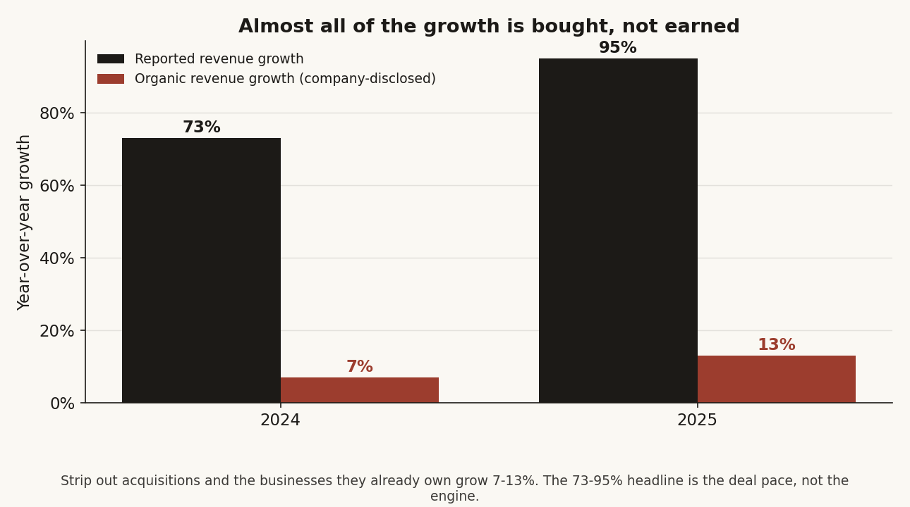
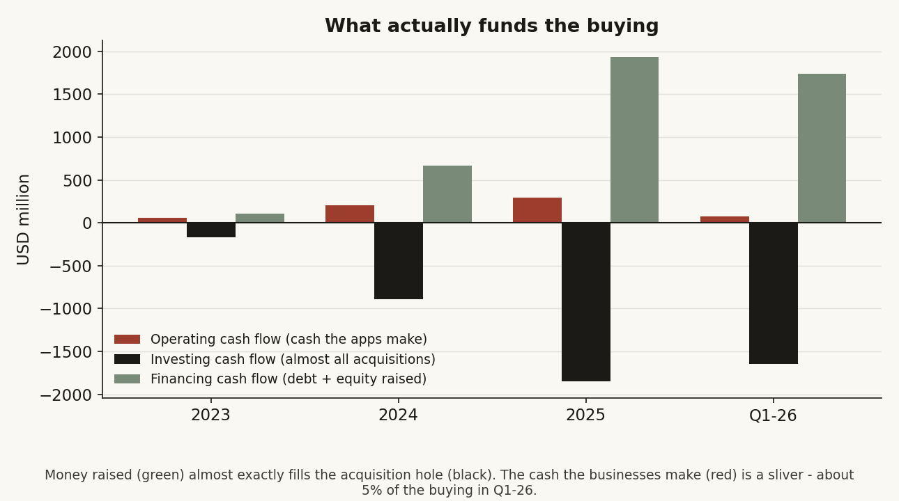
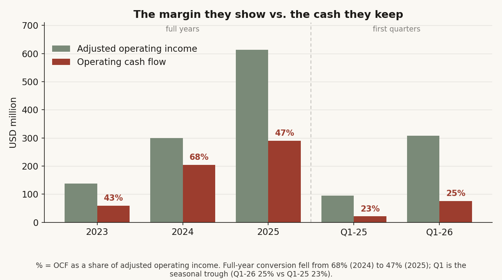
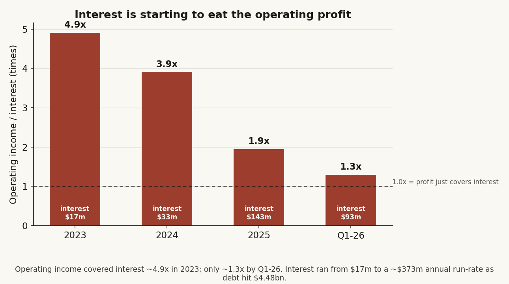
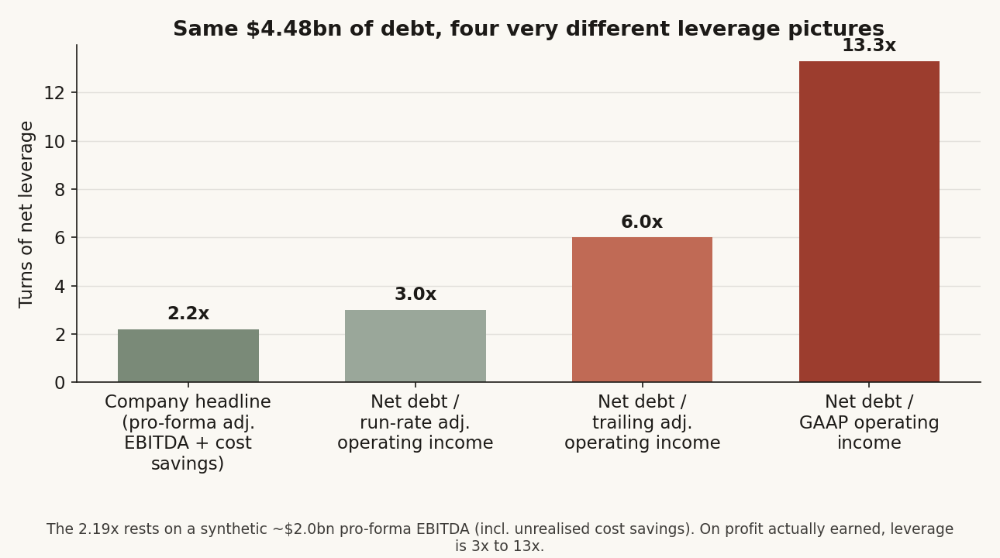

# 25 - Bending Spoons ($BSP): IPO Due Diligence Memo

**Question.** Is Bending Spoons a differentiated permanent owner/operator of digital products, or a private-equity-like software roll-up whose reported growth depends on acquisition pace, debt, restructuring, and pricing power?

**Finding.** **Real business, real complexity — and the cash flow tells a sharper story than the margin.** Bending Spoons is not one app and not a normal roll-up. It is a **diversified holding company of unrelated digital cash-flow businesses** — a conglomerate — that owns AOL, Eventbrite, Vimeo, Brightcove, Evernote, WeTransfer, Meetup, StreamYard, Issuu, Harvest, komoot, MileIQ, Loomly, tractive, Remini, Splice, and smaller assets across at least six unrelated end-markets. The headline numbers are genuinely strong: revenue grew from **$387.1m (2023)** to **$1.306bn (2025)** and **$601.3m** in Q1 2026; GAAP operating income was positive every full year; adjusted operating income margin hit **51%** in Q1 2026. But three things sit underneath that headline. First, almost all of the growth is **bought, not earned** — organic growth was only **7% (2024)** and **13% (2025)**. Second, the cash the businesses actually throw off does not come close to funding the buying: the acquisition program runs on **outside capital**, debt rose to **$4.480bn** by March 31, 2026 (up **$1.77bn in a single quarter**), and **interest now eats most of the operating profit** — interest cover fell from ~4.9x (2023) to **~1.3x in Q1 2026**. Third, the **2.19x leverage** the company shows rests on a generous pro-forma EBITDA; on profit actually earned, leverage is **3x to 13x**. So the IPO is best read as **equity to refuel and de-lever a capital-hungry conglomerate**, not a victory-lap cash-out. It is a yellow flag on the model's capital dependence — but, to be fair to the company, **not a distress raise**: there is no going-concern flag, no near-term debt wall, and the founders are selling some of their own shares alongside.

> Research only; not investment advice or a recommendation to buy, sell, or hold any security. Latest SEC check: **2026-06-15**. The latest EDGAR filing located was Bending Spoons S.p.A.'s Form F-1 filed **2026-06-08**, accession **0001104659-26-071170**. No F-1/A, price range, or revised valuation has been filed as of 2026-06-15.

## What I Looked At This Pass

I started from the surface — a fast-growing, profitable, "permanent owner-operator" of famous apps — and pushed on the two places the story could be hiding something: **what they actually own** (is this a focused roll-up or a sprawling conglomerate?) and **the cash flow statement** (does the money the businesses make match the margin they advertise, and if not, what is funding everything?). The short version:

- **It is a conglomerate, not a roll-up.** The businesses sit in six unrelated end-markets and share no customers, product, or billing — only a balance sheet and an operating playbook. The one real exception is a video/creator cluster (Vimeo, Brightcove, StreamYard, Splice, FiLMiC). The F-1's own role models (Teledyne, Danaher) confirm the conglomerate identity.
- **The growth is bought.** Organic growth is 7-13%; the 73-95% headline is the deal pace.
- **The apps cannot fund the buying.** Operating cash flow is ~5% of the acquisition spend; debt and equity fund the rest. Maintenance capex is ~$0, so the entire investing outflow is acquisitions.
- **Interest is starting to bite.** It went from $17m (2023) to a ~$373m annual run-rate; operating income now covers it only ~1.3x.
- **The leverage optic is flattered**, and the GAAP/economic bottom line is near breakeven.
- **But there is no distress trigger.** No going-concern, no 2026-2028 maturity wall (57% of the debt matures after 2030), demonstrated access to debt markets, covenant headroom, and a partial founder sell-down. "Death spiral" overstates it; "capital-hungry, thin-coverage refuel-raise" is the honest label.

## Source Stack

EDGAR is the source of truth. Company pages explain products. Press reports triangulate disclosed deals and restructurings. Reddit, Hacker News, forums, app stores, and review sites are used only as customer/community signal.

| Source layer | What it is used for | Treatment |
|---|---|---|
| SEC filings | Financials, IPO mechanics, governance, debt, acquisition accounting, pro forma numbers, disclosed risks | Hardest evidence; figures below are from the F-1 unless otherwise stated. |
| Acquired-company SEC filings | Vimeo, Eventbrite, Brightcove transaction terms and completion filings | Hard evidence for public-company acquisitions. |
| Company/product pages | Product positioning and customer bases | Company claims/context, not financial proof. |
| Tech/business press | Layoffs, public-company deal context, market narrative | Press-reported facts; cross-checked where possible. |
| Reddit/HN/forums/app reviews | Pricing backlash, migration intent, support/product quality, reputation spillover | Sentiment evidence only; selection-biased and not statistically representative. |

Primary SEC documents are listed in [SOURCES.md](SOURCES.md). Method and limitations are in [METHODOLOGY.md](METHODOLOGY.md). The publication audit trail is in [QA_CHECKLIST.md](QA_CHECKLIST.md).

## What They Own — A Conglomerate, Not A Roll-Up

This is the distinction that changes how you value the company. A **roll-up** buys competitors or close neighbors in *one* fragmented market to win share and merge duplicate cost — think of consolidating regional HVAC firms, or dental clinics, or one software category. A **conglomerate** buys *unrelated* businesses and holds them under one owner for the cash they produce — Teledyne, Danaher, old Capital Cities. Bending Spoons is the second kind.

The apps it owns sit in at least six unrelated end-markets and share no customers, no product, no billing rails, and no go-to-market motion. The only things they have in common are the balance sheet that bought them and the operating playbook that gets applied to them. The disclosed scale figure makes the point on its own: "more than 500m monthly active users" is **not de-duplicated** — it is the summed audience of separate apps, not one franchise.

| End-market | Businesses |
|---|---|
| Consumer internet / advertising | AOL |
| Events & community marketplaces | Eventbrite, Meetup |
| Video & creator tools | Vimeo, Brightcove, StreamYard, Splice, FiLMiC, Remini |
| Productivity & notes | Evernote |
| SMB / back-office workflow | Harvest, MileIQ, Loomly, Issuu |
| Outdoor & connected hardware | komoot, tractive |
| File transfer / creative delivery | WeTransfer |

There is exactly one place the portfolio looks like a real roll-up: the **video/creator cluster** (Vimeo + Brightcove + StreamYard + Splice + FiLMiC, and Remini at the edge), where the products genuinely overlap and could be merged into one creator stack. Everything else is a silo. And the 2025-26 deal flow — AOL, Eventbrite, komoot, tractive (pet GPS *hardware*) — moved decisively *away* from focus and toward diversification. The honest label is a diversified digital-subscription conglomerate with one roll-up pocket inside it.

The links below go to each product. The point of clicking through is to feel the spread: a 1990s email portal, an events marketplace, an enterprise video platform, a note-taking app, a pet GPS tracker. These are not variations on a theme; they are separate businesses held for cash.

| Business | Status / acquisition timing | What it does | Monetization | Read-through |
|---|---:|---|---|---|
| [AOL](https://www.aol.com/) | Closed Jan. 2, 2026 | Email, news portal, search, consumer internet services | Ads, subscriptions/other legacy services | Biggest scale wrinkle; F-1 preliminary purchase price allocation shows **$1.454bn** consideration. |
| [Eventbrite](https://www.eventbrite.com/) | Closed Mar. 10, 2026 | Event creation, ticketing, discovery | Ticketing/transaction fees and related services | Marketplace/transaction revenue; acquired at **$4.50/share**, F-1 consideration **$504.6m**. |
| [Vimeo](https://vimeo.com/) | Closed Nov. 24, 2025 | Video hosting, management, streaming | Subscription and enterprise video services | Large video platform asset; transaction value about **$1.38bn** at **$7.85/share**. |
| [Brightcove](https://www.brightcove.com/) | Closed Feb. 4, 2025 | Enterprise video hosting/management/streaming | Subscriptions, overages, integration services | Enterprise ARPU video platform; acquired at **$4.45/share**. |
| [Evernote](https://evernote.com/) | Closed Jan. 3, 2023 | Notes and productivity | Subscription | Canonical Bending Spoons turnaround/pricing case; acquired for **$199.7m**. |
| [WeTransfer](https://wetransfer.com/) | Closed July 31, 2024 | File transfer/storage and distribution | Subscription plus advertising | Large reach asset: **58m MAUs** and **1m monthly paying customers** in March 2026; acquired for **$476.3m**. |
| [Meetup](https://www.meetup.com/) | Closed Jan. 23, 2024 | Group/community organizing | Organizer subscriptions/services | Community network; part of Meetup/StreamYard/Issuu group acquired for **$280.7m**. |
| [StreamYard](https://streamyard.com/) | Closed Apr. 23, 2024 | Browser-based recording/live streaming | Subscription | Named transformation case in the F-1. |
| [Issuu](https://issuu.com/) | Closed July 18, 2024 | Digital publishing/content hosting | Subscription | Creator/SMB publishing asset. |
| [Harvest](https://www.getharvest.com/) | Closed July 31, 2025 | Time tracking and invoicing | Subscription plus payment commissions | SMB workflow software; part of **$701m** group with Loomly, komoot, MileIQ. |
| [komoot](https://www.komoot.com/) | Closed Mar. 20, 2025 | Outdoor route planning/navigation | Subscription and one-time purchases | Consumer navigation/community asset. |
| [MileIQ](https://mileiq.com/) | Closed June 30, 2025 | Mileage tracking | Subscription | Utility productivity app. |
| [Loomly](https://www.loomly.com/) | Closed Jan. 1, 2025 | Social-media/content calendar | Subscription | SMB marketing workflow asset. |
| [tractive](https://tractive.com/) | Closed May 18, 2026 | Pet GPS/location and health monitoring | Hardware plus subscription/services | Adds connected-device complexity; excluded from F-1 financial/operating stats due to timing. |
| [Remini](https://remini.ai/) | Acquired June 2021 | AI image/video enhancement and generation | Subscription plus advertising | Internal AI/product transformation case. |
| [Splice](https://spliceapp.com/) | Pre-2023 | Mobile video editing | Subscription | Older mobile-app cash-flow asset; not the music-collaboration platform. |
| Mosaic / IAC assets | 2024 asset deal | Collection of digital apps/assets | Mixed | Small app/assets deal; relevant for restructuring reputation. |
| FiLMiC | Legacy relevant asset | Mobile professional video camera apps | App purchase/subscription history | Not a main Q1 2026 F-1 business, but important for creator-tool backlash signal. |

## Filing Facts

| Metric | 2023 | 2024 | 2025 | Q1 2025 | Q1 2026 |
|---|---:|---:|---:|---:|---:|
| Revenue | $387.1m | $671.1m | $1.306bn | $258.9m | $601.3m |
| Revenue growth | n/a | 73% | 95% | n/a | 132% YoY |
| Operating income / (loss) | $84.3m | $127.4m | $277.9m | $(4.6)m | $120.2m |
| Operating margin | 22% | 19% | 21% | (2)% | 20% |
| Adjusted operating income | $137.4m | $299.5m | $613.2m | $95.0m | $308.0m |
| Adjusted operating income margin | 36% | 45% | 47% | 37% | 51% |
| Net income / (loss) | $160.6m | $89.0m | $(0.2)m | $(112.2)m | $27.5m |
| Operating cash flow | $59.2m | $204.9m | $290.6m | $21.4m | $75.7m |
| Investing cash flow | $(170.3)m | $(889.7)m | $(1.852)bn | $(485.7)m | $(1.648)bn |
| Financing cash flow | $110.7m | $664.0m | $1.936bn | $778.4m | $1.741bn |
| Interest expense | $17.2m | $32.6m | $142.6m | $19.3m | $93.2m |
| Interest cover (op. income / interest) | 4.9x | 3.9x | 1.9x | n.m. | 1.3x |

Other key filed facts:

- Proposed Nasdaq Global Select Market ticker: **BSP**.
- Initial F-1 still leaves price range, share count, and some post-offering ownership fields blank.
- Q1 2026 revenue mix: **84% subscription**, **12% advertising**, **4% other**.
- 2023/2024/2025 subscription mix: **95% / 92% / 93%** of revenue.
- March 2026 scale: **more than 500m monthly active users** and **more than 9m monthly paying customers**, not de-duplicated across products or identifiers.
- Q1 2026 main businesses: AOL, Brightcove, Eventbrite, Evernote, Harvest, komoot, Remini, StreamYard, Vimeo, and WeTransfer; together more than **80%** of Q1 2026 revenue.
- Organic revenue growth disclosed by the company: **7% in 2024** and **13% in 2025**.
- Pro forma Eventbrite + AOL + Vimeo, as if acquired Jan. 1, 2025: **$2.608bn** 2025 revenue and **$22.4m** pro forma net income attributable to Bending Spoons shareholders.
- Q1 2026 comparable pro forma: **$655.4m** revenue and **$(13.1)m** net loss.
- Cash/cash equivalents/restricted cash at March 31, 2026: **$788.8m**.
- Total assets at March 31, 2026: **$6.983bn**; total liabilities: **$5.920bn**; shareholders' equity: **$1.063bn**.
- Outstanding principal debt rose from **$2.706bn** at Dec. 31, 2025 to **$4.480bn** at Mar. 31, 2026.
- Leverage ratio was **2.24** at 2025 year-end and **2.19** at Q1 2026, using a pro forma adjusted EBITDA/cost-savings definition rather than simple reported EBITDA.
- For 2023 through Q1 2026 acquisitions, the F-1 says Bending Spoons generally applied return hurdles of **65% levered IRR** and **25% unlevered IRR**.
- Interest expense rose from **$17.2m (2023)** to **$142.6m (2025)** and **$93.2m in Q1 2026** alone (annualizing to roughly a **$373m** run-rate). All term loans are floating-rate but **100% hedged**, so the figures are near-insensitive to further rate moves; the contractual interest schedule implies a blended cash rate around **7.9%**.
- The entire investing outflow is the acquisition program. Acquisitions net of cash were **$1,851.3m in 2025** and **$1,644.7m in Q1 2026**; ordinary capex (property/equipment) was under **$1m** a year and the company capitalizes essentially **no internal software**. There is no meaningful maintenance capex to net against operating cash flow.
- Term-loan principal totals **$4.48bn** with no near-term maturity wall: about **$271m** amortizes across the rest of 2026, and roughly **57% ($2.54bn)** does not mature until **after 2030** (core facilities mature March 2031). The financial covenant caps the leverage ratio at **4.00x** (same pro forma definition), leaving roughly **1.8 turns** of headroom against the reported 2.19x.
- The offering is **both primary and secondary**: the company sells new shares and existing shareholders sell some of theirs; the company receives **no proceeds** from the secondary shares. Price range, share count, and the primary/secondary split are still blank placeholders. Primary use of proceeds is **general corporate purposes and future acquisitions**, with **no binding acquisition agreement** at filing.
- Liquidity language carries a tell: management states existing cash, undrawn revolvers, and operating cash flow are sufficient for the next twelve months **"assuming relatively limited acquisition activity."** There is **no going-concern flag** on Bending Spoons. Press reports (not the F-1) put the targeted raise around **$1.5bn** at a roughly **$20bn** valuation, versus a roughly **$11.7bn** private round about eight months earlier.

## Operating Model

The company describes the model as:

1. Acquire digital businesses.
2. Transform and optimize them.
3. Reinvest expanded earnings, prudent debt, and occasional equity into more acquisitions.

This is not a classic PE fund with fixed-life capital and planned exits. The F-1 says Bending Spoons evaluates acquisitions assuming it will never sell the business. But the mechanics are PE-like:

- acquisition-led growth;
- debt financing;
- post-close restructuring;
- pricing and monetization changes;
- return-hurdle discipline;
- centralization of product, engineering, marketing, monetization, data, and talent.

The pitch is that Bending Spoons has built a reusable operating platform. It claims proprietary technologies, proprietary data, and a centralized talent model. The company cites role models including Henry Singleton at Teledyne, Tom Murphy at Capital Cities, Broadcom, Danaher, and TransDigm. That is not a normal SaaS peer set. It is a capital allocator/operator peer set.

The F-1 gives transformation examples:

- **Remini:** full codebase rewrite, dedicated tooling, redesigned user experience and monetization, new features.
- **Evernote:** organization rearchitecture, technology modernization, faster product development, marketing/monetization changes, Evernote v11 in early 2026.
- **StreamYard:** leaner organization, improved audio/video quality, advanced functionality, marketing/monetization changes.
- **AOL/Eventbrite/Vimeo:** named as recent transformation focus areas.

The central diligence question is whether this is a durable operating system or a very strong cost/pricing machine whose returns become harder to sustain as targets get larger, more public, and more operationally complex.

## Reading The Cash Flow — The Part The Margin Hides

The company wants you to look at the adjusted operating margin: 51% in Q1 2026, climbing every year. That number is real, but it is the most flattering figure in the filing, and it sits a long way from the cash. When I followed the money through the cash flow statement, four things stood out. None is a scandal on its own. Together they change what the IPO *means*.

### Almost all the growth is bought

Start with the growth, because it frames everything else. Reported revenue grew 73% in 2024 and 95% in 2025. But the company also discloses *organic* growth — what the businesses it already owned did on their own — and that was only 7% in 2024 and 13% in 2025.

So the engine is acquisitions, not the underlying apps. For a conglomerate that is fine; it is the whole point. But it has a consequence. If the buying stops, growth drops to single digits, and a company priced for 95% growth re-rates hard. The growth and the buying are the same act. Hold that thought.

### The apps don't make enough cash to fund the buying

Here is the part that surprised me. In 2025 the businesses produced $290.6m of operating cash flow. In the same year the company spent $1.852bn on acquisitions — and because it capitalizes almost no software and buys almost no equipment, that investing line is *essentially all acquisitions*, with no real maintenance capex to net against operating cash. The gap was about $1.56bn. In Q1 2026 alone the gap was $1.57bn — a full year's shortfall in a single quarter.

Where does the money come from? Financing. Debt and equity raised covered about 105% of the investing outflow in both 2025 and Q1 2026. Operating cash was roughly 5% of the buying.

This is the treadmill in one chart. The green bars (money raised) almost exactly fill the black bars (the acquisition hole). The red bars (the cash the businesses actually make) barely register. The model does not fund itself out of operations; it funds itself out of capital markets.

### The margin they show is not the cash they keep

Next I lined up the adjusted operating income they advertise against the operating cash flow the business actually produced.

Across a full year, only about half of "adjusted operating income" turns into operating cash — 68% in 2024, 47% in 2025. The first quarter is the seasonal low point for cash, so I compared like with like rather than a quarter against a year: Q1 2026's 25% is in line with Q1 2025's 23%, not a fresh collapse. The honest read is the annual one, and it slipped. The question is why.

### Interest is starting to eat the profit

This is the answer, and it is the mechanism behind the sense that liquidity is being drained.

Interest expense went from $17m in 2023 to $143m in 2025, and $93m in Q1 2026 alone — roughly a $373m annual run-rate as the debt climbed to $4.48bn. Divide operating income by interest and the cover ratio falls from about 4.9x in 2023 to 1.9x in 2025 to about 1.3x in Q1 2026. At 1.3x, operating profit barely covers the interest bill — before tax, before reinvestment, before any new deal.

The business is not losing money at the operating line; it isn't. The problem is that the debt taken on to buy growth now carries a coupon large enough to consume most of what the operating line produces, and the standalone cash flow (about $300m annualized) does not comfortably cover a ~$373m interest run-rate by itself. A full year of consolidated AOL and Eventbrite earnings will help — but that is exactly the tell: the model needs the next deal's earnings to service the last deal's debt.

### The 2.19x leverage is the friendliest possible framing

The company reports a leverage ratio of 2.19x, which sounds conservative. It is built on a pro-forma "adjusted EBITDA plus cost savings" denominator — full-year credit for businesses owned only part of the year, plus cost savings not yet realized. Back it out and that denominator is about $2.0bn: more than three times the adjusted operating income the company actually earned in 2025 ($613m), and more than seven times GAAP operating income ($278m). The denominator is a number the business has not yet produced.

Same $4.48bn of debt; the denominator does all the work. 2.2x on the pro-forma number, about 6x on trailing adjusted operating income, about 13x on GAAP operating income. The 2.19x is a covenant-and-marketing construct (the covenant cap is 4.00x on the same generous definition), not a measure of how much cash is available to service the debt today.

### So why go public?

Put it together: growth is bought, the apps cannot fund the buying, interest now eats most of the operating profit, and the cleaner leverage measures are mid-single-digit to low-teens. The company has funded itself with debt up to here. Debt has a ceiling — the covenant, the rating, the lenders' appetite — and at 1.3x interest cover you are close enough to feel it. The next, cheaper, more permanent funding leg is equity.

That is why I read the IPO the way the headline does not. Not a triumphant cash-out by a company that has arrived, but **the next refuelling of a capital-hungry conglomerate** — equity to keep the acquisition flywheel turning and to take pressure off a balance sheet doing a lot of work. The use of proceeds ("future acquisitions") and the liquidity language ("sufficient... assuming relatively limited acquisition activity") both say the quiet part out loud: the cash is comfortable only if they stop buying, and stopping buying is the one thing the equity story cannot afford.

### Where I had to talk myself down

I went looking for a death spiral and I did not find one. Three checks pulled me back from the strong version of the story, and they belong in the memo:

- **No distress trigger.** There is no going-concern flag, no 2026-2028 maturity wall (57% of the debt matures after 2030; the core facilities run to 2031), and the company placed $1.77bn of fresh debt in a single quarter — lenders are still happy to fund it. A cornered borrower cannot do that.
- **The raise is partly the founders selling.** The offering has a secondary component: existing holders sell some of their own shares. A company raising in desperation maximizes primary cash and bars insiders from selling. This is closer to a partial cash-out than a rescue.
- **The seasonality trap.** The scariest single number — "cash conversion fell to 25%" — is partly a calendar artifact, a three-month quarter set against full years. On a like-for-like Q1 basis, conversion actually ticked up. I kept the annual decline (68% to 47%), which is real, and dropped the quarterly scare.

So the honest verdict is not "they must IPO or die." It is that this is a conglomerate whose growth is bought and whose cash conversion and interest cover have weakened to the point where outside equity is the natural next move — a yellow flag about the model's appetite for capital, not a red flag about its survival. The IPO is a refuelling. Refuelling is not a victory lap.

## Governance And IPO Setup

- Bending Spoons is an Italian S.p.A. and will be a foreign private issuer.
- Ordinary shares carry one vote.
- Class A shares carry five votes and are convertible into ordinary shares.
- Matteo Danieli, Luca Ferrari, Francesco Patarnello, and Luca Querella will hold class A shares after the offering.
- Bending Spoons will not receive proceeds from shares sold by selling shareholders.
- Use of proceeds for primary shares: general corporate purposes and future acquisitions; the F-1 says no binding agreement for a material acquisition existed at filing.
- Underwriters listed in the preliminary prospectus include Goldman Sachs International, J.P. Morgan, Allen & Company, Wells Fargo Securities, BofA Securities, Jefferies, Evercore ISI, BNP Paribas, Mizuho, Societe Generale, Credit Agricole CIB, IMI - Intesa Sanpaolo, UniCredit, and Banca Akros - Gruppo Banco BPM.

Public investors are buying minority exposure to a founder-led capital allocation machine with lighter FPI reporting obligations and high-vote founder shares.

## Founder Read

Luca Ferrari is co-founder, chair, and CEO. The F-1 says he is 41 and has served as CEO and director since June 2013. Before Bending Spoons, he worked at McKinsey from 2010 to 2012 and co-founded Evertale, an AI-based self-writing diary startup, from 2010 to 2013.

The origin story matters. Ferrari, Francesco Patarnello, and Matteo Danieli started with Evertale, which failed commercially. Their lesson appears to be: avoid product-market-fit lottery by buying products that already have demand, then outperform on everything after product-market fit.

Key management disclosed in the F-1:

| Name | Age | Role |
|---|---:|---|
| Luca Ferrari | 41 | Chair, co-founder, CEO |
| Francesco Patarnello | 40 | Vice chair, co-founder, head of business acquisitions |
| Matteo Danieli | 41 | Director, co-founder |
| Francesco Mancone | 31 | Chief technology officer |
| Enrico Martinelli | 34 | Co-chief financial officer |
| Davide Giorgio Andrea Scarpazza | 36 | Co-chief financial officer |
| Ignacio Jose Pereira | 37 | General counsel |
| Luca Querella | Not listed in officer table | Co-founder / class A holder |

The credibility case: the founding team has moved from mobile apps to multi-billion-dollar public-company/carve-out acquisitions while producing substantial revenue and adjusted operating income. The risk case: the culture and underwriting judgment may be key-person dependent, and the model is harder to prove as deal size rises.

## Community And Customer Signal

This is sentiment diligence, not financial proof. Reddit, HN, forums, app stores, and review platforms overrepresent power users and unhappy users. Still, recurring themes across unrelated communities can reveal product-risk failure modes.

| Theme | Confidence | Evidence pattern | Diligence implication |
|---|---|---|---|
| Pricing/free-tier pressure is the dominant complaint | High | Evernote Reddit/forum, Trustpilot, FiLMiC app reviews, WeTransfer Reddit, Vimeo Reddit | Ask for churn, paid conversion, downgrades, refunds, and engagement after price/free-tier changes. |
| Restructuring is now part of the brand | High | TechCrunch reported Evernote layoffs, FiLMiC staff departures, WeTransfer planned 75% staff reduction, and Vimeo layoffs | Cost actions may power margins but can hurt support, roadmap, enterprise renewal, and reputation. |
| Users discuss migration and backup strategies | High | Evernote users cite Obsidian/Notion/OneNote/Joplin; Vimeo users cite Mux/Gumlet/SproutVideo/PeerTube; FiLMiC users cite Blackmagic/ProTake | Portability and switching friction are core diligence questions. |
| Reputation spills beyond owned products | Medium-high | r/ObsidianMD treated a possible Bending Spoons approach as a threat to Obsidian's product ethos | The acquirer brand itself can become a retention risk when buying community-loved tools. |
| AI/privacy language matters for creative tools | Medium-high | WeTransfer terms controversy drew public backlash before clarification | Creative users are sensitive to AI/data-use ambiguity; communications quality matters. |
| Positive countercurrent exists | Medium | r/EvernotePositive and some HN/Reddit comments argue Evernote needed monetization and that some post-deal features improved | The story is not simply "asset stripping." The proof should be product-level cohort data. |

The community evidence lines up with a filed Evernote disclosure: Evernote revenue growth after acquisition was driven by higher average revenue per subscriber, partly offset by fewer subscribers. That is the model in one sentence. It can work financially and still create customer-trust drawdown.

## Risks

1. **Acquisition and integration risk.** The strategy requires constant underwriting, financing, and integration. Larger deals make mistakes more expensive.
2. **Transformation risk.** Bending Spoons usually changes organization, pricing, monetization, technology, and staffing. Those moves can lift margins but harm product quality or trust.
3. **Debt and interest-cover risk.** Principal debt reached **$4.480bn** by March 31, 2026, and interest expense annualizes to roughly **$373m**, so operating income covers interest only about **1.3x** at the Q1 2026 run-rate. The reported **2.19x** leverage uses a pro-forma adjusted-EBITDA-plus-cost-savings denominator; on profit actually earned, leverage is mid-single-digit to low-teens. The mitigant is timing, not size: there is **no near-term maturity wall** (about 57% of the debt matures after 2030) and the debt is 100% rate-hedged, so the pressure is the coupon, not a refinancing cliff.
4. **Internal-control material weaknesses.** The F-1 discloses material weaknesses around SEC-reporting experience, SOX/GAAP expertise, authority/accountability structure, segregation of duties, IT general controls, and acquisition/integration controls.
5. **Comparability/pro forma risk.** Historical financials constantly change with scope of consolidation. The F-1 warns pro forma data does not include all acquired businesses and is not meant to simulate future results.
6. **Intangible/impairment risk.** Acquisition accounting creates large goodwill and intangible assets. Future impairments could pressure GAAP results.
7. **Subscription/consumer-protection risk.** Auto-renewing consumer and SMB subscriptions across many products increase exposure to subscription, privacy, payments, advertising, and consumer-protection law.
8. **Content/platform liability.** AOL, Vimeo, WeTransfer, Eventbrite, Meetup, Issuu, and StreamYard touch user-generated content, publishing, distribution, events, and moderation.
9. **AI/IP risk.** AI is central to product features and internal productivity claims; law around training data, generated outputs, ownership, and patentability remains unsettled.
10. **Governance risk.** Founder high-vote shares and FPI status reduce minority-investor control and reporting cadence.

## Roadshow Questions

1. What are the final price range, primary/secondary split, valuation, and post-offering voting percentages?
2. What is the current revenue run-rate including AOL, Eventbrite, Vimeo, and tractive?
3. What are revenue, gross margin, contribution margin, churn, and NRR by major business?
4. What part of adjusted operating income comes from completed cost actions versus expected synergies?
5. What happened to user engagement, paid subscribers, NPS, app-store ratings, support response times, complaint volume, refunds, and downgrades after major price/free-tier changes?
6. What is the free-to-paid conversion funnel after free-tier restrictions?
7. How much AOL revenue is search/ads versus subscriptions or other services, and what partner concentration exists?
8. What is the long-term strategy for Vimeo versus Brightcove?
9. How many acquired employees remain after each major acquisition?
10. What is the long-term target leverage range, and will management disclose acquisition returns by cohort after IPO?

## Answer

**Differentiated permanent owner, or PE-like debt-and-pricing roll-up? Conditional — it is a genuine business *and* a capital-hungry conglomerate, and the IPO is a refuelling, not a victory lap.**

Bending Spoons is a rare IPO candidate: profitable at the operating line, fast-scaling, and built around acquisition-led capital allocation rather than a single product. The bull case is that Luca Ferrari and team have built a reusable operating system for digital products — buy under-optimized assets with embedded demand, improve product and monetization, cut cost, reinvest — and the role models they cite (Teledyne, Danaher) are the right archetype if the operating system really travels across unrelated markets.

The bear case is the one the cash flow makes for you. The growth is bought (organic only 7-13%), the apps cannot fund the buying (operating cash is ~5% of acquisition spend), interest now eats most of the operating profit (cover about 1.3x), and the friendly 2.19x leverage becomes 6-13x on profit actually earned. That is why the IPO reads as the next funding leg of a debt-fed acquisition machine rather than a celebration: equity is the cheaper, more permanent capital you reach for when the debt route is getting tight.

What pulls the verdict back from "distress" is equally real: no going-concern flag, no near-term maturity wall, ongoing access to debt markets, covenant headroom, and a partial founder sell-down inside the offering. So the framing is not "which app do they own?" and not "are they about to collapse?" It is: **do I trust this team to keep underwriting, financing, integrating, and operating a constantly changing portfolio of unrelated digital cash-flow assets better than prior owners — while interest cover sits near 1.3x — without exhausting users, employees, regulators, or the balance sheet?** Price it as a leveraged capital-allocation conglomerate, demand the cohort-level returns and the post-deal customer data, haircut for the conglomerate discount and the key-person and control-rights risk, and do not pay the multiple of a focused, organically compounding software business — because it is not one.

### Scorecard

| Question | Verdict | The number behind it |
|---|---|---|
| Is it a real, profitable business? | **Yes** | Positive GAAP operating income every full year; $1.306bn revenue (2025); 51% adjusted operating margin (Q1 2026). |
| Conglomerate or focused roll-up? | **Conglomerate** | 16+ businesses across 6 unrelated end-markets; one genuine roll-up pocket (video/creator); MAUs explicitly not de-duplicated. |
| Is the growth organic? | **No** | Organic growth 7% (2024) / 13% (2025) vs 73% / 95% reported. The rest is acquisitions. |
| Do the businesses fund their own buying? | **No** | Operating cash flow ~5% of acquisition spend; financing covered ~105% of the investing outflow. |
| Is cash conversion healthy? | **Weakening** | Full-year OCF / adjusted operating income fell from 68% (2024) to 47% (2025). |
| Can operating profit cover interest? | **Barely** | Interest cover ~1.9x (2025) and ~1.3x (Q1 2026); interest run-rate ~$373m. |
| Is leverage as low as the 2.19x headline? | **No** | About 6x on trailing adjusted operating income, ~13x on GAAP operating income. |
| Is the IPO a victory lap or a refuelling? | **Refuelling** | Proceeds earmarked for future acquisitions; liquidity "sufficient assuming relatively limited acquisition activity." |
| Is it a distress / forced raise? | **No** | No going-concern flag; no near-term maturity wall (57% due after 2030); partial founder sell-down. |

This is study 25 in the public set; it builds on the IPO-diligence lens of [study 15 (the IPO chase)](../15-ipo-chase/) and [study 02 (IPO-anchored VWAP)](../02-ipo-anchored-vwap/), and shares the "look past the adjusted number to the cash" discipline with [study 27 (the AI capital cycle)](../27-ai-capital-cycle/). The next update belongs when the F-1/A lands with a price range, the primary/secondary split, and a full year of consolidated AOL and Eventbrite cash flow — the single fact that would most change the interest-cover read.
