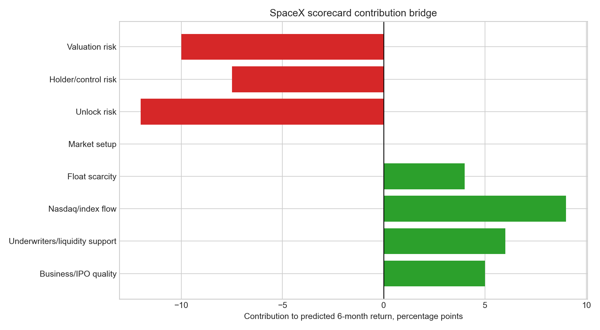
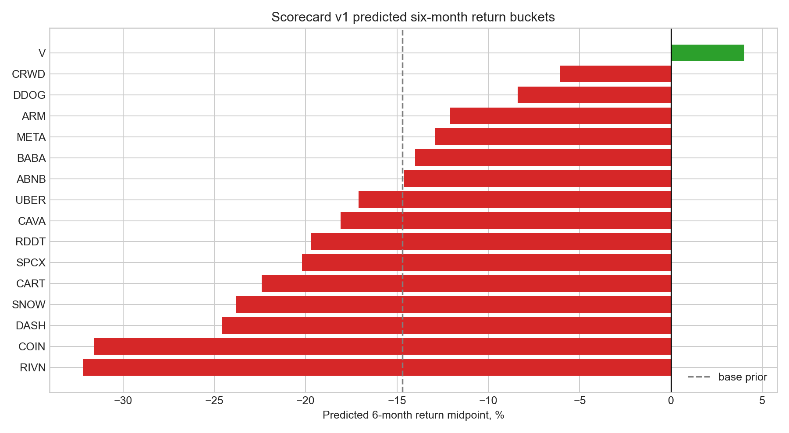

# 25 - IPO six-month price-action predictor

**Question.** Can the IPO research stack be turned into a reusable first-six-month price-action framework using offering mechanics, underwriters, holder control, market setup, index flow and business quality?

**Finding.** **Yes, as a transparent scorecard, not a magic price oracle.** The strongest prior is still study 15: aftermarket IPO chasing is a weak base-rate trade. This model starts with the large-IPO six-month fade prior and then adjusts for company-specific mechanics known by IPO date or first close. For SpaceX, the scorecard gives a **negative six-month bucket**, a **-20.2%** midpoint from first listed close, **22.4%** probability of beating SPY and **18.4%** probability of beating QQQ. The positive forces are underwriters, scarcity and Nasdaq-100 fast-entry flow. The negative forces are valuation, lock-up supply and Musk/Class B voting control.

> Research model only; not investment advice. The target is the first six months from first listed close. The model deliberately excludes post-IPO 13F holder data from IPO-day prediction because it is lagged and would create lookahead leakage.

## Method

The framework combines four prior notes:

| Study | Role in model |
|---|---|
| [02 - IPO-anchored VWAP](../02-ipo-anchored-vwap/) | Aftermarket entry framing: first close is not the same as offer allocation. |
| [15 - Should you chase IPOs?](../15-ipo-chase/) | Base rate: broad day-1-close IPO chasing underperformed SPY. |
| [22 - Equity issuance as a market-top signal](../22-equity-issuance-top-signal/) | Aggregate issuance is weak as a market-timing signal, but new issues underperform cross-sectionally. |
| [24 - SpaceX IPO quality model](../24-spacex-ipo-quality-model/) | SpaceX mechanics, lock-ups, index rules, underwriters and institutional comp set. |

The model is intentionally simple:

```text
six-month prediction = IPO base prior
                     + business / IPO quality
                     + underwriter and stabilization quality
                     + index-flow and scarcity support
                     - lock-up supply risk
                     - holder/control risk
                     - valuation risk
```

Market makers are handled conservatively. Pre-listing, the public source is usually the bookrunner and stabilization disclosure, not true symbol-level market-maker identity. So the model uses **underwriters/stabilization agent as the liquidity-support proxy** and treats actual market-maker data as post-listing monitoring only.

## SpaceX Worked Example

| Factor | Contribution | Read |
|---|---:|---|
| Base prior | -14.7 pts | Large IPOs have a negative six-month base rate from first close. |
| Business / IPO quality | +5.0 pts | Strong business and offering quality, but governance lowers the score. |
| Underwriters / liquidity support | +6.0 pts | Goldman Sachs and Morgan Stanley-led global book; Morgan Stanley stabilization proxy. |
| Nasdaq / index flow | +9.0 pts | Nasdaq-100 fast-entry path can create forced demand. |
| Float scarcity | +4.0 pts | Immediate float is only about 4.25% of basic shares. |
| Market setup | 0.0 pts | 2026 mega-IPO setup is treated as neutral/frothy. |
| Unlock risk | -12.0 pts | Potential tradable supply reaches about 9.4x IPO float by day 180. |
| Holder / control risk | -7.5 pts | Musk voting control about 84.4%; Class B voting power 88.5%. |
| Valuation risk | -10.0 pts | About $1.77tn implied basic market cap and high sales multiple. |
| **Model output** | **-20.2%** | Negative bucket; trade-only / wait-for-unlock bias. |



## What The Model Predicts

The model does not try to forecast exact closing prices. It produces a six-month bucket, midpoint, and probability of beating SPY/QQQ.

| Ticker | Prediction bucket | Midpoint | Beat SPY | Beat QQQ | Actual 6m return if known |
|---|---|---:|---:|---:|---:|
| SPCX | Negative | -20.2% | 22.4% | 18.4% | n/a |
| V | Range-bound | +4.0% | 41.6% | 37.6% | +13.6% |
| META | Negative | -12.9% | 31.6% | 27.6% | -40.0% |
| UBER | Negative | -17.1% | 23.1% | 19.1% | -34.1% |
| ABNB | Negative | -14.6% | 26.0% | 22.0% | +3.1% |
| ARM | Negative | -12.1% | 29.6% | 25.6% | +99.7% |
| SNOW | Negative | -23.8% | 17.8% | 13.8% | -14.7% |
| RIVN | Severe fade | -32.2% | 14.1% | 10.1% | -75.9% |
| CRWD | Range-bound | -6.1% | 29.8% | 25.8% | -18.0% |
| DDOG | Range-bound | -8.4% | 27.6% | 23.6% | -11.1% |



The model is directionally useful, not perfectly calibrated. ARM is the obvious exception: it screened as negative because of controlled-company/float/valuation risk, then produced a very strong six-month move. That is exactly why the output is a bucket and probability, not a certainty.

## Interfaces

The workbook and CSVs are designed so future IPOs can be added row-by-row.

| Output | Purpose |
|---|---|
| [ipo_master](data/ipo_master.csv) | IPO universe, role, inclusion and data quality. |
| [ipo_price_targets](data/ipo_price_targets.csv) | Actual 6m targets when available. |
| [ipo_features_offering](data/ipo_features_offering.csv) | Proceeds, market cap, float, lock-up and offering flags. |
| [ipo_features_underwriters](data/ipo_features_underwriters.csv) | Lead underwriters, syndicate depth and liquidity-support proxy. |
| [ipo_features_holders](data/ipo_features_holders.csv) | Founder/control/top-holder overhang features. |
| [ipo_features_market_setup](data/ipo_features_market_setup.csv) | Issuance regime and market context. |
| [ipo_features_index_flow](data/ipo_features_index_flow.csv) | Nasdaq/S&P/passive-flow flags. |
| [ipo_features_business_quality](data/ipo_features_business_quality.csv) | Business, governance and quality rubric. |
| [model_predictions](data/model_predictions.csv) | Six-month buckets, midpoint and beat-SPY/QQQ probabilities. |
| [spacex_prediction](data/spacex_prediction.csv) | SpaceX contribution bridge. |
| [feature_dictionary](data/feature_dictionary.csv) | Feature definitions, source table and no-lookahead status. |

Workbook: [ipo_six_month_price_action_model.xlsx](ipo_six_month_price_action_model.xlsx)

## Caveats

- The current dataset is a curated institutional IPO set plus SpaceX, not a full EDGAR-scale scrape.
- Six-month targets are from first listed close, not the offer price.
- Underwriter/stabilization disclosures are used as a pre-listing liquidity proxy; true market-maker data is not assumed.
- Top institutional holders from 13F are lagged post-IPO data and belong in monitoring, not IPO-day prediction.
- SpaceX facts use the June 3, 2026 S-1/A and subsequent FWPs until a final 424B4 appears.

Rebuild:

```bash
python3 25-ipo-six-month-price-action/build_model.py
```
