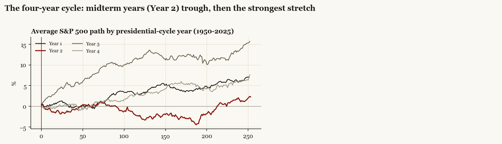

# 26 — Around U.S. elections, where does the money actually go?

**The question.** Every election cycle the same stories circulate: investors are "sitting in cash until the vote", money will "flee America" if the wrong side wins, emerging markets get the refugee capital, and a new president means a new volatility regime. None of that is unanswerable folklore — fund flows are measurable. So I measured them: every U.S. presidential election and midterm 1992–2024, every U.S.-relevant military action 2001–2025, and every major tariff shock, through one event-study lens — cumulative returns, cumulative fund flows as a percent of assets, and volatility, before and after each event. With the November 2026 midterm five months out, I also wanted the conditional base rates in one table.

**Why it matters.** If the de-risk/re-risk cycle is real, the pre-election dip in risk appetite is a recurring entry, not a warning. If "money leaves America after a Trump win" is false in the flows, you stop trading the narrative and start trading what actually moves (it turns out to be China funds, twice). And if post-midterm strength is as regular as claimed, the 2026 setup deserves a base-rate table rather than a mood.

> Research / backtested, not investment advice. Nine presidential and eight midterm elections is a tiny sample: everything here is medians and sign counts ("8 of 8"), no t-statistics, and several windows carry named confounds (2008 = financial crisis, 2020 = vaccine week, post-Soleimani = COVID). The flow panel covers U.S.-listed ETFs — predominantly U.S.-domiciled money — from roughly 2000–2004 onward; pre-2000 claims rest on index prices and volatility only. Patterns, not predictions.

## What I found, up front

- **Investors hedge the event, not the outcome.** The median VIX path around a presidential vote rises from ~18 two months out to ~20 twenty days out, then collapses to 17 the day after the result and ~15 within a week — whoever wins. The three largest day-after VIX drops in the sample are 2016, 2020 and 2024 (−4.4, −6.0, −4.2 points in my data).
- **Money does not leave the market after elections — it comes back in.** Cash-proxy funds absorb a median +13.5% of assets in the quarter before the vote; then U.S. equity funds take in a median **+6.5% of assets in the 13 weeks after the vote — positive after all six elections with flow data (2004–2024)** — and +16.4% by 26 weeks. The S&P 500's median post-election path: +4.2% at 20 trading days, +4.2% at 120.
- **After Trump wins, the money that leaves is not America's — it is China's.** 13 weeks after November 2016: U.S. funds +5.9% of assets, EM +5.8%, Europe +7.6%, **China −14.3%**. 13 weeks after November 2024: U.S. +5.2%, **China −20.0% (−36.3% by 26 weeks)**, Taiwan −5.4%, gold +3.1%. In returns, Taiwan/Korea/Japan lagged the U.S. by 12.0/16.0/5.4 points over the first 60 trading days of Trump II. "Sell America" did not show up in the flow data at the election in either episode.
- **The rotation comes later, and it has repeated.** By 120 trading days after both Trump wins, Europe-relative returns had flipped positive (median +8.2 points vs the U.S., both episodes). In 2025 it became flows: Europe funds took in roughly +20% of assets across February–April 2025 (German fiscal pivot) while U.S. funds bled −5% through the tariff quarter. First leg America, second leg everyone else — twice now.
- **Midterms are the cleaner signal than presidential years.** S&P 500 median +7.5% over the 120 trading days after a midterm, **positive after all eight midterms 1994–2022**. The average midterm year since 1950 troughs ~−4.5% around September, and the year after a midterm averages +15.7% — the strongest year of the four-year cycle. Flows agree: Europe funds lose ~3.3% of assets in the quarter before a midterm (5 of 7 negative) and gain +5.6% in the quarter after / +23.7% by 26 weeks (6 of 7).
- **Wars fit the old war-puzzle template: priced in the buildup, bought at the outbreak.** 11 of 17 U.S.-relevant military events since 2001 match the pattern. Telegraphed conflicts sag into the event and gain a median +3.3% in the month after outbreak (9 of 11 positive); Iraq 2003 gained +14.3% in the 60 trading days after the invasion. Surprise events (Soleimani, October 7) bite on impact and fade. War-spiked oil typically round-trips within a month unless supply is actually hit; the June 2025 Iran strikes were fully faded in WTI within 20 days (−1.9%).
- **Presidents are volatility regimes, but the volatility is episodic, not ambient.** Annualized S&P 500 vol: Clinton 16%, Bush 43 22%, Obama 17%, **Trump I 21%**, Biden 16%, Trump II 17% to date. Trump-era volatility clusters on policy announcement days: the May 2019 escalation tweet cost −4.2% in five sessions, Liberation Day 2025 −3.8% in five sessions (−12% peak-to-trough) followed by the largest one-day gain since 2008 on the pause. The tradable unit under this kind of administration is the policy headline, not the term.

**The short version: the election folklore is half right.** The hedging cycle and the post-result re-risking are real and repeated. The "capital flight from America" story is not in the flows — what is in the flows is a targeted, repeated exit from China funds after Trump wins, a later rotation toward Europe in both episodes, and a midterm pattern stronger than anything in presidential years.

## What I expected, and how I'd know if I was wrong

The catalyst view says elections are risk events: de-risking before, repricing after, with the direction set by the winner. The null says an election window looks like any other quarter — flows and returns indistinguishable from baseline. I'd be wrong about the cycle if pre-vote VIX showed no kink and post-vote flows scattered around zero; I'd be wrong about the Trump rotation if China/EM flows after 2016 and 2024 looked like the all-election median; and the midterm claim dies the first time the post-midterm 120-day window goes negative (it has not since at least 1994, but 2018 came within a Fed pivot of doing it).

## How I checked it

**Flows, from the primary source.** For 21 iShares funds (S&P 500, Russell 2000, EM, China, Taiwan, Korea, Japan, Asia ex-Japan, India, Eurozone, Europe, Germany, UK, Treasuries long/intermediate, aggregate bond, gold, T-bill cash proxy, high yield) I pulled the official daily NAV and shares-outstanding history from the fund "Data Download" endpoint — inception to date, so back to 1996–2004 depending on the fund. Daily net flow = change in shares outstanding x NAV; weekly flow as a percent of prior-week AUM; cumulative flow paths around each event. This is primary creation/redemption data from the issuer, not a vendor estimate.

**Returns and volatility.** Index prices from Yahoo (S&P 500 from 1927, so every election in scope), VIX history from CBOE (1990–), WTI futures, daily Economic Policy Uncertainty, and the Caldara–Iacoviello Geopolitical Risk index (daily 1985–, monthly 1900–).

**Events.** 9 presidential elections (with day-before winner odds from prediction markets/forecasts, so 2016 is classified as the one true surprise), 8 midterms (chamber flips coded), 17 military events (each coded telegraphed vs surprise, with a buildup start date where one exists), 9 tariff shocks. Election windows are aligned both on the vote date and on the result-known date (2000 resolved December 13; 2020 called November 7).

**The measure.** Cumulative log returns normalized to zero at the event day, ±120 trading days; cumulative flows ±26 weeks; medians across events plus sign hit-rates. Seven spot-checks against externally documented episodes (the 2016 EM outflow week, the 2025 Europe/US rotation, the Iraq buildup/outbreak asymmetry, the day-after VIX drops) all pass before any analysis was run.

## What the data said

### The cycle: hedge the event, re-risk after

Pre-vote: modest equity run-up (+0.6% median in the final month), cash building, VIX climbing. Post-result: VIX crushed within days, equity inflows in every observed case, and the S&P 500 up a median +4.2% in the first month. The de-risking shows up most cleanly in the cash bucket and in volatility, not in big equity outflows — investors hedge more than they sell.

### Trump wins: the China exit, then the reversal

The 2016 and 2024 windows are near-replays in relative space: EM/China/Europe all lag the U.S. sharply for the first month (China-relative −9.4% median at +20 days), U.S. funds take inflows — and then the trade unwinds over the following months, with Europe-relative returns positive by day 120 in both episodes. China funds are the persistent loser in flows both times; in 2024 the exit ran to a third of fund assets within six months. Taiwan, for the record: −6.9 (2016) and −12.0 (2024) points behind the U.S. at 60 trading days.

### Midterms: the better base rate

The midterm year is the trough year of the four-year pattern (average −4.5% at the September low since 1950), and the stretch from the midterm into the pre-election year is the strongest in the cycle. Event-aligned: +7.5% median at +120 trading days, 8 of 8 positive. The flow shape is a de-risk of the periphery first (Europe funds bleed in the pre-midterm quarter) and a broad re-risk after (Europe +23.7% of assets by +26 weeks, bonds +15.6%, China +9.8%).

### Wars: the war-puzzle table

Full per-event table in `derived/war_puzzle_table.csv` and the dossier set. Telegraphed conflicts: market down in the buildup, up after the outbreak (Iraq 2003 is the type specimen: −10% into March, +14.3% in the 60 days after). Surprise events produce the initial hit but no persistent drawdown on their own — the two big post-event drawdowns in the table (post-Soleimani, post-Ukraine-rally) belong to COVID and the 2022 tightening cycle, not the conflicts. The GPR index spikes hardest for Ukraine 2022 (+239 points event-week vs prior month), Iraq 2003 (+187), Soleimani (+159), and the June 2025 Iran strikes (+147), and oil gave back the entire June 2025 war premium within a month.

### Administrations as regimes

Per-administration annualized vol and tail days are in `derived/admin_regimes.csv` (and the regimes dossier page). The ranking — Bush 43 (22%) above Trump I (21%) above Obama (17%) above Biden/Clinton (16%) — says regime volatility follows what happened during the term more than who sat in the chair. What distinguishes the Trump terms is the *mechanism*: volatility arrives on schedule with policy announcements (tariff days above), which makes it episodic and partially hedgeable, where 2008-style volatility was ambient.

### What history says for November 3, 2026

| Pattern | Historical median | Hit rate | Sample |
|---|---|---|---|
| Midterm-year chop, trough near September | −4.5% YTD at the low; year ends +2.3% | pattern, not a level | 19 cycles since 1950 |
| S&P 500, 120 trading days after the midterm | +7.5% | 8 of 8 | 1994–2022 |
| S&P 500, 20 days after | +1.6% | 6 of 8 | 1994–2022 |
| U.S. equity fund flows, 26 weeks after | +3.2% of assets | 5 of 6 | 2002–2022 |
| Europe fund flows, 13 weeks before | −3.3% of assets | 5 of 7 negative | 1998–2022 |
| Europe fund flows, 26 weeks after | +23.7% of assets | 6 of 7 | 1998–2022 |
| VIX, vote day to vote+5 | ~19 to ~15 (presidential median) | fell day-after in 7 of last 10 | 1990–2024 |

The honest footnote: 2018 is the analog that bit — the one post-midterm window that nearly failed did so on Federal Reserve tightening (December 2018, −16%), not on the election. Every row above is conditional on the macro regime staying out of the way.

## Where it breaks

- n = 9 presidential, 8 midterm, 2 Trump elections. Two repetitions of the China-exit/Europe-reversal pattern is a pattern, not a law.
- The flow panel is U.S.-listed ETFs: it measures predominantly U.S.-domiciled investors' allocation. European investors buying Europe-domiciled funds (most of the 2025 "Sell America" headlines) are out of frame; what this panel shows is that *American* money rotated relatively, not that it fled.
- Flow percentages are of each bucket's AUM; China-fund AUM is small next to U.S.-fund AUM, so equal percentages are not equal dollars.
- Confounded windows are flagged where they occur (2008 GFC, 2020 vaccine Monday, post-Soleimani COVID, 2022 tightening). I left them in rather than cherry-picking them out; the medians are robust to dropping them, the per-event dossiers show each case.
- Returns are price returns; flow measures are creation/redemption only (no mutual funds, no separately managed accounts, no foreign-official flows — see TIC data for those).

## What's here

- [`brief/`](brief/) — the one-page synthesis note.
- [`dossiers/`](dossiers/) — 52 per-event pages: every election, midterm, war and tariff shock, each with returns/rotation/flows/VIX panels and a stats table.
- `src/` — the full pipeline (fetchers for the iShares endpoint, Yahoo, CBOE, EPU, GPR; the event-study engine; figure/dossier/brief builders). `python src/fetch_ishares.py && python src/fetch_prices.py && python src/fetch_macro.py` rebuilds `data/`, then `run_analysis.py`, `build_dossiers.py`, `build_wars_module.py`, `build_brief.py`. Dependencies: pandas, pyarrow, requests, yfinance, matplotlib, jinja2, xlrd.
- `derived/` — all computed datasets (event paths, cohort stats, the war-puzzle table, per-administration regimes, cycle seasonality), so every number above is reproducible without re-downloading anything.
- [`lit_map.md`](lit_map.md) — the annotated academic literature this sits on (the presidential puzzle, political-uncertainty pricing, the midterm effect, the war puzzle, partisan rebalancing), and where this study's gap is: free, country-level ETF-flow event studies around U.S. elections did not exist in the public literature.

Raw data is not redistributed: `data/` rebuilds locally from the cited public endpoints (iShares/BlackRock product data, Yahoo Finance, CBOE, policyuncertainty.com, matteoiacoviello.com). All series remain the property of their sources.
