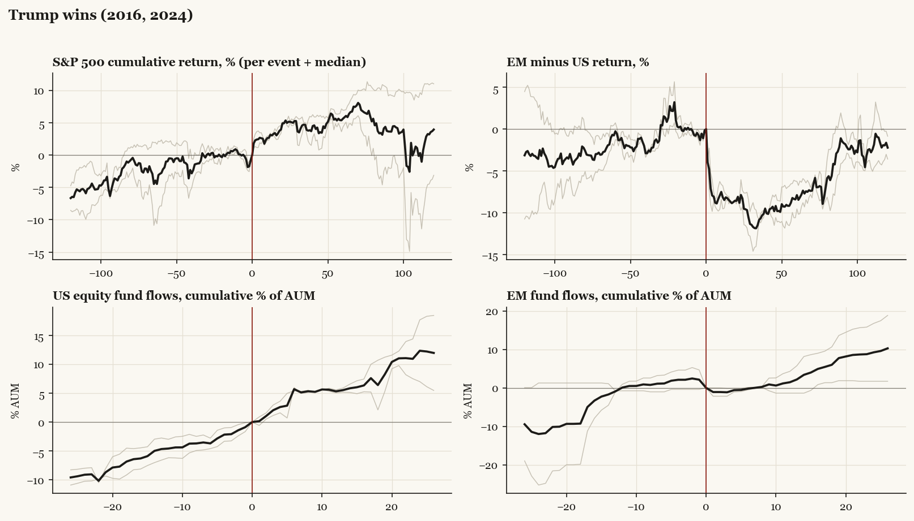

# Money around U.S. elections

*Where it goes before the vote, after the result, under each kind of winner, and when the shooting starts. Every U.S. presidential election and midterm 1992-2024, every U.S.-relevant military action 2001-2025, measured in fund flows, returns, and volatility.*

June 2026 - the dossier set with per-event detail accompanies this note.

## The election cycle in one motion

Investors hedge the event, not the outcome. Implied volatility builds for roughly two months into a presidential vote (median VIX 20 twenty days out against 18 sixty days out) and collapses within days of a result, whoever wins: 17 the day after, 15 a week after. Cash-proxy funds absorb a median +13.5% of assets in the quarter before the vote. Then the re-risking: U.S. equity funds take in a median **+6.5% of assets in the thirteen weeks after the vote** - positive after every election in the sample - and +16.4% by twenty-six weeks. The S&P 500's median path: +0.5% in the month before, **+4.2% in the month after, +4.2% over six months**.

## Does the money leave America? Mostly no - it leaves China

The popular narrative says capital flees the U.S. when the result displeases it. The flow data say otherwise: after a typical election, U.S. and foreign-region funds get inflows together - allocation is not a zero-sum exit. What moves is the relative line, and the clean repeated case is a Trump win. In the thirteen weeks after November 2016, U.S. equity funds gained +5.9% of assets while China funds lost **-14.3%**; after November 2024, U.S. funds gained +5.2% while China funds lost **-20.0%**, reaching -36.3% by half a year. Taiwan funds saw -5.4% over the same 2024 window, and Taiwan underperformed U.S. equities by -12.0% in the first sixty trading days, Korea by -16.0%. Money did not leave America after Trump won; it left the tariff targets.

The reversal comes later and is just as regular. By six months after both Trump wins, Europe-relative returns had flipped positive (+2.9% and +13.6% versus U.S. at 120 trading days, both episodes) and in 2025 the rotation became flows: Europe funds took in roughly twenty percent of assets across February-April 2025 while U.S. funds bled through the tariff quarter. The first quarter after a Trump win belongs to America; the second leg has twice belonged to everyone else.

## Midterms are the better signal

The strongest, most repeatable pattern in the dataset is not the presidential race. After midterm elections the S&P 500's median move is +7.5% over the next 120 trading days - **positive after all eight midterms since 1994**. The average midterm year since 1950 troughs around September (-4.5% year-to-date at the low) before the strongest stretch of the four-year cycle begins: the average pre-election-year gain is +15.7%. Flows confirm the de-risk/re-risk shape: Europe funds lose -3.3% of assets in the quarter before a midterm and gain +5.6% in the quarter after (+23.7% by twenty-six weeks); bond funds take in +15.6% in the half-year after.

## Wars: priced in the buildup, bought at the outbreak

Across seventeen U.S.-relevant military events since 2001, the old pattern holds: when conflict is telegraphed, equities sag during the buildup and rally once the uncertainty resolves - Iraq 2003 fell through the six-month buildup and gained +14.3% in the sixty trading days after the invasion; the median telegraphed event gained +3.3% in the month after outbreak. Surprise events bite on impact but rarely persist. Oil tells the same story from the other side: the war premium typically decays within a month unless supply is actually hit. Eleven of seventeen episodes match the buildup-down, outbreak-up template; the exceptions are dominated by confounding macro (the post-Soleimani window runs into COVID; Ukraine's relief rally drowned in the 2022 tightening cycle).

## Presidents as volatility regimes

Annualized S&P 500 volatility by administration: Clinton 16%, Bush 43 22%, Obama 17%, Trump I **21%**, Biden 17%, Trump II 17% to date. Trump I ran five points hotter than Biden, but the volatility is episodic, not ambient: it clusters on policy announcement days rather than around the election itself. The 2019 escalation tweet cost -4.2% in five sessions; Liberation Day 2025 cost -3.8% in five sessions and was followed by the largest one-day gain since 2008 when the pause was announced. Under this kind of administration the tradable unit is the policy headline, and the historical base rate is that tariff-shock drawdowns retraced once de-escalation began (+3.3% in the month after the May 2025 Geneva step-down).

## What history says for November 3, 2026

| Pattern | Historical median | Hit rate | Sample |
|---|---|---|---|
| Midterm-year chop, trough near September | -4.5% YTD at the low; year ends +2.3% | pattern, not a level | 19 cycles |
| S&P 500, 120 trading days after the midterm | +7.5% | 8 of 8 | 1994-2022 |
| S&P 500, 20 days after | +1.6% | 6 of 8 | 1994-2022 |
| U.S. equity fund flows, 26 weeks after | +3.2% of assets | 5 of 6 | 2002-2022 |
| Europe fund flows, 13 weeks before | -3.3% | 5 of 7 negative | 1998-2022 |
| Europe fund flows, 26 weeks after | +23.7% | 6 of 7 | 1998-2022 |
| VIX from vote to vote+5 | 19 to 15 (presidential median) | fell day-after in 7 of last 10 | 1990-2024 |

The 2018 analog deserves respect: the one recent midterm whose aftermath broke down (December 2018, minus sixteen percent) did so on Federal Reserve tightening, not the election. The pattern is conditional on the macro regime staying out of the way.

---

*Limits. Nine presidential and eight midterm observations; medians and sign counts, not statistics. Fund-flow panel covers U.S.-listed ETFs (predominantly U.S.-domiciled money) from 2000-2004 onward; pre-2000 statements rest on index prices and volatility only. The 2020 post-election window contains the vaccine announcement; the 2008 window contains the financial crisis; the post-Soleimani window contains COVID. These are patterns, not predictions.*