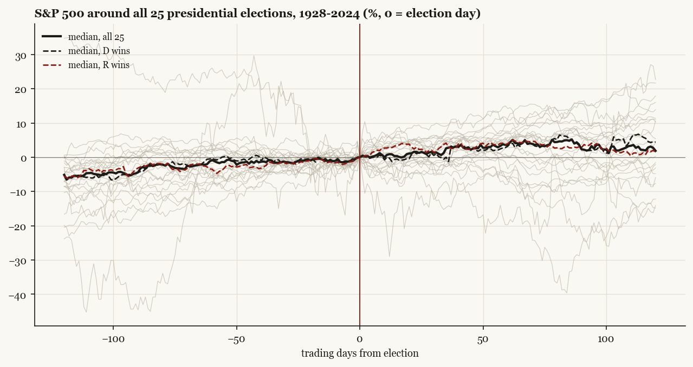
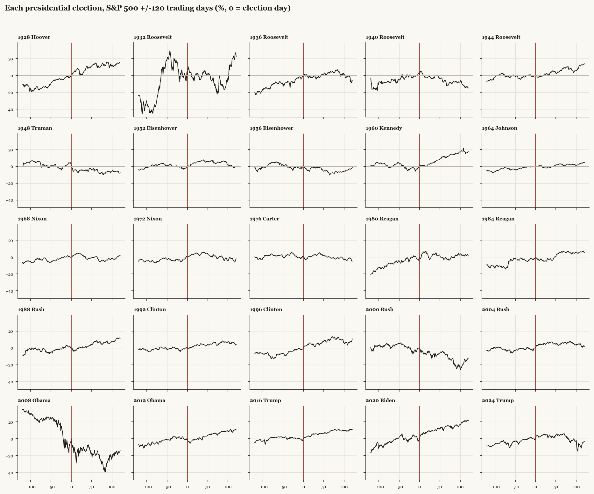
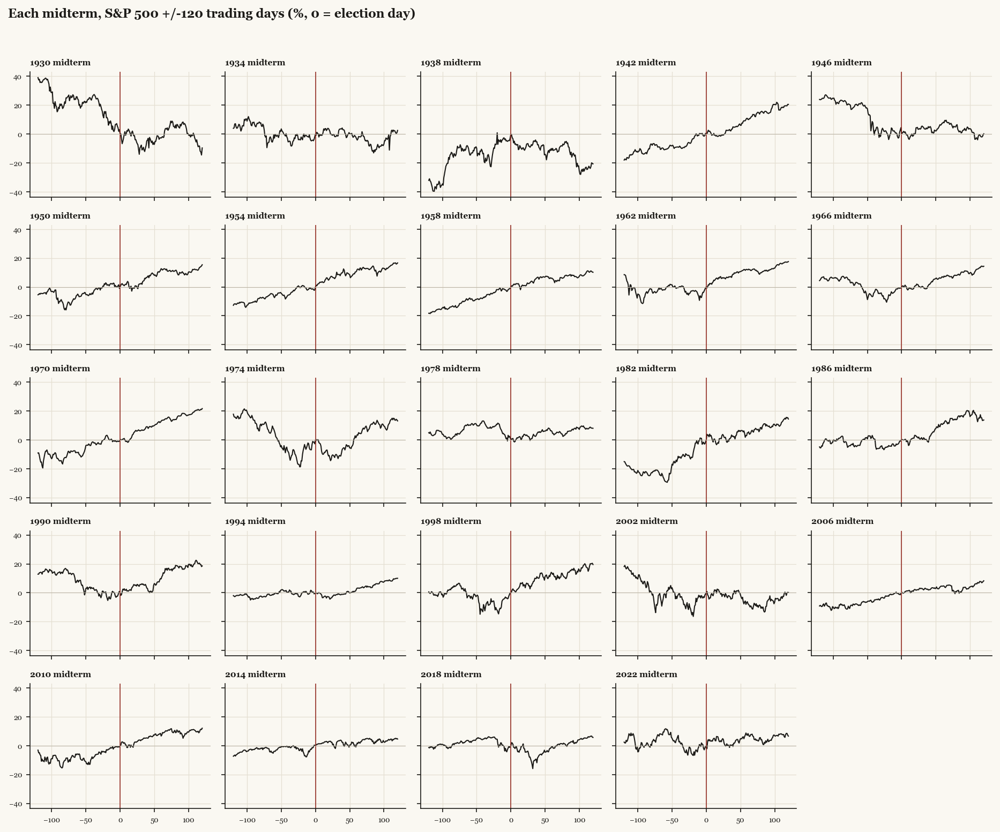

# Every election since 1928: the deep sample

*S&P 500 price index around 25 presidential elections and 24 midterms; realized volatility (21-day, annualized) as the century-long volatility measure. All paths normalized to 0 at election day.*

## Per-election detail (presidential)

| event | party | flip | pre60 | post20 | post60 | post120 | window_maxdd | rv_pre | rv_change_20d |
|---|---|---|---|---|---|---|---|---|---|
| 1928 Hoover | R | False | 14.44 | 2.97 | 14.23 | 16.04 | -8.85 | 12.28 | 7.18 |
| 1932 Roosevelt | D | True | -1.15 | -0.43 | -6.57 | 22.66 | -40.6 | 68.32 | -19.82 |
| 1936 Roosevelt | D | False | 8.06 | -2.44 | 3.22 | -5.91 | -14.35 | 15.48 | 1.71 |
| 1940 Roosevelt | D | False | 3.87 | -2.44 | -7.9 | -14.86 | -18.35 | 12.06 | 14.47 |
| 1944 Roosevelt | D | False | 0.85 | 0.39 | 5.71 | 13.9 | -6.93 | 8.74 | -0.94 |
| 1948 Truman | D | False | -1.19 | -5.15 | -4.69 | -7.63 | -15.71 | 9.27 | 18.49 |
| 1952 Eisenhower | R | True | -3.5 | 3.78 | 7.31 | 0.24 | -9.26 | 11.24 | -4.39 |
| 1956 Eisenhower | R | False | -3.07 | -0.64 | -7.08 | -1.54 | -14.61 | 13.3 | 1.19 |
| 1960 Kennedy | D | True | -2.25 | 1.44 | 10.96 | 17.87 | -10.11 | 12.64 | -2.7 |
| 1964 Johnson | D | False | 4.03 | -1.13 | 2.83 | 4.43 | -3.55 | 4.82 | 1.63 |
| 1968 Nixon | R | True | 4.01 | 3.91 | 0.37 | 1.71 | -9.59 | 6.04 | -0.95 |
| 1972 Nixon | R | False | 0.71 | 4.53 | 0.27 | -2.1 | -11.04 | 10.05 | -3.91 |
| 1976 Carter | D | True | -1.53 | 0.2 | 0.01 | -4.83 | -9.94 | 12.12 | -0.13 |
| 1980 Reagan | R | True | 5.12 | 3.85 | -3.42 | 1.3 | -9.92 | 15.93 | 2.42 |
| 1984 Reagan | R | False | 2.97 | -5.0 | 4.71 | 5.38 | -5.59 | 12.06 | -1.26 |
| 1988 Bush | R | False | 6.17 | 1.08 | 7.63 | 11.32 | -6.99 | 12.94 | 0.44 |
| 1992 Clinton | D | True | 0.12 | 2.35 | 4.39 | 4.22 | -5.32 | 9.96 | -2.81 |
| 1996 Clinton | D | False | 7.01 | 4.24 | 9.61 | 10.61 | -9.63 | 7.16 | 2.1 |
| 2000 Bush | R | True | -4.08 | -5.78 | -5.57 | -12.2 | -27.45 | 25.45 | -0.56 |
| 2004 Bush | R | False | 5.95 | 5.24 | 3.55 | 1.86 | -7.17 | 11.22 | -0.33 |
| 2008 Obama | D | True | -26.07 | -14.41 | -19.76 | -14.08 | -52.58 | 82.96 | -6.14 |
| 2012 Obama | D | False | 1.81 | -1.35 | 4.61 | 10.26 | -7.67 | 11.76 | 2.98 |
| 2016 Trump | R | True | -2.34 | 4.65 | 6.91 | 10.99 | -5.6 | 10.6 | -3.08 |
| 2020 Biden | D | True | 0.26 | 8.53 | 11.34 | 21.64 | -9.6 | 21.67 | -6.06 |
| 2024 Trump | R | True | 7.88 | 5.12 | 4.32 | -3.14 | -18.9 | 10.77 | 0.86 |

## Per-election detail (midterms)

| event | party | flip | pre60 | post20 | post60 | post120 | window_maxdd | rv_pre | rv_change_20d |
|---|---|---|---|---|---|---|---|---|---|
| 1930 midterm | R | True | -19.85 | -1.21 | -2.81 | -9.66 | -41.51 | 35.85 | -3.56 |
| 1934 midterm | D | False | 2.87 | 2.9 | -3.32 | 2.47 | -22.28 | 21.14 | -0.81 |
| 1938 midterm | D | False | 14.57 | -11.27 | -11.27 | -20.71 | -25.09 | 43.98 | -19.64 |
| 1942 midterm | D | False | 10.61 | -1.06 | 10.83 | 20.52 | -5.27 | 12.5 | -1.3 |
| 1946 midterm | D | True | -20.9 | 0.2 | 7.61 | 0.14 | -26.81 | 27.36 | -5.9 |
| 1950 midterm | D | False | 6.77 | -0.82 | 12.66 | 15.37 | -14.02 | 15.34 | 5.47 |
| 1954 midterm | R | True | 7.42 | 5.22 | 10.94 | 16.63 | -6.82 | 8.05 | 3.27 |
| 1958 midterm | R | False | 7.73 | 0.99 | 6.06 | 10.15 | -4.39 | 10.36 | 2.87 |
| 1962 midterm | D | False | 1.86 | 6.94 | 11.96 | 17.55 | -18.16 | 20.38 | -9.76 |
| 1966 midterm | D | False | -1.66 | 0.82 | 6.88 | 14.32 | -16.45 | 13.41 | -2.81 |
| 1970 midterm | R | False | 10.01 | 4.93 | 12.97 | 21.66 | -9.97 | 10.86 | -0.31 |
| 1974 midterm | R | False | -5.99 | -10.82 | 2.46 | 13.12 | -33.1 | 32.62 | -10.0 |
| 1978 midterm | D | False | -10.24 | 3.81 | 5.85 | 8.01 | -13.55 | 21.18 | -6.4 |
| 1982 midterm | R | False | 28.8 | 0.89 | 4.81 | 14.42 | -13.36 | 26.53 | -0.92 |
| 1986 midterm | R | True | 2.27 | 3.06 | 10.73 | 13.76 | -9.42 | 10.16 | 5.82 |
| 1990 midterm | R | False | -8.37 | 5.71 | 9.61 | 18.6 | -19.92 | 22.15 | -5.89 |
| 1994 midterm | D | True | 0.95 | -3.15 | 2.75 | 10.05 | -6.43 | 11.71 | -1.73 |
| 1998 midterm | D | False | 2.53 | 5.3 | 13.63 | 19.57 | -19.34 | 21.1 | -6.12 |
| 2002 midterm | R | True | 1.27 | 0.24 | -6.2 | 0.17 | -29.81 | 32.2 | -8.94 |
| 2006 midterm | R | True | 8.65 | 2.15 | 4.6 | 8.29 | -5.86 | 7.44 | 0.35 |
| 2010 midterm | D | True | 5.67 | 1.04 | 6.7 | 12.11 | -11.65 | 11.25 | 5.3 |
| 2014 midterm | D | True | 3.81 | 3.05 | 0.43 | 4.6 | -7.4 | 18.14 | -12.94 |
| 2018 midterm | R | True | -2.38 | -2.18 | -0.65 | 5.72 | -19.78 | 24.02 | -2.02 |
| 2022 midterm | D | True | -11.56 | 2.73 | 7.13 | 6.64 | -16.91 | 24.85 | 1.76 |

## Cohort medians and hit rates

| cohort | metric | median | hit_rate_pos | n |
|---|---|---|---|---|
| all_presidential | pre60 | 0.85 | 0.64 | 25 |
| all_presidential | post20 | 1.08 | 0.6 | 25 |
| all_presidential | post60 | 3.55 | 0.72 | 25 |
| all_presidential | post120 | 1.86 | 0.64 | 25 |
| all_presidential | rv_change_20d | -0.33 | 0.44 | 25 |
| pres_D_win | pre60 | 0.26 | 0.62 | 13 |
| pres_D_win | post20 | -0.43 | 0.46 | 13 |
| pres_D_win | post60 | 3.22 | 0.69 | 13 |
| pres_D_win | post120 | 4.43 | 0.62 | 13 |
| pres_D_win | rv_change_20d | -0.13 | 0.46 | 13 |
| pres_R_win | pre60 | 3.49 | 0.67 | 12 |
| pres_R_win | post20 | 3.82 | 0.75 | 12 |
| pres_R_win | post60 | 3.94 | 0.75 | 12 |
| pres_R_win | post120 | 1.5 | 0.67 | 12 |
| pres_R_win | rv_change_20d | -0.45 | 0.42 | 12 |
| pres_flip | pre60 | -1.34 | 0.42 | 12 |
| pres_flip | post20 | 3.06 | 0.75 | 12 |
| pres_flip | post60 | 2.35 | 0.67 | 12 |
| pres_flip | post120 | 1.5 | 0.67 | 12 |
| pres_flip | rv_change_20d | -2.76 | 0.17 | 12 |
| pres_hold | pre60 | 3.87 | 0.85 | 13 |
| pres_hold | post20 | -0.64 | 0.46 | 13 |
| pres_hold | post60 | 3.55 | 0.77 | 13 |
| pres_hold | post120 | 4.43 | 0.62 | 13 |
| pres_hold | rv_change_20d | 1.63 | 0.69 | 13 |
| all_midterm | pre60 | 2.4 | 0.67 | 24 |
| all_midterm | post20 | 1.02 | 0.71 | 24 |
| all_midterm | post60 | 6.38 | 0.79 | 24 |
| all_midterm | post120 | 11.13 | 0.92 | 24 |
| all_midterm | rv_change_20d | -1.88 | 0.29 | 24 |
| pres_1928-1948 | pre60 | 2.36 | 0.67 | 6 |
| pres_1928-1948 | post20 | -1.44 | 0.33 | 6 |
| pres_1928-1948 | post60 | -0.74 | 0.5 | 6 |
| pres_1928-1948 | post120 | 4.0 | 0.5 | 6 |
| pres_1928-1948 | rv_change_20d | 4.44 | 0.67 | 6 |
| pres_1952-1990 | pre60 | 1.84 | 0.6 | 10 |
| pres_1952-1990 | post20 | 1.26 | 0.7 | 10 |
| pres_1952-1990 | post60 | 1.6 | 0.8 | 10 |
| pres_1952-1990 | post120 | 1.5 | 0.7 | 10 |
| pres_1952-1990 | rv_change_20d | -0.54 | 0.4 | 10 |
| pres_1992-2024 | pre60 | 0.26 | 0.67 | 9 |
| pres_1992-2024 | post20 | 4.24 | 0.67 | 9 |
| pres_1992-2024 | post60 | 4.39 | 0.78 | 9 |
| pres_1992-2024 | post120 | 4.22 | 0.67 | 9 |
| pres_1992-2024 | rv_change_20d | -0.56 | 0.33 | 9 |

Columns: pre60/post20/post60/post120 = cumulative % move in the named window; window_maxdd = worst drawdown inside the +/-120-day window; rv_pre = realized vol level the day before; rv_change_20d = vol change 20 days after vs the day before (negative = uncertainty resolved).
