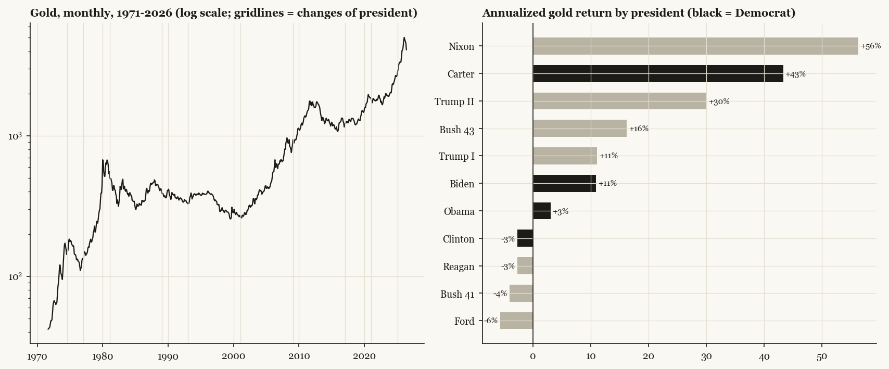
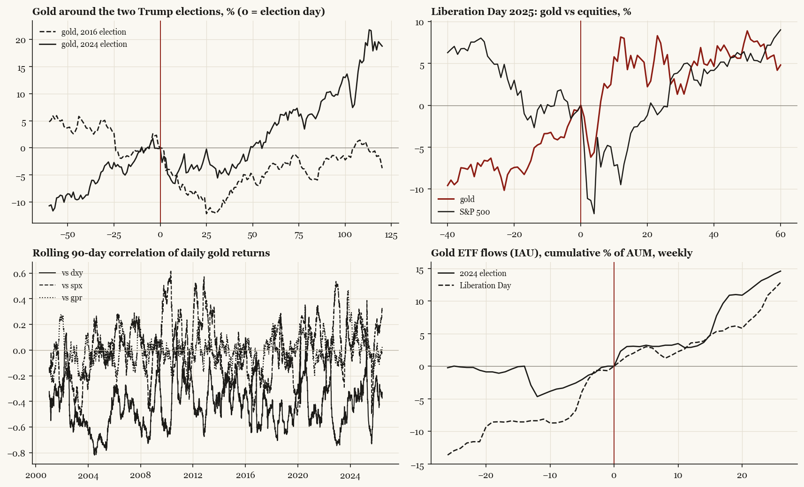

# Gold: elections, presidents, and the Trump question

## Conclusions

- The gold rise predates Trump II but accelerated after the vote: +16.0%/yr in the 2022-24 central-bank era, +29.0%/yr since the 2024 election. Under all of Trump I it was just +11.2%/yr - so this is an acceleration on a structural trend, not a pure Trump effect.
- What changed under Trump II is not the dollar link (correlation ~-0.4 in every era) but the gold-equity correlation turning positive (+0.11): gold is rising WITH stocks - an allocation bid, not a fear bid.
- Across the float era, gold regimes are era-driven, not party-driven: Carter +43%/yr, Reagan -3%/yr, Trump II +30%/yr to date.

*Monthly gold from the 1971 float; daily futures from 2000; gold-ETF (IAU) creation/redemption flows from 2005. The question: is the recent rise a Trump effect or a structural one?*

## Gold by president (float era)

| president | party | months | cum_gold_pct | ann_gold_pct | ann_vol_pct | sharpe | max_dd_pct | note |
|---|---|---|---|---|---|---|---|---|
| Nixon | R | 35 | 267.9 | 56.3 | 27.4 | 1.58 | -21.0 | from 1971-08 |
| Ford | R | 28 | -12.8 | -5.7 | 18.0 | -0.54 | -40.2 |  |
| Carter | D | 47 | 309.1 | 43.3 | 33.4 | 0.99 | -23.9 |  |
| Reagan | R | 95 | -19.2 | -2.7 | 17.2 | -0.55 | -40.2 |  |
| Bush 41 | R | 47 | -15.1 | -4.1 | 10.0 | -0.96 | -21.1 |  |
| Clinton | D | 95 | -19.4 | -2.7 | 10.7 | -0.64 | -36.7 |  |
| Bush 43 | R | 95 | 227.9 | 16.2 | 14.2 | 0.95 | -21.4 |  |
| Obama | D | 95 | 26.4 | 3.0 | 12.7 | 0.3 | -39.3 |  |
| Trump I | R | 47 | 51.3 | 11.1 | 9.6 | 1.0 | -10.2 |  |
| Biden | D | 47 | 49.9 | 10.9 | 10.7 | 0.74 | -14.5 |  |
| Trump II | R | 16 | 41.9 | 30.0 | 19.8 | 1.22 | -18.2 | term in progress |

## Gold around every election since 1972 (monthly)

| event | party | flip | pre_12m | post_3m | post_6m | post_12m |
|---|---|---|---|---|---|---|
| 1972 Nixon | R | False | 32.0 | 32.0 | 88.0 | 67.0 |
| 1976 Carter | D | True | -4.0 | 10.7 | 5.1 | 19.8 |
| 1980 Reagan | R | True | 15.5 | -7.3 | -14.3 | -23.8 |
| 1984 Reagan | R | False | -21.5 | -1.9 | -1.0 | 0.7 |
| 1988 Bush | R | False | -16.0 | -6.9 | -12.3 | -2.3 |
| 1992 Clinton | D | True | -8.0 | -1.4 | 11.1 | 14.5 |
| 1996 Clinton | D | False | -5.0 | -4.7 | -7.7 | -21.8 |
| 2000 Bush | R | True | -4.3 | -3.1 | -0.4 | 1.6 |
| 2004 Bush | R | False | 7.9 | -1.9 | -2.6 | 15.4 |
| 2008 Obama | D | True | 1.6 | 13.3 | 15.9 | 39.0 |
| 2012 Obama | D | False | 2.7 | -5.4 | -20.3 | -27.5 |
| 2016 Trump | R | True | 7.1 | 6.4 | 8.9 | 9.3 |
| 2020 Biden | D | True | 20.4 | -7.5 | -1.3 | -3.7 |
| 2024 Trump | R | True | 23.5 | 12.7 | 26.6 | 62.7 |

## Trump-era shock windows (daily, % moves)

| event | date | gold_5d | gold_20d | gold_60d | spx_5d | spx_20d | spx_60d |
|---|---|---|---|---|---|---|---|
| 2016 election | 2016-11-08 | -4.0 | -8.5 | -3.1 | 1.9 | 4.6 | 6.9 |
| 2024 election | 2024-11-05 | -5.3 | -3.2 | 3.4 | 3.4 | 5.1 | 4.3 |
| 2018 steel tariffs | 2018-03-01 | 1.3 | 1.5 | 0.0 | 2.3 | -1.4 | 1.6 |
| 2019 escalation tweets | 2019-05-05 | 1.4 | 3.2 | 10.7 | -4.2 | -4.5 | 1.6 |
| 2025 Feb tariff EOs | 2025-02-01 | 2.8 | 2.6 | 15.4 | 1.2 | -3.7 | -7.4 |
| 2025 Liberation Day | 2025-04-02 | -2.7 | 2.2 | 4.8 | -3.8 | -1.2 | 9.0 |
| 2025 pause | 2025-04-09 | 8.5 | 7.6 | 8.6 | -3.4 | 3.7 | 13.2 |
| 2025 Geneva step-down | 2025-05-12 | 0.3 | 3.1 | 4.8 | 2.0 | 3.3 | 8.1 |
| 2025 Israel-Iran war | 2025-06-13 | -1.6 | -2.4 | 6.0 | 0.8 | 4.4 | 8.9 |
| 2025 US strikes Iran | 2025-06-22 | -2.5 | 0.7 | 8.8 | 2.9 | 4.6 | 9.1 |

## Era correlations and returns

| era | gold_ann_ret_pct | corr_dxy | corr_spx | corr_gpr | days |
|---|---|---|---|---|---|
| 2000-2016 | 9.4 | -0.4 | -0.03 | -0.02 | 4102 |
| Trump I | 11.2 | -0.38 | 0.06 | 0.06 | 1005 |
| Biden | 10.1 | -0.42 | 0.09 | 0.04 | 1005 |
| Trump II | 33.3 | -0.39 | 0.11 | -0.02 | 347 |

## The baseline test

- 2017-2021 (Trump I): +11.2% annualized
- 2022-01 to 2024-10 (CB-buying era, pre-election): +16.0% annualized
- 2024-11 to present (post-election, Trump II): +29.0% annualized
