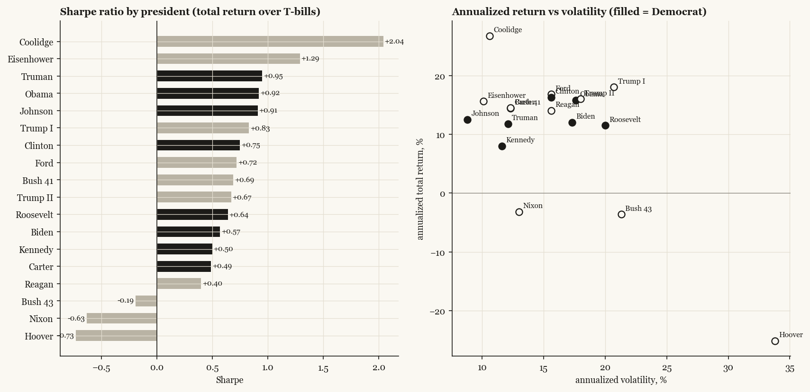
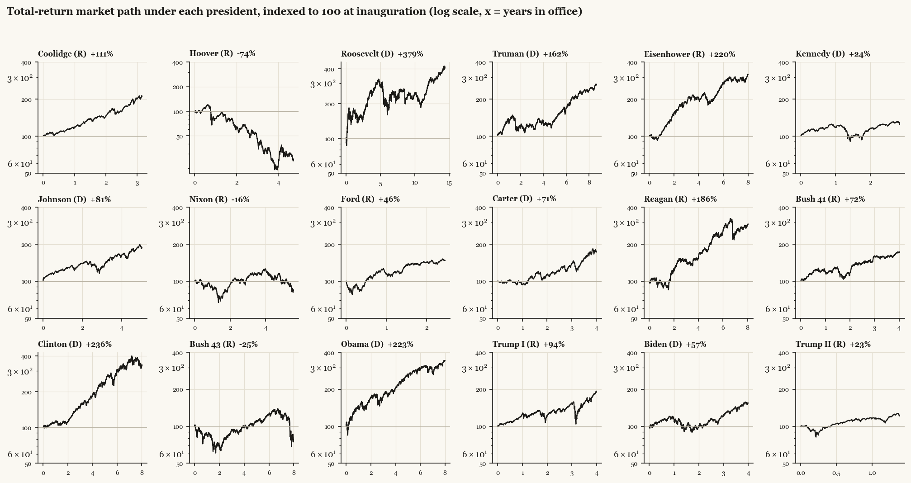

# The market under every president, 1926-2026

*Total-return market series (dividends included) in excess of T-bills; every president of the daily-data era, normalized to 100 at inauguration so terms of any length compare. Sharpe = annualized excess return / annualized volatility.*

## The full table, ranked by Sharpe

| president | party | term | years | cum_return_pct | ann_return_pct | ann_vol_pct | sharpe | max_drawdown_pct | worst_day_pct | days | note |
|---|---|---|---|---|---|---|---|---|---|---|---|
| Coolidge | R | 1923-08-02 - 1929-03-04 | 3.2 | 111.2 | 26.7 | 10.6 | 2.04 | -10.3 | -3.5 | 795 | data from 1926-07 |
| Eisenhower | R | 1953-01-20 - 1961-01-20 | 8.0 | 219.7 | 15.6 | 10.1 | 1.29 | -20.7 | -6.5 | 2017 |  |
| Truman | D | 1945-04-12 - 1953-01-20 | 8.7 | 162.4 | 11.8 | 12.1 | 0.95 | -28.3 | -6.9 | 2180 |  |
| Obama | D | 2009-01-20 - 2017-01-20 | 8.0 | 223.4 | 15.8 | 17.6 | 0.92 | -21.8 | -7.0 | 2016 |  |
| Johnson | D | 1963-11-22 - 1969-01-20 | 5.0 | 81.4 | 12.5 | 8.8 | 0.91 | -20.3 | -2.9 | 1272 |  |
| Trump I | R | 2017-01-20 - 2021-01-20 | 4.0 | 93.5 | 18.0 | 20.7 | 0.83 | -34.2 | -12.0 | 1007 |  |
| Clinton | D | 1993-01-20 - 2001-01-20 | 8.0 | 236.0 | 16.3 | 15.6 | 0.75 | -21.9 | -6.7 | 2021 |  |
| Ford | R | 1974-08-09 - 1977-01-20 | 2.5 | 46.5 | 16.8 | 15.6 | 0.72 | -22.0 | -3.5 | 620 |  |
| Bush 41 | R | 1989-01-20 - 1993-01-20 | 4.0 | 72.5 | 14.5 | 12.3 | 0.69 | -20.8 | -5.5 | 1012 |  |
| Trump II | R | 2025-01-20 - present | 1.4 | 22.9 | 16.0 | 18.0 | 0.67 | -19.6 | -5.9 | 349 | term in progress |
| Roosevelt | D | 1933-03-04 - 1945-04-12 | 14.4 | 379.4 | 11.5 | 20.0 | 0.64 | -51.0 | -9.2 | 3626 |  |
| Biden | D | 2021-01-20 - 2025-01-20 | 4.0 | 57.0 | 12.0 | 17.3 | 0.57 | -25.6 | -4.3 | 1005 |  |
| Kennedy | D | 1961-01-20 - 1963-11-22 | 2.8 | 24.3 | 8.0 | 11.6 | 0.5 | -27.7 | -7.0 | 716 |  |
| Carter | D | 1977-01-20 - 1981-01-20 | 4.0 | 71.4 | 14.4 | 12.3 | 0.49 | -18.7 | -3.4 | 1010 |  |
| Reagan | R | 1981-01-20 - 1989-01-20 | 8.0 | 186.5 | 14.0 | 15.6 | 0.4 | -33.1 | -17.4 | 2025 |  |
| Bush 43 | R | 2001-01-20 - 2009-01-20 | 8.0 | -25.3 | -3.6 | 21.3 | -0.19 | -50.8 | -9.0 | 2010 |  |
| Nixon | R | 1969-01-20 - 1974-08-09 | 5.6 | -16.4 | -3.2 | 13.0 | -0.63 | -35.6 | -3.2 | 1402 |  |
| Hoover | R | 1929-03-04 - 1933-03-04 | 4.7 | -74.5 | -25.1 | 33.8 | -0.73 | -84.1 | -11.5 | 1192 |  |

Notes: returns include dividends (price-only series understate the pre-1960 high-dividend era). Truman, Johnson and Ford start at succession, not election. Coolidge covers 1926-07 onward (data start); Trump II is in progress. Sharpe compares risk-adjusted results across eras, but eras differ structurally - the components matter as much as the ratio.
