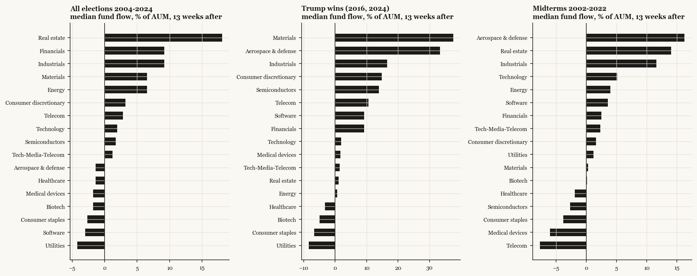
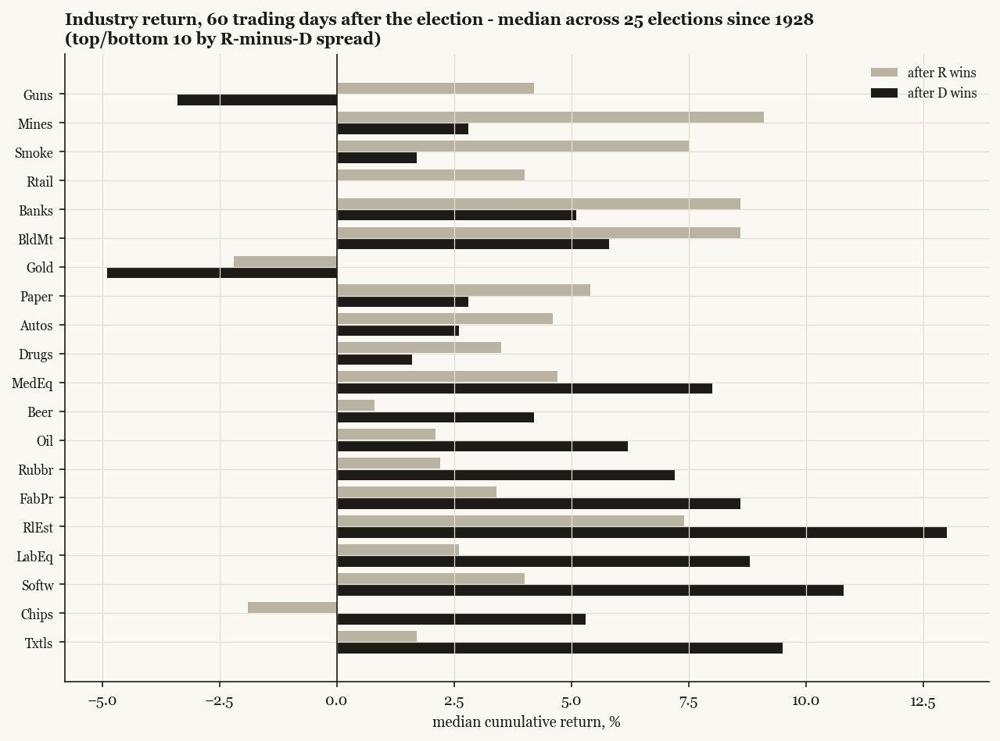
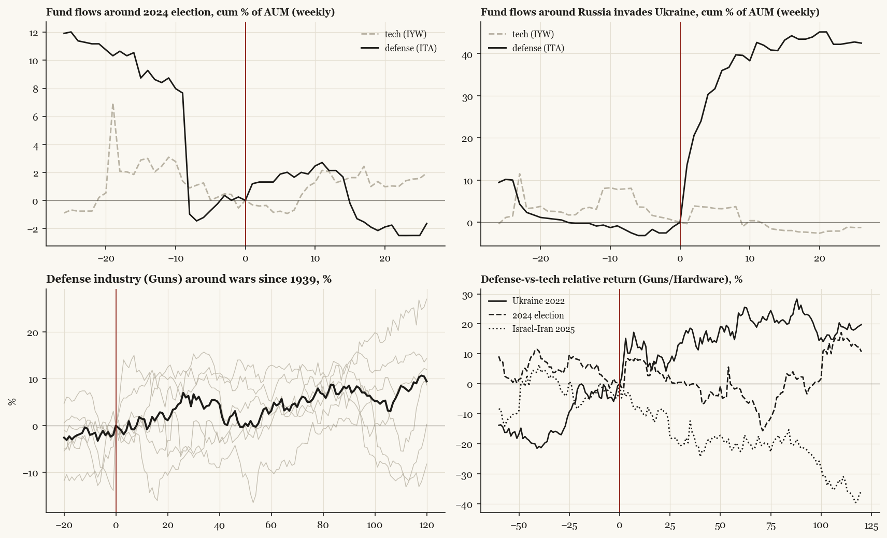

# Sector rotation: where the money goes inside America

*Two layers: creation/redemption flows for 17 iShares sector funds (2000-), and the French 49 value-weighted industries (1926-) for returns around all 25 elections and every major war since 1939.*

## Sector fund flows, 13 weeks after the vote (cohort medians)

| sector | D_wins | R_wins | all_presidential | midterms | trump_wins |
|---|---|---|---|---|---|
| Aerospace & defense | -9.5 | 33.3 | -1.4 | 16.3 | 33.3 |
| Biotech | 0.7 | -4.3 | -1.8 | 0.1 | -4.9 |
| Consumer discretionary | 0.7 | 21.8 | 3.2 | 1.6 | 14.8 |
| Consumer staples | -1.1 | -4.2 | -2.7 | -3.8 | -6.7 |
| Energy | 12.6 | 1.0 | 6.5 | 4.0 | 0.7 |
| Financials | 20.9 | 9.0 | 9.2 | 2.5 | 9.2 |
| Healthcare | -0.5 | -2.3 | -1.4 | -1.9 | -3.2 |
| Industrials | 17.5 | 0.8 | 9.2 | 11.6 | 16.6 |
| Materials | 4.8 | 8.2 | 6.5 | 0.3 | 37.6 |
| Medical devices | -4.9 | 1.7 | -1.8 | -6.0 | 1.7 |
| Real estate | 20.3 | 16.0 | 18.1 | 14.1 | 1.1 |
| Semiconductors | -6.4 | 8.0 | 1.7 | -2.7 | 13.9 |
| Software | -3.4 | 10.7 | -3.0 | 3.6 | 9.2 |
| Tech-Media-Telecom | -7.9 | 2.3 | 1.2 | 2.3 | 1.5 |
| Technology | -0.6 | 2.5 | 1.9 | 5.1 | 1.9 |
| Telecom | -0.8 | 3.5 | 2.8 | -7.7 | 10.6 |
| Utilities | 7.0 | -8.3 | -4.2 | 1.2 | -8.4 |

## Who wins under whom: industries 60 trading days after the election, 1928-2024

| industry | d_win_post60 | d_hit | d_n | r_win_post60 | r_hit | r_n | r_minus_d |
|---|---|---|---|---|---|---|---|
| Guns | -3.4 | 0.43 | 7 | 4.2 | 0.89 | 9 | 7.6 |
| Mines | 2.8 | 0.77 | 13 | 9.1 | 0.75 | 12 | 6.3 |
| Smoke | 1.7 | 0.69 | 13 | 7.5 | 0.83 | 12 | 5.8 |
| Rtail | -0.0 | 0.46 | 13 | 4.0 | 0.75 | 12 | 4.0 |
| Banks | 5.1 | 0.77 | 13 | 8.6 | 0.83 | 12 | 3.5 |
| BldMt | 5.8 | 0.69 | 13 | 8.6 | 0.67 | 12 | 2.8 |
| Gold | -4.9 | 0.43 | 7 | -2.2 | 0.44 | 9 | 2.7 |
| Paper | 2.8 | 0.62 | 13 | 5.4 | 0.73 | 11 | 2.6 |
| Autos | 2.6 | 0.69 | 13 | 4.6 | 0.67 | 12 | 2.0 |
| Drugs | 1.6 | 0.69 | 13 | 3.5 | 0.75 | 12 | 1.9 |
| Meals | 4.9 | 0.69 | 13 | 6.6 | 0.83 | 12 | 1.7 |
| Trans | 7.2 | 0.69 | 13 | 8.6 | 0.75 | 12 | 1.4 |
| Telcm | 3.3 | 0.85 | 13 | 4.4 | 0.92 | 12 | 1.1 |
| Chems | 4.1 | 0.77 | 13 | 5.2 | 0.83 | 12 | 1.1 |
| Steel | 5.6 | 0.69 | 13 | 6.5 | 0.58 | 12 | 0.9 |
| Books | 3.6 | 0.69 | 13 | 4.4 | 0.67 | 12 | 0.8 |
| Hardw | 4.6 | 0.77 | 13 | 5.3 | 0.75 | 12 | 0.7 |
| ElcEq | 4.3 | 0.77 | 13 | 4.8 | 0.58 | 12 | 0.5 |
| Mach | 5.4 | 0.85 | 13 | 5.3 | 0.67 | 12 | -0.1 |
| Coal | 7.0 | 0.62 | 13 | 6.9 | 0.75 | 12 | -0.1 |
| Clths | 5.4 | 0.92 | 13 | 5.2 | 0.75 | 12 | -0.2 |
| Boxes | 4.4 | 0.77 | 13 | 4.1 | 0.67 | 12 | -0.3 |
| Cnstr | 6.9 | 0.77 | 13 | 6.6 | 0.67 | 12 | -0.3 |
| Insur | 6.6 | 0.85 | 13 | 5.9 | 0.75 | 12 | -0.7 |
| Agric | 6.3 | 0.77 | 13 | 5.6 | 0.92 | 12 | -0.7 |
| Aero | 4.9 | 0.85 | 13 | 4.1 | 0.75 | 12 | -0.8 |
| Food | 3.9 | 0.77 | 13 | 2.9 | 0.67 | 12 | -1.0 |
| Whlsl | 7.1 | 0.69 | 13 | 6.1 | 0.83 | 12 | -1.0 |
| Other | 7.3 | 0.77 | 13 | 6.3 | 0.58 | 12 | -1.0 |
| Fin | 7.8 | 0.77 | 13 | 6.7 | 0.83 | 12 | -1.1 |
| Fun | 12.0 | 0.85 | 13 | 10.6 | 0.83 | 12 | -1.4 |
| Soda | 3.0 | 0.71 | 7 | 0.9 | 0.67 | 9 | -2.1 |
| BusSv | 5.9 | 0.77 | 13 | 3.6 | 0.75 | 12 | -2.3 |
| Util | 5.2 | 0.69 | 13 | 2.8 | 0.83 | 12 | -2.4 |
| PerSv | 6.6 | 0.85 | 13 | 3.6 | 0.67 | 12 | -3.0 |
| Ships | 9.7 | 0.77 | 13 | 6.7 | 0.92 | 12 | -3.0 |
| Hshld | 5.2 | 0.62 | 13 | 1.9 | 0.67 | 12 | -3.3 |
| Toys | 5.5 | 0.69 | 13 | 2.2 | 0.58 | 12 | -3.3 |
| MedEq | 8.0 | 0.77 | 13 | 4.7 | 0.67 | 12 | -3.3 |
| Beer | 4.2 | 0.77 | 13 | 0.8 | 0.5 | 12 | -3.4 |
| Oil | 6.2 | 0.77 | 13 | 2.1 | 0.75 | 12 | -4.1 |
| Rubbr | 7.2 | 0.77 | 13 | 2.2 | 0.64 | 11 | -5.0 |
| FabPr | 8.6 | 0.71 | 7 | 3.4 | 0.67 | 9 | -5.2 |
| RlEst | 13.0 | 0.69 | 13 | 7.4 | 0.92 | 12 | -5.6 |
| LabEq | 8.8 | 0.92 | 13 | 2.6 | 0.75 | 12 | -6.2 |
| Softw | 10.8 | 0.83 | 6 | 4.0 | 0.67 | 9 | -6.8 |
| Chips | 5.3 | 0.77 | 13 | -1.9 | 0.42 | 12 | -7.2 |
| Txtls | 9.5 | 0.77 | 13 | 1.7 | 0.67 | 12 | -7.8 |

## Tech vs defense around the Trump-era events

| event | date | tech_flow_13w | tech_ret_60d | defense_flow_13w | defense_ret_60d | defense_minus_tech_60d |
|---|---|---|---|---|---|---|
| 2016 election | 2016-11-08 | 2.5 | 7.9 | 64.6 | 10.6 | 2.7 |
| 2024 election | 2024-11-05 | 1.3 | 4.0 | 2.1 | 6.1 | 2.1 |
| Russia invades Ukraine | 2022-02-24 | -1.5 | -17.3 | 40.8 | -8.2 | 9.1 |
| Liberation Day | 2025-04-02 | 0.3 | 19.3 | 7.7 | 19.7 | 0.4 |
| Israel-Iran war | 2025-06-13 | 2.4 | 13.7 | 6.4 | 9.9 | -3.8 |

## Defense around wars since 1939

| event | date | industry | post20 | post60 | post120 | rel_mkt_60 |
|---|---|---|---|---|---|---|
| WWII begins (Europe) | 1939-09-01 | Aero | 24.4 | 37.4 | 35.9 | 23.8 |
| Pearl Harbor | 1941-12-08 | Aero | 5.9 | -7.1 | -15.9 | -1.1 |
| Korea invasion | 1950-06-26 | Aero | 14.7 | 13.9 | 22.3 | 6.5 |
| Kuwait invaded | 1990-08-02 | Guns | -10.7 | -9.7 | 9.4 | 5.4 |
| Kuwait invaded | 1990-08-02 | Aero | -9.9 | -16.0 | -9.0 | -0.9 |
| Desert Storm | 1991-01-17 | Guns | 9.8 | 12.9 | 14.3 | -5.1 |
| Desert Storm | 1991-01-17 | Aero | 5.9 | 5.1 | 8.7 | -12.9 |
| 9/11 (reopen) | 2001-09-17 | Guns | 7.5 | 3.1 | 27.0 | -7.1 |
| 9/11 (reopen) | 2001-09-17 | Aero | 1.7 | 11.6 | 35.4 | 1.4 |
| Iraq invasion | 2003-03-20 | Guns | -3.2 | 4.1 | 8.6 | -11.5 |
| Iraq invasion | 2003-03-20 | Aero | -2.9 | 22.0 | 24.6 | 6.4 |
| Russia invades Ukraine | 2022-02-24 | Guns | 12.5 | 5.2 | 12.0 | 15.8 |
| Russia invades Ukraine | 2022-02-24 | Aero | 4.6 | -16.2 | -0.8 | -5.6 |
| Israel-Iran war | 2025-06-13 | Guns | 1.1 | 0.5 | -8.3 | -9.5 |
| Israel-Iran war | 2025-06-13 | Aero | 7.3 | 9.4 | 13.0 | -0.6 |
| US strikes Iran | 2025-06-22 | Guns | -6.7 | 2.2 | 0.2 | -8.0 |
| US strikes Iran | 2025-06-22 | Aero | 5.4 | 8.7 | 12.1 | -1.5 |

Flows are % of each fund's AUM (sector funds differ hugely in size - percentages are not dollars). Industry returns are value-weighted French industries; 'Guns' = defense, 'Hardw'/'Chips'/'Softw' = the tech stack.
