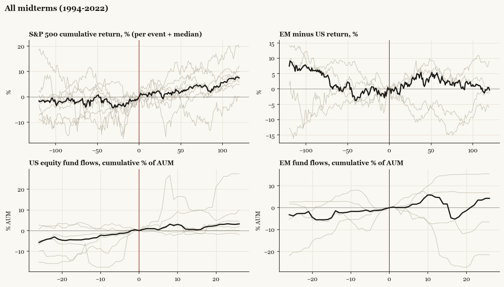

# All midterms (1994-2022)

*Median paths with per-event detail.*

[Index](README.md)

## Cohort statistics (medians and sign hit-rates)

| series | horizon | median | hit_rate_pos | n |
|---|---|---|---|---|
| SPX | +20 | +1.60 | 75% | 8 |
| SPX | pre20 | +3.35 | 75% | 8 |
| SPX | +60 | +3.68 | 75% | 8 |
| SPX | pre60 | +1.90 | 75% | 8 |
| SPX | +120 | +7.46 | 100% | 8 |
| SPX | pre120 | +1.64 | 62% | 8 |
| US | +20 | +1.77 | 83% | 6 |
| US | pre20 | +3.46 | 83% | 6 |
| US | +60 | +2.44 | 67% | 6 |
| US | pre60 | +2.50 | 67% | 6 |
| US | +120 | +6.12 | 100% | 6 |
| US | pre120 | +2.08 | 67% | 6 |
| EM | +20 | -0.43 | 40% | 5 |
| EM | pre20 | +2.36 | 100% | 5 |
| EM | +60 | +5.89 | 60% | 5 |
| EM | pre60 | -4.06 | 40% | 5 |
| EM | +120 | +6.14 | 100% | 5 |
| EM | pre120 | -1.15 | 40% | 5 |
| China | +20 | +0.83 | 80% | 5 |
| China | pre20 | +3.35 | 80% | 5 |
| China | +60 | +6.44 | 80% | 5 |
| China | pre60 | -3.27 | 40% | 5 |
| China | +120 | +13.90 | 80% | 5 |
| China | pre120 | +10.23 | 60% | 5 |
| Europe | +20 | +0.16 | 57% | 7 |
| Europe | pre20 | +5.01 | 86% | 7 |
| Europe | +60 | +1.46 | 71% | 7 |
| Europe | pre60 | -4.89 | 29% | 7 |
| Europe | +120 | +8.45 | 86% | 7 |
| Europe | pre120 | -8.61 | 29% | 7 |
| Japan | +20 | -0.42 | 43% | 7 |
| Japan | pre20 | +3.62 | 71% | 7 |
| Japan | +60 | +0.00 | 43% | 7 |
| Japan | pre60 | -0.25 | 43% | 7 |
| Japan | +120 | +4.26 | 71% | 7 |
| Japan | pre120 | -4.12 | 29% | 7 |
| Taiwan | +20 | +1.50 | 67% | 6 |
| Taiwan | pre20 | +3.34 | 83% | 6 |
| Taiwan | +60 | +2.76 | 83% | 6 |
| Taiwan | pre60 | -1.12 | 33% | 6 |
| Taiwan | +120 | +5.26 | 67% | 6 |
| Taiwan | pre120 | -3.64 | 50% | 6 |
| Bonds | +20 | +1.37 | 80% | 5 |
| Bonds | pre20 | -0.54 | 20% | 5 |
| Bonds | +60 | +4.76 | 60% | 5 |
| Bonds | pre60 | +1.29 | 60% | 5 |
| Bonds | +120 | +2.96 | 60% | 5 |
| Bonds | pre120 | +2.03 | 60% | 5 |
| Gold | +20 | +2.24 | 100% | 5 |
| Gold | pre20 | +2.71 | 80% | 5 |
| Gold | +60 | +6.90 | 80% | 5 |
| Gold | pre60 | -0.29 | 40% | 5 |
| Gold | +120 | +8.46 | 100% | 5 |
| Gold | pre120 | -6.03 | 20% | 5 |
| EM_minus_US | +20 | +1.51 | 60% | 5 |
| EM_minus_US | pre20 | -0.59 | 40% | 5 |
| EM_minus_US | +60 | +2.74 | 60% | 5 |
| EM_minus_US | pre60 | +0.65 | 60% | 5 |
| EM_minus_US | +120 | -0.35 | 40% | 5 |
| EM_minus_US | pre120 | -7.43 | 20% | 5 |
| China_minus_US | +20 | +2.78 | 60% | 5 |
| China_minus_US | pre20 | +0.91 | 60% | 5 |
| China_minus_US | +60 | +7.29 | 80% | 5 |
| China_minus_US | pre60 | -3.35 | 40% | 5 |
| China_minus_US | +120 | +7.31 | 80% | 5 |
| China_minus_US | pre120 | +3.13 | 60% | 5 |
| Europe_minus_US | +20 | -0.42 | 50% | 6 |
| Europe_minus_US | pre20 | +2.29 | 83% | 6 |
| Europe_minus_US | +60 | +0.31 | 50% | 6 |
| Europe_minus_US | pre60 | -0.74 | 50% | 6 |
| Europe_minus_US | +120 | +0.25 | 50% | 6 |
| Europe_minus_US | pre120 | -5.07 | 33% | 6 |
| flow_US | +4 | +0.94 | 83% | 6 |
| flow_US | pre4 | +1.28 | 67% | 6 |
| flow_US | +13 | +0.52 | 50% | 6 |
| flow_US | pre13 | +4.06 | 67% | 6 |
| flow_US | +26 | +3.24 | 83% | 6 |
| flow_US | pre26 | +5.72 | 67% | 6 |
| flow_EM | +4 | +0.05 | 60% | 5 |
| flow_EM | pre4 | +1.24 | 80% | 5 |
| flow_EM | +13 | +4.64 | 60% | 5 |
| flow_EM | pre13 | +2.31 | 60% | 5 |
| flow_EM | +26 | +4.26 | 60% | 5 |
| flow_EM | pre26 | +3.22 | 60% | 5 |
| flow_China | +4 | +3.45 | 80% | 5 |
| flow_China | pre4 | +0.03 | 60% | 5 |
| flow_China | +13 | +7.22 | 80% | 5 |
| flow_China | pre13 | +9.42 | 60% | 5 |
| flow_China | +26 | +9.78 | 80% | 5 |
| flow_China | pre26 | +10.53 | 80% | 5 |
| flow_Europe | +4 | +1.20 | 86% | 7 |
| flow_Europe | pre4 | +0.93 | 57% | 7 |
| flow_Europe | +13 | +5.64 | 86% | 7 |
| flow_Europe | pre13 | -3.28 | 29% | 7 |
| flow_Europe | +26 | +23.72 | 86% | 7 |
| flow_Europe | pre26 | -1.37 | 43% | 7 |
| flow_Bonds | +4 | +1.42 | 60% | 5 |
| flow_Bonds | pre4 | +1.28 | 60% | 5 |
| flow_Bonds | +13 | +9.50 | 80% | 5 |
| flow_Bonds | pre13 | +2.65 | 60% | 5 |
| flow_Bonds | +26 | +15.58 | 80% | 5 |
| flow_Bonds | pre26 | +14.00 | 100% | 5 |
| flow_Gold | +4 | +0.00 | 40% | 5 |
| flow_Gold | pre4 | -0.38 | 40% | 5 |
| flow_Gold | +13 | +4.64 | 80% | 5 |
| flow_Gold | pre13 | -0.75 | 40% | 5 |
| flow_Gold | +26 | +5.19 | 100% | 5 |
| flow_Gold | pre26 | -2.07 | 40% | 5 |
| flow_Cash | +4 | -1.79 | 50% | 4 |
| flow_Cash | pre4 | +4.36 | 75% | 4 |
| flow_Cash | +13 | +11.20 | 75% | 4 |
| flow_Cash | pre13 | +3.51 | 100% | 4 |
| flow_Cash | +26 | +13.60 | 75% | 4 |
| flow_Cash | pre26 | +10.16 | 100% | 4 |

Events: 1994 midterm, 1998 midterm, 2002 midterm, 2006 midterm, 2010 midterm, 2014 midterm, 2018 midterm, 2022 midterm.
