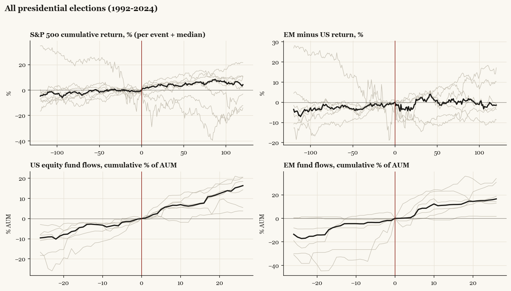

# All presidential elections (1992-2024)

*Median paths with per-event detail.*

[Index](README.md)

## Cohort statistics (medians and sign hit-rates)

| series | horizon | median | hit_rate_pos | n |
|---|---|---|---|---|
| SPX | +20 | +4.24 | 67% | 9 |
| SPX | pre20 | +0.55 | 78% | 9 |
| SPX | +60 | +4.39 | 78% | 9 |
| SPX | pre60 | +0.26 | 67% | 9 |
| SPX | +120 | +4.22 | 67% | 9 |
| SPX | pre120 | +4.76 | 78% | 9 |
| US | +20 | +4.98 | 67% | 6 |
| US | pre20 | +0.28 | 67% | 6 |
| US | +60 | +4.46 | 83% | 6 |
| US | pre60 | +0.86 | 67% | 6 |
| US | +120 | +5.83 | 67% | 6 |
| US | pre120 | +5.87 | 83% | 6 |
| EM | +20 | -1.47 | 50% | 6 |
| EM | pre20 | +0.76 | 83% | 6 |
| EM | +60 | +2.34 | 67% | 6 |
| EM | pre60 | +3.62 | 67% | 6 |
| EM | +120 | +5.28 | 83% | 6 |
| EM | pre120 | +11.98 | 83% | 6 |
| China | +20 | +0.15 | 60% | 5 |
| China | pre20 | -1.14 | 40% | 5 |
| China | +60 | -1.43 | 40% | 5 |
| China | pre60 | +7.24 | 60% | 5 |
| China | +120 | +4.47 | 80% | 5 |
| China | pre120 | +11.99 | 80% | 5 |
| Europe | +20 | +2.00 | 62% | 8 |
| Europe | pre20 | -0.74 | 38% | 8 |
| Europe | +60 | +3.95 | 75% | 8 |
| Europe | pre60 | +0.33 | 50% | 8 |
| Europe | +120 | +9.34 | 75% | 8 |
| Europe | pre120 | +3.88 | 50% | 8 |
| Japan | +20 | +1.79 | 75% | 8 |
| Japan | pre20 | -0.09 | 50% | 8 |
| Japan | +60 | +0.57 | 50% | 8 |
| Japan | pre60 | -0.44 | 50% | 8 |
| Japan | +120 | +1.99 | 62% | 8 |
| Japan | pre120 | +0.40 | 62% | 8 |
| Taiwan | +20 | +1.59 | 50% | 6 |
| Taiwan | pre20 | +0.39 | 50% | 6 |
| Taiwan | +60 | +1.94 | 50% | 6 |
| Taiwan | pre60 | +1.87 | 83% | 6 |
| Taiwan | +120 | +6.10 | 83% | 6 |
| Taiwan | pre120 | +6.34 | 67% | 6 |
| Bonds | +20 | +0.35 | 50% | 6 |
| Bonds | pre20 | -1.04 | 33% | 6 |
| Bonds | +60 | -1.84 | 33% | 6 |
| Bonds | pre60 | -1.86 | 33% | 6 |
| Bonds | +120 | -0.31 | 50% | 6 |
| Bonds | pre120 | +0.29 | 67% | 6 |
| Gold | +20 | -3.48 | 20% | 5 |
| Gold | pre20 | +0.94 | 60% | 5 |
| Gold | +60 | -2.56 | 40% | 5 |
| Gold | pre60 | -4.92 | 40% | 5 |
| Gold | +120 | -3.06 | 40% | 5 |
| Gold | pre120 | +9.22 | 80% | 5 |
| EM_minus_US | +20 | -3.50 | 50% | 6 |
| EM_minus_US | pre20 | +1.38 | 83% | 6 |
| EM_minus_US | +60 | -0.66 | 33% | 6 |
| EM_minus_US | pre60 | +1.75 | 67% | 6 |
| EM_minus_US | +120 | -1.41 | 33% | 6 |
| EM_minus_US | pre120 | +3.52 | 67% | 6 |
| China_minus_US | +20 | -5.26 | 40% | 5 |
| China_minus_US | pre20 | -1.45 | 40% | 5 |
| China_minus_US | +60 | +1.17 | 60% | 5 |
| China_minus_US | pre60 | +7.00 | 80% | 5 |
| China_minus_US | +120 | -6.42 | 40% | 5 |
| China_minus_US | pre120 | +3.53 | 80% | 5 |
| Europe_minus_US | +20 | +0.12 | 50% | 6 |
| Europe_minus_US | pre20 | -1.58 | 33% | 6 |
| Europe_minus_US | +60 | +0.03 | 50% | 6 |
| Europe_minus_US | pre60 | -2.40 | 33% | 6 |
| Europe_minus_US | +120 | +3.63 | 67% | 6 |
| Europe_minus_US | pre120 | -3.93 | 33% | 6 |
| flow_US | +4 | +2.43 | 100% | 6 |
| flow_US | pre4 | +1.52 | 83% | 6 |
| flow_US | +13 | +6.48 | 100% | 6 |
| flow_US | pre13 | +2.77 | 100% | 6 |
| flow_US | +26 | +16.36 | 100% | 6 |
| flow_US | pre26 | +9.59 | 100% | 6 |
| flow_EM | +4 | +0.57 | 50% | 6 |
| flow_EM | pre4 | +3.49 | 83% | 6 |
| flow_EM | +13 | +11.21 | 83% | 6 |
| flow_EM | pre13 | +4.56 | 100% | 6 |
| flow_EM | +26 | +16.57 | 100% | 6 |
| flow_EM | pre26 | +13.56 | 67% | 6 |
| flow_China | +4 | +4.41 | 60% | 5 |
| flow_China | pre4 | -1.54 | 20% | 5 |
| flow_China | +13 | +3.03 | 60% | 5 |
| flow_China | pre13 | +10.11 | 80% | 5 |
| flow_China | +26 | +13.52 | 60% | 5 |
| flow_China | pre26 | +6.47 | 60% | 5 |
| flow_Europe | +4 | +2.54 | 75% | 8 |
| flow_Europe | pre4 | +0.60 | 62% | 8 |
| flow_Europe | +13 | +4.39 | 75% | 8 |
| flow_Europe | pre13 | +2.97 | 62% | 8 |
| flow_Europe | +26 | +7.90 | 62% | 8 |
| flow_Europe | pre26 | +6.62 | 62% | 8 |
| flow_Bonds | +4 | -1.88 | 17% | 6 |
| flow_Bonds | pre4 | +0.35 | 50% | 6 |
| flow_Bonds | +13 | -2.16 | 17% | 6 |
| flow_Bonds | pre13 | +2.57 | 83% | 6 |
| flow_Bonds | +26 | +1.64 | 50% | 6 |
| flow_Bonds | pre26 | +6.61 | 100% | 6 |
| flow_Gold | +4 | +0.21 | 60% | 5 |
| flow_Gold | pre4 | +1.38 | 60% | 5 |
| flow_Gold | +13 | +3.11 | 60% | 5 |
| flow_Gold | pre13 | +6.35 | 80% | 5 |
| flow_Gold | +26 | -6.50 | 40% | 5 |
| flow_Gold | pre26 | +10.45 | 100% | 5 |
| flow_Cash | +4 | +0.00 | 60% | 5 |
| flow_Cash | pre4 | -2.23 | 40% | 5 |
| flow_Cash | +13 | +6.25 | 60% | 5 |
| flow_Cash | pre13 | +13.54 | 60% | 5 |
| flow_Cash | +26 | +16.36 | 80% | 5 |
| flow_Cash | pre26 | +7.98 | 60% | 5 |

Events: 1992 Clinton, 1996 Clinton, 2000 Bush, 2004 Bush, 2008 Obama, 2012 Obama, 2016 Trump, 2020 Biden, 2024 Trump.
