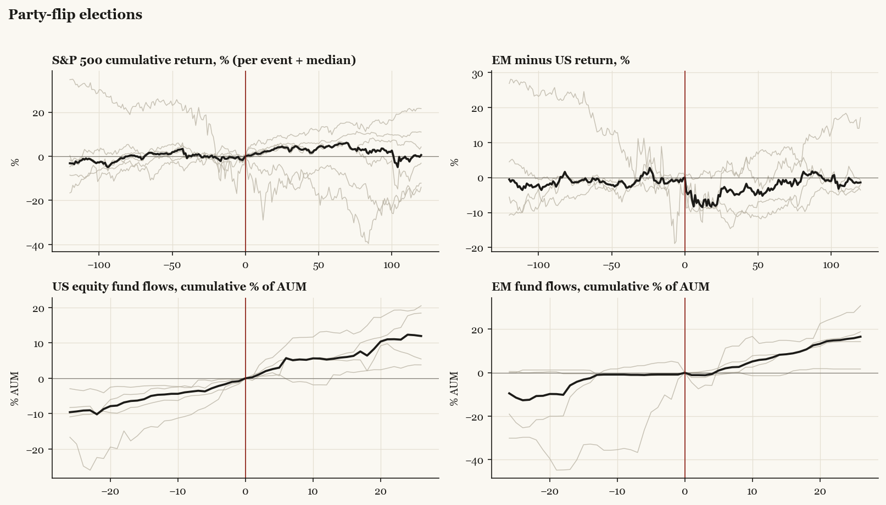

# Party-flip elections

*Median paths with per-event detail.*

[Index](README.md)

## Cohort statistics (medians and sign hit-rates)

| series | horizon | median | hit_rate_pos | n |
|---|---|---|---|---|
| SPX | +20 | +3.50 | 67% | 6 |
| SPX | pre20 | +0.75 | 100% | 6 |
| SPX | +60 | +4.36 | 67% | 6 |
| SPX | pre60 | -1.11 | 50% | 6 |
| SPX | +120 | +0.54 | 50% | 6 |
| SPX | pre120 | +3.20 | 67% | 6 |
| US | +20 | +5.02 | 75% | 4 |
| US | pre20 | +0.33 | 100% | 4 |
| US | +60 | +5.51 | 75% | 4 |
| US | pre60 | -1.11 | 50% | 4 |
| US | +120 | +3.83 | 50% | 4 |
| US | pre120 | +6.61 | 75% | 4 |
| EM | +20 | -3.57 | 25% | 4 |
| EM | pre20 | +1.24 | 75% | 4 |
| EM | +60 | -2.38 | 50% | 4 |
| EM | pre60 | +1.17 | 50% | 4 |
| EM | +120 | +5.28 | 75% | 4 |
| EM | pre120 | +9.75 | 75% | 4 |
| China | +20 | -0.45 | 50% | 4 |
| China | pre20 | -2.15 | 25% | 4 |
| China | +60 | -1.72 | 25% | 4 |
| China | pre60 | +3.51 | 50% | 4 |
| China | +120 | +5.20 | 100% | 4 |
| China | pre120 | +15.29 | 75% | 4 |
| Europe | +20 | -1.35 | 40% | 5 |
| Europe | pre20 | -1.33 | 20% | 5 |
| Europe | +60 | +0.76 | 60% | 5 |
| Europe | pre60 | -4.23 | 20% | 5 |
| Europe | +120 | +10.33 | 60% | 5 |
| Europe | pre120 | -2.73 | 20% | 5 |
| Japan | +20 | +1.42 | 60% | 5 |
| Japan | pre20 | +0.58 | 60% | 5 |
| Japan | +60 | -1.17 | 40% | 5 |
| Japan | pre60 | +0.42 | 60% | 5 |
| Japan | +120 | +3.00 | 60% | 5 |
| Japan | pre120 | +0.14 | 60% | 5 |
| Taiwan | +20 | -1.60 | 25% | 4 |
| Taiwan | pre20 | +1.70 | 75% | 4 |
| Taiwan | +60 | -3.96 | 25% | 4 |
| Taiwan | pre60 | +1.55 | 75% | 4 |
| Taiwan | +120 | +6.27 | 75% | 4 |
| Taiwan | pre120 | +15.11 | 75% | 4 |
| Bonds | +20 | +0.35 | 50% | 4 |
| Bonds | pre20 | -1.52 | 0% | 4 |
| Bonds | +60 | -1.95 | 25% | 4 |
| Bonds | pre60 | -3.04 | 25% | 4 |
| Bonds | +120 | -2.50 | 25% | 4 |
| Bonds | pre120 | -0.60 | 50% | 4 |
| Gold | +20 | -3.85 | 25% | 4 |
| Gold | pre20 | +1.29 | 75% | 4 |
| Gold | +60 | +0.50 | 50% | 4 |
| Gold | pre60 | -5.50 | 25% | 4 |
| Gold | +120 | +6.29 | 50% | 4 |
| Gold | pre120 | +5.43 | 75% | 4 |
| EM_minus_US | +20 | -7.85 | 25% | 4 |
| EM_minus_US | pre20 | +0.90 | 75% | 4 |
| EM_minus_US | +60 | -3.53 | 25% | 4 |
| EM_minus_US | pre60 | +0.26 | 50% | 4 |
| EM_minus_US | +120 | -1.41 | 25% | 4 |
| EM_minus_US | pre120 | +0.55 | 50% | 4 |
| China_minus_US | +20 | -5.55 | 25% | 4 |
| China_minus_US | pre20 | -2.60 | 25% | 4 |
| China_minus_US | +60 | -2.23 | 50% | 4 |
| China_minus_US | pre60 | +4.62 | 75% | 4 |
| China_minus_US | +120 | -0.46 | 50% | 4 |
| China_minus_US | pre120 | +3.66 | 75% | 4 |
| Europe_minus_US | +20 | -3.89 | 25% | 4 |
| Europe_minus_US | pre20 | -2.08 | 0% | 4 |
| Europe_minus_US | +60 | -2.83 | 25% | 4 |
| Europe_minus_US | pre60 | -3.95 | 0% | 4 |
| Europe_minus_US | +120 | +3.63 | 75% | 4 |
| Europe_minus_US | pre120 | -8.66 | 0% | 4 |
| flow_US | +4 | +2.60 | 100% | 4 |
| flow_US | pre4 | +2.18 | 100% | 4 |
| flow_US | +13 | +5.52 | 100% | 4 |
| flow_US | pre13 | +4.68 | 100% | 4 |
| flow_US | +26 | +11.95 | 100% | 4 |
| flow_US | pre26 | +9.59 | 100% | 4 |
| flow_EM | +4 | -0.59 | 25% | 4 |
| flow_EM | pre4 | +0.81 | 75% | 4 |
| flow_EM | +13 | +7.06 | 75% | 4 |
| flow_EM | pre13 | +0.99 | 100% | 4 |
| flow_EM | +26 | +16.57 | 100% | 4 |
| flow_EM | pre26 | +9.47 | 50% | 4 |
| flow_China | +4 | +1.59 | 50% | 4 |
| flow_China | pre4 | -3.86 | 0% | 4 |
| flow_China | +13 | -5.61 | 50% | 4 |
| flow_China | pre13 | +6.18 | 75% | 4 |
| flow_China | +26 | -1.79 | 50% | 4 |
| flow_China | pre26 | +4.83 | 50% | 4 |
| flow_Europe | +4 | +2.31 | 80% | 5 |
| flow_Europe | pre4 | +0.45 | 60% | 5 |
| flow_Europe | +13 | +0.38 | 60% | 5 |
| flow_Europe | pre13 | -1.94 | 40% | 5 |
| flow_Europe | +26 | +5.88 | 60% | 5 |
| flow_Europe | pre26 | -1.92 | 40% | 5 |
| flow_Bonds | +4 | -2.74 | 0% | 4 |
| flow_Bonds | pre4 | +0.87 | 50% | 4 |
| flow_Bonds | +13 | -2.16 | 0% | 4 |
| flow_Bonds | pre13 | +2.57 | 100% | 4 |
| flow_Bonds | +26 | -1.15 | 25% | 4 |
| flow_Bonds | pre26 | +6.61 | 100% | 4 |
| flow_Gold | +4 | -0.55 | 50% | 4 |
| flow_Gold | pre4 | -0.07 | 50% | 4 |
| flow_Gold | +13 | +1.11 | 50% | 4 |
| flow_Gold | pre13 | +4.63 | 75% | 4 |
| flow_Gold | +26 | +0.07 | 50% | 4 |
| flow_Gold | pre26 | +8.45 | 100% | 4 |
| flow_Cash | +4 | +1.05 | 75% | 4 |
| flow_Cash | pre4 | -2.82 | 25% | 4 |
| flow_Cash | +13 | -3.40 | 50% | 4 |
| flow_Cash | pre13 | +4.37 | 50% | 4 |
| flow_Cash | +26 | +14.46 | 75% | 4 |
| flow_Cash | pre26 | +2.24 | 50% | 4 |

Events: 1992 Clinton, 2000 Bush, 2008 Obama, 2016 Trump, 2020 Biden, 2024 Trump.
