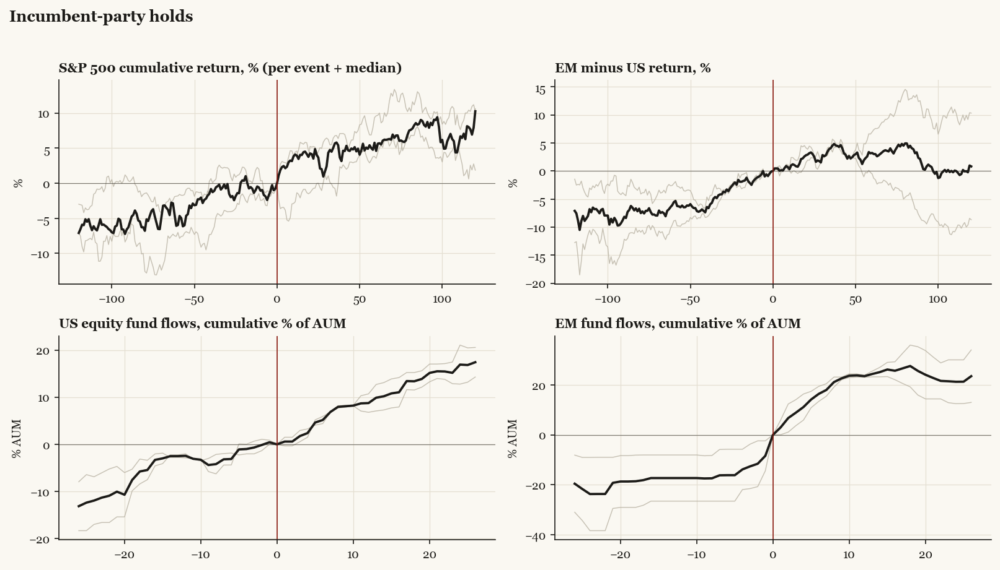

# Incumbent-party holds

*Median paths with per-event detail.*

[Index](README.md)

## Cohort statistics (medians and sign hit-rates)

| series | horizon | median | hit_rate_pos | n |
|---|---|---|---|---|
| SPX | +20 | +4.24 | 67% | 3 |
| SPX | pre20 | -0.35 | 33% | 3 |
| SPX | +60 | +4.61 | 100% | 3 |
| SPX | pre60 | +5.95 | 100% | 3 |
| SPX | +120 | +10.26 | 100% | 3 |
| SPX | pre120 | +7.09 | 100% | 3 |
| US | +20 | +2.07 | 50% | 2 |
| US | pre20 | -1.25 | 0% | 2 |
| US | +60 | +3.91 | 100% | 2 |
| US | pre60 | +3.78 | 100% | 2 |
| US | +120 | +5.83 | 100% | 2 |
| US | pre120 | +4.88 | 100% | 2 |
| EM | +20 | +4.89 | 100% | 2 |
| EM | pre20 | +0.68 | 100% | 2 |
| EM | +60 | +7.13 | 100% | 2 |
| EM | pre60 | +9.34 | 100% | 2 |
| EM | +120 | +6.64 | 100% | 2 |
| EM | pre120 | +11.99 | 100% | 2 |
| China | +20 | +0.16 | 100% | 1 |
| China | pre20 | +7.41 | 100% | 1 |
| China | +60 | +5.84 | 100% | 1 |
| China | pre60 | +8.62 | 100% | 1 |
| China | +120 | -1.94 | 0% | 1 |
| China | pre120 | +10.35 | 100% | 1 |
| Europe | +20 | +2.57 | 100% | 3 |
| Europe | pre20 | +1.13 | 67% | 3 |
| Europe | +60 | +5.50 | 100% | 3 |
| Europe | pre60 | +7.63 | 100% | 3 |
| Europe | +120 | +8.36 | 100% | 3 |
| Europe | pre120 | +11.37 | 100% | 3 |
| Japan | +20 | +2.17 | 100% | 3 |
| Japan | pre20 | -0.77 | 33% | 3 |
| Japan | +60 | +5.53 | 67% | 3 |
| Japan | pre60 | -1.31 | 33% | 3 |
| Japan | +120 | +0.99 | 67% | 3 |
| Japan | pre120 | +0.66 | 67% | 3 |
| Taiwan | +20 | +5.14 | 100% | 2 |
| Taiwan | pre20 | -4.35 | 0% | 2 |
| Taiwan | +60 | +4.72 | 100% | 2 |
| Taiwan | pre60 | +5.84 | 100% | 2 |
| Taiwan | +120 | +5.87 | 100% | 2 |
| Taiwan | pre120 | +1.56 | 50% | 2 |
| Bonds | +20 | -0.24 | 50% | 2 |
| Bonds | pre20 | +0.44 | 100% | 2 |
| Bonds | +60 | -0.56 | 50% | 2 |
| Bonds | pre60 | +0.34 | 50% | 2 |
| Bonds | +120 | +0.73 | 100% | 2 |
| Bonds | pre120 | +3.14 | 100% | 2 |
| Gold | +20 | -1.27 | 0% | 1 |
| Gold | pre20 | -3.76 | 0% | 1 |
| Gold | +60 | -2.61 | 0% | 1 |
| Gold | pre60 | +5.79 | 100% | 1 |
| Gold | +120 | -16.36 | 0% | 1 |
| Gold | pre120 | +10.60 | 100% | 1 |
| EM_minus_US | +20 | +2.81 | 100% | 2 |
| EM_minus_US | pre20 | +1.93 | 100% | 2 |
| EM_minus_US | +60 | +3.22 | 50% | 2 |
| EM_minus_US | pre60 | +5.55 | 100% | 2 |
| EM_minus_US | +120 | +0.81 | 50% | 2 |
| EM_minus_US | pre120 | +7.11 | 100% | 2 |
| China_minus_US | +20 | +1.18 | 100% | 1 |
| China_minus_US | pre20 | +9.61 | 100% | 1 |
| China_minus_US | +60 | +1.17 | 100% | 1 |
| China_minus_US | pre60 | +7.00 | 100% | 1 |
| China_minus_US | +120 | -12.25 | 0% | 1 |
| China_minus_US | pre120 | +3.37 | 100% | 1 |
| Europe_minus_US | +20 | +3.20 | 100% | 2 |
| Europe_minus_US | pre20 | +2.42 | 100% | 2 |
| Europe_minus_US | +60 | +2.29 | 100% | 2 |
| Europe_minus_US | pre60 | +5.51 | 100% | 2 |
| Europe_minus_US | +120 | +1.23 | 50% | 2 |
| Europe_minus_US | pre120 | +6.51 | 100% | 2 |
| flow_US | +4 | +2.39 | 100% | 2 |
| flow_US | pre4 | +0.99 | 50% | 2 |
| flow_US | +13 | +9.89 | 100% | 2 |
| flow_US | pre13 | +2.50 | 100% | 2 |
| flow_US | +26 | +17.41 | 100% | 2 |
| flow_US | pre26 | +13.12 | 100% | 2 |
| flow_EM | +4 | +11.12 | 100% | 2 |
| flow_EM | pre4 | +13.85 | 100% | 2 |
| flow_EM | +13 | +24.35 | 100% | 2 |
| flow_EM | pre13 | +17.31 | 100% | 2 |
| flow_EM | +26 | +23.49 | 100% | 2 |
| flow_EM | pre26 | +19.56 | 100% | 2 |
| flow_China | +4 | +10.61 | 100% | 1 |
| flow_China | pre4 | +21.38 | 100% | 1 |
| flow_China | +13 | +32.95 | 100% | 1 |
| flow_China | pre13 | +24.53 | 100% | 1 |
| flow_China | +26 | +16.90 | 100% | 1 |
| flow_China | pre26 | +6.47 | 100% | 1 |
| flow_Europe | +4 | +4.95 | 67% | 3 |
| flow_Europe | pre4 | +1.07 | 67% | 3 |
| flow_Europe | +13 | +12.63 | 100% | 3 |
| flow_Europe | pre13 | +24.16 | 100% | 3 |
| flow_Europe | +26 | +15.07 | 67% | 3 |
| flow_Europe | pre26 | +29.49 | 100% | 3 |
| flow_Bonds | +4 | +8.57 | 50% | 2 |
| flow_Bonds | pre4 | -3.67 | 50% | 2 |
| flow_Bonds | +13 | +18.42 | 50% | 2 |
| flow_Bonds | pre13 | +2.73 | 50% | 2 |
| flow_Bonds | +26 | +35.03 | 100% | 2 |
| flow_Bonds | pre26 | +13.46 | 100% | 2 |
| flow_Gold | +4 | +2.51 | 100% | 1 |
| flow_Gold | pre4 | +2.70 | 100% | 1 |
| flow_Gold | +13 | +4.74 | 100% | 1 |
| flow_Gold | pre13 | +13.52 | 100% | 1 |
| flow_Gold | +26 | -6.93 | 0% | 1 |
| flow_Gold | pre26 | +16.62 | 100% | 1 |
| flow_Cash | +4 | -6.94 | 0% | 1 |
| flow_Cash | pre4 | +2.47 | 100% | 1 |
| flow_Cash | +13 | +9.87 | 100% | 1 |
| flow_Cash | pre13 | +15.12 | 100% | 1 |
| flow_Cash | +26 | +50.90 | 100% | 1 |
| flow_Cash | pre26 | +16.95 | 100% | 1 |

Events: 1996 Clinton, 2004 Bush, 2012 Obama.
