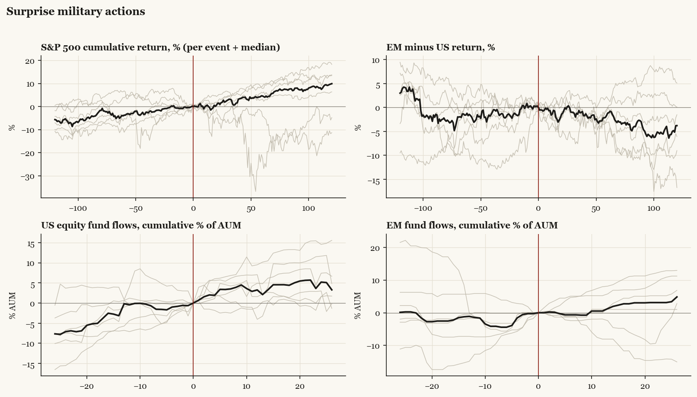

# Surprise military actions

*Median paths with per-event detail.*

[Index](README.md)

## Cohort statistics (medians and sign hit-rates)

| series | horizon | median | hit_rate_pos | n |
|---|---|---|---|---|
| SPX | +20 | +0.57 | 67% | 6 |
| SPX | pre20 | +0.14 | 50% | 6 |
| SPX | +60 | +4.58 | 67% | 6 |
| SPX | pre60 | +3.76 | 67% | 6 |
| SPX | +120 | +9.93 | 67% | 6 |
| SPX | pre120 | +5.66 | 83% | 6 |
| US | +20 | +0.66 | 67% | 6 |
| US | pre20 | +0.03 | 50% | 6 |
| US | +60 | +4.56 | 67% | 6 |
| US | pre60 | +3.82 | 67% | 6 |
| US | +120 | +9.90 | 67% | 6 |
| US | pre120 | +5.55 | 83% | 6 |
| EM | +20 | -0.48 | 50% | 6 |
| EM | pre20 | +2.02 | 83% | 6 |
| EM | +60 | +4.89 | 67% | 6 |
| EM | pre60 | +5.94 | 83% | 6 |
| EM | +120 | +10.33 | 67% | 6 |
| EM | pre120 | +3.89 | 83% | 6 |
| China | +20 | -0.23 | 50% | 6 |
| China | pre20 | +2.28 | 67% | 6 |
| China | +60 | -5.42 | 33% | 6 |
| China | pre60 | +6.27 | 67% | 6 |
| China | +120 | +0.51 | 50% | 6 |
| China | pre120 | +5.24 | 67% | 6 |
| Europe | +20 | -1.90 | 33% | 6 |
| Europe | pre20 | +2.64 | 83% | 6 |
| Europe | +60 | +3.67 | 67% | 6 |
| Europe | pre60 | +7.35 | 83% | 6 |
| Europe | +120 | +6.25 | 67% | 6 |
| Europe | pre120 | +8.54 | 83% | 6 |
| Japan | +20 | -2.18 | 33% | 6 |
| Japan | pre20 | +0.63 | 50% | 6 |
| Japan | +60 | +4.01 | 83% | 6 |
| Japan | pre60 | +1.72 | 67% | 6 |
| Japan | +120 | +10.72 | 67% | 6 |
| Japan | pre120 | +2.76 | 83% | 6 |
| Taiwan | +20 | -0.12 | 50% | 6 |
| Taiwan | pre20 | +3.28 | 83% | 6 |
| Taiwan | +60 | +2.64 | 50% | 6 |
| Taiwan | pre60 | +4.15 | 50% | 6 |
| Taiwan | +120 | +7.48 | 67% | 6 |
| Taiwan | pre120 | +7.74 | 83% | 6 |
| Bonds | +20 | -0.01 | 50% | 6 |
| Bonds | pre20 | +0.79 | 67% | 6 |
| Bonds | +60 | +2.62 | 83% | 6 |
| Bonds | pre60 | -1.33 | 33% | 6 |
| Bonds | +120 | +3.13 | 100% | 6 |
| Bonds | pre120 | -4.69 | 17% | 6 |
| Gold | +20 | +0.60 | 50% | 6 |
| Gold | pre20 | +4.56 | 83% | 6 |
| Gold | +60 | +5.16 | 83% | 6 |
| Gold | pre60 | +8.56 | 83% | 6 |
| Gold | +120 | +16.01 | 100% | 6 |
| Gold | pre120 | +8.85 | 83% | 6 |
| EM_minus_US | +20 | -1.43 | 33% | 6 |
| EM_minus_US | pre20 | +1.38 | 67% | 6 |
| EM_minus_US | +60 | -1.18 | 17% | 6 |
| EM_minus_US | pre60 | +1.45 | 50% | 6 |
| EM_minus_US | +120 | -3.80 | 33% | 6 |
| EM_minus_US | pre120 | -2.98 | 33% | 6 |
| China_minus_US | +20 | -1.99 | 33% | 6 |
| China_minus_US | pre20 | +2.25 | 83% | 6 |
| China_minus_US | +60 | -0.41 | 50% | 6 |
| China_minus_US | pre60 | +1.72 | 67% | 6 |
| China_minus_US | +120 | -6.64 | 33% | 6 |
| China_minus_US | pre120 | -3.14 | 33% | 6 |
| Europe_minus_US | +20 | -1.85 | 17% | 6 |
| Europe_minus_US | pre20 | +2.15 | 67% | 6 |
| Europe_minus_US | +60 | -2.72 | 50% | 6 |
| Europe_minus_US | pre60 | +0.84 | 83% | 6 |
| Europe_minus_US | +120 | -7.36 | 17% | 6 |
| Europe_minus_US | pre120 | +0.04 | 50% | 6 |
| flow_US | +4 | +1.92 | 83% | 6 |
| flow_US | pre4 | +1.00 | 67% | 6 |
| flow_US | +13 | +2.10 | 83% | 6 |
| flow_US | pre13 | +0.18 | 50% | 6 |
| flow_US | +26 | +3.27 | 67% | 6 |
| flow_US | pre26 | +7.65 | 100% | 6 |
| flow_EM | +4 | -0.29 | 33% | 6 |
| flow_EM | pre4 | +1.58 | 83% | 6 |
| flow_EM | +13 | +1.26 | 67% | 6 |
| flow_EM | pre13 | +1.12 | 83% | 6 |
| flow_EM | +26 | +4.85 | 83% | 6 |
| flow_EM | pre26 | -0.13 | 50% | 6 |
| flow_China | +4 | -0.08 | 50% | 6 |
| flow_China | pre4 | -0.89 | 50% | 6 |
| flow_China | +13 | -3.27 | 50% | 6 |
| flow_China | pre13 | -4.74 | 33% | 6 |
| flow_China | +26 | -4.66 | 33% | 6 |
| flow_China | pre26 | -8.81 | 17% | 6 |
| flow_Europe | +4 | +1.35 | 67% | 6 |
| flow_Europe | pre4 | +5.45 | 67% | 6 |
| flow_Europe | +13 | -3.10 | 33% | 6 |
| flow_Europe | pre13 | +11.16 | 83% | 6 |
| flow_Europe | +26 | -5.24 | 17% | 6 |
| flow_Europe | pre26 | +12.41 | 83% | 6 |
| flow_Bonds | +4 | +2.81 | 83% | 6 |
| flow_Bonds | pre4 | +0.76 | 100% | 6 |
| flow_Bonds | +13 | +3.00 | 83% | 6 |
| flow_Bonds | pre13 | +2.34 | 83% | 6 |
| flow_Bonds | +26 | +9.05 | 100% | 6 |
| flow_Bonds | pre26 | +3.01 | 83% | 6 |
| flow_Gold | +4 | +1.83 | 83% | 6 |
| flow_Gold | pre4 | +1.19 | 67% | 6 |
| flow_Gold | +13 | +5.80 | 83% | 6 |
| flow_Gold | pre13 | +3.98 | 83% | 6 |
| flow_Gold | +26 | +12.56 | 83% | 6 |
| flow_Gold | pre26 | +12.27 | 67% | 6 |
| flow_Cash | +4 | -0.72 | 33% | 6 |
| flow_Cash | pre4 | +2.54 | 83% | 6 |
| flow_Cash | +13 | +3.22 | 83% | 6 |
| flow_Cash | pre13 | +6.18 | 83% | 6 |
| flow_Cash | +26 | +1.39 | 50% | 6 |
| flow_Cash | pre26 | +5.12 | 67% | 6 |

Events: 2011 bin Laden raid, 2017 Shayrat strike (Syria), 2020 Soleimani strike, 2023 Hamas attack / Gaza war, 2025 Houthi campaign, 2025 Israel-Iran war begins.
