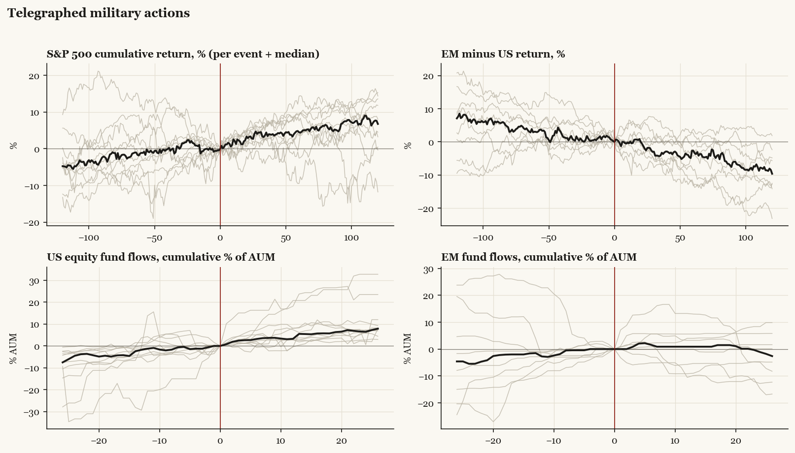

# Telegraphed military actions

*Median paths with per-event detail.*

[Index](README.md)

## Cohort statistics (medians and sign hit-rates)

| series | horizon | median | hit_rate_pos | n |
|---|---|---|---|---|
| SPX | +20 | +3.31 | 82% | 11 |
| SPX | pre20 | -1.42 | 36% | 11 |
| SPX | +60 | +4.49 | 82% | 11 |
| SPX | pre60 | +1.11 | 55% | 11 |
| SPX | +120 | +6.76 | 82% | 11 |
| SPX | pre120 | +4.74 | 73% | 11 |
| US | +20 | +3.01 | 82% | 11 |
| US | pre20 | -1.22 | 36% | 11 |
| US | +60 | +4.41 | 82% | 11 |
| US | pre60 | +1.52 | 55% | 11 |
| US | +120 | +6.76 | 82% | 11 |
| US | pre120 | +4.78 | 73% | 11 |
| EM | +20 | +1.88 | 67% | 9 |
| EM | pre20 | -2.23 | 11% | 9 |
| EM | +60 | -0.04 | 44% | 9 |
| EM | pre60 | -1.48 | 33% | 9 |
| EM | +120 | -8.06 | 33% | 9 |
| EM | pre120 | +2.58 | 56% | 9 |
| China | +20 | +3.77 | 67% | 9 |
| China | pre20 | -4.51 | 33% | 9 |
| China | +60 | -0.96 | 44% | 9 |
| China | pre60 | -1.06 | 33% | 9 |
| China | +120 | -2.87 | 44% | 9 |
| China | pre120 | +0.61 | 56% | 9 |
| Europe | +20 | +1.72 | 73% | 11 |
| Europe | pre20 | -1.88 | 18% | 11 |
| Europe | +60 | -0.14 | 45% | 11 |
| Europe | pre60 | -3.83 | 36% | 11 |
| Europe | +120 | -2.81 | 45% | 11 |
| Europe | pre120 | +0.14 | 55% | 11 |
| Japan | +20 | +0.81 | 64% | 11 |
| Japan | pre20 | -1.69 | 18% | 11 |
| Japan | +60 | +2.32 | 55% | 11 |
| Japan | pre60 | -0.84 | 45% | 11 |
| Japan | +120 | -2.07 | 45% | 11 |
| Japan | pre120 | +2.75 | 64% | 11 |
| Taiwan | +20 | +3.45 | 64% | 11 |
| Taiwan | pre20 | -1.71 | 18% | 11 |
| Taiwan | +60 | +4.13 | 64% | 11 |
| Taiwan | pre60 | -0.52 | 36% | 11 |
| Taiwan | +120 | +1.21 | 64% | 11 |
| Taiwan | pre120 | +3.47 | 73% | 11 |
| Bonds | +20 | -0.06 | 40% | 10 |
| Bonds | pre20 | -0.24 | 50% | 10 |
| Bonds | +60 | +1.33 | 70% | 10 |
| Bonds | pre60 | -0.05 | 50% | 10 |
| Bonds | +120 | -0.18 | 50% | 10 |
| Bonds | pre120 | -1.52 | 40% | 10 |
| Gold | +20 | +0.99 | 56% | 9 |
| Gold | pre20 | +2.51 | 67% | 9 |
| Gold | +60 | -2.74 | 44% | 9 |
| Gold | pre60 | +2.29 | 78% | 9 |
| Gold | +120 | -2.23 | 44% | 9 |
| Gold | pre120 | +4.57 | 56% | 9 |
| EM_minus_US | +20 | -0.05 | 44% | 9 |
| EM_minus_US | pre20 | -1.01 | 33% | 9 |
| EM_minus_US | +60 | -2.71 | 22% | 9 |
| EM_minus_US | pre60 | -3.00 | 33% | 9 |
| EM_minus_US | +120 | -9.66 | 11% | 9 |
| EM_minus_US | pre120 | -7.07 | 22% | 9 |
| China_minus_US | +20 | +0.93 | 78% | 9 |
| China_minus_US | pre20 | -3.22 | 33% | 9 |
| China_minus_US | +60 | -2.06 | 33% | 9 |
| China_minus_US | pre60 | -3.38 | 33% | 9 |
| China_minus_US | +120 | -5.56 | 11% | 9 |
| China_minus_US | pre120 | -7.79 | 33% | 9 |
| Europe_minus_US | +20 | -1.11 | 27% | 11 |
| Europe_minus_US | pre20 | -1.86 | 27% | 11 |
| Europe_minus_US | +60 | -2.24 | 45% | 11 |
| Europe_minus_US | pre60 | -0.54 | 36% | 11 |
| Europe_minus_US | +120 | -7.27 | 27% | 11 |
| Europe_minus_US | pre120 | -4.87 | 9% | 11 |
| flow_US | +4 | +2.62 | 91% | 11 |
| flow_US | pre4 | +1.24 | 64% | 11 |
| flow_US | +13 | +5.50 | 100% | 11 |
| flow_US | pre13 | +1.77 | 73% | 11 |
| flow_US | +26 | +7.88 | 100% | 11 |
| flow_US | pre26 | +7.52 | 100% | 11 |
| flow_EM | +4 | +2.04 | 67% | 9 |
| flow_EM | pre4 | +0.00 | 44% | 9 |
| flow_EM | +13 | +0.89 | 56% | 9 |
| flow_EM | pre13 | +1.51 | 78% | 9 |
| flow_EM | +26 | -2.61 | 44% | 9 |
| flow_EM | pre26 | +4.60 | 67% | 9 |
| flow_China | +4 | +2.19 | 89% | 9 |
| flow_China | pre4 | +2.21 | 89% | 9 |
| flow_China | +13 | +1.44 | 78% | 9 |
| flow_China | pre13 | +1.10 | 56% | 9 |
| flow_China | +26 | +4.70 | 78% | 9 |
| flow_China | pre26 | -9.38 | 44% | 9 |
| flow_Europe | +4 | -0.14 | 36% | 11 |
| flow_Europe | pre4 | +1.97 | 64% | 11 |
| flow_Europe | +13 | -6.07 | 36% | 11 |
| flow_Europe | pre13 | +2.47 | 55% | 11 |
| flow_Europe | +26 | -1.38 | 45% | 11 |
| flow_Europe | pre26 | +15.35 | 55% | 11 |
| flow_Bonds | +4 | +1.06 | 60% | 10 |
| flow_Bonds | pre4 | +0.41 | 60% | 10 |
| flow_Bonds | +13 | +5.29 | 90% | 10 |
| flow_Bonds | pre13 | +1.95 | 70% | 10 |
| flow_Bonds | +26 | +10.82 | 100% | 10 |
| flow_Bonds | pre26 | +5.16 | 80% | 10 |
| flow_Gold | +4 | +0.66 | 56% | 9 |
| flow_Gold | pre4 | +1.01 | 67% | 9 |
| flow_Gold | +13 | -0.91 | 44% | 9 |
| flow_Gold | pre13 | +0.37 | 67% | 9 |
| flow_Gold | +26 | +0.69 | 56% | 9 |
| flow_Gold | pre26 | +0.69 | 56% | 9 |
| flow_Cash | +4 | +1.97 | 67% | 9 |
| flow_Cash | pre4 | +0.28 | 56% | 9 |
| flow_Cash | +13 | +4.19 | 67% | 9 |
| flow_Cash | pre13 | +3.82 | 56% | 9 |
| flow_Cash | +26 | +4.36 | 67% | 9 |
| flow_Cash | pre26 | +9.71 | 67% | 9 |

Events: 2001 Afghanistan war begins, 2003 Iraq invasion, 2011 Libya intervention, 2013 Syria red-line stand-down, 2014 Anti-ISIS strikes Iraq, 2014 Anti-ISIS strikes Syria, 2018 Douma response strikes (Syria), 2021 Kabul falls / withdrawal, 2022 Russia invades Ukraine, 2024 US-UK Houthi strikes, 2025 US strikes Iran nuclear sites.
