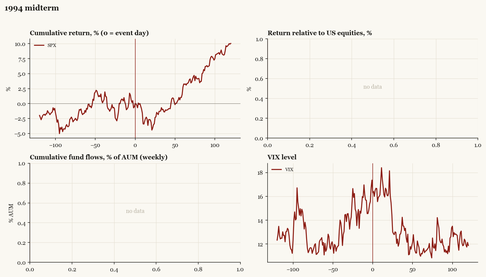

# 1994 midterm

*Midterm election, 1994-11-08. House flipped; Senate flipped.*

[Index](README.md)

## What moved

- Equities ran +1.0% over the 60 trading days into the event.
- The S&P 500 moved +2.8% over the following 60 trading days and +10.0% over 120.
- Implied volatility moved -0.9 VIX points across the event (from 17.4).
- Republican Revolution; both chambers flip

## Detail

| series | runup pre-60d | +20d | +60d | +120d |
|---|---|---|---|---|
| SPX | +1.0% | -3.1% | +2.8% | +10.0% |
