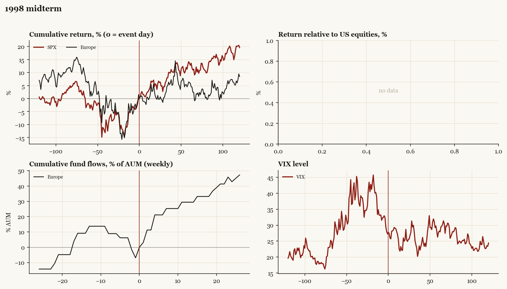

# 1998 midterm

*Midterm election, 1998-11-03. No chamber flipped.*

[Index](README.md)

## What moved

- Equities ran +2.5% over the 60 trading days into the event.
- The S&P 500 moved +13.6% over the following 60 trading days and +19.6% over 120.
- Cumulative net flows into Europe funds: +29.4% of assets in the 13 weeks after (vs -13.7% in the 13 weeks before).
- Implied volatility moved +0.1 VIX points across the event (from 27.3).
- Unusual pres-party House gains

## Detail

| series | runup pre-60d | +20d | +60d | +120d |
|---|---|---|---|---|
| SPX | +2.5% | +5.3% | +13.6% | +19.6% |
| Europe | -4.9% | +0.2% | +6.1% | +8.4% |
| Japan | +16.2% | -2.4% | +0.0% | +16.5% |
