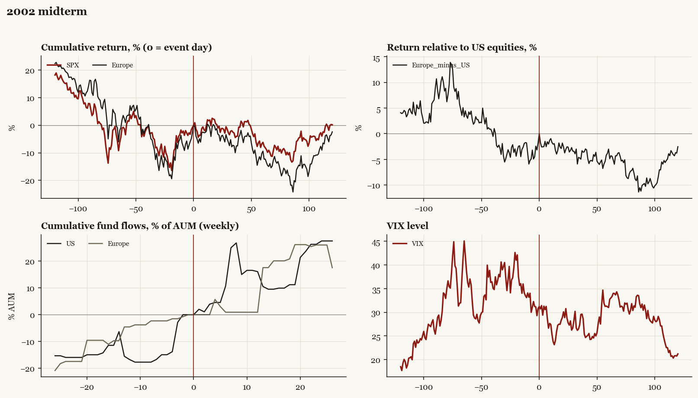

# 2002 midterm

*Midterm election, 2002-11-05. Senate flipped.*

[Index](README.md)

## What moved

- Equities ran +1.3% over the 60 trading days into the event.
- The S&P 500 moved -6.2% over the following 60 trading days and +0.2% over 120.
- Cumulative net flows into US equity funds: +10.5% of assets in the 13 weeks after (vs +15.5% in the 13 weeks before).
- Cumulative net flows into Europe funds: +17.5% of assets in the 13 weeks after (vs +4.6% in the 13 weeks before).
- Implied volatility moved -0.1 VIX points across the event (from 30.8).
- Pres-party gains both chambers (post-9/11); Senate back to R

## Detail

| series | runup pre-60d | +20d | +60d | +120d |
|---|---|---|---|---|
| SPX | +1.3% | +0.2% | -6.2% | +0.2% |
| US | +1.3% | +0.6% | -6.4% | +0.1% |
| Taiwan | -1.6% | -2.2% | +4.5% | -12.9% |
| Europe | -2.4% | -1.2% | -9.4% | -2.4% |
| Japan | -8.4% | -4.3% | -4.8% | -11.6% |
