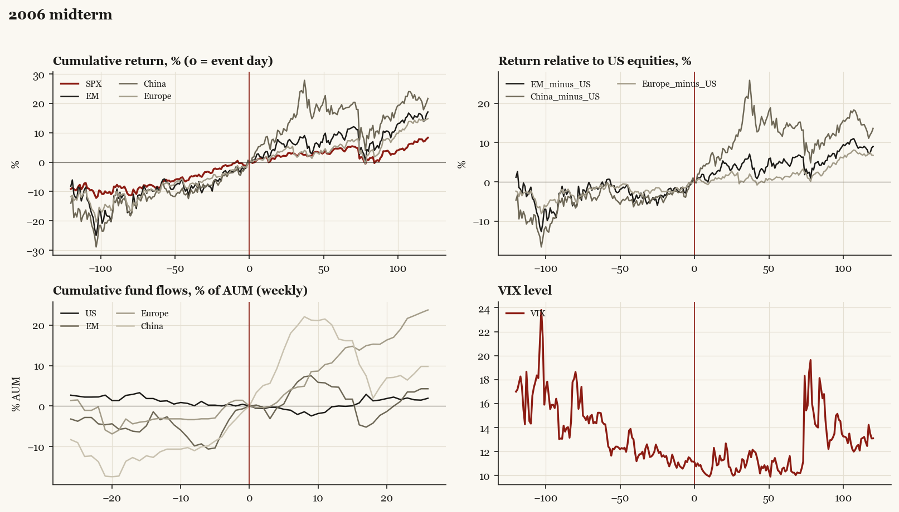

# 2006 midterm

*Midterm election, 2006-11-07. House flipped; Senate flipped.*

[Index](README.md)

## What moved

- Equities ran +8.7% over the 60 trading days into the event.
- The S&P 500 moved +4.6% over the following 60 trading days and +8.3% over 120.
- Cumulative net flows into US equity funds: -0.0% of assets in the 13 weeks after (vs -1.2% in the 13 weeks before).
- Cumulative net flows into emerging-market funds: +4.6% of assets in the 13 weeks after (vs +3.4% in the 13 weeks before).
- Cumulative net flows into Europe funds: +12.5% of assets in the 13 weeks after (vs +3.1% in the 13 weeks before).
- Cumulative net flows into China funds: +16.5% of assets in the 13 weeks after (vs +11.3% in the 13 weeks before).
- Implied volatility moved -0.4 VIX points across the event (from 11.2).
- D sweep

## Detail

| series | runup pre-60d | +20d | +60d | +120d |
|---|---|---|---|---|
| SPX | +8.7% | +2.2% | +4.6% | +8.3% |
| US | +8.6% | +2.3% | +4.5% | +8.1% |
| EM | +9.3% | +7.0% | +10.3% | +17.1% |
| China | +9.4% | +10.4% | +18.0% | +21.7% |
| Taiwan | +8.2% | +8.5% | +6.1% | +4.2% |
| Europe | +10.1% | +3.3% | +5.5% | +14.8% |
| Japan | +1.8% | +2.2% | +4.5% | +4.3% |
| Bonds | +2.7% | +1.4% | -0.8% | -0.3% |
| Gold | -0.3% | +0.9% | +4.4% | +8.5% |
