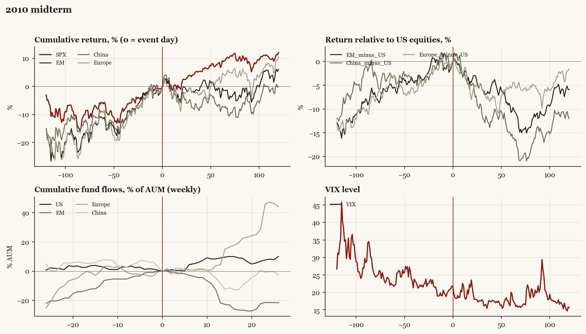

# 2010 midterm

*Midterm election, 2010-11-02. House flipped.*

[Index](README.md)

## What moved

- Equities ran +5.7% over the 60 trading days into the event.
- The S&P 500 moved +6.7% over the following 60 trading days and +12.1% over 120.
- Cumulative net flows into US equity funds: +9.0% of assets in the 13 weeks after (vs -2.5% in the 13 weeks before).
- Cumulative net flows into emerging-market funds: -21.7% of assets in the 13 weeks after (vs +6.3% in the 13 weeks before).
- Cumulative net flows into Europe funds: +4.4% of assets in the 13 weeks after (vs -3.3% in the 13 weeks before).
- Cumulative net flows into China funds: -8.4% of assets in the 13 weeks after (vs -7.7% in the 13 weeks before).
- Implied volatility moved -2.3 VIX points across the event (from 21.8).
- Tea Party House wave

## Detail

| series | runup pre-60d | +20d | +60d | +120d |
|---|---|---|---|---|
| SPX | +5.7% | +1.0% | +6.7% | +12.1% |
| US | +5.6% | +1.3% | +6.7% | +12.1% |
| EM | +11.0% | -2.5% | -4.1% | +6.1% |
| China | +8.6% | -3.4% | -9.0% | +0.0% |
| Taiwan | +9.0% | +2.9% | +10.2% | +10.6% |
| Europe | +8.7% | -5.6% | +1.0% | +10.5% |
| Japan | +1.2% | +4.8% | +8.9% | +2.3% |
| Bonds | +1.3% | -3.3% | -5.5% | -4.7% |
| Gold | +12.2% | +2.2% | -1.7% | +10.0% |
