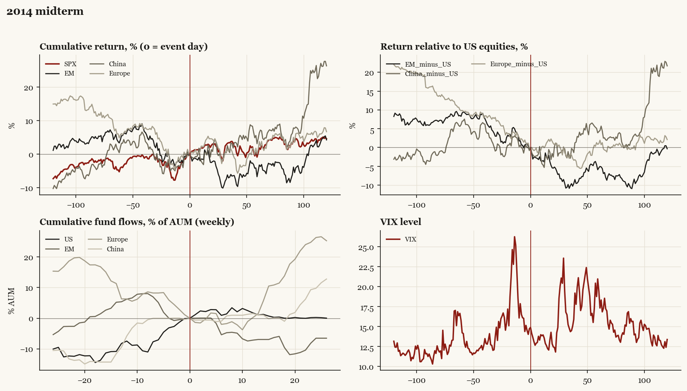

# 2014 midterm

*Midterm election, 2014-11-04. Senate flipped.*

[Index](README.md)

## What moved

- Equities ran +3.8% over the 60 trading days into the event.
- The S&P 500 moved +0.4% over the following 60 trading days and +4.6% over 120.
- Cumulative net flows into US equity funds: +1.0% of assets in the 13 weeks after (vs +8.2% in the 13 weeks before).
- Cumulative net flows into emerging-market funds: -6.9% of assets in the 13 weeks after (vs -5.4% in the 13 weeks before).
- Cumulative net flows into Europe funds: +1.5% of assets in the 13 weeks after (vs -6.3% in the 13 weeks before).
- Cumulative net flows into China funds: +1.0% of assets in the 13 weeks after (vs +9.4% in the 13 weeks before).
- Implied volatility moved -0.6 VIX points across the event (from 14.7).
- Senate flips R

## Detail

| series | runup pre-60d | +20d | +60d | +120d |
|---|---|---|---|---|
| SPX | +3.8% | +3.0% | +0.4% | +4.6% |
| US | +3.7% | +3.3% | +0.4% | +4.6% |
| EM | -5.5% | -2.2% | -5.0% | +4.3% |
| China | -3.3% | +0.8% | +4.7% | +26.3% |
| Taiwan | -0.6% | +0.1% | -1.3% | +6.3% |
| Europe | -6.2% | +4.4% | +1.5% | +6.7% |
| Japan | -0.3% | -0.4% | -1.8% | +11.0% |
| Bonds | +1.4% | +0.6% | +7.2% | +3.0% |
| Gold | -11.5% | +3.6% | +8.8% | +3.0% |
