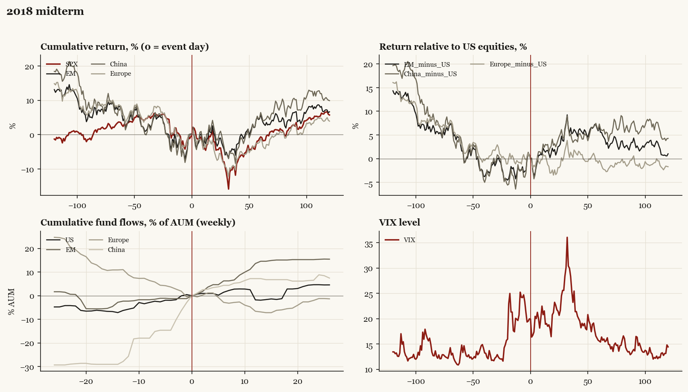

# 2018 midterm

*Midterm election, 2018-11-06. House flipped.*

[Index](README.md)

## What moved

- Equities ran -2.4% over the 60 trading days into the event.
- The S&P 500 moved -0.6% over the following 60 trading days and +5.7% over 120.
- Cumulative net flows into US equity funds: -1.9% of assets in the 13 weeks after (vs +6.3% in the 13 weeks before).
- Cumulative net flows into emerging-market funds: +14.6% of assets in the 13 weeks after (vs +2.3% in the 13 weeks before).
- Cumulative net flows into Europe funds: -6.9% of assets in the 13 weeks after (vs -11.0% in the 13 weeks before).
- Cumulative net flows into China funds: +7.2% of assets in the 13 weeks after (vs +27.8% in the 13 weeks before).
- Implied volatility moved -3.6 VIX points across the event (from 20.0).
- D House; concurrent Q4-2018 Fed-driven selloff

## Detail

| series | runup pre-60d | +20d | +60d | +120d |
|---|---|---|---|---|
| SPX | -2.4% | -2.2% | -0.6% | +5.7% |
| US | -2.5% | -1.9% | -0.8% | +5.6% |
| EM | -4.1% | -0.4% | +5.9% | +6.7% |
| China | -5.8% | +0.8% | +6.4% | +9.9% |
| Taiwan | -8.4% | -2.2% | +0.1% | +6.6% |
| Europe | -5.5% | -5.4% | -1.3% | +3.9% |
| Japan | -3.1% | -2.7% | -1.9% | -0.3% |
| Bonds | -3.8% | +2.9% | +4.8% | +6.1% |
| Gold | +2.6% | +0.9% | +6.9% | +3.5% |
