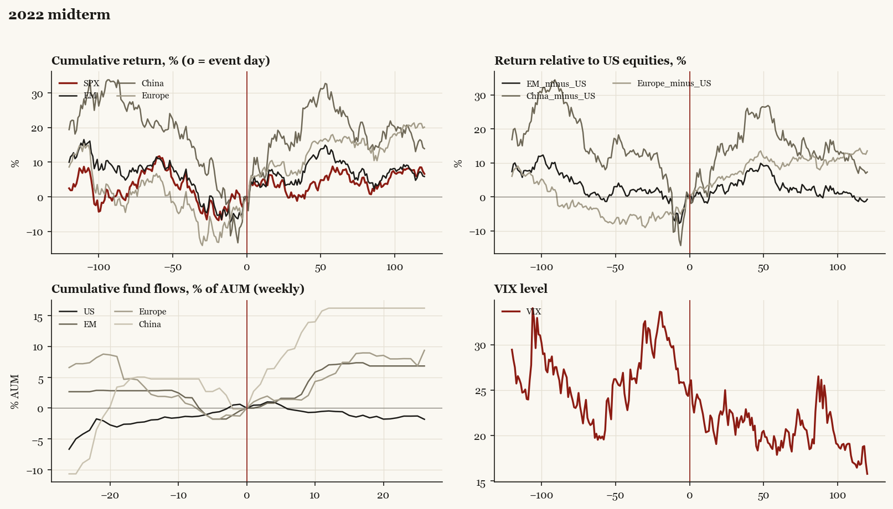

# 2022 midterm

*Midterm election, 2022-11-08. House flipped.*

[Index](README.md)

## What moved

- Equities ran -11.6% over the 60 trading days into the event.
- The S&P 500 moved +7.1% over the following 60 trading days and +6.6% over 120.
- Cumulative net flows into US equity funds: -0.6% of assets in the 13 weeks after (vs +1.9% in the 13 weeks before).
- Cumulative net flows into emerging-market funds: +7.1% of assets in the 13 weeks after (vs -2.8% in the 13 weeks before).
- Cumulative net flows into Europe funds: +5.6% of assets in the 13 weeks after (vs -1.9% in the 13 weeks before).
- Cumulative net flows into China funds: +16.2% of assets in the 13 weeks after (vs -4.7% in the 13 weeks before).
- Implied volatility moved +1.7 VIX points across the event (from 24.4).
- Narrow R House; red wave underperformed expectations

## Detail

| series | runup pre-60d | +20d | +60d | +120d |
|---|---|---|---|---|
| SPX | -11.6% | +2.7% | +7.1% | +6.6% |
| US | -11.7% | +2.9% | +7.1% | +6.6% |
| EM | -11.0% | +6.0% | +9.8% | +5.9% |
| China | -21.6% | +16.1% | +24.5% | +13.9% |
| Taiwan | -18.5% | +11.7% | +1.0% | -0.8% |
| Europe | -5.6% | +8.8% | +15.8% | +20.1% |
| Japan | -9.8% | +5.3% | +10.3% | +12.2% |
| Bonds | -13.2% | +8.6% | +6.9% | +8.2% |
| Gold | -3.9% | +4.3% | +8.7% | +17.2% |
