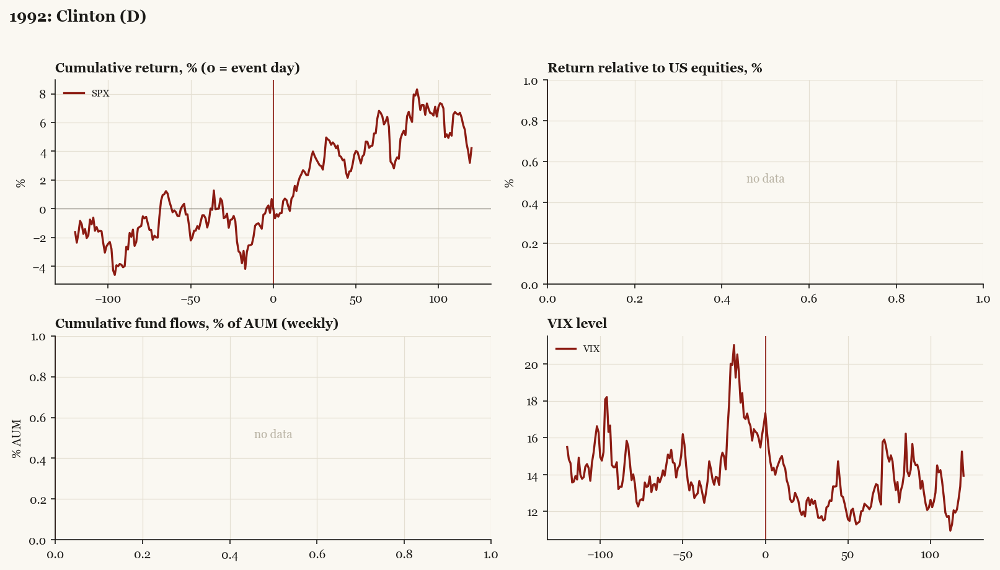

# 1992: Clinton (D)

*Presidential election, 1992-11-03 - winner Clinton (D), party flip, day-before odds of winner ~80%.*

[Index](README.md)

## What moved

- Equities ran +0.1% over the 60 trading days into the event.
- The S&P 500 moved +4.4% over the following 60 trading days and +4.2% over 120.
- Implied volatility moved -0.4 VIX points across the event (from 16.7).
- Clinton clear favorite; unified D government

## Detail

| series | runup pre-60d | +20d | +60d | +120d |
|---|---|---|---|---|
| SPX | +0.1% | +2.3% | +4.4% | +4.2% |
