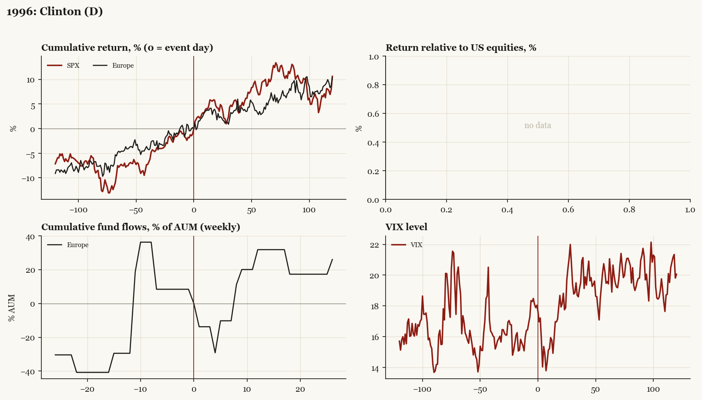

# 1996: Clinton (D)

*Presidential election, 1996-11-05 - winner Clinton (D), incumbent-party hold, day-before odds of winner ~90%.*

[Index](README.md)

## What moved

- Equities ran +7.0% over the 60 trading days into the event.
- The S&P 500 moved +9.6% over the following 60 trading days and +10.6% over 120.
- Cumulative net flows into Europe funds: +31.8% of assets in the 13 weeks after (vs +29.5% in the 13 weeks before).
- Implied volatility moved -1.1 VIX points across the event (from 18.0).
- Landslide hold; R Congress retained

## Detail

| series | runup pre-60d | +20d | +60d | +120d |
|---|---|---|---|---|
| SPX | +7.0% | +4.2% | +9.6% | +10.6% |
| Europe | +4.3% | +1.8% | +3.3% | +10.3% |
| Japan | -6.6% | +0.5% | -16.2% | -15.6% |
