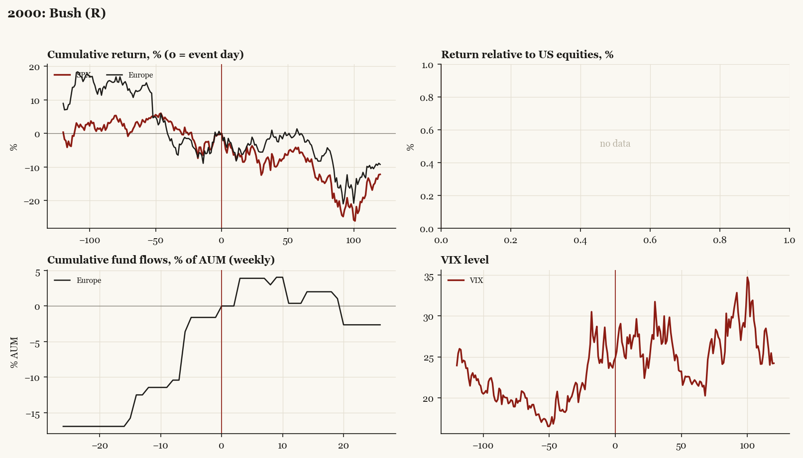

# 2000: Bush (R)

*Presidential election, 2000-11-07 - winner Bush (R), party flip, day-before odds of winner ~50%. Result known only 2000-12-13.*

[Index](README.md)

## What moved

- Equities ran -4.1% over the 60 trading days into the event.
- The S&P 500 moved -5.6% over the following 60 trading days and -12.2% over 120.
- Cumulative net flows into Europe funds: +0.4% of assets in the 13 weeks after (vs +12.5% in the 13 weeks before).
- Implied volatility moved +1.1 VIX points across the event (from 24.5).
- Contested 36 days (Bush v. Gore 12-12, Gore concession 12-13); dot-com unwind backdrop

## Detail

| series | runup pre-60d | +20d | +60d | +120d |
|---|---|---|---|---|
| SPX | -4.1% | -5.8% | -5.6% | -12.2% |
| Europe | -14.3% | -3.0% | -0.0% | -9.2% |
| Japan | -5.6% | -9.0% | -18.7% | -12.5% |
