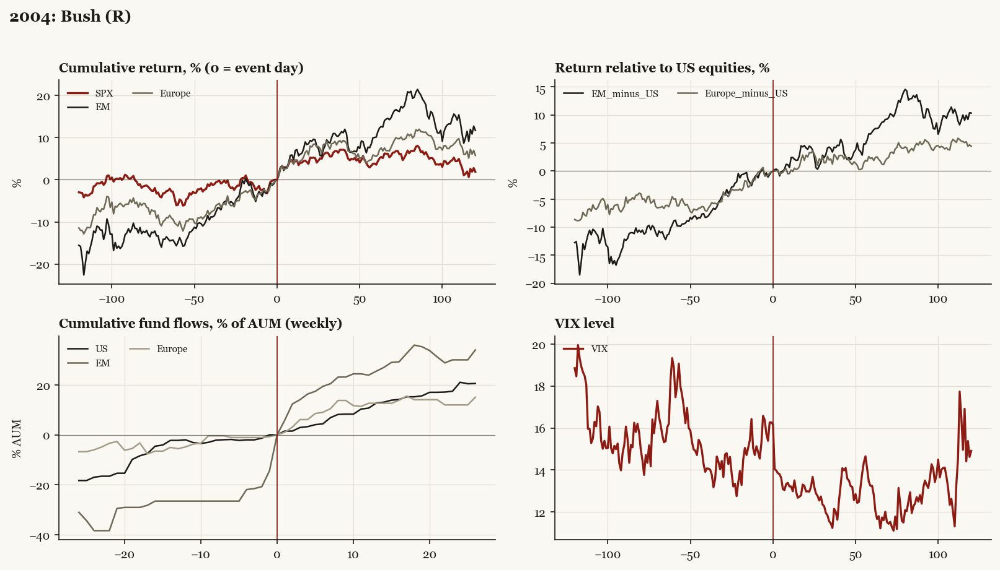

# 2004: Bush (R)

*Presidential election, 2004-11-02 - winner Bush (R), incumbent-party hold, day-before odds of winner ~57%.*

[Index](README.md)

## What moved

- Equities ran +6.0% over the 60 trading days into the event.
- The S&P 500 moved +3.5% over the following 60 trading days and +1.9% over 120.
- Cumulative net flows into US equity funds: +12.7% of assets in the 13 weeks after (vs +2.2% in the 13 weeks before).
- Cumulative net flows into emerging-market funds: +25.5% of assets in the 13 weeks after (vs +26.5% in the 13 weeks before).
- Cumulative net flows into Europe funds: +12.6% of assets in the 13 weeks after (vs +5.6% in the 13 weeks before).
- Implied volatility moved -2.2 VIX points across the event (from 16.3).
- Close but priced hold

## Detail

| series | runup pre-60d | +20d | +60d | +120d |
|---|---|---|---|---|
| SPX | +6.0% | +5.2% | +3.5% | +1.9% |
| US | +5.9% | +5.2% | +3.2% | +1.3% |
| EM | +14.8% | +9.3% | +10.1% | +11.7% |
| Taiwan | +9.7% | +4.7% | +5.4% | +4.3% |
| Europe | +11.0% | +8.0% | +5.5% | +5.8% |
| Japan | +4.9% | +4.2% | +5.5% | +1.0% |
| Bonds | +1.6% | -1.9% | +1.0% | +0.4% |
