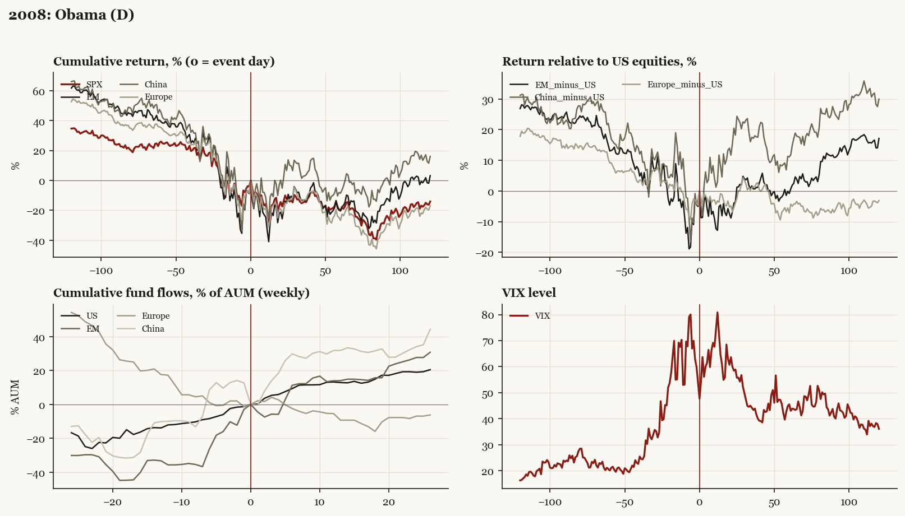

# 2008: Obama (D)

*Presidential election, 2008-11-04 - winner Obama (D), party flip, day-before odds of winner ~85%.*

[Index](README.md)

## What moved

- Equities ran -26.1% over the 60 trading days into the event.
- The S&P 500 moved -19.8% over the following 60 trading days and -14.1% over 120.
- Cumulative net flows into US equity funds: +12.9% of assets in the 13 weeks after (vs +13.8% in the 13 weeks before).
- Cumulative net flows into emerging-market funds: +14.1% of assets in the 13 weeks after (vs +33.2% in the 13 weeks before).
- Cumulative net flows into Europe funds: -9.3% of assets in the 13 weeks after (vs -17.6% in the 13 weeks before).
- Cumulative net flows into China funds: +31.9% of assets in the 13 weeks after (vs +10.1% in the 13 weeks before).
- Implied volatility moved +0.9 VIX points across the event (from 53.7).
- GFC dominates the window (Lehman 2008-09-15)

## Detail

| series | runup pre-60d | +20d | +60d | +120d |
|---|---|---|---|---|
| SPX | -26.1% | -14.4% | -19.8% | -14.1% |
| US | -26.3% | -13.8% | -19.6% | -13.9% |
| EM | -39.3% | -21.3% | -20.4% | +3.3% |
| China | -45.5% | +0.1% | -8.5% | +16.1% |
| Taiwan | -39.3% | -22.3% | -32.6% | +4.8% |
| Europe | -35.4% | -19.0% | -26.8% | -17.0% |
| Japan | -20.2% | -10.0% | -12.6% | -11.0% |
| Bonds | +0.2% | +9.1% | +8.0% | +5.1% |
| Gold | -7.2% | +0.7% | +16.0% | +15.6% |
