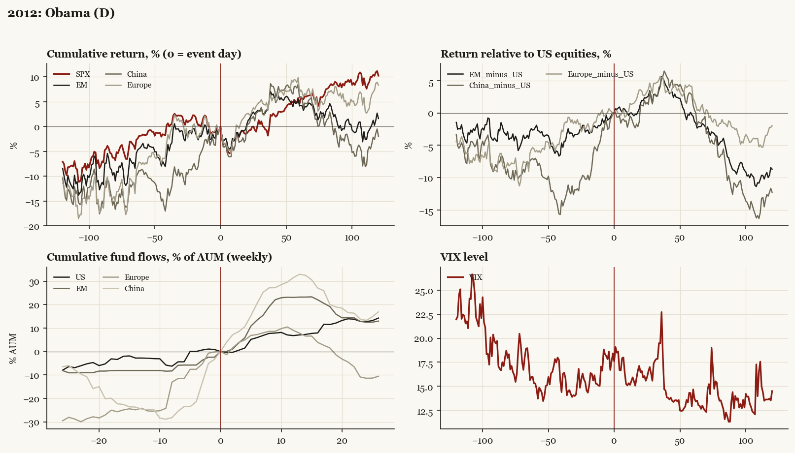

# 2012: Obama (D)

*Presidential election, 2012-11-06 - winner Obama (D), incumbent-party hold, day-before odds of winner ~70%.*

[Index](README.md)

## What moved

- Equities ran +1.8% over the 60 trading days into the event.
- The S&P 500 moved +4.6% over the following 60 trading days and +10.3% over 120.
- Cumulative net flows into US equity funds: +7.1% of assets in the 13 weeks after (vs +2.8% in the 13 weeks before).
- Cumulative net flows into emerging-market funds: +23.2% of assets in the 13 weeks after (vs +8.1% in the 13 weeks before).
- Cumulative net flows into Europe funds: +7.8% of assets in the 13 weeks after (vs +24.2% in the 13 weeks before).
- Cumulative net flows into China funds: +32.9% of assets in the 13 weeks after (vs +24.5% in the 13 weeks before).
- Implied volatility moved +0.7 VIX points across the event (from 18.4).
- Priced hold; divided government

## Detail

| series | runup pre-60d | +20d | +60d | +120d |
|---|---|---|---|---|
| SPX | +1.8% | -1.3% | +4.6% | +10.3% |
| US | +1.6% | -1.0% | +4.7% | +10.3% |
| EM | +3.8% | +0.5% | +4.2% | +1.6% |
| China | +8.6% | +0.2% | +5.8% | -1.9% |
| Taiwan | +2.0% | +5.6% | +4.0% | +7.4% |
| Europe | +7.6% | +2.6% | +6.9% | +8.4% |
| Japan | -1.3% | +2.2% | +8.9% | +24.0% |
| Bonds | -1.0% | +1.4% | -2.1% | +1.0% |
| Gold | +5.8% | -1.3% | -2.6% | -16.4% |
