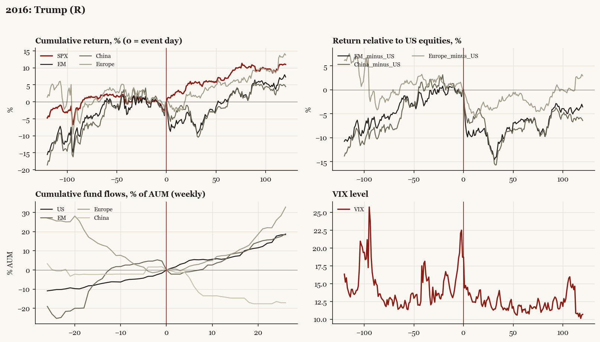

# 2016: Trump (R)

*Presidential election, 2016-11-08 - winner Trump (R), party flip, day-before odds of winner ~22%.*

[Index](README.md)

## What moved

- Equities ran -2.3% over the 60 trading days into the event.
- The S&P 500 moved +6.9% over the following 60 trading days and +11.0% over 120.
- Cumulative net flows into US equity funds: +5.9% of assets in the 13 weeks after (vs +6.6% in the 13 weeks before).
- Cumulative net flows into emerging-market funds: +5.8% of assets in the 13 weeks after (vs +1.1% in the 13 weeks before).
- Cumulative net flows into Europe funds: +7.6% of assets in the 13 weeks after (vs -12.2% in the 13 weeks before).
- Cumulative net flows into China funds: -14.3% of assets in the 13 weeks after (vs +2.2% in the 13 weeks before).
- Implied volatility moved -4.3 VIX points across the event (from 18.7).
- SURPRISE. Overnight futures -5 percent then reversal; reflation rotation

## Detail

| series | runup pre-60d | +20d | +60d | +120d |
|---|---|---|---|---|
| SPX | -2.3% | +4.6% | +6.9% | +11.0% |
| US | -2.3% | +4.8% | +6.8% | +10.9% |
| EM | -1.0% | -3.4% | +0.5% | +7.3% |
| China | -0.2% | -1.0% | -1.4% | +4.5% |
| Taiwan | +1.8% | -1.5% | -0.2% | +7.7% |
| Europe | -3.5% | +2.2% | +4.6% | +13.8% |
| Japan | +0.4% | +1.4% | +2.3% | +5.0% |
| Bonds | -3.3% | -4.6% | -4.9% | -3.9% |
| Gold | -4.9% | -8.5% | -3.2% | -3.1% |
