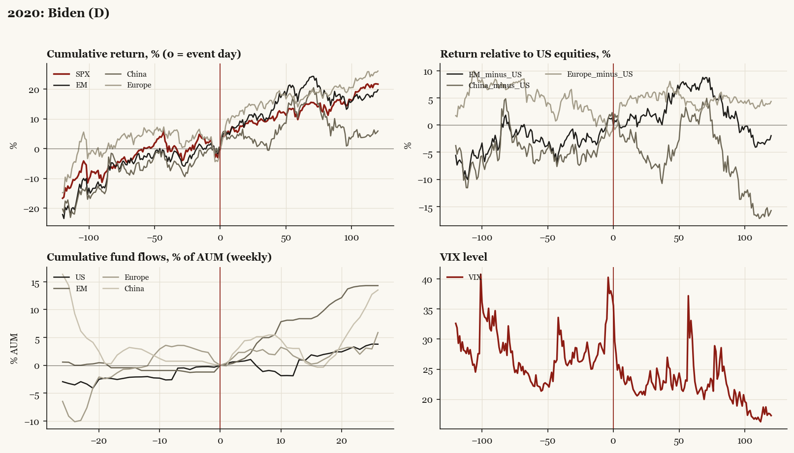

# 2020: Biden (D)

*Presidential election, 2020-11-03 - winner Biden (D), party flip, day-before odds of winner ~65%. Result known only 2020-11-07.*

[Index](README.md)

## What moved

- Equities ran +0.3% over the 60 trading days into the event.
- The S&P 500 moved +11.3% over the following 60 trading days and +21.6% over 120.
- Cumulative net flows into US equity funds: +1.0% of assets in the 13 weeks after (vs +2.1% in the 13 weeks before).
- Cumulative net flows into emerging-market funds: +8.4% of assets in the 13 weeks after (vs +0.9% in the 13 weeks before).
- Cumulative net flows into Europe funds: +1.2% of assets in the 13 weeks after (vs +0.4% in the 13 weeks before).
- Cumulative net flows into China funds: +3.0% of assets in the 13 weeks after (vs -2.9% in the 13 weeks before).
- Implied volatility moved -7.6 VIX points across the event (from 37.1).
- Called Saturday 11-07; Pfizer vaccine news Monday 11-09 contaminates post-window; Senate unified only after GA runoffs 2021-01-05

## Detail

| series | runup pre-60d | +20d | +60d | +120d |
|---|---|---|---|---|
| SPX | +0.3% | +8.5% | +11.3% | +21.6% |
| US | +0.1% | +8.7% | +11.3% | +21.7% |
| EM | +3.4% | +9.2% | +18.6% | +19.7% |
| China | +7.2% | +3.5% | +13.1% | +5.9% |
| Taiwan | +1.3% | +9.4% | +20.6% | +34.5% |
| Europe | -4.2% | +13.9% | +15.2% | +26.0% |
| Japan | +6.6% | +8.8% | +11.9% | +12.3% |
| Bonds | -3.6% | -0.3% | -1.5% | -6.7% |
| Gold | -6.1% | -4.2% | -2.6% | -6.8% |
