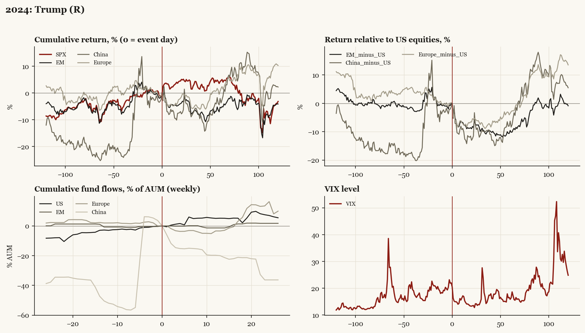

# 2024: Trump (R)

*Presidential election, 2024-11-05 - winner Trump (R), party flip, day-before odds of winner ~55%.*

[Index](README.md)

## What moved

- Equities ran +7.9% over the 60 trading days into the event.
- The S&P 500 moved +4.3% over the following 60 trading days and -3.1% over 120.
- Cumulative net flows into US equity funds: +5.2% of assets in the 13 weeks after (vs +2.8% in the 13 weeks before).
- Cumulative net flows into emerging-market funds: -1.4% of assets in the 13 weeks after (vs +0.8% in the 13 weeks before).
- Cumulative net flows into Europe funds: -3.4% of assets in the 13 weeks after (vs -1.9% in the 13 weeks before).
- Cumulative net flows into China funds: -20.0% of assets in the 13 weeks after (vs +50.5% in the 13 weeks before).
- Implied volatility moved -5.7 VIX points across the event (from 22.0).
- Partially priced; decisive sweep; 2025-04-02 tariffs treated as separate shock

## Detail

| series | runup pre-60d | +20d | +60d | +120d |
|---|---|---|---|---|
| SPX | +7.9% | +5.1% | +4.3% | -3.1% |
| US | +7.8% | +5.2% | +4.3% | -3.2% |
| EM | +7.0% | -3.7% | -5.3% | -4.1% |
| China | +21.9% | -7.8% | -2.0% | +2.3% |
| Taiwan | +7.6% | -1.7% | -7.8% | -15.7% |
| Europe | +4.2% | -1.3% | +0.8% | +10.3% |
| Japan | +5.0% | +3.0% | -1.2% | +3.0% |
| Bonds | -2.8% | +1.0% | -2.4% | -1.1% |
| Gold | +10.4% | -3.5% | +3.6% | +16.1% |
