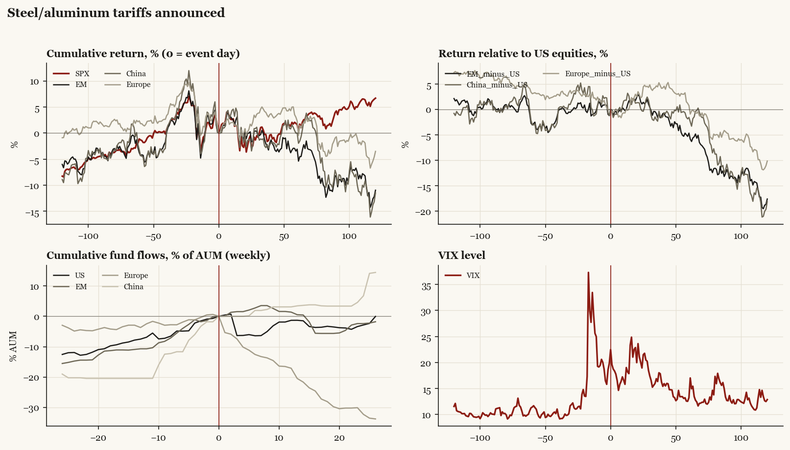

# Steel/aluminum tariffs announced

*Trump1 administration tariff/policy shock, 2018-03-01.*

[Index](README.md)

## What moved

- Equities ran +1.3% over the 60 trading days into the event.
- The S&P 500 moved +1.6% over the following 60 trading days and +6.7% over 120.
- Cumulative net flows into US equity funds: -1.3% of assets in the 13 weeks after (vs +7.5% in the 13 weeks before).
- Cumulative net flows into emerging-market funds: +0.5% of assets in the 13 weeks after (vs +10.7% in the 13 weeks before).
- Cumulative net flows into Europe funds: -20.5% of assets in the 13 weeks after (vs +3.7% in the 13 weeks before).
- Cumulative net flows into China funds: +3.4% of assets in the 13 weeks after (vs +20.4% in the 13 weeks before).
- Implied volatility moved -0.3 VIX points across the event (from 19.9).

## Detail

| series | runup pre-60d | +20d | +60d | +120d |
|---|---|---|---|---|
| SPX | +1.3% | -1.4% | +1.6% | +6.7% |
| US | +1.3% | -1.6% | +1.6% | +6.6% |
| EM | +4.3% | +0.8% | -3.1% | -11.0% |
| China | +4.3% | -0.3% | -0.0% | -11.5% |
| Taiwan | -0.5% | +4.1% | +0.8% | +0.8% |
| Europe | -1.8% | +0.8% | +2.3% | -3.5% |
| Japan | -0.6% | +2.3% | +1.4% | -3.2% |
| Bonds | -3.9% | +1.1% | -0.3% | +0.6% |
| Gold | +2.6% | +0.9% | -1.1% | -9.7% |
