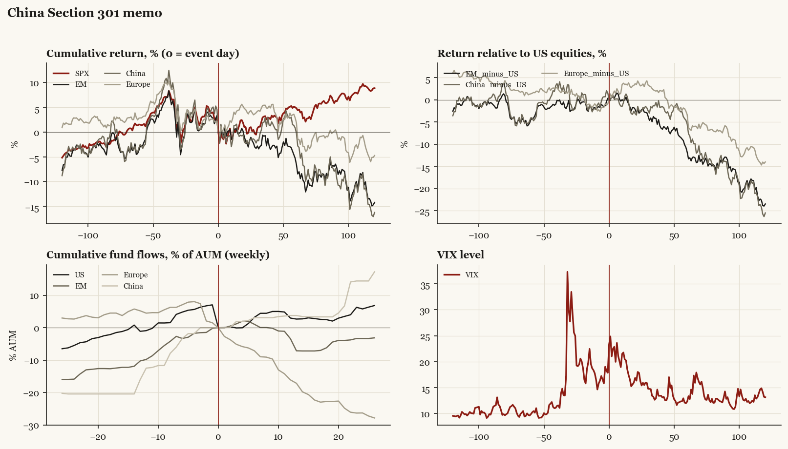

# China Section 301 memo

*Trump1 administration tariff/policy shock, 2018-03-22.*

[Index](README.md)

## What moved

- Equities ran -1.5% over the 60 trading days into the event.
- The S&P 500 moved +4.8% over the following 60 trading days and +8.9% over 120.
- Cumulative net flows into US equity funds: +2.7% of assets in the 13 weeks after (vs +1.1% in the 13 weeks before).
- Cumulative net flows into emerging-market funds: -7.1% of assets in the 13 weeks after (vs +10.3% in the 13 weeks before).
- Cumulative net flows into Europe funds: -17.2% of assets in the 13 weeks after (vs -5.2% in the 13 weeks before).
- Cumulative net flows into China funds: +3.8% of assets in the 13 weeks after (vs +16.0% in the 13 weeks before).
- Implied volatility moved +7.0 VIX points across the event (from 17.9).

## Detail

| series | runup pre-60d | +20d | +60d | +120d |
|---|---|---|---|---|
| SPX | -1.5% | +1.0% | +4.8% | +8.9% |
| US | -1.5% | +1.1% | +5.2% | +9.3% |
| EM | +2.9% | -1.0% | -6.6% | -14.2% |
| China | +2.5% | -2.0% | -0.3% | -16.3% |
| Taiwan | +5.5% | -2.8% | -4.2% | -3.1% |
| Europe | -2.9% | +4.8% | +1.9% | -4.8% |
| Japan | -0.8% | +1.9% | +0.6% | -4.3% |
| Bonds | -2.7% | -1.0% | -0.4% | -0.9% |
| Gold | +4.0% | +0.5% | -3.9% | -9.8% |
