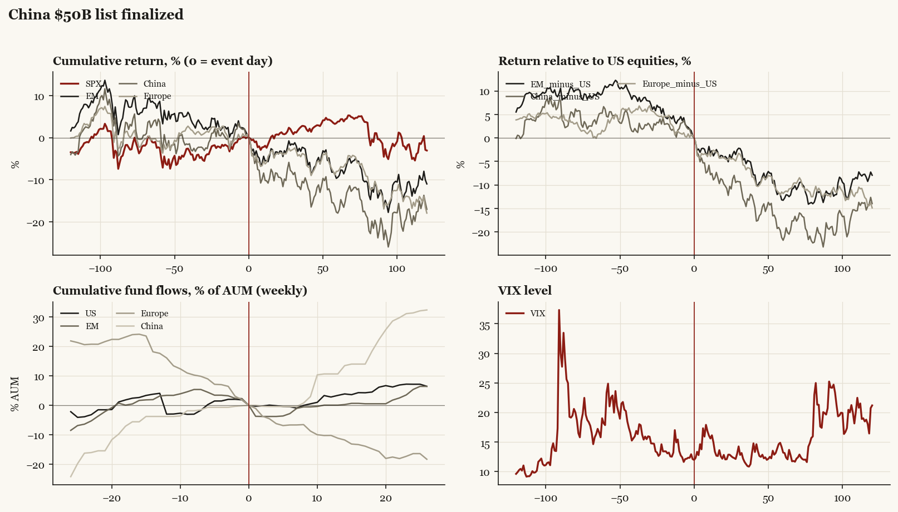

# China $50B list finalized

*Trump1 administration tariff/policy shock, 2018-06-15.*

[Index](README.md)

## What moved

- Equities ran +2.5% over the 60 trading days into the event.
- The S&P 500 moved +3.8% over the following 60 trading days and -3.1% over 120.
- Cumulative net flows into US equity funds: +3.4% of assets in the 13 weeks after (vs -4.1% in the 13 weeks before).
- Cumulative net flows into emerging-market funds: +0.1% of assets in the 13 weeks after (vs -3.2% in the 13 weeks before).
- Cumulative net flows into Europe funds: -11.2% of assets in the 13 weeks after (vs -17.7% in the 13 weeks before).
- Cumulative net flows into China funds: +10.7% of assets in the 13 weeks after (vs +3.8% in the 13 weeks before).
- Implied volatility moved +0.2 VIX points across the event (from 12.1).

## Detail

| series | runup pre-60d | +20d | +60d | +120d |
|---|---|---|---|---|
| SPX | +2.5% | +0.7% | +3.8% | -3.1% |
| US | +2.4% | +0.4% | +3.8% | -3.1% |
| EM | -8.6% | -3.9% | -9.4% | -11.0% |
| China | -3.7% | -9.4% | -17.9% | -17.0% |
| Taiwan | -5.1% | -1.0% | +0.1% | -11.2% |
| Europe | +0.8% | -3.8% | -8.0% | -17.9% |
| Japan | +0.4% | -4.6% | -5.8% | -11.2% |
| Bonds | +0.1% | +0.9% | -0.6% | -0.6% |
| Gold | -4.1% | -3.1% | -6.8% | -3.6% |
