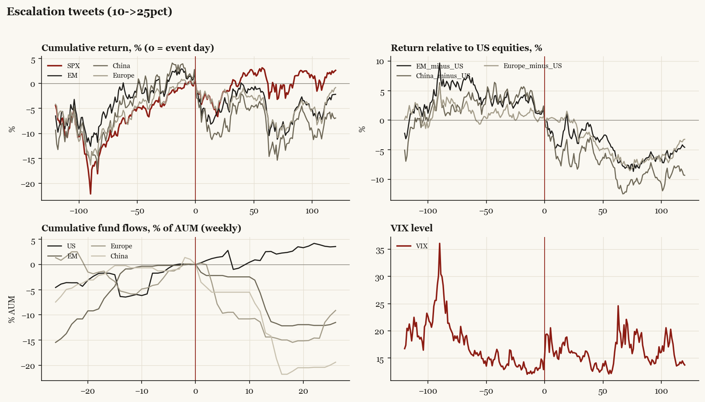

# Escalation tweets (10->25pct)

*Trump1 administration tariff/policy shock, 2019-05-05.*

[Index](README.md)

## What moved

- Equities ran +8.0% over the 60 trading days into the event.
- The S&P 500 moved +1.6% over the following 60 trading days and +2.6% over 120.
- Cumulative net flows into US equity funds: +2.5% of assets in the 13 weeks after (vs +6.5% in the 13 weeks before).
- Cumulative net flows into emerging-market funds: -8.9% of assets in the 13 weeks after (vs +0.9% in the 13 weeks before).
- Cumulative net flows into Europe funds: -14.4% of assets in the 13 weeks after (vs +5.5% in the 13 weeks before).
- Cumulative net flows into China funds: -13.6% of assets in the 13 weeks after (vs +0.2% in the 13 weeks before).
- Implied volatility moved +6.5 VIX points across the event (from 12.9).

## Detail

| series | runup pre-60d | +20d | +60d | +120d |
|---|---|---|---|---|
| SPX | +8.0% | -4.5% | +1.6% | +2.6% |
| US | +8.1% | -4.3% | +1.5% | +2.4% |
| EM | +2.2% | -5.1% | -3.7% | -2.2% |
| China | +4.8% | -10.0% | -6.6% | -6.9% |
| Taiwan | +7.8% | -7.0% | -1.4% | +7.7% |
| Europe | +7.5% | -3.5% | -5.2% | -0.8% |
| Japan | +4.0% | -3.2% | -1.9% | +4.8% |
| Bonds | +1.4% | +3.3% | +4.4% | +7.0% |
| Gold | -2.4% | +3.6% | +9.9% | +16.0% |
