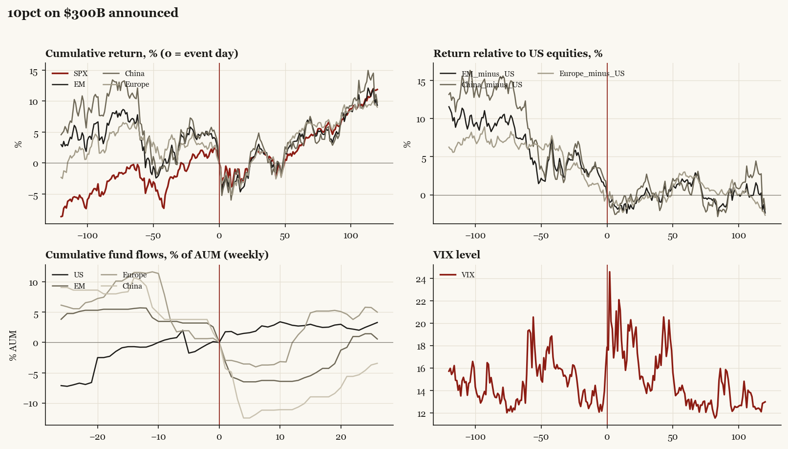

# 10pct on $300B announced

*Trump1 administration tariff/policy shock, 2019-08-01.*

[Index](README.md)

## What moved

- Equities ran +2.4% over the 60 trading days into the event.
- The S&P 500 moved +2.3% over the following 60 trading days and +11.9% over 120.
- Cumulative net flows into US equity funds: +2.7% of assets in the 13 weeks after (vs +0.8% in the 13 weeks before).
- Cumulative net flows into emerging-market funds: -6.3% of assets in the 13 weeks after (vs -5.7% in the 13 weeks before).
- Cumulative net flows into Europe funds: +1.3% of assets in the 13 weeks after (vs -11.5% in the 13 weeks before).
- Cumulative net flows into China funds: -10.7% of assets in the 13 weeks after (vs -10.3% in the 13 weeks before).
- Implied volatility moved +1.5 VIX points across the event (from 16.1).

## Detail

| series | runup pre-60d | +20d | +60d | +120d |
|---|---|---|---|---|
| SPX | +2.4% | -1.0% | +2.3% | +11.9% |
| US | +2.3% | -0.8% | +2.3% | +11.7% |
| EM | -3.7% | -2.6% | +4.2% | +9.3% |
| China | -6.4% | -1.7% | +3.3% | +9.8% |
| Taiwan | -2.4% | +0.1% | +11.2% | +16.3% |
| Europe | -3.7% | -2.2% | +4.7% | +9.0% |
| Japan | -0.1% | -1.1% | +6.7% | +9.5% |
| Bonds | +5.1% | +4.4% | +1.2% | +2.2% |
| Gold | +11.8% | +5.6% | +4.0% | +7.7% |
