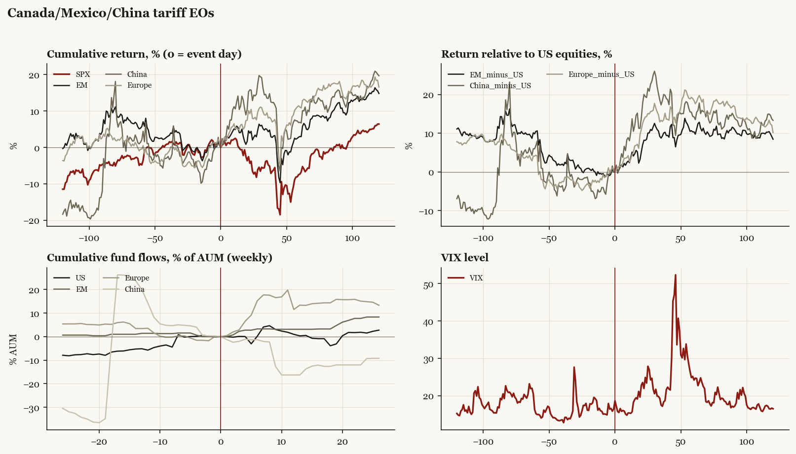

# Canada/Mexico/China tariff EOs

*Trump2 administration tariff/policy shock, 2025-02-01.*

[Index](README.md)

## What moved

- Equities ran +4.8% over the 60 trading days into the event.
- The S&P 500 moved -7.4% over the following 60 trading days and +6.4% over 120.
- Cumulative net flows into US equity funds: +0.3% of assets in the 13 weeks after (vs +5.2% in the 13 weeks before).
- Cumulative net flows into emerging-market funds: +3.1% of assets in the 13 weeks after (vs -1.4% in the 13 weeks before).
- Cumulative net flows into Europe funds: +13.3% of assets in the 13 weeks after (vs -3.4% in the 13 weeks before).
- Cumulative net flows into China funds: -16.3% of assets in the 13 weeks after (vs -20.0% in the 13 weeks before).
- Implied volatility moved +0.8 VIX points across the event (from 16.4).

## Detail

| series | runup pre-60d | +20d | +60d | +120d |
|---|---|---|---|---|
| SPX | +4.8% | -3.7% | -7.4% | +6.4% |
| US | +4.8% | -3.6% | -7.4% | +6.3% |
| EM | -5.7% | +1.6% | +3.0% | +14.8% |
| China | -2.0% | +10.4% | +6.9% | +19.6% |
| Taiwan | -7.9% | +0.1% | -7.2% | +14.7% |
| Europe | +0.5% | +7.4% | +11.1% | +16.5% |
| Japan | -0.6% | +1.4% | +5.4% | +9.3% |
| Bonds | -2.3% | +2.6% | +2.3% | +0.1% |
| Gold | +2.8% | +3.5% | +15.6% | +16.2% |
