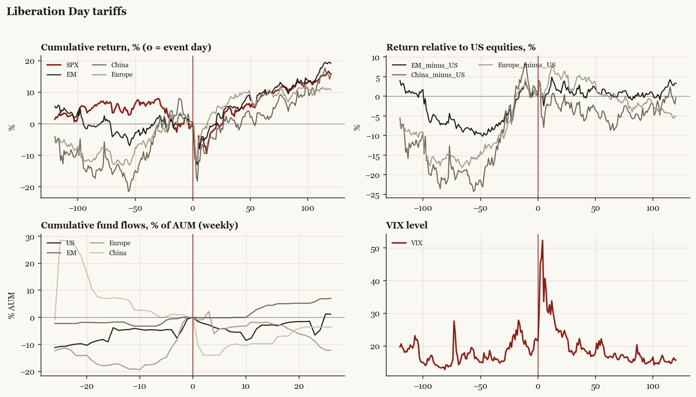

# Liberation Day tariffs

*Trump2 administration tariff/policy shock, 2025-04-02.*

[Index](README.md)

## What moved

- Equities ran -4.7% over the 60 trading days into the event.
- The S&P 500 moved +9.0% over the following 60 trading days and +15.7% over 120.
- Cumulative net flows into US equity funds: -2.9% of assets in the 13 weeks after (vs +4.6% in the 13 weeks before).
- Cumulative net flows into emerging-market funds: +3.6% of assets in the 13 weeks after (vs +1.7% in the 13 weeks before).
- Cumulative net flows into Europe funds: -1.9% of assets in the 13 weeks after (vs +18.2% in the 13 weeks before).
- Cumulative net flows into China funds: -9.7% of assets in the 13 weeks after (vs -6.8% in the 13 weeks before).
- Implied volatility moved +8.2 VIX points across the event (from 21.8).

## Detail

| series | runup pre-60d | +20d | +60d | +120d |
|---|---|---|---|---|
| SPX | -4.7% | -1.2% | +9.0% | +15.7% |
| US | -4.7% | -1.1% | +9.0% | +15.8% |
| EM | +3.6% | -0.3% | +9.8% | +19.1% |
| China | +15.6% | -5.0% | +2.5% | +15.4% |
| Taiwan | -7.5% | -1.4% | +16.9% | +27.1% |
| Europe | +12.9% | +3.2% | +9.2% | +10.7% |
| Japan | +1.4% | +4.2% | +9.4% | +17.0% |
| Bonds | +3.3% | -1.1% | -0.9% | -0.1% |
| Gold | +16.9% | +3.2% | +5.6% | +17.6% |
