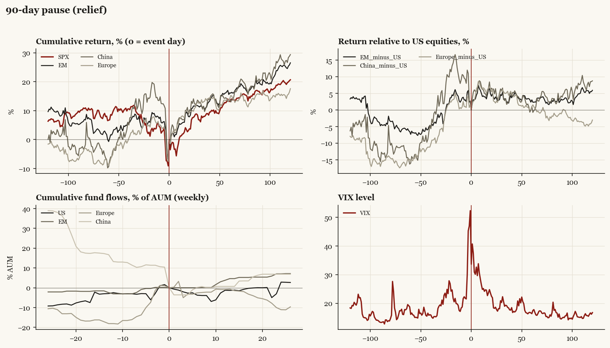

# 90-day pause (relief)

*Trump2 administration tariff/policy shock, 2025-04-09.*

[Index](README.md)

## What moved

- Equities ran -6.7% over the 60 trading days into the event.
- The S&P 500 moved +13.2% over the following 60 trading days and +20.7% over 120.
- Cumulative net flows into US equity funds: -1.3% of assets in the 13 weeks after (vs +2.9% in the 13 weeks before).
- Cumulative net flows into emerging-market funds: +4.6% of assets in the 13 weeks after (vs +2.5% in the 13 weeks before).
- Cumulative net flows into Europe funds: -0.7% of assets in the 13 weeks after (vs +18.1% in the 13 weeks before).
- Cumulative net flows into China funds: +0.7% of assets in the 13 weeks after (vs -16.7% in the 13 weeks before).
- Implied volatility moved -11.6 VIX points across the event (from 52.3).

## Detail

| series | runup pre-60d | +20d | +60d | +120d |
|---|---|---|---|---|
| SPX | -6.7% | +3.7% | +13.2% | +20.7% |
| US | -6.7% | +3.8% | +13.2% | +20.7% |
| EM | +0.7% | +7.9% | +16.2% | +26.6% |
| China | +9.3% | +10.3% | +14.2% | +29.4% |
| Taiwan | -11.5% | +13.3% | +25.3% | +35.9% |
| Europe | +8.7% | +9.2% | +14.2% | +17.6% |
| Japan | +1.4% | +8.0% | +9.8% | +19.0% |
| Bonds | +3.3% | -0.9% | -1.1% | +1.6% |
| Gold | +15.0% | +6.6% | +6.4% | +22.2% |
