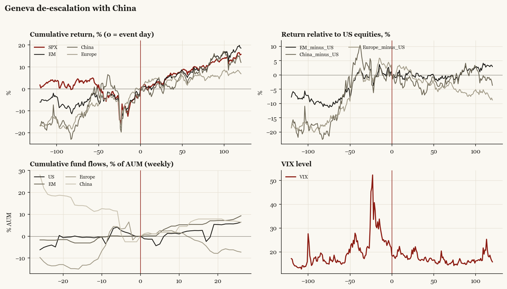

# Geneva de-escalation with China

*Trump2 administration tariff/policy shock, 2025-05-12.*

[Index](README.md)

## What moved

- Equities ran -4.5% over the 60 trading days into the event.
- The S&P 500 moved +8.1% over the following 60 trading days and +15.7% over 120.
- Cumulative net flows into US equity funds: +2.5% of assets in the 13 weeks after (vs +0.5% in the 13 weeks before).
- Cumulative net flows into emerging-market funds: +5.4% of assets in the 13 weeks after (vs +3.1% in the 13 weeks before).
- Cumulative net flows into Europe funds: -0.7% of assets in the 13 weeks after (vs +12.8% in the 13 weeks before).
- Cumulative net flows into China funds: +6.6% of assets in the 13 weeks after (vs -12.4% in the 13 weeks before).
- Implied volatility moved -3.7 VIX points across the event (from 21.9).

## Detail

| series | runup pre-60d | +20d | +60d | +120d |
|---|---|---|---|---|
| SPX | -4.5% | +3.3% | +8.1% | +15.7% |
| US | -4.5% | +3.4% | +8.1% | +15.7% |
| EM | +4.0% | +4.0% | +7.8% | +18.6% |
| China | +5.7% | +2.2% | +5.1% | +12.0% |
| Taiwan | +0.2% | +5.2% | +13.1% | +23.0% |
| Europe | +7.3% | +4.6% | +4.5% | +6.9% |
| Japan | +5.0% | +1.5% | +5.1% | +13.7% |
| Bonds | -0.6% | -0.0% | +1.8% | +3.7% |
| Gold | +9.8% | +2.9% | +4.9% | +21.2% |
