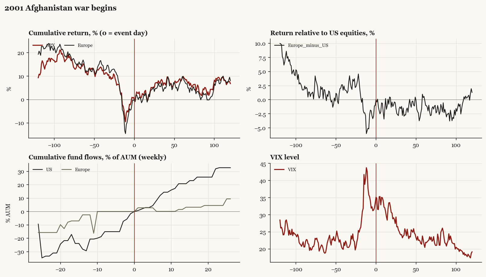

# 2001 Afghanistan war begins

*Bush administration. Outbreak/event 2001-10-07, buildup from 2001-09-11. Telegraphed; type: campaign.*

[Index](README.md)

## What moved

- Equities ran -12.1% over the 60 trading days into the event.
- The S&P 500 moved +9.2% over the following 60 trading days and +6.8% over 120.
- Cumulative net flows into US equity funds: +20.8% of assets in the 13 weeks after (vs +29.4% in the 13 weeks before).
- Cumulative net flows into Europe funds: +1.5% of assets in the 13 weeks after (vs +2.5% in the 13 weeks before).
- Implied volatility moved +1.4 VIX points across the event (from 33.4).
- Post-9/11; the 9/11 shock itself is a separate market event

## Detail

| series | runup pre-60d | +20d | +60d | +120d |
|---|---|---|---|---|
| SPX | -12.1% | +3.7% | +9.2% | +6.8% |
| US | -11.7% | +3.8% | +9.2% | +6.8% |
| Taiwan | -31.9% | +16.1% | +46.2% | +52.2% |
| Europe | -12.2% | +3.3% | +9.8% | +8.1% |
| Japan | -13.3% | +0.0% | -7.2% | -8.1% |
