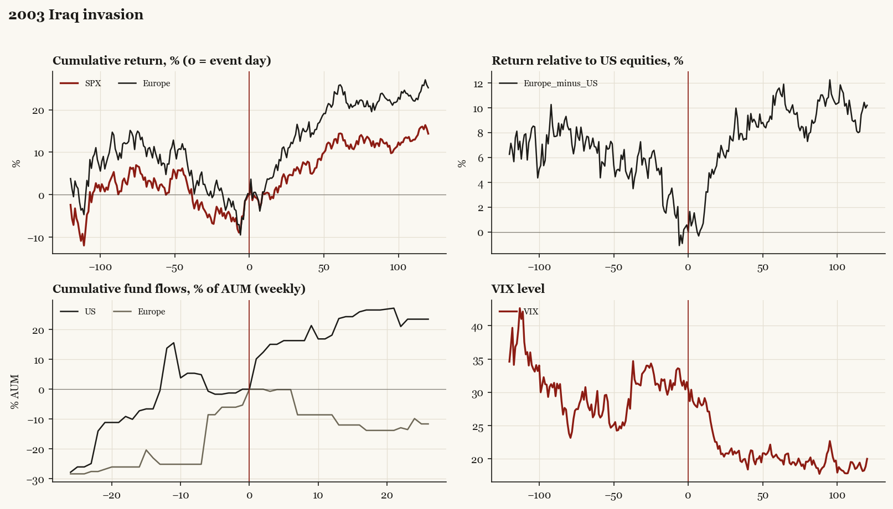

# 2003 Iraq invasion

*Bush administration. Outbreak/event 2003-03-20, buildup from 2002-09-12. Telegraphed; type: campaign.*

[Index](README.md)

## What moved

- Equities ran -2.3% over the 60 trading days into the event.
- The S&P 500 moved +14.3% over the following 60 trading days and +14.4% over 120.
- Cumulative net flows into US equity funds: +23.7% of assets in the 13 weeks after (vs +0.5% in the 13 weeks before).
- Cumulative net flows into Europe funds: -12.0% of assets in the 13 weeks after (vs +25.2% in the 13 weeks before).
- Implied volatility moved -2.9 VIX points across the event (from 31.5).
- Classic buildup-then-outbreak case; SPX bottom 2003-03-11

## Detail

| series | runup pre-60d | +20d | +60d | +120d |
|---|---|---|---|---|
| SPX | -2.3% | +2.0% | +14.3% | +14.4% |
| US | -2.2% | +1.9% | +14.3% | +15.0% |
| Taiwan | +5.3% | -1.7% | +6.1% | +23.7% |
| Europe | -9.5% | +8.3% | +25.7% | +25.2% |
| Japan | -2.7% | -3.5% | +8.8% | +26.0% |
| Bonds | -0.2% | +0.6% | +7.7% | -2.0% |
