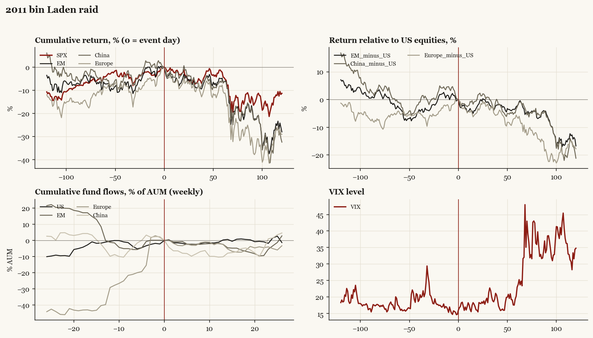

# 2011 bin Laden raid

*Obama administration. Outbreak/event 2011-05-02, no buildup window. Surprise; type: one_off.*

[Index](README.md)

## What moved

- Equities ran +4.1% over the 60 trading days into the event.
- The S&P 500 moved -4.2% over the following 60 trading days and -11.3% over 120.
- Cumulative net flows into US equity funds: +0.3% of assets in the 13 weeks after (vs +1.0% in the 13 weeks before).
- Cumulative net flows into emerging-market funds: -2.4% of assets in the 13 weeks after (vs +0.1% in the 13 weeks before).
- Cumulative net flows into Europe funds: -2.5% of assets in the 13 weeks after (vs +39.8% in the 13 weeks before).
- Cumulative net flows into China funds: -10.2% of assets in the 13 weeks after (vs +5.8% in the 13 weeks before).
- Implied volatility moved +1.9 VIX points across the event (from 14.8).
- Announced Sunday night 05-01 ET

## Detail

| series | runup pre-60d | +20d | +60d | +120d |
|---|---|---|---|---|
| SPX | +4.1% | -1.2% | -4.2% | -11.3% |
| US | +4.1% | -1.0% | -4.2% | -11.3% |
| EM | +7.3% | -3.0% | -6.5% | -28.0% |
| China | +5.4% | +0.7% | -6.9% | -32.5% |
| Taiwan | -0.0% | -1.1% | -4.0% | -25.6% |
| Europe | +9.0% | -4.2% | -10.5% | -29.1% |
| Japan | -7.2% | -2.8% | +1.1% | -10.7% |
| Bonds | +2.6% | +2.3% | +2.1% | +10.6% |
| Gold | +13.0% | -0.5% | +4.5% | +4.9% |
