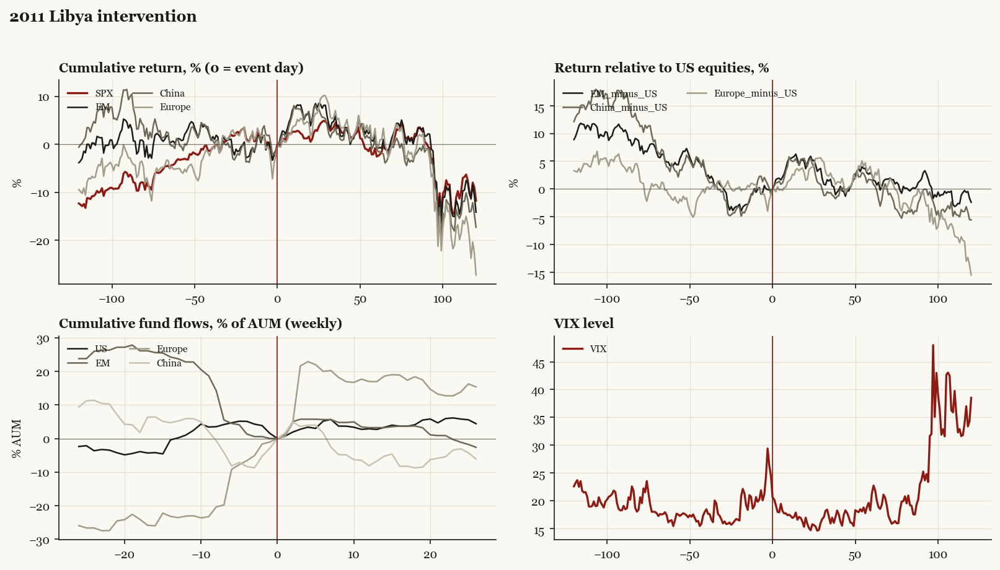

# 2011 Libya intervention

*Obama administration. Outbreak/event 2011-03-19, buildup from 2011-02-26. Telegraphed; type: campaign.*

[Index](README.md)

## What moved

- Equities ran +3.1% over the 60 trading days into the event.
- The S&P 500 moved -2.6% over the following 60 trading days and -11.8% over 120.
- Cumulative net flows into US equity funds: +2.7% of assets in the 13 weeks after (vs -0.2% in the 13 weeks before).
- Cumulative net flows into emerging-market funds: +3.2% of assets in the 13 weeks after (vs -23.7% in the 13 weeks before).
- Cumulative net flows into Europe funds: +16.9% of assets in the 13 weeks after (vs +23.6% in the 13 weeks before).
- Cumulative net flows into China funds: -6.7% of assets in the 13 weeks after (vs -5.2% in the 13 weeks before).
- Implied volatility moved -4.2 VIX points across the event (from 24.4).
- UNSC 1973 on 03-17

## Detail

| series | runup pre-60d | +20d | +60d | +120d |
|---|---|---|---|---|
| SPX | +3.1% | +0.5% | -2.6% | -11.8% |
| US | +3.0% | +0.2% | -2.6% | -11.8% |
| EM | -1.2% | +3.8% | -0.0% | -14.2% |
| China | -0.9% | +4.9% | -1.0% | -17.3% |
| Taiwan | -3.7% | +2.6% | +4.3% | -9.9% |
| Europe | +5.1% | +1.7% | -0.2% | -27.3% |
| Japan | -0.8% | -6.5% | -6.5% | -14.5% |
| Bonds | +0.1% | -0.1% | +3.1% | +11.9% |
| Gold | +3.1% | +4.7% | +6.9% | +26.2% |
